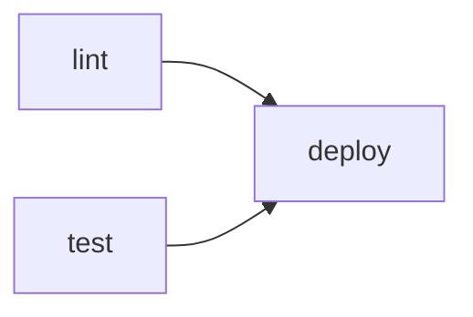

# Automatizzare un repo con GitHub Actions

**GitHub Actions** è la piattaforma di CI/CD integrata in GitHub: definisce *workflow* dichiarativi in *YAML*, salvati in `.github/workflows/*.yml`, che GitHub esegue automaticamente in risposta a eventi del repository (push, pull request, schedule, ecc.) su macchine virtuali temporanee (*runner*) messe a disposizione da GitHub stesso o auto-ospitate. A differenza di un tema grafico o di una libreria condivisa, un workflow non viene "incluso": vive interamente dentro il repository che lo usa, un file per ogni pipeline.


## Mappa: cosa serve per cosa

- **Eventi (`on`)**: *quando* un workflow parte. Push, pull request, orario fisso (`schedule`), avvio manuale (`workflow_dispatch`).
- **Job (`jobs`)**: *cosa* gira, isolato. Ogni job ha il proprio runner (VM pulita), i job comunicano solo tramite artifact, mai tramite memoria condivisa.
- **`needs`**: l'ordine tra job. Un grafo aciclico diretto (DAG), non necessariamente una catena lineare.
- **Matrix (`strategy.matrix`)**: *quante volte* ripetere lo stesso job, con parametri diversi (versioni, sistemi operativi).
- **Cache e artifact**: cosa sopravvive *tra* run diversi (cache) o *tra* job dello stesso run (artifact).
- **Permessi e secrets**: cosa il workflow *può fare* verso il resto di GitHub e verso servizi esterni.


## 1. Anatomia di un workflow

Un workflow minimo che gira su ogni push:

```yaml
name: CI

on:
  push:
    branches: [main]

jobs:
  test:
    runs-on: ubuntu-latest
    steps:
      - uses: actions/checkout@v4
      - uses: actions/setup-python@v5
        with:
          python-version: "3.12"
      - run: pip install -r requirements.txt
      - run: pytest
```

| Chiave    | Livello           | Significato                                                                                    |
|-----------|-------------------|------------------------------------------------------------------------------------------------|
| `on`      | workflow          | eventi che innescano l'esecuzione                                                              |
| `jobs`    | workflow          | insieme dei job, ciascuno su un runner proprio                                                 |
| `runs-on` | job               | immagine della VM/container (es. `ubuntu-latest`)                                              |
| `needs`   | job               | dipendenze da altri job — un arco nel DAG, vedi [§3](#3-il-grafo-dei-job-needs-e-parallelismo) |
| `steps`   | job               | sequenza *ordinata* di operazioni sullo stesso runner                                          |
| `uses`    | step              | richiama un'**action** riutilizzabile (`owner/repo@versione`)                                  |
| `run`     | step              | esegue un comando di shell direttamente                                                        |
| `with`    | step              | parametri passati a un'action                                                                  |
| `env`     | workflow/job/step | variabili d'ambiente (i livelli più interni sovrascrivono quelli esterni)                      |
| `if`      | job/step          | condizione booleana di esecuzione                                                              |

`uses` e `run` sono le due facce di uno step: `uses` richiama codice pubblicato da altri (versionato con un tag, un branch o uno SHA — fissarlo a un tag come `@v4` è la norma, uno SHA dà garanzie più forti contro modifiche silenziose all'action), `run` esegue comandi shell arbitrari nell'ambiente del runner.


### 1.1 Runner e isolamento

Ogni job parte da una macchina **pulita**: nessuno stato sopravvive da un job al successivo se non viene esplicitamente propagato con `actions/cache` o `actions/upload-artifact` / `download-artifact` (vedi [§5](#5-cache-e-artifact-la-memoization-applicata-alla-ci)). Questo è l'opposto del modello a memoria condivisa: due job nello stesso workflow non hanno più in comune di due processi su macchine diverse in rete.


## 2. Eventi e trigger

La chiave `on` accetta uno o più eventi:

```yaml
on:
  push:
    branches: [main]
  pull_request:
  schedule:
    - cron: "0 3 * * 1-5"
  workflow_dispatch:
```

- **`push`** / **`pull_request`**: il caso più comune, con filtri opzionali su branch, tag o path.
- **`schedule`**: sintassi *cron* a cinque campi, in UTC.
- **`workflow_dispatch`**: bottone "Run workflow" nell'interfaccia, utile per pipeline che non devono girare a ogni commit (release, pubblicazioni manuali).

| Campo cron             | Valori             | Esempio           |
|------------------------|--------------------|-------------------|
| minuto                 | 0–59               | `0`               |
| ora                    | 0–23               | `3`               |
| giorno del mese        | 1–31               | `*` (ogni giorno) |
| mese                   | 1–12               | `*` (ogni mese)   |
| giorno della settimana | 0–6 (0 = domenica) | `1-5` (lun–ven)   |

`cron: "0 3 * * 1-5"` si legge quindi "ogni giorno feriale alle 3:00 UTC" — utile per job periodici (rigenerare un report, invalidare una cache) che non dipendono da un push.


## 3. Il grafo dei job: `needs` e parallelismo

Senza `needs`, tutti i job di un workflow partono **in parallelo**, ciascuno sul proprio runner. `needs` introduce una dipendenza esplicita: il job a valle aspetta che quello a monte finisca (e di norma che abbia successo).



`lint` e `test` non hanno `needs` tra loro: girano in parallelo, su due runner distinti; `deploy` dichiara `needs: [lint, test]` e parte solo quando **entrambi** sono terminati con successo. L'insieme dei job con le loro dipendenze forma un **DAG**, esattamente come i grafi di dipendenza visti per le riduzioni tra problemi in [teoria_riduzioni.md](teoria_riduzioni.md): qui i nodi sono job invece di problemi, e gli archi sono "deve finire prima di" invece di "si riduce a".

È un parallelismo diverso da quello delle **goroutine** di [fondamenti_go.md §9](fondamenti_go.md#9-concorrenza-goroutine-e-canali): le goroutine condividono lo stesso processo e comunicano su canali *in-memory*; i job di Actions girano su runner isolati e comunicano solo scambiandosi *artifact* (file), mai stato in memoria — il modello CSP di Go ("condividi la memoria comunicando" su un canale) non si applica qui, perché non c'è memoria da condividere in primo luogo.


## 4. Strategia a matrice

`strategy.matrix` ripete lo stesso job una volta per ogni combinazione di parametri:

```yaml
jobs:
  test:
    strategy:
      matrix:
        os: [ubuntu-latest, macos-latest]
        python-version: ["3.10", "3.11", "3.12"]
    runs-on: ${{ matrix.os }}
    steps:
      - uses: actions/setup-python@v5
        with:
          python-version: ${{ matrix.python-version }}
      - run: pytest
```

Se la matrice ha $k$ assi $V_1, \dots, V_k$ (qui $k=2$: `os` e `python-version`), il numero di job generati è il prodotto cartesiano delle cardinalità di ciascun asse:

$$
|J| = \prod_{i=1}^{k} |V_i|
$$

nell'esempio sopra, $\|J\| = 2 \times 3 = 6$ job indipendenti (GitHub impone un limite pratico di 256 job per matrice). `exclude` e `include` permettono di togliere o aggiungere combinazioni specifiche senza dover elencare tutto il prodotto cartesiano.


## 5. Cache e artifact: la memoization applicata alla CI

`actions/cache` salva una directory tra run diversi dello stesso workflow, indicizzata da una **chiave**:

```yaml
- uses: actions/cache@v4
  with:
    path: ~/.cache/pip
    key: pip-${{ hashFiles('requirements.txt') }}
```

Concettualmente è la stessa idea della **memoization top-down** vista in [problema_fibonacci.md §2](problema_fibonacci.md): lì si evita di ricalcolare `fib(k)` se il risultato per quel `k` è già in tabella; qui si evita di reinstallare le dipendenze se il loro hash (`hashFiles('requirements.txt')`, che gioca il ruolo di chiave della tabella dei risultati) non è cambiato rispetto a un run precedente. In entrambi i casi la chiave è ciò che rende sicuro saltare il lavoro: se l'input cambia, cambia la chiave, e il "ricalcolo" (qui: `pip install`) riparte da zero.

La stessa idea si legge anche in chiave di **costo ammortizzato** ([teoria_costo.md §5.1](teoria_costo.md#51-metodo-aggregato--esempio-vettore-dinamico)): il primo run su una cache fredda paga il costo pieno dell'installazione (l'analogo di un ridimensionamento del vettore dinamico), i run successivi con cache calda pagano solo il costo di un lookup — su una sequenza lunga di run, il costo medio per run tende a un valore molto più basso del caso pessimo di un singolo run a freddo.

Gli **artifact** (`actions/upload-artifact` / `download-artifact`) risolvono un problema diverso: non la ripetizione nel tempo, ma il trasferimento di file *tra job dello stesso run* (es. il job `build` produce un eseguibile, il job `deploy` lo scarica) — è il meccanismo usato anche per pubblicare pagine statiche, vedi [§7](#7-caso-di-studio-pubblicare-sphinx-con-github-actions).


## 6. Permessi, secrets e OIDC

Ogni workflow riceve automaticamente un `GITHUB_TOKEN` con permessi di default piuttosto ampi; il blocco `permissions` li restringe esplicitamente al minimo necessario (*principio del privilegio minimo*):

```yaml
permissions:
  contents: read
  pages: write
  id-token: write
```

- **`contents: read`**: il job può solo leggere il repository (checkout), non scrivere (niente push, niente release) — sufficiente per una build.
- **`pages: write`**: consente al job di pubblicare su GitHub Pages.
- **`id-token: write`**: consente al job di richiedere un token **OIDC** di breve durata, verificato da GitHub e scambiato con un provider esterno (o con lo stesso GitHub Pages) — l'alternativa moderna a incollare un *secret* di lunga durata nelle impostazioni del repository. È lo stesso principio per cui, in [teoria_tipi.md](teoria_tipi.md), un tipo più ristretto è preferibile a uno più permissivo quando possibile: meno privilegio disponibile, meno danno possibile in caso di workflow compromesso.

I **secrets** (`${{ secrets.NOME }}`) sono invece valori cifrati e persistenti configurati nelle impostazioni del repository/organizzazione — usati quando serve davvero un credenziale di lungo periodo che l'OIDC non può sostituire (es. una API key di terze parti).

`concurrency` evita esecuzioni sovrapposte dello stesso gruppo logico:

```yaml
concurrency:
  group: pages
  cancel-in-progress: false
```

con `cancel-in-progress: false` un nuovo run entra in coda invece di cancellare quello in corso — importante per un deploy (non si vuole un sito a metà pubblicato), mentre per build di test su pull request si usa spesso `true`, per non sprecare minuti di CI su commit ormai superati da un push successivo.


## 7. Caso di studio: pubblicare Sphinx con GitHub Actions

Il repository [nn-option-pricing](https://github.com/matteogiorgi/nn-option-pricing) — una rete neurale *feed-forward* addestrata ad approssimare la formula di Black-Scholes per il pricing di opzioni call europee, usata qui come caso d'uso reale — pubblica la propria documentazione (generata con *Sphinx* a partire dai docstring del pacchetto Python `nn_option_pricing`) su GitHub Pages tramite `.github/workflows/docs.yml`:

```yaml
name: Build and publish documentation

on:
  push:
    branches:
      - main
  workflow_dispatch:

permissions:
  contents: read
  pages: write
  id-token: write

concurrency:
  group: pages
  cancel-in-progress: false

jobs:
  build:
    runs-on: ubuntu-latest

    steps:
      - name: Check out repository
        uses: actions/checkout@v4

      - name: Set up Python
        uses: actions/setup-python@v5
        with:
          python-version: "3.11"

      - name: Install dependencies
        run: |
          python -m pip install --upgrade pip
          pip install -r requirements.txt
          pip install -r requirements-docs.txt
          pip install -e . --no-build-isolation

      - name: Build Sphinx documentation
        run: sphinx-build -W -b html docs/source docs/build/html

      - name: Configure GitHub Pages
        uses: actions/configure-pages@v5

      - name: Upload GitHub Pages artifact
        uses: actions/upload-pages-artifact@v3
        with:
          path: docs/build/html

  deploy:
    needs: build
    runs-on: ubuntu-latest
    environment:
      name: github-pages
      url: ${{ steps.deployment.outputs.page_url }}

    steps:
      - name: Deploy to GitHub Pages
        id: deployment
        uses: actions/deploy-pages@v4
```

Due job, un solo arco `needs`:


Punti da notare, richiamando le sezioni precedenti:

- **`-W`** in `sphinx-build -W` promuove ogni *warning* di Sphinx a errore: la build fallisce rumorosamente invece di pubblicare una documentazione con link rotti o riferimenti incrociati mancanti — analogo, in spirito, ai contratti "falliscono rumorosamente" discussi per S4 in [fondamenti_r_oop.md §5](fondamenti_r_oop.md#5-s4-il-sistema-formale).
- `pip install -e . --no-build-isolation` installa il pacchetto in modalità *editable*: Sphinx importa `nn_option_pricing` per estrarne i docstring, quindi deve trovarlo installato nello stesso ambiente della build.
- `environment: github-pages` sul job `deploy` è ciò che abilita lo scambio OIDC del [§6](#6-permessi-secrets-e-oidc): senza un *environment* dichiarato, `id-token: write` da solo non basta a ottenere un token verificabile da `actions/deploy-pages`.
- `needs: build` è l'unico arco del DAG: nessuna matrice, nessun parallelismo da sfruttare — un caso degenere ma comune di [§3](#3-il-grafo-dei-job-needs-e-parallelismo), utile proprio perché mostra la forma più semplice possibile del pattern "prepara, poi pubblica".

Il risultato è pubblicato all'indirizzo `https://matteogiorgi.github.io/nn-option-pricing`, rigenerato automaticamente a ogni push su `main` (o su richiesta manuale, grazie a `workflow_dispatch`) senza intervento umano oltre al push stesso.


## 8. Jekyll vs Sphinx: quando serve davvero un workflow

Questo stesso repository (`geonote`) pubblica le proprie pagine su GitHub Pages **senza** alcun workflow: come descritto in [tema_geoteo.md §2.4](tema_geoteo.md#24-abilitare-github-pages), basta **Settings → Pages → Deploy from a branch**, perché *Jekyll* è generato **nativamente** dalla pipeline di build di GitHub Pages. `nn-option-pricing`, che usa *Sphinx* invece di Jekyll, non ha questa scorciatoia: Sphinx non è tra i generatori supportati nativamente da GitHub Pages, quindi la build va eseguita a mano (o, meglio, automatizzata) e solo l'HTML risultante va caricato come artifact di Pages.

|                      | `geonote` (Jekyll)                 | `nn-option-pricing` (Sphinx)                                         |
|----------------------|------------------------------------|----------------------------------------------------------------------|
| Generatore           | Jekyll, supportato nativamente     | Sphinx, non supportato nativamente                                   |
| Configurazione Pages | *Deploy from a branch*             | *GitHub Actions* (workflow personalizzato)                           |
| Chi builda           | l'infrastruttura di GitHub Pages   | un job del workflow (`build`), su un runner qualsiasi                |
| File coinvolti       | `_layouts/`, `_config.yml` (vedi [tema_geoteo.md §2](tema_geoteo.md#2-passi-per-replicarlo-in-un-altro-repository)) | `.github/workflows/docs.yml`, `docs/source/` |
| Trigger              | push su `main` (gestito da GitHub) | push su `main` **o** `workflow_dispatch` (dichiarati esplicitamente) |

> **La regola generale**: serve un workflow di Actions per pubblicare su Pages ogni volta che il generatore del sito non è Jekyll (Sphinx, Hugo, Docusaurus, un semplice script che produce HTML statico...) — in tutti questi casi tocca a un job `build` fare esplicitamente ciò che, per Jekyll, GitHub fa da solo dietro le quinte.


## 9. Documentazione e risorse

- **Documentazione ufficiale**: <https://docs.github.com/en/actions>
- **Sintassi dei workflow**: <https://docs.github.com/en/actions/reference/workflow-syntax-for-github-actions>
- **Marketplace delle action**: <https://github.com/marketplace?type=actions>
- **Caso d'uso reale**: [nn-option-pricing](https://github.com/matteogiorgi/nn-option-pricing), rete neurale per il pricing di opzioni, vedi [§7](#7-caso-di-studio-pubblicare-sphinx-con-github-actions)
- Vedi anche [tema_geoteo.md](tema_geoteo.md) per la configurazione di GitHub Pages usata da questo stesso repository.

> **Nota sulla versione**: le action esterne (`actions/checkout`, `actions/setup-python`, ...) sono versionate indipendentemente dalla piattaforma. Fissare un tag maggiore (es. `@v4`) è la norma; verifica sempre changelog e breaking change sulla pagina del Marketplace dell'action prima di aggiornarlo.
