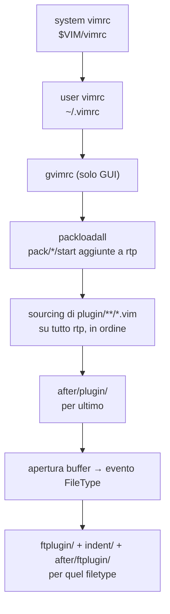

# Come Vim carica i file di configurazione

Vim non ha percorsi "cablati" per plugin, sintassi, colori o impostazioni di filetype: cerca *tutto* scorrendo un elenco ordinato di directory, il **`runtimepath`**, provando ciascuna nell'ordine in cui compare finché non trova quello che serve. Una volta fissato questo singolo meccanismo, quasi ogni "perché questo file sta qui e non altrove" si riduce a due assi ortogonali: *dove* una directory si trova nel `runtimepath` (chi vince quando due file hanno lo stesso nome) e *quando*, nella timeline di avvio, il suo contenuto viene effettivamente eseguito (perché un'impostazione in `vimrc` a volte "non fa niente").


## Mappa: cosa serve per cosa

- **`runtimepath`** — l'elenco ordinato di directory in cui Vim cerca `plugin/`, `ftplugin/`, `colors/`, `syntax/`, ecc.; la posizione in questo elenco decide chi vince tra due file con lo stesso nome.
- **Scoperta del `vimrc`** — quale file di avvio viene letto, con quale ordine di preferenza, e cosa succede se non ne esiste nessuno.
- **Timeline di avvio** — l'ordine *temporale* con cui `vimrc`, pacchetti e plugin vengono eseguiti; spiega perché certe impostazioni in `vimrc` non hanno effetto su un plugin.
- **Tassonomia delle sottocartelle** — cosa si carica sempre all'avvio (`plugin/`), cosa solo su richiesta (`autoload/`), cosa per tipo di file (`ftplugin/`, `syntax/`, `indent/`).
- **Pacchetti nativi** — `pack/*/start` contro `pack/*/opt`, l'alternativa integrata ai plugin manager esterni.
- **Config locale** — `exrc`/`secure`, l'unica configurazione che *non* passa dal `runtimepath`, e il suo rischio di sicurezza.
- **Introspezione** — `:scriptnames`, `:verbose set`, `:verbose map`, `--startuptime`: come verificare il modello invece di crederci sulla parola.


## 1. Il `runtimepath`: la spina dorsale

`'runtimepath'` (abbreviato `'rtp'`) è la lista ordinata di directory in cui Vim cerca le sottocartelle "note" (`plugin/`, `autoload/`, `ftplugin/`, `colors/`, `syntax/`, `indent/`, `after/`, ...). Ogni sottocartella ha un significato *relativo alla posizione della sua directory in rtp*, non un percorso assoluto fissato dall'implementazione.

Valore di default su Unix (semplificato), $D_1$ prima, $D_5$ ultima:

1. `~/.vim` — roba dell'utente
2. `$VIM/vimfiles` — roba di sistema/distribuzione
3. `$VIMRUNTIME` — roba che viene con Vim
4. `$VIM/vimfiles/after` — after di sistema
5. `~/.vim/after` — after dell'utente

Formalizzando: se $D_1, \dots, D_n$ sono le directory di rtp nell'ordine in cui compaiono, e Vim cerca un file `f` (ad esempio `plugin/miofile.vim`), il file effettivamente caricato è quello nella *prima* directory che lo contiene:

$$
\text{resolve}(f) = \min\{\, i \in \{1, \dots, n\} : f \in D_i \,\}
$$

Da questa sola formula discendono due regole che spiegano quasi tutto il resto della nota:

- **L'utente vince sulla distribuzione**, perché `~/.vim` ha indice più basso di `$VIMRUNTIME`: a parità di nome file, `min` sceglie il primo.
- **`after/` vince su tutto**, perché le directory `after/` hanno l'indice più *alto* di rtp (sono in coda): sono l'unico posto pensato apposta per essere sourcato *dopo* ogni alternativa.

Controlla il valore reale con `:set runtimepath?` (o `:echo &rtp`).

> **Nota — non è un caso isolato.** Lo stesso schema "prima corrispondenza in una sequenza ordinata vince" torna nel dispatch **S3** di R: `class(cane)` è un vettore ordinato come `c("cane", "default")`, e R prova i metodi in quell'ordine finché non ne trova uno che esiste (vedi [fondamenti_r_oop.md §4](fondamenti_r_oop.md#4-s3-il-sistema-informale)). In entrambi i casi la "ricerca" non è altro che uno scorrimento lineare di una lista con priorità dettata dalla posizione, non dal contenuto.


## 2. Scoperta e precedenza del `vimrc`

All'avvio Vim carica **prima** il vimrc di sistema, **poi** quello dell'utente — il sistema fa da base, l'utente sovrascrive:

1. **System vimrc**: `$VIM/vimrc`, se esiste.
2. **User vimrc**: Vim usa il **primo** che trova, in quest'ordine:
   - `$VIMINIT` (variabile d'ambiente, eseguita come comando Ex);
   - `~/.vimrc`;
   - `~/.vim/vimrc`;
   - `$EXINIT`;
   - `~/.exrc`.

Due dettagli che chiudono i casi limite più comuni:

- **`$MYVIMRC`** viene impostata al file utente effettivamente caricato — comodo per `:echo $MYVIMRC` o per un rapido `:source $MYVIMRC` dopo una modifica.
- **`defaults.vim`** entra in gioco *solo se non esiste alcun vimrc utente*: è il set di default "ragionevoli" del Vim moderno. Appena si crea un proprio `~/.vimrc`, anche vuoto, `defaults.vim` smette di essere caricato.

> **Gotcha — `'compatible'`.** La sola *esistenza* di un vimrc utente disattiva l'opzione `'compatible'`. Un `~/.vimrc` **vuoto** cambia già il comportamento di Vim rispetto a non averne alcuno: conta il file, non il suo contenuto. Scrivere `set nocompatible` in cima al proprio vimrc resta comunque buona norma per chiarezza, anche se in quel contesto è tecnicamente ridondante.


## 3. La timeline di avvio

È la parte più fraintesa, perché "dove sta un file" e "quando viene eseguito" sono due domande indipendenti a cui si tende a dare la stessa risposta.



I nodi da `sys` ad `after` accadono **una sola volta**, all'avvio; i nodi `ft`/`ftplug` si ripetono a **ogni** apertura di un buffer che attiva un filetype — motivo per cui `ftplugin/` non compare mai in `:scriptnames` finché non si apre almeno un file di quel tipo.

A differenza del **DAG** di job visto in [azioni_github.md §3](azioni_github.md#3-il-grafo-dei-job-needs-e-parallelismo), dove più rami possono girare in parallelo su runner distinti, questa è una sequenza **totalmente ordinata**: non c'è parallelismo, non c'è biforcazione, solo una linea temporale singola che ogni installazione di Vim percorre allo stesso modo.

Conseguenze pratiche da fissare:

- **Il vimrc gira prima dei plugin.** Nel vimrc si impostano le variabili che un plugin leggerà *quando* verrà sorgentato:

  ```vim
  let g:foo_enable = 1   " il plugin la leggerà quando arriverà il suo turno in plug
  ```

  Non si può invece, dal vimrc, sovrascrivere un mapping o un comando che il plugin crea *al momento del proprio sourcing*: il plugin gira dopo, e vince lui.

- **Per fare override di un plugin, serve `after/plugin/`.** Gira per ultimo nella fase `plug`/`after`, quindi è il posto giusto per ridefinire un mapping o correggere un'impostazione imposta da un plugin di terzi.

- **`ftplugin/` non si carica allo startup.** Si carica a ogni evento `FileType`, per questo al suo interno si usa `setlocal` (non `set`, che sarebbe globale) e mapping con `<buffer>`, spesso accompagnati da `b:undo_ftplugin` per poter tornare indietro quando il filetype del buffer cambia.

> **Interruttori necessari.** Perché la macchina dei filetype (nodi `ft`/`ftplug` del diagramma) funzioni, servono nel vimrc:
> ```vim
> filetype plugin indent on
> syntax on
> ```
> Senza questi, `ftplugin/`, `indent/` e `syntax/` restano completamente inerti, e la causa resta invisibile finché non si guarda proprio qui.


## 4. Tassonomia delle sottocartelle: automatico vs on-demand

| Cartella    | Quando si carica                                | A cosa serve                         |
|-------------|-------------------------------------------------|--------------------------------------|
| `plugin/`   | Automatico, allo startup (fase `plug`)          | Codice sempre attivo                 |
| `autoload/` | Pigro: alla prima chiamata di `foo#bar()`       | Namespacing + startup più veloce     |
| `ftplugin/` | Evento `FileType` (per-buffer)                  | Impostazioni per un singolo filetype |
| `indent/`   | Evento `FileType`                               | Regole di indentazione per filetype  |
| `syntax/`   | Quando serve l'evidenziazione di quel filetype  | Definizioni di sintassi              |
| `colors/`   | Con `:colorscheme nome`                         | Temi                                 |
| `after/...` | Come la controparte, ma per ultimo              | Override                             |

Il senso di fondo è separare **"codice che deve essere sempre attivo"** (`plugin/`) da **"codice caricato solo quando serve"** (`autoload/`, `ftplugin/`). Il pattern `autoload` è il caso più istruttivo:

```vim
" file: autoload/mio.vim — definisce mio#saluta()
function! mio#saluta()
    echo "ciao"
endfunction
```

```vim
" altrove, es. in un mapping dentro plugin/mio.vim:
nnoremap <leader>s :call mio#saluta()<CR>
```

`autoload/mio.vim` non viene sourcato nella fase `plug` insieme al resto: Vim lo carica solo la prima volta che il codice invoca effettivamente `mio#saluta()`, guidato dalla convenzione di nome `nomefile#funzione`. È lo stesso principio — **rimandare il lavoro finché non serve davvero, e farlo una volta sola** — dietro la memoization *top-down* di [problema_fibonacci.md §2](problema_fibonacci.md#2-soluzione-programmazione-dinamica-top-down--memoization): lì si evita di ricalcolare un sottoproblema già risolto, qui si evita di caricare (parsare, compilare in bytecode interno) uno script che magari, in quella sessione, non verrà mai usato.


## 5. Pacchetti nativi (Vim 8+)

Il sistema `packages`, introdotto in Vim 8, sostituisce il vecchio "tutto dentro `~/.vim/plugin/`":

```
~/.vim/pack/QUALSIASI_NOME/
├── start/   " aggiunto a rtp e caricato AUTOMATICAMENTE (fase packloadall del §3)
└── opt/     " caricato A MANO con :packadd nome
```

- `start/`: ogni plugin qui dentro entra in rtp e viene sorgentato nella stessa fase `plug` descritta nel diagramma del [§3](#3-la-timeline-di-avvio).
- `opt/`: resta dormiente finché non arriva un `:packadd nome` esplicito — utile per plugin pesanti o specifici di un solo contesto (es. un plugin LaTeX caricato solo quando serve davvero).

Il nome intermedio (`QUALSIASI_NOME`) è puramente di raggruppamento — spesso il nome del plugin manager o una categoria — e non ha alcun effetto sul comportamento di caricamento.


## 6. Config locale di progetto: `exrc` e `secure`

Un'unica fonte di configurazione **non** passa dal `runtimepath`:

```vim
set exrc      " legge un .vimrc/.exrc nella directory corrente all'avvio
set secure    " ...ma limita cosa quei file possono fare
```

`exrc` fa leggere a Vim un `.vimrc`/`.exrc` presente nella directory da cui viene lanciato — comodo per impostazioni per-progetto (es. `set shiftwidth=2` solo per un repository specifico). `secure`, quasi obbligatorio insieme, vieta a quei file locali `:autocmd`, comandi di shell e scritture su disco.

> **Nota di sicurezza.** Senza `secure`, clonare un repository che contiene un `.vimrc` ostile e aprire Vim al suo interno può eseguire codice arbitrario al solo avvio dell'editor. È lo stesso principio del **privilegio minimo** discusso per i permessi di un workflow in [azioni_github.md §6](azioni_github.md#6-permessi-secrets-e-oidc): meno un file di configurazione può fare, meno danno può causare se proviene da una fonte non fidata. Attiva `exrc` solo con `secure` accanto, e solo se ti fidi dei repository che apri.


## 7. Introspezione: verificare il modello

Questi comandi trasformano il modello di §1–§3 da "credo funzioni così" a "lo dimostro":

- **`:scriptnames`** — elenco, nell'ordine reale, di *tutti* i file sorgentati: la ground truth della timeline del [§3](#3-la-timeline-di-avvio).
- **`:verbose set opzione?`** — mostra il valore di un'opzione *e* il file da cui proviene. Es. `:verbose set tabstop?`.
- **`:verbose map <tasto>`** — da quale file arriva un certo mapping, utile per capire chi ha "rubato" un tasto conteso tra due plugin.
- **`vim --startuptime avvio.log`** — profila i tempi di caricamento fase per fase; il modo più diretto per scoprire quale plugin rallenta l'avvio.

Quando qualcosa si carica nell'ordine sbagliato, o non si carica affatto, si parte quasi sempre da `:scriptnames`: se un file non compare, il problema è nel `runtimepath` (§1); se compare ma "troppo presto" o "troppo tardi", il problema è nella timeline (§3).


## 8. Divergenza con Neovim

Il *modello* (rtp ordinato + timeline in fasi) resta identico; cambiano i **percorsi**, spostati allo standard *XDG*:

|                      | Vim                                  | Neovim                                                |
|----------------------|--------------------------------------|-------------------------------------------------------|
| Config principale    | `~/.vimrc`                           | `~/.config/nvim/init.vim` **oppure** `init.lua`       |
| Pacchetti utente     | `~/.vim/pack/...`                    | `~/.local/share/nvim/site/pack/...`                   |
| Risoluzione percorsi | variabili come `$VIM`, `$VIMRUNTIME` | funzione `stdpath('config')`, `stdpath('data')`, ecc. |

Il "dove" cambia; il "come" — cerca nelle directory di rtp, in ordine, con `after/` in coda, poi esegui la timeline del [§3](#3-la-timeline-di-avvio) — no. Chi porta una configurazione da Vim a Neovim sta quasi sempre solo traducendo percorsi, non riscrivendo un modello mentale nuovo.


## 9. Documentazione e risorse

- **Guida ufficiale**: `:help startup` e `:help load-plugins` dentro Vim stesso — la fonte definitiva per la sequenza esatta, passo per passo, di cui il [§3](#3-la-timeline-di-avvio) dà la granularità che conta in pratica.
- **`runtimepath`**: `:help 'runtimepath'`.
- **Pacchetti nativi**: `:help packages`.
- **Sicurezza locale**: `:help 'exrc'` e `:help 'secure'`.
- Vedi anche [azioni_github.md](azioni_github.md) per un altro esempio di "sequenza di caricamento dichiarata in file di configurazione", questa volta come DAG invece che come linea temporale (confronto al [§3](#3-la-timeline-di-avvio)), e [fondamenti_r_oop.md](fondamenti_r_oop.md) per il dispatch S3 richiamato al [§1](#1-il-runtimepath-la-spina-dorsale).
