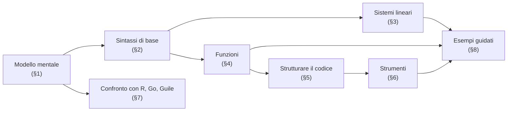
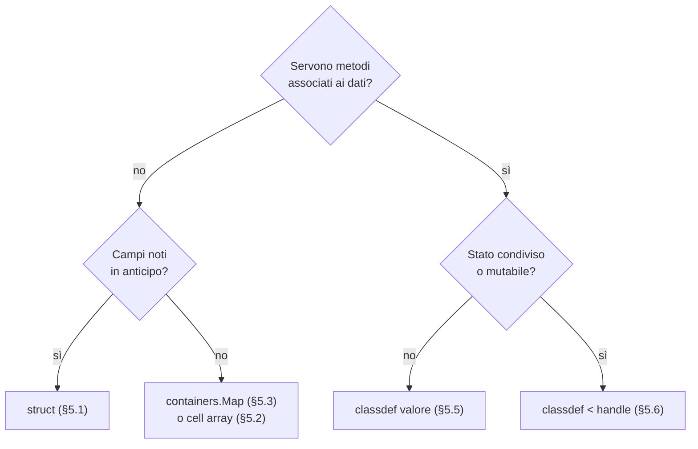

# GNU Octave — fondamenti del linguaggio

GNU Octave è un linguaggio interpretato per il calcolo numerico, nato all'inizio degli anni '90 e oggi parte del progetto GNU. È in larga parte compatibile con MATLAB, di cui condivide sintassi e modello di dati: il valore fondamentale è la **matrice**, e quasi ogni operazione è pensata per agire su matrici intere invece che su singoli numeri. Chi arriva da un linguaggio "normale" tende a leggerlo come tale (variabili scalari, cicli, oggetti) e ottiene codice lento e poco idiomatico; chi lo legge come una notazione eseguibile per l'algebra lineare ottiene programmi brevi, vicini alle formule e veloci.

Questa nota parte proprio da quel cambio di prospettiva — il modello mentale del [§1](#1-il-modello-mentale) — e su quello costruisce il resto: la sintassi di base, le funzioni e gli elementi funzionali, i modi di strutturare un programma che cresce (da `struct` a `classdef`), gli strumenti di lavoro quotidiano e un confronto con R, Go e Guile, già trattati in [fondamenti_r](fondamenti_r.md), [fondamenti_go](fondamenti_go.md) e [fondamenti_guile](fondamenti_guile.md). Chiudono due esempi guidati e una sezione onesta sui limiti dello strumento.


## Cosa ci serve

- **Algebra lineare di base**: prodotto matriciale, trasposta, sistemi lineari, l'idea di fattorizzazione (LU, QR). Serve soprattutto nel [§3](#3-sistemi-lineari-e-minimi-quadrati).
- **Il vocabolario dei sistemi di tipi**: statico/dinamico, forte/debole, come in [teoria_tipi §7–§8](../teoria_linguaggi/teoria_tipi.md#7-statico-vs-dinamico-applicato); serve a collocare Octave nel [§1.4](#14-dove-si-colloca-tra-i-sistemi-di-tipi).
- **Chiusure**: la distinzione tra catturare un *binding* e catturarne il valore, discussa in [teoria_chiusure §6](../teoria_linguaggi/teoria_chiusure.md#6-binding-vs-cella); è la chiave del [§4.4](#44-cattura-per-valore-un-confronto).



> **Convenzioni.** Gli esempi sono stati verificati con Octave 8.4. I commenti usano `%` e i blocchi si chiudono con `end`, cioè la sintassi comune a MATLAB; le estensioni proprie di Octave (`#`, `!=`, `+=`, `endif`...) sono raccolte nel [§2.7](#27-octave-non-è-matlab-le-estensioni) e usate solo dove serve, segnalandolo.


## 1. Il modello mentale

Tre idee spiegano quasi tutto il comportamento di Octave, compresi gli errori più comuni di chi lo usa per la prima volta.


### 1.1 Tutto è una matrice

In Octave non esiste uno scalare "vero": un numero è una matrice $1 \times 1$, una stringa è una matrice riga di caratteri, e la matrice vuota `[]` ha dimensione $0 \times 0$. Il tipo predefinito di ogni numero è `double` (virgola mobile a 64 bit), anche quando si scrive un intero.

```octave
x = 5;
size(x)       % => 1 1
class(x)      % => double

s = 'ciao';
size(s)       % => 1 4  — quattro caratteri in una riga
class(s)      % => char

size([])      % => 0 0
```

La conseguenza pratica è che le funzioni e gli operatori sono scritti per ricevere matrici di qualunque forma: `sqrt(4)` e `sqrt([4 9 16])` sono la stessa operazione, applicata a una matrice $1 \times 1$ nel primo caso e $1 \times 3$ nel secondo. Non c'è bisogno di un `map`: l'iterazione è implicita nell'operazione (si veda il [§2.6](#26-perché-vettorizzare)).


### 1.2 Indici da 1 e ordine per colonne

Gli indici partono da **1**, come in R e in matematica. In memoria, una matrice è memorizzata **per colonne** (*column-major*, come in Fortran e in R): prima tutta la prima colonna, poi la seconda, e così via. Questo rende sempre disponibile anche un **indice lineare**, che tratta la matrice come un unico vettore colonna. Per una matrice $m \times n$, l'elemento in posizione $(i, j)$ ha indice lineare

$$
k = i + (j - 1)\, m.
$$

```octave
A = [1 2 3; 4 5 6];   % matrice 2 x 3
A(:)'                 % => 1 4 2 5 3 6  — l'ordine reale in memoria
A(2, 3)               % => 6
A(6)                  % => 6  — stesso elemento: k = 2 + (3-1)*2
sub2ind(size(A), 2, 3)  % => 6  — la formula, già pronta
```

L'ordine per colonne non è un dettaglio da compilatore: decide come si comportano `A(:)`, `reshape` e il ciclo `for` sulle matrici ([§2.5](#25-controllo-di-flusso)), ed è il motivo per cui le funzioni di riduzione come `sum` e `mean` lavorano per colonne se non si specifica altro.


### 1.3 Semantica per valore

Assegnare una matrice o passarla a una funzione produce, dal punto di vista del programma, una **copia indipendente**. Una funzione non può modificare i dati del chiamante: può solo restituirne una versione nuova.

```octave
function v = azzera_primo(v)
  v(1) = 0;          % modifica la copia locale
end

a = [1 2 3];
b = azzera_primo(a);
a                    % => 1 2 3  — invariato
b                    % => 0 2 3
```

Copiare davvero ogni matrice a ogni chiamata sarebbe costoso, quindi l'interprete usa il **copy-on-write**: la copia fisica avviene solo se e quando una delle due parti viene modificata. Il programmatore ragiona come se i valori fossero copiati sempre; l'interprete copia solo quando serve. È lo stesso modello di R (*copy-on-modify*, si veda [fondamenti_r](fondamenti_r.md)), e la stessa eccezione: in Octave l'unico modo per condividere dati mutabili tra più variabili sono le classi **handle** ([§5.6](#56-classdef-classi-handle)).


### 1.4 Dove si colloca tra i sistemi di tipi

Con il vocabolario di [teoria_tipi](../teoria_linguaggi/teoria_tipi.md), Octave è **dinamico** (i tipi sono dei valori, non delle variabili, e si controllano solo a runtime) e piuttosto **debole**: molte conversioni avvengono in silenzio.

```octave
'a' + 1            % => 98      — il carattere diventa il suo codice
class(true + 1)    % => double  — il logico diventa numero
```

I tipi interi (`int8`, `int32`, `uint8`...) seguono regole proprie, poco intuitive per chi arriva da C o Go: l'aritmetica è **saturante** (non va in overflow, si ferma al massimo rappresentabile), il risultato di un'operazione con un `double` resta intero e viene **arrotondato**, e due interi di tipo diverso non si possono combinare.

```octave
int8(100) + int8(100)   % => 127   — saturazione, non overflow
int8(5) + 2.7           % => 8     — risultato int8, arrotondato
int32(7) / int32(2)     % => 4     — 3.5 arrotondato, non troncato
int8(1) + int16(1)      % errore: operatore non definito tra int8 e int16
```

Nella pratica numerica si lavora quasi sempre in `double`; gli interi servono soprattutto per immagini e dati binari. Il sistema a oggetti ([§5](#5-strutturare-il-codice)) aggiunge tipi definiti dall'utente, ma il controllo resta comunque dinamico.


## 2. Sintassi di base

Questa sezione è pensata come riferimento da consultare: ogni sottosezione è autonoma.


### 2.1 Costruire matrici

Dentro le parentesi quadre lo spazio (o la virgola) separa le colonne e il punto e virgola separa le righe. Un punto e virgola **a fine istruzione** ha un altro significato: sopprime la stampa del risultato.

```octave
A = [1 2; 3 4];          % matrice 2 x 2
v = [1, 2, 3]            % vettore riga (senza ';' finale viene stampato)
w = [1; 2; 3];           % vettore colonna

zeros(2, 3)              % matrice di zeri 2 x 3
ones(2)                  % matrice di uni 2 x 2
eye(3)                   % identità 3 x 3
rand(2, 2)               % uniforme in (0, 1)
randn(1, 5)              % normale standard

1:5                      % => 1 2 3 4 5
1:0.5:3                  % => 1 1.5 2 2.5 3  — inizio:passo:fine
linspace(0, 1, 5)        % => 0 0.25 0.5 0.75 1  — n punti equispaziati
```

Le matrici si concatenano con la stessa sintassi, purché le dimensioni siano compatibili: `[A, A]` affianca, `[A; A]` impila.


### 2.2 Indicizzare

Gli indici possono essere scalari, vettori di posizioni o **maschere logiche**. La parola chiave `end`, dentro un indice, vale l'ultima posizione lungo quella dimensione e `:` da solo significa "tutta la dimensione".

```octave
A = magic(4);
A(2, :)              % seconda riga
A(:, end)            % ultima colonna
A(1:2, [1 3])        % sottomatrice: righe 1-2, colonne 1 e 3

x = [3 -1 4 -1 5];
x(x > 0)             % => 3 4 5  — indicizzazione logica
x(x < 0) = [];       % assegnare [] cancella gli elementi
x(end)               % => 5
x(end:-1:1)          % => 5 4 3  — al contrario
```

L'indicizzazione logica è l'equivalente di un `filter`: `x > 0` produce un vettore di `true`/`false` della stessa forma di `x`, e usarlo come indice seleziona solo le posizioni vere.


### 2.3 Operatori: elemento per elemento o matriciali

È la distinzione più importante della sintassi. Gli operatori "nudi" hanno il significato dell'algebra lineare; quelli preceduti dal punto agiscono **elemento per elemento**.

| Operazione | Matriciale | Elemento per elemento |
|---|---|---|
| Prodotto | `A * B` — righe per colonne | `A .* B` — $a_{ij} b_{ij}$ |
| Potenza | `A ^ 2` — $A \cdot A$ | `A .^ 2` — $a_{ij}^2$ |
| Divisione | `A / B` — $A B^{-1}$ | `A ./ B` — $a_{ij} / b_{ij}$ |
| Trasposta | `A'` — coniugata | `A.'` — semplice |

Somma e sottrazione sono già elemento per elemento, quindi non hanno la versione con il punto. La differenza tra le due trasposte si vede solo con i numeri complessi, ma lì è facile sbagliare: `'` è la **trasposta coniugata** $A^{\mathsf H}$, `.'` la trasposta semplice $A^\top$.

```octave
z = [1+2i, 3];
z'      % => [1-2i; 3-0i]  — coniugata
z.'     % => [1+2i; 3+0i]  — solo trasposta
```

Dimenticare il punto non sempre produce un errore: con due matrici quadrate `A * B` e `A .* B` sono entrambe valide e danno risultati diversi.


### 2.4 Broadcasting

Quando un'operazione elemento per elemento coinvolge matrici di forma diversa, Octave **espande automaticamente** le dimensioni di lunghezza 1 per farle coincidere (*broadcasting*). Per esempio, se $A$ è $m \times n$ e $b$ è un vettore riga $1 \times n$,

$$
(A - b)_{ij} = a_{ij} - b_j,
$$

cioè $b$ viene sottratto da ogni riga. È il modo idiomatico per centrare le colonne di una matrice di dati:

```octave
M = magic(3);
M - mean(M)      % mean lavora per colonne: ogni colonna ha ora media 0
```

Due dimensioni sono compatibili se sono uguali oppure se una delle due vale 1; in tutti gli altri casi si ottiene un errore di dimensioni non conformi.


### 2.5 Controllo di flusso

Le strutture sono quelle consuete; ogni blocco si chiude con `end`.

```octave
if x > 0
  disp('positivo')
elseif x == 0
  disp('zero')
else
  disp('negativo')
end

for k = 1:5
  printf('%d\n', k ^ 2);
end

while x > 1
  x = x / 2;
end

switch metodo
  case 'media'
    r = mean(v);
  case {'mediana', 'median'}   % più etichette per lo stesso caso
    r = median(v);
  otherwise
    error('metodo sconosciuto: %s', metodo);
end
```

Un dettaglio che sorprende: `for` itera sulle **colonne** dell'espressione, non sui suoi elementi. Con un vettore riga come `1:5` le colonne sono proprio gli elementi, ma con una matrice la variabile di ciclo è un'intera colonna:

```octave
for c = [1 2; 3 4]
  disp(c')     % stampa 1 3, poi 2 4
end
```


### 2.6 Perché vettorizzare

Octave è interpretato: ogni iterazione di un ciclo paga il costo di interpretare di nuovo il corpo del ciclo. Una funzione predefinita come `sum` o un operatore come `.^`, invece, esegue il proprio ciclo internamente in codice compilato (C++ e librerie numeriche come BLAS e LAPACK). **Vettorizzare** significa riscrivere un ciclo come una o più operazioni su matrici intere, spostando il lavoro dall'interprete al codice compilato.

Per calcolare $\sum_{k=1}^{n} k^2$ con $n = 10^6$:

```octave
n = 1e6;

s = 0;                    % ciclo esplicito: ~0.7 s
for k = 1:n
  s = s + k ^ 2;
end

s = sum((1:n) .^ 2);      % vettorizzato: ~0.01 s
```

Il guadagno è di circa due ordini di grandezza e la versione vettorizzata è anche **più vicina alla formula**. Il prezzo è la memoria: `(1:n) .^ 2` costruisce un vettore intermedio di $n$ elementi. In pratica il compromesso è quasi sempre favorevole, ma per problemi molto grandi conviene lavorare a blocchi.


### 2.7 Octave non è MATLAB: le estensioni

Octave accetta tutta la sintassi di base di MATLAB e aggiunge alcune comodità. Sono piacevoli da usare, ma un file che le contiene **non gira più in MATLAB**: se la portabilità conta, vanno evitate.

| Octave | Equivalente MATLAB | Nota |
|---|---|---|
| `# commento` | `% commento` | `%` funziona in entrambi |
| `!=`, `!x` | `~=`, `~x` | |
| `x += 1`, `x *= 2` | `x = x + 1` | operatori di assegnazione composti |
| `endif`, `endfor`, `endfunction` | `end` | chiusure di blocco esplicite |
| `do ... until cond` | — | ciclo con test in coda |
| `unwind_protect` | `try` / `onCleanup` | codice di pulizia garantito |
| `magic(3)(2, :)` | — | indicizzare il risultato di una chiamata |
| `"a\tb"` | — | in MATLAB `"..."` crea un oggetto `string`, un tipo diverso |

L'ultima riga merita attenzione: in Octave le virgolette doppie creano un normale vettore di `char`, ma con le sequenze di escape interpretate (`"a\tb"` ha 3 caratteri, `'a\tb'` ne ha 4). In MATLAB le stesse virgolette creano un oggetto di un altro tipo. È la differenza di compatibilità più insidiosa, perché il codice spesso funziona in entrambi ma con comportamenti diversi.


## 3. Sistemi lineari e minimi quadrati

L'operatore `\` (*left division*) è il punto in cui Octave mostra meglio la sua natura. `A \ b` risolve il sistema $A x = b$ **senza calcolare l'inversa** di $A$: sceglie una fattorizzazione adatta alla struttura della matrice (sostituzione diretta se è triangolare, Cholesky se è simmetrica definita positiva, LU negli altri casi quadrati).

```octave
A = [2 1; 1 3];
b = [3; 5];
x = A \ b        % => [0.8; 1.4]
```

Calcolare `inv(A) * b` darebbe lo stesso risultato in aritmetica esatta, ma in virgola mobile è più lento e meno accurato: l'inversa esplicita accumula più errore di arrotondamento della soluzione diretta.

Lo stesso operatore risolve anche i sistemi **sovradeterminati**, con più equazioni che incognite. Qui una soluzione esatta in generale non esiste e `\` restituisce quella ai **minimi quadrati**. Per la regressione lineare $y = X\beta + \varepsilon$:

$$
\hat{\beta} = \arg\min_{\beta} \lVert y - X\beta \rVert_2^2 = (X^\top X)^{-1} X^\top y.
$$

La formula a destra (le *equazioni normali*) è quella dei libri, ma non è quella che conviene calcolare. Octave fattorizza $X = QR$, con $Q$ a colonne ortonormali e $R$ triangolare superiore, e risolve il sistema triangolare $R\hat\beta = Q^\top y$. Il vantaggio è numerico: il numero di condizionamento di $X^\top X$ è il **quadrato** di quello di $X$,

$$
\kappa(X^\top X) = \kappa(X)^2,
$$

quindi formare $X^\top X$ raddoppia, in scala logaritmica, la sensibilità agli errori di arrotondamento. La QR lavora direttamente su $X$ ed evita il problema.

```octave
x = (1:5)';
y = [2.1; 3.9; 6.2; 7.8; 10.1];
X = [ones(5, 1), x];        % colonna di uni per l'intercetta

beta = X \ y                % => [0.05; 1.99]  — minimi quadrati via QR
beta = (X' * X) \ (X' * y)  % stesso risultato, ma con le equazioni normali
```

Lo stesso modello in R ([fondamenti_r §6](fondamenti_r.md#6-regressione-lineare)) si scrive con una formula e restituisce, oltre ai coefficienti, l'intero apparato inferenziale (errori standard, test, $R^2$):

```r
x <- 1:5
y <- c(2.1, 3.9, 6.2, 7.8, 10.1)
coef(lm(y ~ x)) # (Intercept) 0.05, x 1.99 — anche lm() usa la QR
```

La differenza riassume il rapporto tra i due linguaggi: Octave dà lo strumento algebrico e lascia a chi scrive il resto, R parte dal modello statistico e nasconde l'algebra.


## 4. Funzioni


### 4.1 Script, file di funzione e il trucco `1;`

Un file `.m` può essere di due tipi:

- uno **script**, cioè una sequenza di istruzioni eseguite nello spazio di lavoro di chi lo lancia (le variabili che crea restano visibili dopo);
- un **file di funzione**, che inizia con `function` e definisce una funzione con il proprio spazio di variabili locale. Il nome del file deve coincidere con quello della funzione: `media_pesata.m` per `function m = media_pesata(...)`.

La regola "una funzione pubblica per file" organizza bene i progetti grandi, ma è scomoda per uno script autonomo con qualche funzione di supporto. Octave permette di definire funzioni dentro uno script, a patto che il file **non inizi** con `function`, altrimenti verrebbe letto come file di funzione. L'idioma è aprire lo script con un'istruzione che non fa nulla:

```octave
1;   % rende il file uno script

function y = quadrato(x)
  y = x .^ 2;
end

disp(quadrato(1:4))
```


### 4.2 Argomenti e valori di ritorno

Una funzione può restituire **più valori**, elencati tra parentesi quadre. Chi la chiama ne raccoglie quanti ne vuole, da sinistra, e può scartare quelli che non servono con `~`.

```octave
function [m, s] = media_dev(x)
  m = mean(x);
  if nargout > 1          % calcola s solo se il chiamante lo chiede
    s = std(x);
  end
end

[m, s] = media_dev([2 4 4 4 5 5 7 9]);
m = media_dev([1 2 3]);           % solo il primo valore
[~, s] = media_dev([1 2 3]);      % solo il secondo
```

`nargin` e `nargout` contano gli argomenti effettivamente passati e i valori di ritorno effettivamente richiesti: sono il meccanismo con cui si realizzano gli argomenti opzionali, che Octave non ha come costrutto sintattico.

```octave
function y = potenza(x, p)
  if nargin < 2
    p = 2;                % valore di default
  end
  y = x .^ p;
end
```

Per un numero variabile di argomenti si usano `varargin` e `varargout`, che raccolgono gli argomenti in eccesso in un *cell array* ([§5.2](#52-cell-array)).

```octave
function s = somma_tutti(varargin)
  s = 0;
  for k = 1:numel(varargin)
    s = s + sum(varargin{k}(:));
  end
end

somma_tutti(1, [2 3], magic(2))   % => 16
```


### 4.3 Function handle e funzioni anonime

Le funzioni sono valori: un **function handle** si ottiene con `@` e si passa come qualsiasi altro argomento. Le **funzioni anonime** creano un handle al volo, a partire da una singola espressione.

```octave
f = @sin;                 % handle a una funzione esistente
f(pi / 2)                 % => 1

g = @(x, y) x .* y;       % funzione anonima di due argomenti
g([1 2], [3 4])           % => 3 8

fzero(@(x) x .^ 3 - 2, 1) % radice di x^3 - 2 vicino a 1: => 1.2599
integral(@(t) exp(-t .^ 2), 0, Inf)   % => sqrt(pi)/2
```

Il corpo di una funzione anonima è **una sola espressione**: niente assegnazioni, cicli o blocchi `if`. Quando serve di più si scrive una funzione normale e se ne prende l'handle.


### 4.4 Cattura per valore: un confronto

Una funzione anonima che usa una variabile esterna ne **copia il valore** al momento della creazione. Modifiche successive alla variabile non la riguardano:

```octave
a = 2;
f = @(x) a * x;
a = 10;
f(3)                  % => 6, non 30
```

Nei termini di [teoria_chiusure §6](../teoria_linguaggi/teoria_chiusure.md#6-binding-vs-cella), la funzione anonima cattura il **valore**, non il *binding*: dentro `f` esiste una copia privata di `a`, visibile con `functions(f).workspace`. È coerente con la semantica per valore del [§1.3](#13-semantica-per-valore), e differisce dai linguaggi trattati in quella nota. In Guile la chiusura cattura il binding stesso, quindi un `set!` successivo è visibile ([teoria_chiusure §8](../teoria_linguaggi/teoria_chiusure.md#8-scheme-guile--lorigine-binding-mutabile-nudo)):

```scheme
(define a 2)
(define f (lambda (x) (* a x)))
(set! a 10)
(f 3)  ; => 30
```

In R la funzione porta con sé l'intero ambiente in cui è stata definita e cerca `a` al momento della chiamata, quindi vede anch'essa il nuovo valore ([teoria_chiusure §11](../teoria_linguaggi/teoria_chiusure.md#11-r--closure-pervasiva-lazy-eval--)):

```r
a <- 2
f <- function(x) a * x
a <- 10
f(3) # => 30
```

Una conseguenza importante: con le sole funzioni anonime **non si può** scrivere il contatore con stato privato che fa da filo conduttore a [teoria_chiusure §7](../teoria_linguaggi/teoria_chiusure.md#7-stato-mutabile-incapsulato), perché la copia catturata non è modificabile e il corpo non ammette assegnazioni. Per avere stato che sopravvive tra le chiamate, Octave offre due strade: le variabili `persistent` ([§4.5](#45-stato-tra-chiamate-persistent)) e gli oggetti handle ([§5.6](#56-classdef-classi-handle)).


### 4.5 Stato tra chiamate: `persistent`

Una variabile dichiarata `persistent` dentro una funzione conserva il proprio valore tra una chiamata e l'altra, come una variabile `static` locale in C. All'inizio vale `[]`, quindi va inizializzata con un controllo esplicito.

```octave
function n = conta()
  persistent c
  if isempty(c)
    c = 0;
  end
  c = c + 1;
  n = c;
end

conta()   % => 1
conta()   % => 2
```

È un'unica cella di stato **per funzione**, non per istanza: non si possono avere due contatori indipendenti. Va bene per cache e inizializzazioni da fare una volta sola; per stato con più istanze serve un oggetto.


### 4.6 Map e reduce: `arrayfun` e `cellfun`

Le funzioni di ordine superiore di Octave sono `arrayfun` (applica una funzione a ogni elemento di una matrice), `cellfun` (a ogni elemento di un cell array) e `structfun` (a ogni campo di una struct). Corrispondono al `map` di Guile e alla famiglia `sapply`/`lapply` di R ([fondamenti_r §3](fondamenti_r.md#3-controllo-di-flusso-e-funzioni)).

```octave
cellfun(@numel, {'ab', 'cde', ''})            % => 2 3 0

r = arrayfun(@(k) 1:k, 1:3, 'UniformOutput', false);
r{3}                                          % => 1 2 3
```

Per default il risultato deve essere un valore scalare per elemento, che viene raccolto in una matrice; se ogni chiamata restituisce qualcosa di diverso (un vettore di lunghezza variabile, una stringa) serve `'UniformOutput', false` e il risultato è un cell array.

Le **riduzioni** (*fold*) più comuni sono già funzioni predefinite e vettorizzate: `sum`, `prod`, `max`, `min`, `any`, `all`, e le loro versioni cumulative `cumsum` e `cumprod`. Un fold generico non esiste come funzione: si scrive con un ciclo.

Va sfatato un equivoco: `arrayfun` **non è un'ottimizzazione**. Chiama la funzione una volta per elemento attraverso l'interprete, con un costo per chiamata anche maggiore di quello di un ciclo. Sull'esempio del [§2.6](#26-perché-vettorizzare):

```octave
sum(arrayfun(@(k) k ^ 2, 1:n))   % ~2 s: più lento anche del ciclo (~0.7 s)
sum((1:n) .^ 2)                  % ~0.01 s
```

`arrayfun` e `cellfun` sono utili per la leggibilità quando l'operazione non è vettorizzabile (per esempio su cell array di stringhe); quando esiste un'operazione vettoriale equivalente, quella è sempre preferibile.


## 5. Strutturare il codice

Octave offre diversi meccanismi per organizzare dati e comportamento, nati in epoche diverse e in parte sovrapposti. Conviene vederli come una scala, dal più leggero al più pesante, e salire solo quando il gradino precedente non basta.

<div markdown="1" align="center">



</div>


### 5.1 Struct e struct array

Una `struct` è un record: un insieme di campi con nome, senza comportamento associato. I campi si creano assegnandoli e possono contenere valori di qualunque tipo, anche altre struct.

```octave
p.nome = 'Anna';
p.eta = 30;
p.voti = [28 30 25];
p.indirizzo.citta = 'Bologna';   % struct annidata

fieldnames(p)                    % => {'nome'; 'eta'; 'voti'; 'indirizzo'}
isfield(p, 'eta')                % => true
```

Una **struct array** è una matrice di struct con gli stessi campi. Il costruttore `struct` con cell array crea più elementi in una volta, e la sintassi `[s.campo]` estrae un campo da tutti gli elementi in un unico vettore:

```octave
persone = struct('nome', {'Anna', 'Bruno'}, 'eta', {30, 25});
size(persone)            % => 1 2
mean([persone.eta])      % => 27.5
```

Le struct sono l'equivalente delle liste con nome di R e dei record type di Guile ([fondamenti_guile_oop §4](../teoria_linguaggi/fondamenti_guile_oop.md#4-record-types-dati-strutturati-senza-oop)), ma senza nessun controllo sui campi: un errore di battitura in `p.eat = 31` crea silenziosamente un campo nuovo.


### 5.2 Cell array

Un cell array è una matrice i cui elementi (celle) possono contenere valori di tipo e dimensione diversi. Si costruisce con le graffe, e le graffe servono anche a distinguere due modi di indicizzare:

- `c(2)` restituisce **una cella**, cioè un cell array $1 \times 1$ che contiene il valore;
- `c{2}` restituisce **il contenuto** della cella.

```octave
c = {1, 'due', [3 4]};
class(c(2))      % => cell
class(c{2})      % => char
c{3}(2)          % => 4  — contenuto della terza cella, poi suo secondo elemento
```

È la stessa distinzione che in R separa `lst[2]` da `lst[[2]]`. L'uso tipico dei cell array è raccogliere stringhe di lunghezza diversa (che in una matrice di `char` richiederebbero tutte la stessa lunghezza) e passare liste di argomenti, come fa `varargin`.


### 5.3 Dizionari: `containers.Map`

Quando le chiavi non sono note in anticipo, una struct non è lo strumento giusto: serve un dizionario. `containers.Map` associa chiavi (stringhe o numeri) a valori qualsiasi.

```octave
m = containers.Map();
m('a') = 1;
m('b') = 2;
keys(m)          % => {'a', 'b'}
isKey(m, 'a')    % => true

m2 = m;
m2('c') = 3;
m.Count          % => 3  — m e m2 sono lo stesso oggetto
```

L'ultimo esempio è un'anticipazione del [§5.6](#56-classdef-classi-handle): `containers.Map` è una classe **handle**, quindi `m2 = m` non copia il dizionario ma crea un secondo riferimento allo stesso oggetto. È un'eccezione alla semantica per valore del [§1.3](#13-semantica-per-valore), ed è facile dimenticarla.


### 5.4 Namespace: le cartelle `+pacchetto`

Tutte le funzioni sul *path* di Octave condividono un unico spazio di nomi: due file `normalizza.m` in cartelle diverse si oscurano a vicenda. I **package** risolvono il problema con una convenzione sulle directory: una cartella il cui nome inizia con `+` definisce un namespace.

```text
progetto/
├── main.m
└── +geo/
    ├── area_cerchio.m
    └── distanza.m
```

```octave
geo.area_cerchio(2)      % => 12.566 — chiamata qualificata
```

Le funzioni dentro `+geo` non sono visibili senza il prefisso `geo.`, quindi non entrano in conflitto con funzioni omonime altrove. Lo stesso meccanismo accoglie anche le definizioni `classdef`.


### 5.5 `classdef`: classi valore

Una classe si definisce con `classdef` in un file dal nome uguale a quello della classe. Il blocco `properties` dichiara i campi (con eventuali valori di default) e `methods` le funzioni che operano sull'oggetto.

```octave
% file Punto.m
classdef Punto
  properties
    x = 0
    y = 0
  end

  methods
    function obj = Punto(x, y)        % costruttore
      if nargin > 0
        obj.x = x;
        obj.y = y;
      end
    end

    function d = norma(obj)
      d = hypot(obj.x, obj.y);
    end

    function obj = trasla(obj, dx, dy)
      obj.x = obj.x + dx;
      obj.y = obj.y + dy;
    end

    function r = plus(a, b)           % ridefinisce l'operatore +
      r = Punto(a.x + b.x, a.y + b.y);
    end
  end

  methods (Static)
    function p = origine()
      p = Punto(0, 0);
    end
  end
end
```

```octave
p = Punto(3, 4);
p.norma()          % => 5
q = p.trasla(1, 1);
[p.x, q.x]         % => 3 4  — p non è cambiato
s = p + q;         % chiama plus: s = (7, 9)
Punto.origine()    % metodo statico, chiamato sulla classe
```

Rispetto a una struct, la classe fissa l'insieme dei campi (assegnare `p.z` è un errore) e lega le operazioni ai dati. Ma è ancora una classe **valore**: `trasla` non modifica `p`, restituisce un nuovo punto, ed è per questo che il metodo deve restituire `obj` e il chiamante deve riassegnarlo. Un metodo che "modifica" un oggetto valore senza restituirlo non ha alcun effetto visibile. Gli operatori si ridefiniscono scrivendo il metodo con il nome corrispondente: `plus` per `+`, `times` per `.*`, `mtimes` per `*`, `disp` per la stampa.


### 5.6 `classdef`: classi handle

Una classe che eredita da `handle` ha semantica per **riferimento**: l'oggetto vive in un'unica copia, e ogni variabile che lo contiene è un riferimento a quella copia. I metodi possono modificarlo senza restituirlo.

```octave
% file Contatore.m
classdef Contatore < handle
  properties (SetAccess = private)   % leggibile da fuori, modificabile solo dai metodi
    n = 0
  end

  methods
    function v = incrementa(obj)
      obj.n = obj.n + 1;
      v = obj.n;
    end
  end
end
```

```octave
c = Contatore();
d = c;             % d e c sono lo stesso oggetto
c.incrementa();
d.incrementa();
c.n                % => 2
c.n = 5;           % errore: la proprietà è privata in scrittura
```

È il contatore con stato privato che, come visto nel [§4.4](#44-cattura-per-valore-un-confronto), non si può costruire con una funzione anonima. In Octave lo stato mutabile incapsulato passa necessariamente per un oggetto: è il caso concreto della dualità tra chiusura e oggetto discussa in [teoria_chiusure §7](../teoria_linguaggi/teoria_chiusure.md#7-stato-mutabile-incapsulato), e lo stesso ruolo che in R hanno le classi R6 ([fondamenti_r_oop §6](../teoria_linguaggi/fondamenti_r_oop.md#6-r6-e-reference-classes-oggetti-mutabili-e-incapsulati)).

La scelta tra valore e handle è la decisione di progetto principale di una classe. Una classe valore si comporta come un numero o una matrice, e quindi si integra con il resto del linguaggio senza sorprese; una classe handle serve quando l'oggetto rappresenta un'**identità** che più parti del programma devono condividere (una connessione, una cache, un modello che evolve).


### 5.7 Ereditarietà e dispatch

Una classe eredita da un'altra con `<`. Una sottoclasse può ridefinire un metodo e, al suo interno, richiamare la versione della superclasse con la sintassi `metodo@Superclasse(obj)`.

```octave
% file Forma.m
classdef Forma
  properties
    nome = 'forma'
  end
  methods
    function descrivi(obj)
      printf('%s di area %.2f\n', obj.nome, obj.area());
    end
    function a = area(obj)
      error('area non definita per %s', class(obj));
    end
  end
end

% file Quadrato.m
classdef Quadrato < Forma
  properties
    l = 1
  end
  methods
    function obj = Quadrato(l)
      obj.nome = 'quadrato';
      obj.l = l;
    end
    function a = area(obj)
      a = obj.l ^ 2;
    end
    function descrivi(obj)
      descrivi@Forma(obj);           % prima il comportamento della superclasse
      printf('  (lato %g)\n', obj.l);
    end
  end
end
```

```octave
descrivi(Quadrato(3))
% quadrato di area 9.00
%   (lato 3)
```

In MATLAB, `area` in `Forma` si dichiarerebbe `methods (Abstract)`; **Octave 8 non supporta i metodi astratti** e restituisce un errore di sintassi, per cui il metodo base che solleva un errore è il ripiego più semplice. È un esempio del limite generale del supporto a `classdef` in Octave: le funzionalità di base (proprietà, metodi, ereditarietà, classi handle, attributi di accesso) funzionano, ma diverse funzionalità avanzate di MATLAB mancano o sono parziali. Prima di progettare una gerarchia di classi conviene verificarle sulla propria versione.

Il **dispatch** è *singolo*: quando un metodo riceve più oggetti, l'implementazione viene scelta in base a uno solo di essi (quello della classe dominante, di norma il primo). Non c'è il *multiple dispatch* di S4 ([fondamenti_r_oop §5](../teoria_linguaggi/fondamenti_r_oop.md#5-s4-il-sistema-formale)) o di GOOPS ([fondamenti_guile_oop §6](../teoria_linguaggi/fondamenti_guile_oop.md#6-metodi-generici-e-dispatch)): i casi che dipendono dalla combinazione dei tipi si gestiscono a mano, con `isa` dentro il metodo.


### 5.8 Le vecchie classi `@cartella`

Prima di `classdef`, le classi si definivano con una cartella `@NomeClasse/` contenente un file per il costruttore e un file per ogni metodo, con lo stato in una struct passata a `class(s, 'NomeClasse')`. Questo stile si incontra ancora nel codice esistente e in alcuni pacchetti, ed è utile saperlo riconoscere; per codice nuovo `classdef` è più leggibile e va preferito.


## 6. Strumenti

Saper scrivere codice Octave non basta per lavorarci: servono i pacchetti, un modo di verificare il codice, un debugger e un uso comodo da terminale.


### 6.1 Pacchetti

Le funzionalità aggiuntive sono distribuite come pacchetti, gestiti con il comando `pkg`. Un pacchetto installato va anche **caricato** in ogni sessione in cui serve.

```octave
pkg install -forge statistics   % scarica e installa (una volta sola)
pkg load statistics             % rende disponibili le funzioni (ogni sessione)
pkg list                        % pacchetti installati
```

Il pacchetto `statistics` contiene le distribuzioni di probabilità, i test d'ipotesi e la regressione; `optim`, `signal` e `symbolic` coprono rispettivamente ottimizzazione, elaborazione dei segnali e calcolo simbolico. Su molte distribuzioni Linux i pacchetti più comuni sono disponibili anche tramite il gestore di sistema (per esempio `octave-statistics`).


### 6.2 Test dentro il file

Octave ha un meccanismo di test integrato, poco noto ma molto pratico: i test si scrivono **nello stesso file della funzione**, in righe di commento che iniziano con `%!`. L'interprete le ignora durante l'esecuzione normale e le esegue con il comando `test`.

```octave
% file rendita.m
function a = rendita(n, i)
  v = 1 / (1 + i);
  a = sum(v .^ (0:n-1));
end

%!assert (rendita(1, 0.05), 1)
%!assert (rendita(10, 0.03), (1 - 1.03^-10) / (0.03 / 1.03), 1e-12)
%!error rendita()
%!test
%! a = rendita(20, 0.02);
%! assert (a > 0 && a < 20)
```

```octave
test rendita
% PASSES 4 out of 4 tests
```

`%!assert` confronta un'espressione con il valore atteso, con una tolleranza opzionale (indispensabile con i `double`); `%!error` verifica che un'espressione sollevi un errore; `%!test` introduce un blocco di più righe. Avere i test accanto al codice rende naturale scriverli e aggiornarli insieme alla funzione. La funzione `rendita` è sviluppata nel [§8.2](#82-valore-attuale-di-una-rendita).


### 6.3 Debug

Il debugger si usa dalla riga di comando:

- `keyboard` inserito nel codice sospende l'esecuzione in quel punto e apre un prompt con accesso alle variabili locali;
- `dbstop in nomefunzione at 12` imposta un breakpoint alla riga 12 senza modificare il file;
- `dbstep` avanza di un'istruzione, `dbcont` riprende l'esecuzione, `dbquit` la interrompe;
- `dbstack` mostra la catena delle chiamate.

Per errori in codice che non si sa dove guardare, `dbstop if error` sospende l'esecuzione nel punto esatto in cui l'errore viene sollevato.


### 6.4 I/O e grafici

```octave
M = csvread('dati.csv', 1, 0);       % CSV numerico, salta la prima riga
M = dlmread('dati.txt', '\t');       % separatore qualsiasi
save('-binary', 'stato.bin', 'M');   % salva variabili
load('stato.bin');                   % le ricarica con lo stesso nome

x = linspace(0, 2*pi, 200);
plot(x, sin(x), x, cos(x));
legend('sin', 'cos');
xlabel('x');
print('-dpng', 'grafico.png');       % esporta su file
```

`csvread` e `dlmread` leggono solo dati **numerici**: per file con colonne di testo misto servono `textscan` o `csv2cell` (pacchetto `io`). È uno dei punti in cui Octave è nettamente meno comodo di R (si veda il [§9](#9-limiti-quando-non-usarlo)).


### 6.5 Octave da terminale

Octave non richiede l'interfaccia grafica. `octave-cli` avvia l'interprete in modalità solo testo, e con le opzioni giuste diventa un normale strumento da shell:

```sh
octave-cli -qf script.m               # esegue uno script (-q niente banner, -f niente file di init)
octave-cli -qf --eval 'disp(pi)'      # valuta un'espressione al volo
```

Uno script con lo *shebang* diventa un eseguibile, che legge i propri argomenti con `argv()`:

```octave
#!/usr/bin/env -S octave-cli -qf
args = argv();
printf('ciao %s\n', args{1});
```

```sh
chmod +x saluta.m
./saluta.m mondo     # => ciao mondo
```


## 7. Confronto con R, Go e Guile

I tre linguaggi sono trattati nelle rispettive note di fondamenti; qui interessa solo il confronto lungo gli assi introdotti nel [§1](#1-il-modello-mentale) e nel [§4](#4-funzioni).

| Aspetto | Octave | R | Go | Guile |
|---|---|---|---|---|
| Unità di base | matrice `double` | vettore atomico | tipi scalari, slice | valori, coppie e liste |
| Indici | da 1, per colonne | da 1, per colonne | da 0 | da 0 |
| Passaggio di dati | per valore (copy-on-write) | per valore (copy-on-modify) | per valore, puntatori espliciti | per riferimento agli oggetti |
| Chiusure | copiano il valore | cercano nell'ambiente | catturano la variabile | catturano il binding |
| Oggetti | `classdef` valore e handle | S3, S4, R6 | struct e interfacce | GOOPS |
| Dispatch | singolo | singolo (S3), multiplo (S4) | singolo, statico | multiplo |
| Tipizzazione | dinamica | dinamica | statica | dinamica |


### 7.1 R

R è il parente più stretto: stesso modello di dati vettoriale, stessi indici da 1, stessa semantica per valore. La differenza è nella vocazione. Octave è costruito attorno all'**algebra lineare**: matrici numeriche, operatori matriciali, fattorizzazioni. R è costruito attorno alla **statistica**: data frame con colonne di tipo diverso, valori mancanti (`NA`) gestiti ovunque, formule per i modelli, un ecosistema enorme di metodi già pronti. Il confronto del [§3](#3-sistemi-lineari-e-minimi-quadrati) lo mostra bene: per *calcolare* una stima Octave è più diretto, per *analizzare* un modello R è insostituibile.


### 7.2 Go

Go è all'estremo opposto: compilato, a tipi statici, senza operatori matriciali. Ogni calcolo numerico si scrive con cicli espliciti, che però sono veloci perché compilati. Il risultato è codice più lungo ma con prestazioni **prevedibili**: un ciclo in Go costa sempre poco, mentre in Octave lo stesso ciclo costa cento volte di più della versione vettoriale. Il [§8.1](#81-stima-monte-carlo-di-π) confronta le due versioni sullo stesso problema.


### 7.3 Guile

Guile condivide con Octave la tipizzazione dinamica, ma per evitare i cicli espliciti usa una strada diversa. Octave **vettorizza**: l'iterazione è nascosta dentro operazioni su dati omogenei. Guile **astrae**: l'iterazione è espressa con funzioni di ordine superiore (`map`, `fold`) o con la ricorsione di coda ([fondamenti_guile §7](fondamenti_guile.md#7-funzioni-di-ordine-superiore)), su liste di valori qualsiasi. La prima strada è più veloce per i numeri, la seconda più generale. Guile ha inoltre una torre numerica con razionali esatti ([fondamenti_guile_oop §3](../teoria_linguaggi/fondamenti_guile_oop.md#3-la-torre-numerica-in-pratica)), assente in Octave, dove tutto è `double`: il [§8.2](#82-valore-attuale-di-una-rendita) ne mostra l'effetto.


## 8. Esempi guidati


### 8.1 Stima Monte Carlo di π

Se $X$ e $Y$ sono uniformi e indipendenti in $(0, 1)$, il punto $(X, Y)$ cade nel quarto di cerchio unitario con probabilità pari al rapporto delle aree:

$$
p = P(X^2 + Y^2 \le 1) = \frac{\pi}{4}.
$$

Generando $n$ punti e contando la frazione $\hat p$ di quelli che cadono nel cerchio si ottiene la stima $\hat\pi = 4\hat p$. Poiché $\hat p$ è una media di variabili di Bernoulli, il suo errore standard è $\sqrt{p(1-p)/n}$, e quindi

$$
\mathrm{SE}(\hat\pi) = 4 \sqrt{\frac{\hat p\,(1 - \hat p)}{n}}.
$$

L'errore decresce come $1/\sqrt{n}$: per guadagnare una cifra decimale servono cento volte più punti. La versione vettorizzata è una traduzione diretta delle formule:

```octave
function [stima, se] = stima_pi(n)
  x = rand(n, 1);
  y = rand(n, 1);
  p = mean(x .^ 2 + y .^ 2 <= 1);   % media di un vettore logico = frazione di veri
  stima = 4 * p;
  se = 4 * sqrt(p * (1 - p) / n);
end
```

```octave
[s, e] = stima_pi(1e2)   % => 3.08,   SE 0.17
[s, e] = stima_pi(1e4)   % => 3.13,   SE 0.017
[s, e] = stima_pi(1e6)   % => 3.1406, SE 0.0016
```

La stessa stima scritta "alla Go", con un ciclo e un contatore, è corretta ma lenta:

```octave
function [stima, se] = stima_pi_loop(n)
  dentro = 0;
  for k = 1:n
    x = rand();
    y = rand();
    if x ^ 2 + y ^ 2 <= 1
      dentro = dentro + 1;
    end
  end
  p = dentro / n;
  stima = 4 * p;
  se = 4 * sqrt(p * (1 - p) / n);
end
```

Con $n = 10^6$, misurando con `tic; stima_pi(1e6); toc`, la versione vettorizzata impiega circa 0,07 s, quella con il ciclo circa 6 s: quasi cento volte di più. Lo stesso ciclo in Go, invece, è veloce quanto la versione vettorizzata di Octave, perché è compilato:

```go
func stimaPi(n int, rng *rand.Rand) (stima, se float64) {
	dentro := 0
	for i := 0; i < n; i++ {
		x, y := rng.Float64(), rng.Float64()
		if x*x+y*y <= 1 {
			dentro++
		}
	}
	p := float64(dentro) / float64(n)
	return 4 * p, 4 * math.Sqrt(p*(1-p)/float64(n))
}
```

Il confronto rende concreto il [§7.2](#72-go): in Go si scrive il ciclo e si ottengono le prestazioni; in Octave si ottengono le prestazioni solo se si evita di scriverlo. In compenso, la versione vettorizzata usa memoria proporzionale a $n$ (due vettori di un milione di `double`, 16 MB), mentre il ciclo Go usa memoria costante.


### 8.2 Valore attuale di una rendita

Una rendita anticipata unitaria paga 1 all'inizio di ciascuno di $n$ periodi. Con tasso d'interesse $i$ per periodo e fattore di sconto $v = 1/(1+i)$, il suo valore attuale è la somma dei pagamenti scontati, che essendo una serie geometrica ha anche una forma chiusa:

$$
\ddot a_{n} = \sum_{k=0}^{n-1} v^k = \frac{1 - v^n}{1 - v}.
$$

La traduzione più letterale è un ciclo che accumula la somma:

```octave
function a = rendita_loop(n, i)
  v = 1 / (1 + i);
  a = 0;
  for k = 0:n-1
    a = a + v ^ k;
  end
end
```

La versione vettorizzata costruisce il vettore degli esponenti $0, 1, \dots, n-1$, eleva $v$ a ciascuno e somma. È la formula della sommatoria scritta quasi simbolo per simbolo:

```octave
function a = rendita(n, i)
  v = 1 / (1 + i);
  a = sum(v .^ (0:n-1));
end
```

La forma chiusa evita perfino la somma, e costa un tempo costante invece che proporzionale a $n$:

```octave
function a = rendita_chiusa(n, i)
  v = 1 / (1 + i);
  a = (1 - v ^ n) / (1 - v);
end
```

Tre implementazioni dello stesso valore sono l'occasione ideale per i test integrati del [§6.2](#62-test-dentro-il-file): la forma chiusa fa da riferimento per le altre due, e la tolleranza assorbe le piccole differenze di arrotondamento tra una somma di $n$ termini e una singola divisione.

```octave
%!assert (rendita(10, 0.03), rendita_chiusa(10, 0.03), 1e-12)
%!assert (rendita_loop(10, 0.03), rendita_chiusa(10, 0.03), 1e-12)
%!assert (rendita(1, 0.05), 1)
```

In Guile la stessa somma si esprime con `map` e `fold` invece che con la vettorizzazione ([§7.3](#73-guile)):

```scheme
(use-modules (srfi srfi-1))

(define (rendita n i)
  (let ((v (/ 1 (+ 1 i))))
    (fold + 0 (map (lambda (k) (expt v k)) (iota n)))))

(rendita 10 0.03)   ; => 8.786108921879105
(rendita 3 1/10)    ; => 331/121 — razionale esatto
```

L'ultima riga mostra la differenza di modello numerico: con un tasso dato come razionale esatto, Guile restituisce un razionale esatto, $1 + \tfrac{10}{11} + \tfrac{100}{121} = \tfrac{331}{121}$, mentre Octave restituirebbe sempre l'approssimazione `double` 2.7355.


## 9. Limiti: quando non usarlo

Octave è eccellente per prototipare algoritmi numerici, verificare formule e fare calcoli di algebra lineare. Fuori da questo perimetro conviene sapere quando cambiare strumento.

- **Codice che non si vettorizza.** Algoritmi intrinsecamente sequenziali (simulazioni passo per passo con dipendenze tra iterazioni, ricorsioni, strutture dati dinamiche) restano lenti, perché il ciclo interpretato è inevitabile ([§2.6](#26-perché-vettorizzare)). Octave non ha un compilatore JIT efficace come quello di MATLAB o di Julia.
- **Dati tabellari e statistica applicata.** Colonne di tipo diverso, valori mancanti, fattori, modelli con diagnostica completa: R è progettato per questo, Octave no ([§7.1](#71-r)).
- **Software di produzione.** Programmi da distribuire, servizi di rete, concorrenza, controllo dei tipi in compilazione: Go è uno strumento più adatto ([§7.2](#72-go)).
- **Compatibilità con MATLAB.** La sintassi di base è compatibile, ma i *toolbox* commerciali non hanno sempre un equivalente nei pacchetti di Octave, e alcune funzionalità di `classdef` mancano ([§5.7](#57-ereditarietà-e-dispatch)). Codice MATLAB che le usa richiede adattamenti.


## 10. Riferimenti rapidi

| Operazione | Comando |
|---|---|
| Aiuto su una funzione | `help nome`, `doc nome` |
| Dimensioni, numero di elementi | `size(A)`, `numel(A)`, `ndims(A)` |
| Tipo di un valore | `class(x)`, `isa(x, 'double')` |
| Variabili nello spazio di lavoro | `who`, `whos` |
| Rimuovere variabili | `clear x`, `clear all` |
| Riformattare una matrice | `reshape(A, m, n)`, `A(:)` |
| Trovare indici | `find(x > 0)` |
| Ordinare | `[s, idx] = sort(x)` |
| Risolvere $Ax = b$ | `A \ b` |
| Autovalori e autovettori | `[V, D] = eig(A)` |
| Misurare un tempo | `tic; ...; toc` |
| Eseguire i test di una funzione | `test nome` |


## 11. Documentazione e risorse

- **Sito ufficiale**: <https://octave.org/>
- **Manuale di riferimento**: <https://docs.octave.org/latest/>
- **Pacchetti**: <https://gnu-octave.github.io/packages/>
- **Wiki** (FAQ, differenze con MATLAB, guide): <https://wiki.octave.org/>
- La sezione del manuale *Vectorization and Faster Code Execution* approfondisce le tecniche del [§2.6](#26-perché-vettorizzare); *Classdef Classes* documenta il supporto agli oggetti del [§5](#5-strutturare-il-codice) e i suoi limiti.
- Vedi anche [fondamenti_r](fondamenti_r.md), [fondamenti_go](fondamenti_go.md) e [fondamenti_guile](fondamenti_guile.md) per i linguaggi del [§7](#7-confronto-con-r-go-e-guile), e [teoria_chiusure](../teoria_linguaggi/teoria_chiusure.md) per il quadro teorico del [§4.4](#44-cattura-per-valore-un-confronto).

> **Nota sulla versione**: gli esempi sono stati verificati con Octave 8.4. Il supporto a `classdef` migliora
> da una versione all'altra: verifica sempre la versione installata con `version()` o `octave --version`.
