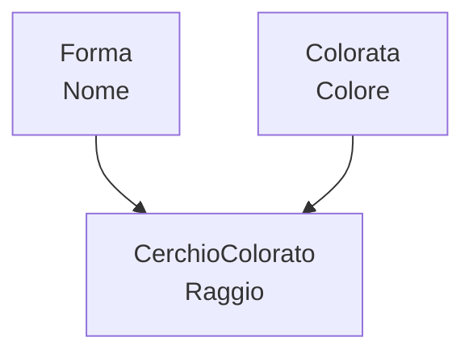

# Tipi Go e programmazione a oggetti

Questa nota approfondisce un argomento solo accennato in [fondamenti_go.md §7](fondamenti_go.md#7-struct-metodi-e-interfacce): il sistema di tipi di Go visto dal lato pratico (asserzioni, contratti a compile-time) e lo stile "a oggetti" del linguaggio — che non ha né classi né ereditarietà classica, ma **struct**, **interfacce implicite** ed **embedding**. È il confronto più istruttivo delle tre note sull'argomento proprio perché Go è l'unico dei tre linguaggi a essere *staticamente* tipato: molte domande che in [fondamenti_guile_oop.md](fondamenti_guile_oop.md) e [fondamenti_r_oop.md](fondamenti_r_oop.md) si risolvono a runtime, qui il compilatore le chiude prima ancora di eseguire una riga.

Per l'inquadramento teorico di Go nello spettro dei sistemi di tipi (statico, forte, sottotipaggio strutturale) vedi [teoria_tipi.md §10](teoria_tipi.md#10-nominale-vs-strutturale) e [teoria_tipi.md §18](teoria_tipi.md#18-tabella-comparativa); questa nota non ripete quella teoria, la mette in pratica.


## 1. Predicati di tipo: asserzioni e type switch

Go è staticamente tipato: per la stragrande maggioranza del codice il tipo di ogni valore è noto al compilatore, e un "predicato di tipo" come quelli visti in Scheme o R semplicemente non serve — il type-checker ha già la risposta prima di eseguire. Il bisogno di interrogare un tipo a runtime riemerge in un solo angolo del linguaggio: quando un valore transita per `any` (alias di `interface{}` dalla 1.18), l'unico tipo che rinuncia deliberatamente a ogni informazione statica.

L'**asserzione di tipo** è lo strumento più diretto, nella forma "sicura" a due valori:

```go
var x any = 42

n, ok := x.(int) // ok è false se x non è un int, invece di un panic
if ok {
	fmt.Println("è un intero:", n)
}

s := x.(string) // PANIC a runtime: forma a un valore, usarla solo
                // quando si è certi del tipo (es. subito dopo un controllo)
```

Il **type switch** generalizza l'idea a più casi, ed è l'equivalente Go del `cond` con predicati di Scheme ([fondamenti_guile_oop.md §1](fondamenti_guile_oop.md#1-predicati-di-tipo)) o dell'`is.*`/`inherits()` di R ([fondamenti_r_oop.md §1](fondamenti_r_oop.md#1-predicati-e-ispezione-di-tipo)):

```go
func descrivi(x any) string {
	switch v := x.(type) {
	case int:
		return fmt.Sprintf("intero: %d", v)
	case string:
		return fmt.Sprintf("stringa: %q", v)
	case nil:
		return "nil"
	default:
		return fmt.Sprintf("tipo non gestito: %T", v)
	}
}
```

Per un'introspezione più profonda (nomi di campo, kind, tag di struct) c'è il pacchetto `reflect`, usato tipicamente da librerie generiche (serializzazione JSON, ORM) più che da codice applicativo:

```go
reflect.TypeOf(42)        // => int
reflect.TypeOf("ciao")    // => string
reflect.TypeOf(42).Kind() // => reflect.Int
```

**Buona pratica:** un type switch che cresce senza controllo è quasi sempre il segnale che serviva un'interfaccia ([§4](#4-interfacce-polimorfismo-strutturale)) invece di smistare manualmente sui tipi concreti — vedi il confronto sul *multiple dispatch* al [§6](#6-multiple-dispatch-quello-che-go-non-ha).


## 2. Contratti: interfacce verificate dal compilatore

Nei linguaggi dinamici delle altre due note, un "contratto" è una condizione controllata a runtime con `assert` (Guile) o `stopifnot()` (R), perché non c'è altro momento in cui controllarla. In Go il contratto principale — "questo tipo si comporta come richiesto" — è verificato **staticamente**, ed è precisamente il sottotipaggio strutturale di [teoria_tipi.md §10](teoria_tipi.md#10-nominale-vs-strutturale): un tipo soddisfa un'interfaccia avendo i metodi giusti, senza dichiararlo, e il compilatore rifiuta il programma se manca anche un solo metodo.

L'idioma per rendere quel controllo esplicito e immediato, invece di scoprirlo alla prima chiamata che lo richiede, è l'**asserzione di interfaccia a compile-time**: una dichiarazione a costo zero a runtime (`_` scarta il valore) che esiste solo per far fallire la build se il contratto si rompe.

```go
type Forma interface {
	Area() float64
}

type Cerchio struct{ Raggio float64 }

func (c Cerchio) Area() float64 { return math.Pi * c.Raggio * c.Raggio }

var _ Forma = Cerchio{} // se Cerchio perde il metodo Area, QUESTA riga
                        // smette di compilare — non serve aspettare una chiamata
```

Resta comunque un margine dove nessun compilatore può aiutare: i **dati che arrivano da fuori** (JSON, input utente, una riga di CSV) hanno un tipo Go solo dopo essere stati decodificati, e quel passaggio può produrre valori strutturalmente validi ma semanticamente assurdi (un'età negativa, un nome vuoto). Lì la disciplina è la stessa delle altre due note, solo espressa nell'idioma di Go — un errore come valore di ritorno, non un'eccezione:

```go
func nuovoUtente(nome string, eta int) (*Utente, error) {
	if nome == "" {
		return nil, fmt.Errorf("nuovoUtente: nome non può essere vuoto")
	}
	if eta < 0 {
		return nil, fmt.Errorf("nuovoUtente: età non può essere negativa, ricevuto %d", eta)
	}
	return &Utente{Nome: nome, Eta: eta}, nil
}
```

Lo stesso principio del *fail fast* di [fondamenti_guile_oop.md §2](fondamenti_guile_oop.md#2-contratti-e-asserzioni-difendersi-dal-dinamismo) e [fondamenti_r_oop.md §2](fondamenti_r_oop.md#2-contratti-e-validazione-difendersi-dal-dinamismo): controllare al punto di ingresso pubblico, con un messaggio che nomina la funzione, invece di lasciare che l'errore riemerga altrove — vedi anche [fondamenti_go.md §8](fondamenti_go.md#8-gestione-degli-errori) per gli errori come valori in generale.


## 3. Struct types: dati come tipi prodotto

Una `struct` è l'unico modo che Go offre per raggruppare campi con nome sotto un solo tipo — l'analogo dei *record type* di Scheme ([fondamenti_guile_oop.md §4](fondamenti_guile_oop.md#4-record-types-dati-strutturati-senza-oop)) e delle liste con `class` di R ([fondamenti_r_oop.md §4](fondamenti_r_oop.md#4-s3-il-sistema-informale)), ma verificata a compile-time invece che per convenzione.

```go
type Punto struct {
	X, Y float64
}

p := Punto{X: 3, Y: 4}
p.X // => 3
```

Una struct è, alla lettera, il **tipo prodotto** dell'algebra dei tipi vista in [teoria_tipi.md §4](teoria_tipi.md#4-lalgebra-dei-tipi): il numero di valori distinti che `Punto` può assumere è il prodotto delle cardinalità dei suoi campi,

$$
|\texttt{struct}\{\texttt{X A};\ \texttt{Y B}\}| = |A| \times |B|
$$

esattamente come la coppia `(bool, bool)` di quella sezione ha $2 \times 2 = 4$ valori.

Un dettaglio che distingue Go da entrambi gli altri due linguaggi è la **semantica di assegnazione**: una struct è un tipo *valore*, e assegnarla o passarla a una funzione ne copia il contenuto, non ne condivide l'identità.

```go
p1 := Punto{X: 1, Y: 2}
p2 := p1 // copia indipendente, non un riferimento
p2.X = 99
fmt.Println(p1.X) // => 1, invariato: p1 e p2 non condividono nulla
```

Per ottenere identità condivisa e mutazione visibile da più punti — il comportamento di default delle istanze GOOPS ([fondamenti_guile_oop.md §5](fondamenti_guile_oop.md#5-goops-classi-e-istanze)) e di R6 ([fondamenti_r_oop.md §6](fondamenti_r_oop.md#6-r6-e-reference-classes-oggetti-mutabili-e-incapsulati)) — serve un puntatore esplicito, `*Punto`: è la stessa distinzione **copy vs reference semantics** discussa per R6 contro S3/S4, resa qui visibile nella firma del tipo invece che nella scelta di un pacchetto.

```go
func (p *Punto) Sposta(dx, dy float64) {
	p.X += dx // muta l'oggetto puntato, visibile a chiunque condivida lo stesso *Punto
	p.Y += dy
}
```


## 4. Interfacce: polimorfismo strutturale

Un'interfaccia elenca solo un insieme di metodi; un tipo la soddisfa **implicitamente**, avendo quei metodi, senza mai scrivere qualcosa come `implements` — il caso di scuola del sottotipaggio strutturale in [teoria_tipi.md §10](teoria_tipi.md#10-nominale-vs-strutturale), qui applicato allo stesso esempio ricorrente delle altre due note (cerchio, rettangolo, area):

```go
type Forma interface {
	Area() float64
}

type Cerchio struct{ Raggio float64 }
type Rettangolo struct{ Base, Altezza float64 }

func (c Cerchio) Area() float64    { return math.Pi * c.Raggio * c.Raggio }
func (r Rettangolo) Area() float64 { return r.Base * r.Altezza }

forme := []Forma{Cerchio{Raggio: 2}, Rettangolo{Base: 3, Altezza: 4}}
for _, f := range forme {
	fmt.Println(f.Area()) // dispatch dinamico sul tipo concreto dietro l'interfaccia
}
```

Aggiungere una nuova forma non tocca `Forma` né le implementazioni esistenti — la stessa **estensibilità aperta** ottenuta in GOOPS con un nuovo `define-method` ([fondamenti_guile_oop.md §6](fondamenti_guile_oop.md#6-metodi-generici-e-dispatch)) o in R con un nuovo metodo S3/S4, solo raggiunta qui tramite un nuovo tipo concreto e i suoi metodi, verificati a compile-time invece che a runtime.

Le interfacce si **compongono** elencandone altre invece di ripetere i metodi, il modo idiomatico di costruire un'interfaccia più ampia da pezzi piccoli:

```go
type Reader interface {
	Read(p []byte) (n int, err error)
}
type Writer interface {
	Write(p []byte) (n int, err error)
}

type ReadWriter interface {
	Reader
	Writer
}
```

`any` (alias di `interface{}`, l'interfaccia senza metodi) è soddisfatta da *qualunque* tipo — il punto in cui il sottotipaggio strutturale degenera nel duck typing puro dei linguaggi dinamici, e non a caso è l'unico angolo di Go dove tornano utili le asserzioni del [§1](#1-predicati-di-tipo-asserzioni-e-type-switch).


## 5. Ereditarietà: embedding al posto delle classi

Go non ha classi né ereditarietà nel senso di Java o C++: il meccanismo di riuso è l'**embedding**, un campo struct dichiarato senza nome che *promuove* i propri campi e metodi al tipo che lo contiene.

```go
type Forma struct {
	Nome string
}

func (f Forma) Descrivi() string { return "forma: " + f.Nome }

type Colorata struct {
	Colore string
}

// embedding multiplo: CerchioColorato "eredita" campi e metodi di entrambe
type CerchioColorato struct {
	Forma
	Colorata
	Raggio float64
}

cc := CerchioColorato{
	Forma:    Forma{Nome: "c1"},
	Colorata: Colorata{Colore: "rosso"},
	Raggio:   5,
}
cc.Nome       // => "c1"       (promosso da Forma)
cc.Colore     // => "rosso"    (promosso da Colorata)
cc.Descrivi() // => "forma: c1" (metodo promosso)
```

<div markdown="1" align="center">



</div>

L'embedding multiplo qui gioca lo stesso ruolo dei **mixin** in GOOPS ([fondamenti_guile_oop.md §7](fondamenti_guile_oop.md#7-ereditarietà)): `Colorata` è pensata per aggiungere una singola capacità componibile, non per vivere in cima a una gerarchia rigida.


### La differenza che conta: niente dispatch virtuale

Qui la parentela con l'ereditarietà classica si rompe, ed è la trappola più comune per chi arriva a Go da un linguaggio a oggetti: l'embedding **non** dà dispatch virtuale. Se `CerchioColorato` ridefinisce `Descrivi`, i metodi di `Forma` continuano a chiamare *la propria* versione, non quella "sovrascritta" — perché a tutti gli effetti sono metodi di due tipi distinti, uno dei quali capita a essere un campo dell'altro.

```go
func (cc CerchioColorato) Descrivi() string {
	// non c'è un "next-method"/"super": si richiama il campo embedded per nome
	return cc.Forma.Descrivi() + ", colore: " + cc.Colore
}

descrivi(cc) // usa CerchioColorato.Descrivi, MA se un metodo di Forma
             // chiamasse internamente Descrivi(), userebbe sempre Forma.Descrivi
```

A differenza di `next-method` in GOOPS ([fondamenti_guile_oop.md §7](fondamenti_guile_oop.md#estendere-invece-di-sostituire-next-method)) e di `NextMethod()`/`callNextMethod()` in R ([fondamenti_r_oop.md §4](fondamenti_r_oop.md#4-s3-il-sistema-informale), [§5](fondamenti_r_oop.md#5-s4-il-sistema-formale)) — che partecipano entrambi a una vera catena di dispatch risolta a runtime sulla classe dell'oggetto — qui `cc.Forma.Descrivi()` è solo una chiamata di metodo ordinaria su un campo, decisa a compile-time. **Buona pratica:** trattare l'embedding come composizione di dati e comportamento riusabile, mai come un modo per simulare il polimorfismo per sottotipo dell'OOP classica.


## 6. Multiple dispatch: quello che Go non ha

Un metodo Go fa dispatch su un solo argomento: il *receiver*. Per far dipendere un comportamento dalla combinazione di **due** tipi — lo stesso problema "cosa succede quando due forme si scontrano" già visto per GOOPS ([fondamenti_guile_oop.md §6](fondamenti_guile_oop.md#6-metodi-generici-e-dispatch)) e per S4 ([fondamenti_r_oop.md §5](fondamenti_r_oop.md#5-s4-il-sistema-formale)) — Go non offre alcun meccanismo nativo: bisogna smistare a mano con un type switch annidato.

```go
func collide(a, b Forma) {
	switch a := a.(type) {
	case Cerchio:
		switch b.(type) {
		case Cerchio:
			fmt.Println("collisione cerchio-cerchio")
		case Rettangolo:
			fmt.Println("collisione cerchio-rettangolo")
		}
	case Rettangolo:
		switch b.(type) {
		case Rettangolo:
			fmt.Println("collisione rettangolo-rettangolo")
		}
	}
}
```

La differenza rispetto a GOOPS e S4 non è di sintassi ma di **estensibilità**: in `collide?`/`collide` di quelle due note, aggiungere una forma significa aggiungere un `define-method`/`setMethod` senza toccare nulla che già esiste. Qui, aggiungere `Triangolo` significa riaprire e modificare `collide` stessa, con un numero di casi che cresce quadraticamente col numero di forme — esattamente il costo che [fondamenti_guile_oop.md §6](fondamenti_guile_oop.md#6-metodi-generici-e-dispatch) descrive per un linguaggio a dispatch singolo, reso qui ancora più esplicito dall'assenza totale di dispatch multiplo nativo.

Il workaround classico dell'OOP a dispatch singolo per questo esatto problema è il ***visitor pattern***: invece di far decidere a una funzione esterna la combinazione di tipi, si delega la seconda metà della decisione a un metodo su ciascun tipo concreto (`a.CollideWith(b)`, con overload per ogni tipo di `b`) — più verboso da scrivere, ma riporta il punto di estensione dentro l'interfaccia invece che in una funzione centrale da riaprire a ogni nuovo caso.


## 7. Generics: polimorfismo parametrico (Go 1.18+)

Fino alla versione 1.18 (2022), il polimorfismo parametrico in Go si simulava solo con `any` e asserzioni di tipo, perdendo ogni controllo statico. I **generics** aggiungono parametri di tipo vincolati da un'interfaccia usata come *constraint* — l'insieme dei tipi ammessi al posto dell'insieme dei metodi richiesti:

```go
type Numero interface {
	~int | ~float64 // "~" ammette anche i tipi il cui underlying type è int/float64
}

func Somma[T Numero](valori []T) T {
	var tot T
	for _, v := range valori {
		tot += v
	}
	return tot
}

Somma([]int{1, 2, 3})      // => 6
Somma([]float64{1.5, 2.5}) // => 4.0
```

Come [teoria_tipi.md §13](teoria_tipi.md#13-polimorfismo-nei-linguaggi) anticipa: Go implementa i generics con **monomorfizzazione**, generando a compile-time una versione specializzata di `Somma` per ogni tipo concreto effettivamente usato (`Somma[int]`, `Somma[float64]`, ...) — l'opposto della *type erasure* di Java, che condivide un solo bytecode e cancella l'informazione di tipo dopo il controllo. Il prezzo che Go paga è la dimensione del binario; il vantaggio è che a runtime non c'è dispatch generico da pagare, il compilatore ha già scelto il codice giusto.

**Buona pratica:** generics per l'omogeneità di tipo su dati (una `Somma` che funziona su qualunque numero, ma resta *lo stesso* numero per tutta la chiamata); interfacce per il polimorfismo di comportamento (`Forma`, dove `Cerchio` e `Rettangolo` restano tipi diversi nella stessa chiamata a `Area()`). I due meccanismi rispondono a domande diverse e si usano spesso insieme, non l'uno al posto dell'altro.


## 8. Confronto tra i tre linguaggi

| Aspetto | Go | Guile (GOOPS) | R (S3/S4/R6) |
|---|---|---|---|
| Controllo dei tipi | statico, a compile-time | dinamico (*latent*) | dinamico (*latent*) |
| "Contratto" di interfaccia | strutturale, verificato dal compilatore ([§2](#2-contratti-interfacce-verificate-dal-compilatore)) | nessuno, duck typing a runtime | S3 nessuno; S4 slot tipizzati con validità |
| Dispatch | singolo (sul receiver) o nessuno (funzioni libere) | multiplo, nativo ([§6](#6-multiple-dispatch-quello-che-go-non-ha)) | S3/R6 singolo; S4 multiplo |
| Riuso tra tipi | embedding: composizione, **senza** dispatch virtuale ([§5](#5-ereditarietà-embedding-al-posto-delle-classi)) | ereditarietà multipla di classi, con `next-method` | S4 `contains`; R6 `inherit`, entrambi con richiamo esplicito al genitore |
| Semantica di mutazione | struct: copia; `*T`: riferimento ([§3](#3-struct-types-dati-come-tipi-prodotto)) | istanze GOOPS: riferimento | S3/S4: copy-on-modify; R6: riferimento |
| Estensibilità aperta | sì per interfacce (nuovo tipo); no per type switch centralizzato | sì, sempre (nuovo `define-method`) | sì (nuovi metodi S3/S4) |

La riga più istruttiva è quella sul dispatch: è l'unico aspetto in cui Go è strutturalmente più debole delle altre due note, non per una scelta di design isolata ma come conseguenza diretta dell'assenza di un sistema a oggetti dedicato — Go tratta le interfacce come un meccanismo di *tipi*, non come l'ingresso a un intero sotto-linguaggio di dispatch come GOOPS o S4.


## 9. Buone pratiche: esempi commentati


### 9.1 Validare ai margini, fidarsi all'interno

```go
// Bene: il controllo è concentrato al punto di ingresso pubblico
func nuovoUtente(nome string, eta int) (*Utente, error) {
	if nome == "" {
		return nil, fmt.Errorf("nuovoUtente: nome non può essere vuoto")
	}
	if eta < 0 {
		return nil, fmt.Errorf("nuovoUtente: età non può essere negativa")
	}
	return &Utente{Nome: nome, Eta: eta}, nil
}

// Male: nessun controllo, l'errore emerge lontano dalla vera causa
func nuovoUtenteFragile(nome string, eta int) *Utente {
	return &Utente{Nome: nome, Eta: eta} // un'età negativa "compila" e si propaga
}
```


### 9.2 Interfacce piccole, definite da chi le consuma

```go
// Male: un'interfaccia larga, che pochi tipi soddisfano per intero
type Archiviatore interface {
	Salva(dato []byte) error
	Carica(id string) ([]byte, error)
	Elimina(id string) error
	Elenca() ([]string, error)
}

// Bene: l'interfaccia minima di cui la funzione ha davvero bisogno
type Salvatore interface {
	Salva(dato []byte) error
}

func backup(s Salvatore, dato []byte) error { return s.Salva(dato) }

// qualunque tipo con un metodo Salva soddisfa questa interfaccia,
// anche uno che implementa anche molto altro
```


### 9.3 Embedding per riuso di comportamento, non per simulare "is-a"

```go
// Bene: Logger è una capacità componibile, non un genitore concettuale
type Logger struct{ prefisso string }

func (l Logger) Log(msg string) { fmt.Println(l.prefisso + ": " + msg) }

type Server struct {
	Logger
	porta int
}

s := Server{Logger: Logger{prefisso: "server"}, porta: 8080}
s.Log("avviato") // "server: avviato" — riuso per composizione, non per gerarchia
```


### 9.4 Generics invece di `any` quando il tipo resta omogeneo

```go
// Male: any perde ogni garanzia statica, serve un'asserzione a ogni uso
func sommaAny(valori []any) any {
	var tot float64
	for _, v := range valori {
		tot += v.(float64) // panic se un elemento non è float64
	}
	return tot
}

// Bene: il vincolo di tipo è verificato dal compilatore, nessuna asserzione
func Somma[T ~int | ~float64](valori []T) T {
	var tot T
	for _, v := range valori {
		tot += v
	}
	return tot
}
```


## 10. Documentazione e risorse

- **Tour interattivo, sezione Methods/Interfaces**: <https://go.dev/tour/methods/1>
- **Effective Go, sezione Interfaces and other types**: <https://go.dev/doc/effective_go#interfaces_and_types>
- **Proposta e design dei generics**: <https://go.dev/doc/tutorial/generics>
- **Specifica del linguaggio**: <https://go.dev/ref/spec>
- Vedi anche [fondamenti_go.md](fondamenti_go.md) per la sintassi di base del linguaggio, [teoria_tipi.md §10](teoria_tipi.md#10-nominale-vs-strutturale) per l'inquadramento teorico del sottotipaggio strutturale, e [fondamenti_guile_oop.md](fondamenti_guile_oop.md)/[fondamenti_r_oop.md](fondamenti_r_oop.md) per il confronto diretto con GOOPS e S3/S4/R6.

> **Nota sulla versione**: gli esempi con generics richiedono **Go 1.18** o successivo. Verifica sempre
> la versione installata con `go version`.
