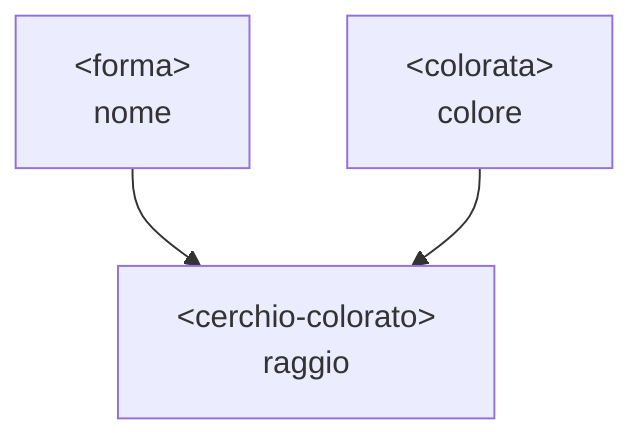

# Tipi Gnu Guile e programmazione a oggetti (GOOPS)

Questa nota approfondisce due argomenti già accennati in [fondamenti_guile.md](fondamenti_guile.md): il sistema di tipi di Guile visto dal lato pratico (predicati, contratti, la torre numerica) e **GOOPS**, il sistema a oggetti di Scheme, trattato qui per esteso — classi, ereditarietà, metodi generici, *multiple dispatch*. Chiude una sezione di buone pratiche con esempi completi.

Per l'inquadramento teorico di Guile nello spettro dei sistemi di tipi (dinamico ma forte, *latent typing*, nessuna coercizione silenziosa) vedi [teoria_tipi.md §8](teoria_tipi.md#8-forte-vs-debole-applicato); questa nota non ripete quella teoria, la mette in pratica.


## 1. Predicati di tipo

Guile non ha annotazioni di tipo: ogni valore porta il proprio tipo con sé a runtime, e lo si interroga con un **predicato** — una funzione che restituisce `#t`/`#f` e il cui nome termina per convenzione con `?`.

```scheme
(number? 42)      ; => #t
(string? "ciao")  ; => #t
(pair? '(1 2))    ; => #t
(procedure? car)  ; => #t
(null? '())       ; => #t
```

Per sapere a quale classe GOOPS appartiene un valore (vedi [§6](#6-goops-classi-e-istanze)), `class-of` è l'equivalente "a runtime" di un `typeof`:

```scheme
(class-of 42)      ; => #<class <integer>>
(class-of "ciao")  ; => #<class <string>>
```

I predicati sono lo strumento con cui si fa dispatch manuale quando non serve tutto l'apparato di GOOPS — `cond` con un predicato per ramo è l'idioma Scheme più comune:

```scheme
(define (descrivi x)
  (cond ((number? x)  "è un numero")
        ((string? x)  "è una stringa")
        ((pair? x)    "è una coppia")
        (else         "tipo non gestito")))
```


## 2. Contratti e asserzioni: difendersi dal dinamismo

Senza un compilatore che controlla i tipi, la disciplina va reintrodotta a mano nei punti in cui il codice riceve dati da fuori (argomenti pubblici, input utente, parsing). L'idioma è **fail fast**: controllare all'ingresso, con un messaggio chiaro, invece di lasciare che l'errore emerga più tardi e più lontano dalla causa.

```scheme
(define (dividi a b)
  (assert (number? a) "dividi: `a` deve essere un numero" a)
  (assert (number? b) "dividi: `b` deve essere un numero" b)
  (assert (not (zero? b)) "dividi: divisione per zero")
  (/ a b))
```

> **Nota:** `assert` termina il programma con un errore se la condizione è falsa; per un controllo che si vuole poter recuperare (invece di interrompere tutto) si usa `error` dentro un normale `if`, catturabile con `catch`/`with-exception-handler`.

Lo stesso pattern si generalizza in un piccolo helper riutilizzabile, utile quando una funzione ha più parametri da validare allo stesso modo:

```scheme
(define (richiedi-tipo pred nome valore)
  (unless (pred valore)
    (error (format #f "atteso ~a, ricevuto: ~s" nome valore))))

(define (area-rettangolo base altezza)
  (richiedi-tipo number? "un numero" base)
  (richiedi-tipo number? "un numero" altezza)
  (* base altezza))
```

Questo è il modo idiomatico in cui Guile compensa l'assenza di un type-checker statico ([§8 di teoria_tipi.md](teoria_tipi.md#8-forte-vs-debole-applicato) chiama questa proprietà "forte": Guile non coercisce mai silenziosamente, quindi un controllo esplicito come questo è ciò che sostituisce, a runtime, la verifica che altri linguaggi farebbero a compile-time).


## 3. La torre numerica in pratica

Guile distingue i numeri **esatti** (interi, razionali) dai numeri **inesatti** (virgola mobile), e non li confonde mai silenziosamente:

```scheme
(exact? 1/3)      ; => #t   — razionale esatto
(exact? 3.14)     ; => #f   — virgola mobile
(+ 1/3 1/6)       ; => 1/2  (esatto, nessun arrotondamento)
(+ 1/3 0.5)       ; => 0.8333333333333334  (il risultato "contagia" inexact)
```

Predicati utili per navigare la gerarchia (integer? ⊂ rational? ⊂ real? ⊂ complex?):

```scheme
(integer? 4)       ; => #t
(rational? 1/3)     ; => #t
(real? 3.14)        ; => #t
(complex? 3+4i)      ; => #t
```

**Buona pratica:** mantenere i calcoli in forma esatta il più a lungo possibile (frazioni, interi a precisione arbitraria) e convertire a virgola mobile — con `exact->inexact` — solo all'ultimo passo, quando serve davvero un numero decimale (es. per stamparlo o passarlo a una libreria grafica). Il passaggio inverso, `inexact->exact`, non "recupera" precisione già persa: va usato solo quando si sa che il valore inesatto rappresenta comunque una quantità esatta (es. il risultato di `(/ 1.0 3)` non torna mai a essere `1/3` in modo affidabile).


## 4. Record types: dati strutturati senza OOP

Prima di arrivare a GOOPS, Scheme offre un meccanismo più leggero per dati strutturati con campi nominati: `define-record-type` (SRFI-9), già standard in R7RS.

```scheme
(define-record-type <punto>
  (make-punto x y)
  punto?
  (x punto-x set-punto-x!)
  (y punto-y set-punto-y!))

(define p (make-punto 3 4))
(punto-x p)          ; => 3
(punto? p)            ; => #t
(set-punto-y! p 10)
(punto-y p)           ; => 10
```

A differenza di una lista o di un vettore posizionale (`(list 3 4)`, dove l'ordine dei campi va ricordato a memoria), un record dà accessori nominati generati automaticamente e un predicato di tipo dedicato (`punto?`), a un costo sintattico minimo.

**Buona pratica:** per dati puramente strutturati — senza bisogno di ereditarietà, di più implementazioni intercambiabili o di dispatch su più tipi — un record è quasi sempre la scelta giusta, più semplice di una classe GOOPS. GOOPS entra in gioco solo quando serve qualcosa che un record da solo non offre: vedi [§9](#9-goops-vs-il-resto-del-linguaggio-quando-usarlo).


## 5. GOOPS: classi e istanze

**GOOPS** (*Guile Object-Oriented Programming System*) è il sistema a oggetti di Guile, ispirato al CLOS di Common Lisp. Una classe si definisce con `define-class`, elencando gli **slot** (i campi) con le loro opzioni:

```scheme
(use-modules (oop goops))

(define-class <punto> ()
  (x #:init-value 0 #:accessor punto-x #:init-keyword #:x)
  (y #:init-value 0 #:accessor punto-y #:init-keyword #:y))

(define p (make <punto> #:x 3 #:y 4))
(punto-x p)          ; => 3
(set! (punto-x p) 10)
(punto-x p)           ; => 10
```

Opzioni comuni per uno slot:

| Opzione | Significato |
|---|---|
| `#:init-value` | Valore di default se non specificato alla creazione |
| `#:init-keyword` | Parola chiave con cui passare il valore a `make` |
| `#:init-thunk` | Funzione a zero argomenti chiamata per calcolare il default |
| `#:accessor` | Genera getter/setter combinati (`(set! (accessor obj) v)`) |
| `#:getter` / `#:setter` | Getter e setter separati, se non si vuole l'accessor combinato |

`#:init-thunk` è utile quando il default non è una costante ma va calcolato ogni volta (es. un timestamp o un identificatore univoco):

```scheme
(define-class <sessione> ()
  (id #:init-thunk (lambda () (gensym "sess-")) #:getter sessione-id))
```


## 6. Metodi generici e dispatch

A differenza di un linguaggio a oggetti "classico" dove i metodi appartengono a una classe, in GOOPS un **metodo generico** è una funzione a sé, e le classi degli argomenti scelgono quale implementazione eseguire — lo stesso `define-method` visto in [fondamenti_guile.md §12](fondamenti_guile.md#12-programmazione-a-oggetti-goops):

```scheme
(define-class <cerchio> ()
  (raggio #:init-keyword #:raggio #:accessor cerchio-raggio))

(define-class <rettangolo> ()
  (base #:init-keyword #:base #:accessor rett-base)
  (altezza #:init-keyword #:altezza #:accessor rett-altezza))

(define-generic area)

(define-method (area (c <cerchio>))
  (* 3.14159 (cerchio-raggio c) (cerchio-raggio c)))

(define-method (area (r <rettangolo>))
  (* (rett-base r) (rett-altezza r)))

(area (make <cerchio> #:raggio 2))              ; => 12.56636
(area (make <rettangolo> #:base 3 #:altezza 4))  ; => 12
```

Il vantaggio rispetto a un `cond` con predicati ([§1](#1-predicati-di-tipo)) è l'**estensibilità aperta**: aggiungere una nuova forma non richiede toccare il codice esistente, basta definire una nuova classe e un nuovo `define-method` per `area` — lo stesso principio *open/closed* che in Go si ottiene con le interfacce strutturali ([teoria_tipi.md §10](teoria_tipi.md#10-nominale-vs-strutturale)), qui realizzato tramite dispatch a runtime sulla classe dell'argomento invece che a compile-time sulla forma del tipo.


### Multiple dispatch: il tratto distintivo di GOOPS

La vera differenza rispetto a Java, Go o Python — dove un metodo fa dispatch su un solo argomento, il ricevente — è che GOOPS può fare dispatch su più argomenti contemporaneamente:

```scheme
(define-generic collide?)

(define-method (collide? (a <cerchio>) (b <cerchio>))
  (display "collisione cerchio-cerchio\n") #t)

(define-method (collide? (a <cerchio>) (b <rettangolo>))
  (display "collisione cerchio-rettangolo\n") #t)

(define-method (collide? (a <rettangolo>) (b <rettangolo>))
  (display "collisione rettangolo-rettangolo\n") #t)

(collide? (make <cerchio> #:raggio 1) (make <rettangolo> #:base 2 #:altezza 2))
;; sceglie automaticamente il metodo cerchio-rettangolo
```

In un linguaggio a dispatch singolo, lo stesso problema (il comportamento dipende dalla combinazione di *due* tipi) richiede uno schema indiretto come il *visitor pattern* o una catena di `instanceof`/type-switch. In GOOPS è la cosa più naturale da scrivere: ogni combinazione di classi è semplicemente un altro `define-method` per lo stesso generico.


## 7. Ereditarietà

Una classe può ereditare da una o più superclassi, elencandole al posto della lista vuota `()` vista finora:

```scheme
(define-class <forma> ()
  (nome #:init-keyword #:nome #:accessor forma-nome))

(define-class <colorata> ()
  (colore #:init-keyword #:colore #:init-value 'nero #:accessor forma-colore))

;; ereditarietà multipla: <cerchio-colorato> eredita sia da <forma> sia da <colorata>
(define-class <cerchio-colorato> (<forma> <colorata>)
  (raggio #:init-keyword #:raggio #:accessor cerchio-raggio))

(define c (make <cerchio-colorato> #:nome "c1" #:colore 'rosso #:raggio 5))
(forma-nome c)     ; => "c1"      (ereditato da <forma>)
(forma-colore c)   ; => rosso    (ereditato da <colorata>, un mixin)
(cerchio-raggio c) ; => 5
```

<div markdown="1" align="center">



</div>

`<colorata>` qui funziona come un **mixin**: una classe pensata per aggiungere una singola capacità (avere un colore) a qualunque altra classe, componibile per ereditarietà multipla invece che dover essere prevista in anticipo in un'unica gerarchia rigida.


### Estendere invece di sostituire: `next-method`

Quando una sottoclasse ridefinisce un metodo generico, può comunque richiamare l'implementazione della superclasse con `next-method` invece di riscriverla da zero:

```scheme
(define-method (descrivi (f <forma>))
  (format #f "forma: ~a" (forma-nome f)))

(define-method (descrivi (c <cerchio-colorato>))
  (string-append (next-method) (format #f ", colore: ~a" (forma-colore c))))

(descrivi c)   ; => "forma: c1, colore: rosso"
```

Questo pattern — chiamare `next-method` per *estendere* un comportamento invece di sovrascriverlo — evita di duplicare la logica della superclasse ogni volta che una sottoclasse vuole solo aggiungere qualcosa, non rimpiazzarla del tutto.


## 8. GOOPS vs il resto del linguaggio: quando usarlo

Scheme è un linguaggio funzionale prima ancora che a oggetti, e l'idioma più comune per incapsulare stato resta la **chiusura** (vedi [teoria_chiusure.md §7](teoria_chiusure.md#7-stato-mutabile-incapsulato): "una chiusura è un oggetto con un solo metodo e uno stato privato"). GOOPS non sostituisce questo stile, lo affianca per i casi in cui serve qualcosa che chiusure e record non danno da soli:

- **serve dispatch su più tipi**, come nell'esempio di `collide?` al [§6](#6-metodi-generici-e-dispatch) — impossibile da esprimere pulitamente con una singola chiusura;
- **serve estensibilità aperta**: aggiungere comportamento a un tipo esistente senza toccarne il codice (nuovi `define-method` su generici già esistenti);
- **serve ereditarietà o composizione di più "capacità"** (i mixin del [§7](#7-ereditarietà)).

Se invece serve solo incapsulare uno stato privato dietro un'interfaccia minima (un contatore, una cache, un generatore), una chiusura o un record sono più semplici, non richiedono di caricare il modulo `(oop goops)`, e restano l'idioma Scheme più naturale. La regola pratica: iniziare con funzioni e record; passare a GOOPS solo quando il problema chiede esplicitamente dispatch multiplo o una gerarchia di tipi correlati.


## 9. Buone pratiche: esempi commentati


### 9.1 Validare ai margini, fidarsi all'interno

```scheme
;; Bene: il controllo è concentrato al punto di ingresso pubblico
(define (crea-utente nome eta)
  (richiedi-tipo string? "una stringa" nome)
  (richiedi-tipo integer? "un intero" eta)
  (assert (>= eta 0) "crea-utente: età non può essere negativa")
  (make-utente nome eta))

;; Male: nessun controllo, l'errore emerge lontano dalla vera causa
(define (crea-utente-fragile nome eta)
  (make-utente nome eta))  ; un'età negativa o una stringa al posto del nome
                            ; falliranno più tardi, altrove, con un messaggio
                            ; che non parla più di crea-utente
```


### 9.2 Preferire record types a liste posizionali

```scheme
;; Male: l'ordine dei campi va ricordato a memoria, nessun controllo
(define (fai-punto x y) (list x y))
(define (punto-x p) (car p))
(define (punto-y p) (cadr p))
;; scambiare per errore fai-punto y x compila e "funziona" silenziosamente

;; Bene: campi nominati, predicato di tipo dedicato, generato automaticamente
(define-record-type <punto>
  (fai-punto x y)
  punto?
  (x punto-x)
  (y punto-y))
```


### 9.3 Estensibilità aperta con metodi generici

```scheme
;; Aggiungere una nuova forma non tocca il codice esistente:
;; basta una nuova classe e un nuovo metodo per il generico già esistente `area`.
(define-class <triangolo> ()
  (base #:init-keyword #:base #:accessor tri-base)
  (altezza #:init-keyword #:altezza #:accessor tri-altezza))

(define-method (area (t <triangolo>))
  (/ (* (tri-base t) (tri-altezza t)) 2))
;; `area` funziona ora anche su <triangolo>, senza aver modificato
;; le definizioni di <cerchio> o <rettangolo> viste al §6
```


### 9.4 `next-method` per non duplicare logica

```scheme
;; Bene: la sottoclasse aggiunge, non riscrive
(define-method (descrivi (c <cerchio-colorato>))
  (string-append (next-method) (format #f ", colore: ~a" (forma-colore c))))

;; Male: duplica la logica di descrivi su <forma>, si disallinea
;; silenziosamente se quella logica cambia in futuro
(define-method (descrivi (c <cerchio-colorato>))
  (string-append (format #f "forma: ~a" (forma-nome c))
                 (format #f ", colore: ~a" (forma-colore c))))
```


## 10. Documentazione e risorse

- **Manuale GOOPS**: <https://www.gnu.org/software/guile/manual/html_node/GOOPS.html>
- **SRFI-9 (record types)**: <https://srfi.schemers.org/srfi-9/srfi-9.html>
- **Manuale di riferimento Guile**: <https://www.gnu.org/software/guile/manual/>
- Vedi anche [fondamenti_guile.md](fondamenti_guile.md) per la sintassi di base del linguaggio e [teoria_tipi.md](teoria_tipi.md) per l'inquadramento teorico del sistema di tipi di Guile nel confronto tra linguaggi.

> **Nota sulla versione**: gli esempi fanno riferimento alla serie **Guile 3.0.x**. Verifica sempre
> il manuale della versione installata con `guile --version`.
