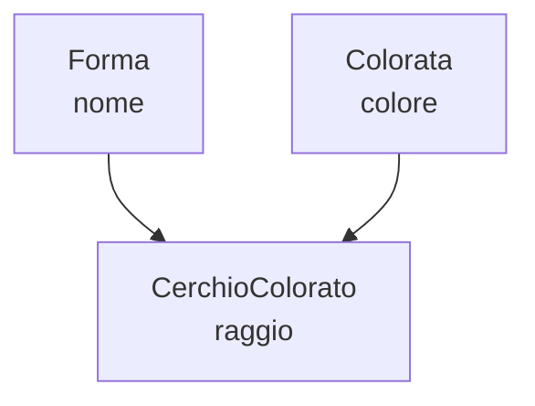

# Tipi R e programmazione a oggetti (S3, S4, R6)

Questa nota approfondisce due argomenti solo accennati in [fondamenti_r.md](fondamenti_r.md): il sistema di tipi di R visto dal lato pratico (predicati, contratti, coercizioni) e i suoi **sistemi a oggetti** — R, a differenza della maggior parte dei linguaggi, non ne ha uno solo. Tratta per esteso **S3** (informale), **S4** (formale, con *multiple dispatch*) e un cenno a **R6**/Reference Classes (mutabile, incapsulato). Chiude con una sezione di buone pratiche con esempi completi.

Per l'inquadramento teorico di R nello spettro dei sistemi di tipi (dinamico, debole, coercizioni gerarchiche automatiche) vedi [teoria_tipi.md §16](teoria_tipi.md#16-un-caso-anomalo-i-sistemi-a-oggetti-di-r); questa nota non ripete quella teoria, la mette in pratica.


## 1. Predicati e ispezione di tipo

R offre due funzioni distinte per interrogare un valore, ed è facile confonderle: `typeof()` restituisce il tipo di **archiviazione interna** (il livello più basso, quello del motore R), `class()` restituisce la classe **S3/S4** del valore, che può essere stata sovrascritta esplicitamente.

```r
x <- 5L
typeof(x) # "integer" — rappresentazione interna
class(x) # "integer" — qui coincidono, per un tipo base senza classe esplicita

df <- data.frame(a = 1)
typeof(df) # "list" — un data.frame è internamente una lista...
class(df) # "data.frame" — ...ma la sua classe S3 dice altro
```

Predicati generici (`is.*`) e il predicato di appartenenza a una classe:

```r
is.numeric(5) # TRUE
is.character("ciao") # TRUE
is.list(df) # TRUE
inherits(df, "data.frame") # TRUE — controlla la classe S3, non typeof()
str(df) # struttura completa, utile per l'ispezione interattiva
```

**Buona pratica:** per controllare "è di questo tipo logico" usare `inherits()` o gli `is.*` specifici, non confrontare `class(x) == "..."` direttamente — un oggetto può avere più di una classe (un vettore di stringhe: `class(df)` per un tibble è `c("tbl_df", "tbl", "data.frame")`), e il confronto con `==` ne vedrebbe solo la prima.


## 2. Contratti e validazione: difendersi dal dinamismo

Come in ogni linguaggio dinamico e debole ([teoria_tipi.md §8](teoria_tipi.md#8-forte-vs-debole-applicato)), la disciplina sui tipi va reintrodotta a mano ai margini del codice. `stopifnot()` è l'idioma più diretto:

```r
dividi <- function(a, b) {
    stopifnot(is.numeric(a), is.numeric(b), b != 0)
    a / b
}
```

Per argomenti che devono essere uno tra pochi valori ammessi, `match.arg()` valida e fornisce un default, in un solo passo:

```r
riassumi <- function(x, metodo = c("media", "mediana", "somma")) {
    metodo <- match.arg(metodo) # errore chiaro se metodo non è tra i tre ammessi
    switch(metodo,
           media   = mean(x),
           mediana = median(x),
           somma   = sum(x))
}
```

Lo stesso pattern si generalizza in un helper riutilizzabile, per messaggi d'errore uniformi su più parametri:

```r
richiedi_tipo <- function(valore, pred, nome) {
    if (!pred(valore)) {
        stop(sprintf("atteso %s, ricevuto un oggetto di classe %s", nome, class(valore)[1]))
    }
}

area_rettangolo <- function(base, altezza) {
    richiedi_tipo(base, is.numeric, "un numero")
    richiedi_tipo(altezza, is.numeric, "un numero")
    base * altezza
}
```


## 3. La gerarchia di coercizione in pratica

`c()` e le altre funzioni vettoriali coercono automaticamente verso il tipo "più espressivo" nella gerarchia `logical < integer < double < character` — già vista in [teoria_tipi.md §16](teoria_tipi.md#16-un-caso-anomalo-i-sistemi-a-oggetti-di-r):

```r
c(1, TRUE, "a") # -> character: c("1", "TRUE", "a"), coercizione silenziosa
c(1, TRUE) # -> numeric: c(1, 1)
```

Un dettaglio pratico spesso ignorato: `NA` da solo è di tipo `logical`, e in un contesto tipizzato va spesso disambiguato con la sua variante esplicita, altrimenti la coercizione lo trasforma silenziosamente insieme al resto:

```r
typeof(NA) # "logical"
typeof(c(1, NA)) # "double" — NA coerce a NA_real_ automaticamente qui
typeof(NA_character_) # "character" — forma esplicita, utile in costruzioni type-sensitive
# (es. costruire una colonna character riga per riga con rbind)
```

**Buona pratica:** quando la coercizione automatica non è quella voluta, convertire esplicitamente con `as.numeric()`, `as.character()`, `as.integer()` *prima* di combinare i valori, invece di lasciare che `c()` decida — e verificare sempre il risultato di una conversione con `is.na()`, perché `as.numeric("abc")` non fallisce rumorosamente: restituisce `NA` con un warning facilmente ignorato in uno script non interattivo.


## 4. S3: il sistema informale

**S3** è il sistema più usato in R (quasi tutto in base R lo è): un oggetto è un valore qualunque con un attributo `class`, e il dispatch dei metodi avviene per **convenzione di nome** — `nomegenerico.classe`.

```r
nuovo_cerchio <- function(raggio) {
    structure(list(raggio = raggio), class = "cerchio")
}

area <- function(x) UseMethod("area") # dichiara "area" come generico
area.cerchio <- function(x) pi * x$raggio^2
area.default <- function(x) stop("area: tipo non supportato")

c1 <- nuovo_cerchio(2)
area(c1) # => 12.56637
```

`UseMethod("area")` cerca una funzione chiamata `area.<classe di x>`; se non la trova, cade su `area.default`. Aggiungere una nuova forma non tocca il codice esistente, basta un nuovo costruttore e un nuovo metodo:

```r
nuovo_rettangolo <- function(base, altezza) {
    structure(list(base = base, altezza = altezza), class = "rettangolo")
}
area.rettangolo <- function(x) x$base * x$altezza

area(nuovo_rettangolo(3, 4)) # => 12, senza aver modificato area.cerchio
```


### `NextMethod()`: estendere invece di sostituire

Come `next-method` in GOOPS ([fondamenti_guile_oop.md §7](fondamenti_guile_oop.md#7-ereditarietà)), `NextMethod()` richiama l'implementazione della classe "genitrice" nella catena di classi di un oggetto:

```r
stampa_animale <- function(x) UseMethod("stampa_animale")
stampa_animale.default <- function(x) cat("Animale:", x$nome, "\n")

cane <- structure(list(nome = "Fido", razza = "Labrador"), class = c("cane", "default"))
stampa_animale.cane <- function(x) {
    NextMethod() # richiama stampa_animale.default
    cat("Razza:", x$razza, "\n")
}

stampa_animale(cane)
# Animale: Fido
# Razza: Labrador
```

Qui `class(cane)` è un **vettore** `c("cane", "default")`: R prova prima `stampa_animale.cane`, e `NextMethod()` prosegue lungo lo stesso vettore fino a `stampa_animale.default`.


## 5. S4: il sistema formale

**S4** (`setClass`, `setGeneric`, `setMethod`) aggiunge ciò che S3 non garantisce: **slot tipizzati**, **validità** verificata alla creazione, e — la sua caratteristica più distintiva — **multiple dispatch** reale, come GOOPS ([fondamenti_guile_oop.md §6](fondamenti_guile_oop.md#6-metodi-generici-e-dispatch)).

```r
setClass("Cerchio", representation(raggio = "numeric"))

setGeneric("area", function(x) standardGeneric("area"))
setMethod("area", "Cerchio", function(x) pi * x@raggio^2)

c1 <- new("Cerchio", raggio = 2)
area(c1) # => 12.56637
```

A differenza di S3, dove `structure(list(...), class = ...)` accetta qualunque contenuto, S4 può rifiutare un oggetto malformato già alla costruzione, tramite una funzione di validità:

```r
setClass("Cerchio", representation(raggio = "numeric"),
    validity = function(object) {
        if (object@raggio <= 0) "il raggio deve essere positivo" else TRUE
    })

new("Cerchio", raggio = -1)
# Error: invalid class "Cerchio" object: il raggio deve essere positivo
```


### Multiple dispatch

Lo stesso esempio "cosa succede quando due forme si scontrano" già visto per GOOPS ([fondamenti_guile_oop.md §6](fondamenti_guile_oop.md#6-metodi-generici-e-dispatch)) si scrive in modo quasi identico in S4 — il metodo scelto dipende dalla classe *di entrambi* gli argomenti:

```r
setClass("Rettangolo", representation(base = "numeric", altezza = "numeric"))

setGeneric("collide", function(a, b) standardGeneric("collide"))
setMethod("collide", signature("Cerchio", "Cerchio"),
          function(a, b) cat("collisione cerchio-cerchio\n"))
setMethod("collide", signature("Cerchio", "Rettangolo"),
          function(a, b) cat("collisione cerchio-rettangolo\n"))
setMethod("collide", signature("Rettangolo", "Rettangolo"),
          function(a, b) cat("collisione rettangolo-rettangolo\n"))

collide(new("Cerchio", raggio = 1), new("Rettangolo", base = 2, altezza = 2))
# collisione cerchio-rettangolo — sceglie automaticamente il metodo giusto
```

In un linguaggio a dispatch singolo la stessa logica richiederebbe una catena `if (is(a, "Cerchio") && is(b, "Rettangolo")) ...`; qui ogni combinazione è semplicemente un altro `setMethod`.


### Ereditarietà e `callNextMethod()`

```r
setClass("Forma", representation(nome = "character"))
setClass("Colorata", representation(colore = "character"))

# ereditarietà multipla: contains accetta più di una superclasse
setClass("CerchioColorato", contains = c("Forma", "Colorata"),
         representation(raggio = "numeric"))

cc <- new("CerchioColorato", nome = "c1", colore = "rosso", raggio = 5)
cc@nome; cc@colore; cc@raggio
```

<div markdown="1" align="center">



</div>

```r
setGeneric("descrivi", function(x) standardGeneric("descrivi"))
setMethod("descrivi", "Forma", function(x) paste("forma:", x@nome))
setMethod("descrivi", "CerchioColorato", function(x) {
    paste0(callNextMethod(), ", colore: ", x@colore) # equivalente S4 di NextMethod()
})

descrivi(cc) # => "forma: c1, colore: rosso"
```


## 6. R6 e Reference Classes: oggetti mutabili e incapsulati

S3 e S4 seguono la semantica **copy-on-modify** di R: modificare un campo produce (concettualmente) una nuova copia dell'oggetto. Quando serve invece stato mutabile con **identità** — un oggetto che cambia "sul posto" e i cui riferimenti condivisi vedono la modifica, come in Java o Python — R offre le **Reference Classes** (`setRefClass`, in base R) e, più diffuso in pratica, il pacchetto **R6**:

```r
library(R6)

Contatore <- R6Class("Contatore",
    public = list(
        count = 0,
        initialize = function(start = 0) { self$count <- start },
        incrementa = function() { self$count <- self$count + 1; invisible(self) }
    )
)

c1 <- Contatore$new()
c2 <- c1 # c2 punta allo STESSO oggetto, non una copia
c1$incrementa()
c2$count # => 1: la modifica tramite c1 è visibile anche da c2
```

**Buona pratica:** riservare R6/Reference Classes ai casi che hanno davvero bisogno di questa semantica (oggetti con stato che più parti del codice devono osservare e modificare in comune, es. una connessione, una cache, un logger); per il resto — la maggioranza del codice R — la semantica a copia di S3/S4 evita un'intera classe di bug da alias condivisi non voluti.


## 7. Quale sistema usare quando

| Sistema | Quando usarlo |
|---|---|
| **S3** | La scelta di default per la quasi totalità del codice R: generici semplici (`print`, `summary`, `plot` su un nuovo tipo), overhead minimo, nessun modulo da caricare |
| **S4** | Serve un contratto formale — slot tipizzati, validità verificata alla creazione, *multiple dispatch* reale — tipico di pacchetti con gerarchie di tipi correlati (es. Bioconductor) |
| **R6 / Reference Classes** | Serve stato mutabile con identità e incapsulamento in stile OOP classico, non la semantica a copia del resto di R |

La progressione è la stessa vista per Guile ([fondamenti_guile_oop.md §8](fondamenti_guile_oop.md#8-goops-vs-il-resto-del-linguaggio-quando-usarlo)): iniziare con la soluzione più leggera (qui, S3) e salire di formalità solo quando il problema lo richiede esplicitamente.


## 8. Buone pratiche: esempi commentati


### 8.1 Validare gli argomenti presto

```r
# Bene: il controllo è concentrato all'ingresso, con un messaggio chiaro
crea_utente <- function(nome, eta) {
    stopifnot(is.character(nome), is.numeric(eta), eta >= 0)
    structure(list(nome = nome, eta = eta), class = "utente")
}

# Male: nessun controllo, l'errore emerge lontano dalla vera causa
crea_utente_fragile <- function(nome, eta) {
    structure(list(nome = nome, eta = eta), class = "utente")
    # un'età negativa o una stringa al posto del nome falliranno più tardi,
    # altrove, con un messaggio che non parla più di crea_utente
}
```


### 8.2 Classe esplicita invece di liste anonime per dati con comportamento

```r
# Male: una lista senza classe non distingue "un punto" da "una lista qualsiasi",
# e non permette dispatch (print, area, ...) mirato
p <- list(x = 3, y = 4)

# Bene: la classe rende il tipo esplicito e abilita il dispatch S3
nuovo_punto <- function(x, y) structure(list(x = x, y = y), class = "punto")
print.punto <- function(p, ...) cat(sprintf("(%g, %g)\n", p$x, p$y))

print(nuovo_punto(3, 4)) # (3, 4) — dispatch automatico su print.punto
```


### 8.3 Estensibilità aperta con generici S3

```r
# Aggiungere una nuova forma non tocca area.cerchio né area.rettangolo:
# basta un nuovo costruttore e un nuovo metodo per il generico già esistente.
nuovo_triangolo <- function(base, altezza) {
    structure(list(base = base, altezza = altezza), class = "triangolo")
}
area.triangolo <- function(x) x$base * x$altezza / 2

area(nuovo_triangolo(3, 4)) # => 6
```


### 8.4 `NextMethod()`/`callNextMethod()` per estendere, non duplicare

```r
# Bene: la sottoclasse aggiunge, non riscrive la logica del genitore
stampa_animale.cane <- function(x) {
    NextMethod()
    cat("Razza:", x$razza, "\n")
}

# Male: duplica la logica di stampa_animale.default, si disallinea
# silenziosamente se quella logica cambia in futuro
stampa_animale.cane_duplicato <- function(x) {
    cat("Animale:", x$nome, "\n")
    cat("Razza:", x$razza, "\n")
}
```


### 8.5 Multiple dispatch S4 invece di catene di `is()`

```r
# Male: catena di controlli manuali, cresce quadraticamente con ogni nuova forma
collide_manuale <- function(a, b) {
    if (is(a, "Cerchio") && is(b, "Cerchio")) cat("cerchio-cerchio\n")
    else if (is(a, "Cerchio") && is(b, "Rettangolo")) cat("cerchio-rettangolo\n")
    else if (is(a, "Rettangolo") && is(b, "Rettangolo")) cat("rettangolo-rettangolo\n")
    else stop("combinazione non gestita")
}

# Bene: ogni combinazione è un setMethod indipendente (vedi §5),
# aggiungerne una nuova non tocca le altre
```


## 9. Documentazione e risorse

- **Advanced R** (Hadley Wickham), capitoli su S3, S4, R6: <https://adv-r.hadley.nz/oo.html>
- **Documentazione S4**: `?setClass`, `?setGeneric`, `?setMethod` in R
- **Pacchetto R6**: <https://r6.r-lib.org/>
- Vedi anche [fondamenti_r.md](fondamenti_r.md) per la sintassi di base del linguaggio, [teoria_tipi.md §16](teoria_tipi.md#16-un-caso-anomalo-i-sistemi-a-oggetti-di-r) per l'inquadramento teorico e [fondamenti_guile_oop.md](fondamenti_guile_oop.md) per il confronto diretto con GOOPS.

> **Nota sulla versione**: gli esempi fanno riferimento alla serie corrente di R. Verifica sempre
> la versione installata con `R.version.string` e, per R6, la versione del pacchetto con `packageVersion("R6")`.
