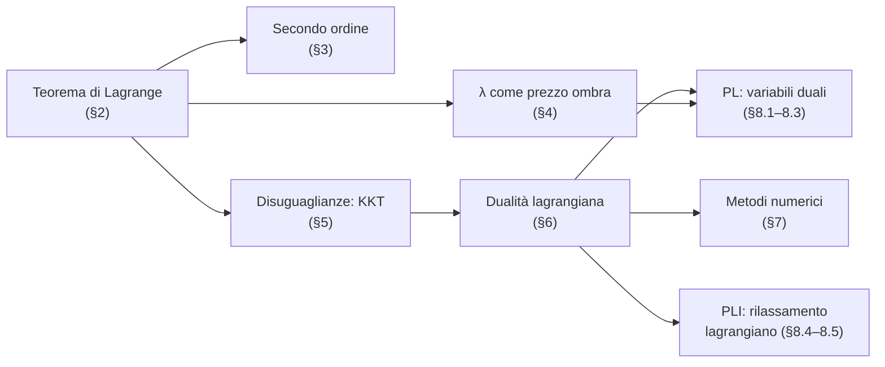
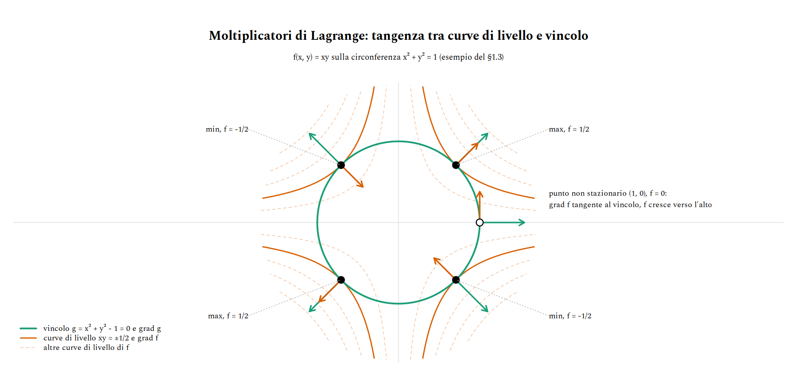
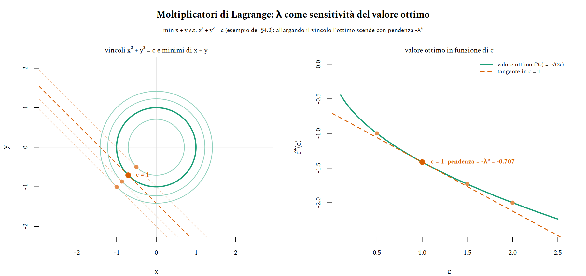
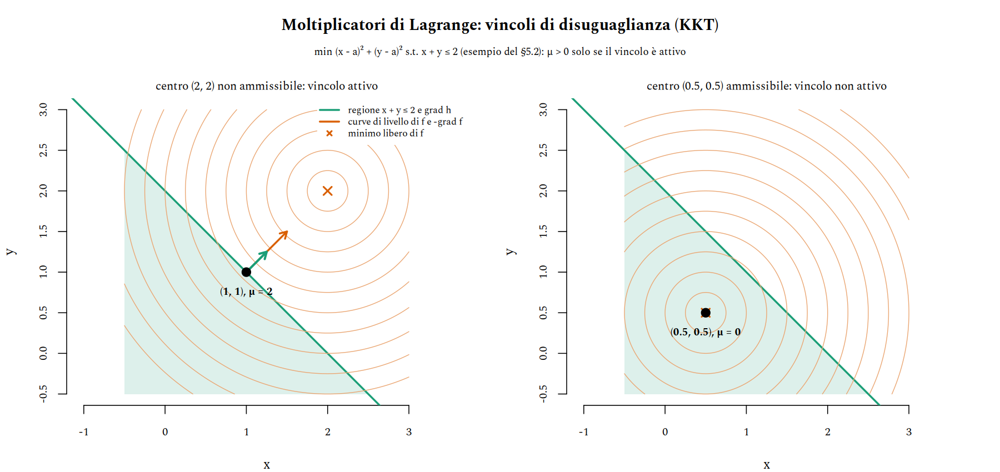
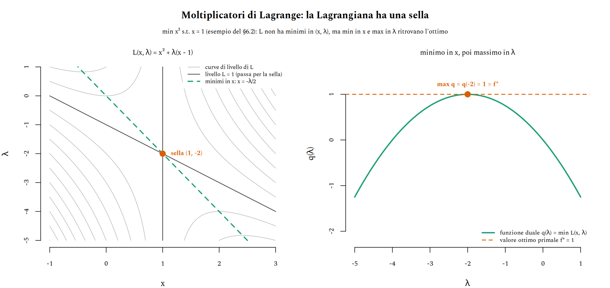
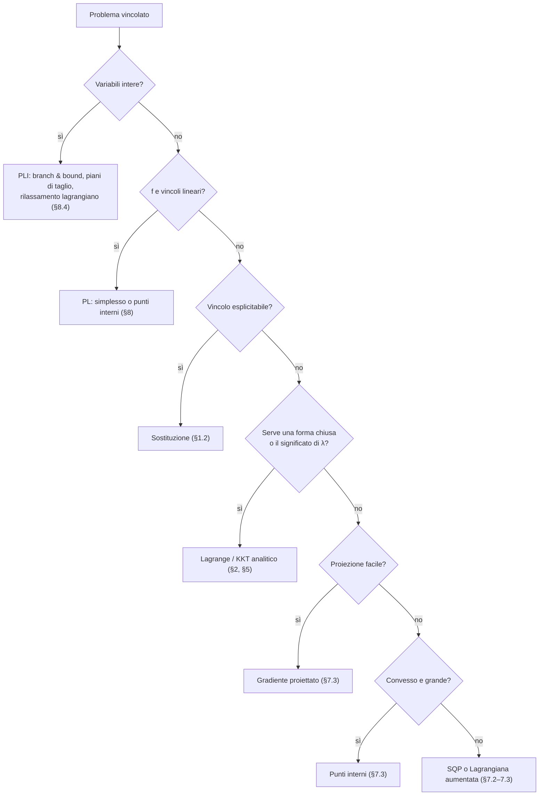
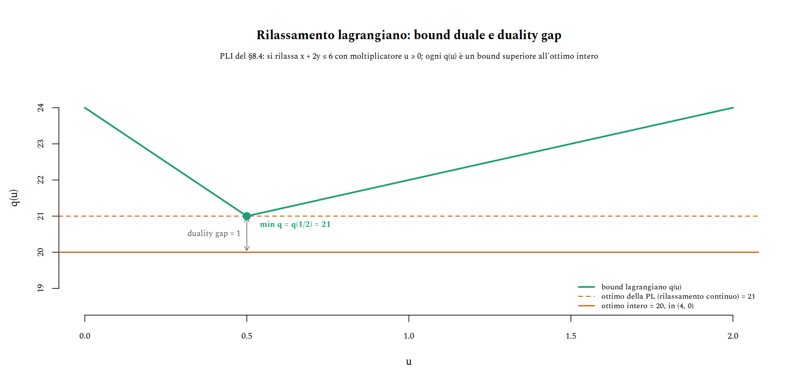

# Ottimizzazione vincolata e dualità

Minimizzare una funzione senza vincoli è, in linea di principio, semplice: si cercano i punti in cui il gradiente si annulla. Con un vincolo del tipo $g(x) = 0$ questa ricetta smette di funzionare: il minimo vincolato di solito *non* annulla il gradiente di $f$, perché il punto non è libero di muoversi in tutte le direzioni, ma solo lungo il vincolo. Il metodo dei moltiplicatori di Lagrange ripristina la ricetta a un prezzo modesto: si introduce una variabile in più, $\lambda$, per ogni vincolo, e il problema vincolato diventa la ricerca dei punti stazionari di una nuova funzione, la **Lagrangiana**.

Il moltiplicatore non è però solo un artificio di calcolo. Misura quanto costa il vincolo (è il *prezzo ombra* dell'economia), genera il problema duale e, nel caso lineare, coincide con le variabili duali della programmazione lineare. Questa nota segue $\lambda$ attraverso tutti questi ruoli: dal teorema con le sue dimostrazioni, alla geometria, ai metodi numerici, fino alla PL e alla PLI già incontrate in [teoria_ottimizzazione](../teoria_computazione/teoria_ottimizzazione.md), di cui riusa lo stesso esempio numerico.


## Cosa ci serve

- **Calcolo differenziale in più variabili**: gradiente, matrice Jacobiana e soprattutto il teorema della funzione implicita, su cui poggiano le dimostrazioni del [§2](#2-il-teorema-dei-moltiplicatori).
- **Algebra lineare**: nucleo e immagine di una matrice e il fatto che $(\ker A)^\perp = \operatorname{Im} A^\top$, che è il cuore algebrico del teorema.
- **Convessità**: serve a passare da condizioni necessarie a condizioni sufficienti ([§5.3](#53-il-caso-convesso-le-kkt-bastano)) e a garantire che la dualità non perda nulla ([§6](#6-dualità-lagrangiana)).
- **Programmazione lineare e intera**: poliedri, vertici, simplesso e branch & bound, come in [teoria_ottimizzazione §1–§2](../teoria_computazione/teoria_ottimizzazione.md#1-programmazione-lineare); servono per il [§8](#8-programmazione-lineare-e-intera).



> **Convenzioni.** In tutta la nota si *minimizza*, i vincoli di uguaglianza si scrivono $g(x) = 0$, quelli di disuguaglianza $h(x) \le 0$, e la Lagrangiana è $L = f + \lambda^\top g + \mu^\top h$, con il segno $+$. Un problema di massimo si riscrive come minimo di $-f$; fa eccezione solo il [§8](#8-programmazione-lineare-e-intera), dove la PL resta nella sua forma naturale di massimo. Il segno dei moltiplicatori dipende da queste scelte: cambiarle a metà strada è la fonte di errore più comune ([§10](#10-insidie)).


## 1. Il problema e l'idea

### 1.1 Il problema vincolato

Il problema di riferimento è

$$
\min_{x \in \mathbb{R}^n} f(x) \qquad \text{s.t.} \qquad g_i(x) = 0, \quad i = 1, \dots, m, \qquad m < n,
$$

con $f$ e $g_i$ di classe $C^1$. Si scrive $g = (g_1, \dots, g_m)$, si indica con $J_g(x)$ la sua Jacobiana ($m \times n$, la riga $i$ è $\nabla g_i(x)^\top$) e con $M = \lbrace x : g(x) = 0 \rbrace$ l'insieme ammissibile. La condizione $m < n$ dice che restano $n - m$ gradi di libertà: tipicamente $M$ è una curva, una superficie o, in generale, una varietà di dimensione $n - m$.


### 1.2 Perché non basta sostituire

Se il vincolo si risolve esplicitamente (per esempio $y = 10 - x$), lo si sostituisce in $f$ e si ottiene un problema libero in meno variabili. Spesso però questa strada è chiusa o scomoda:

- il vincolo non si esplicita in forma chiusa (per esempio $x^3 + y^3 + xy = 1$);
- si esplicita solo a pezzi: la circonferenza $x^2 + y^2 = 1$ richiede i due rami $y = \pm\sqrt{1 - x^2}$, e ciascuno è inutilizzabile in $x = \pm 1$;
- la sostituzione rompe la simmetria del problema e moltiplica i casi;
- con molte variabili e molti vincoli diventa ingestibile.

Lagrange lavora invece con $f$ e $g$ così come sono, senza mai risolvere il vincolo.


### 1.3 L'idea: in un ottimo i gradienti sono paralleli

Esempio guida per le prime sezioni: minimi e massimi di $f(x, y) = xy$ sulla circonferenza $g(x, y) = x^2 + y^2 - 1 = 0$.



L'osservazione chiave si legge nel punto $(1, 0)$, che non è un ottimo. Lì $\nabla g = (2, 0)$ è normale alla circonferenza, mentre $\nabla f = (y, x) = (0, 1)$ è tangente: muovendosi lungo il vincolo verso l'alto, $f$ cresce; verso il basso, decresce. Un punto in cui $\nabla f$ ha una componente tangente al vincolo non può quindi essere né un minimo né un massimo vincolato.

In un ottimo, allora, $\nabla f$ non deve avere componenti tangenti: deve essere perpendicolare al vincolo, cioè parallelo a $\nabla g$. Scritto con il moltiplicatore,

$$
\nabla f(x^\ast) + \lambda \, \nabla g(x^\ast) = 0 .
$$

Geometricamente è una condizione di **tangenza**: la curva di livello di $f$ che passa per l'ottimo tocca il vincolo senza attraversarlo. Nella figura sono le iperboli $xy = \pm 1/2$.

Per l'esempio, le equazioni sono $y + 2\lambda x = 0$, $x + 2\lambda y = 0$, $x^2 + y^2 = 1$. Sottraendo le prime due si ottiene $(y - x)(1 - 2\lambda) = 0$, e sommandole $(x + y)(1 + 2\lambda) = 0$; da qui $x = \pm y$ e i quattro punti stazionari:

| Punto | $f$ | $\lambda$ | Tipo |
|---|---|---|---|
| $(1/\sqrt{2},\, 1/\sqrt{2})$, $(-1/\sqrt{2},\, -1/\sqrt{2})$ | $1/2$ | $-1/2$ | massimo |
| $(1/\sqrt{2},\, -1/\sqrt{2})$, $(-1/\sqrt{2},\, 1/\sqrt{2})$ | $-1/2$ | $1/2$ | minimo |

Il segno di $\lambda$ si vede anche nella figura: nei massimi $\nabla f = -\lambda \nabla g$ ha lo stesso verso di $\nabla g$ ($\lambda < 0$), nei minimi verso opposto ($\lambda > 0$). Che i primi siano massimi e i secondi minimi qui si decide confrontando i valori di $f$; il [§3](#3-condizioni-del-secondo-ordine) dà un criterio locale.


### 1.4 Prima di tutto: il minimo esiste?

Il teorema di Lagrange dà **condizioni necessarie**: dice dove cercare, non che ci sia qualcosa da trovare. Se il minimo non esiste, i punti stazionari possono essere tutt'altro.

Il criterio più usato è Weierstrass: se $M$ è compatto (chiuso e limitato) e $f$ è continua, $f$ ha minimo e massimo su $M$. Circonferenze, sfere ed ellissi sono compatte; rette e iperboli no. Se $M$ non è limitato basta la **coercività**: se $f(x) \to +\infty$ quando $\lVert x \rVert \to \infty$ restando su $M$, il minimo esiste. Nell'esempio guida $M$ è la circonferenza, quindi minimo e massimo esistono e sono tra i quattro punti della tabella.


## 2. Il teorema dei moltiplicatori

### 2.1 Gli strumenti

**Punto regolare.** $x \in M$ è regolare se $\operatorname{rank} J_g(x) = m$, cioè se i gradienti $\nabla g_1(x), \dots, \nabla g_m(x)$ sono linearmente indipendenti. È la condizione detta LICQ (*linear independence constraint qualification*).

**Spazio tangente.** In un punto regolare, le direzioni in cui ci si può muovere restando (al primo ordine) su $M$ sono quelle che non cambiano nessun $g_i$:

$$
T_x = \ker J_g(x) = \lbrace v \in \mathbb{R}^n : \nabla g_i(x) \cdot v = 0 \ \text{ per ogni } i \rbrace, \qquad \dim T_x = n - m .
$$

**Teorema della funzione implicita.** Si spezzi $x = (y, z)$ con $y \in \mathbb{R}^m$ e $z \in \mathbb{R}^{n-m}$. Se $g(x^\ast) = 0$ e la matrice quadrata $\partial_y g(x^\ast)$ è invertibile, allora vicino a $x^\ast$ l'insieme $M$ è il grafico $y = \varphi(z)$ di una funzione $C^1$, con

$$
D\varphi = -(\partial_y g)^{-1} \, \partial_z g .
$$

In un punto regolare il rango di $J_g$ è $m$, quindi esistono sempre $m$ colonne linearmente indipendenti: rinumerando le variabili, si può sempre scegliere una partizione $(y, z)$ con $\partial_y g$ invertibile.

**Algebra lineare.** Per ogni matrice $A$ vale $(\ker A)^\perp = \operatorname{Im} A^\top$: un vettore è ortogonale a tutte le soluzioni di $Av = 0$ se e solo se è combinazione lineare delle righe di $A$.


### 2.2 L'enunciato

> **Teorema 1 (Lagrange).** Sia $x^\ast$ un minimo locale di $f$ su $M$ e sia $x^\ast$ regolare. Allora esiste un unico $\lambda^\ast \in \mathbb{R}^m$ tale che
>
> $$\nabla f(x^\ast) + \sum_{i=1}^{m} \lambda_i^\ast \, \nabla g_i(x^\ast) = 0, \qquad \text{cioè} \qquad \nabla f(x^\ast) + J_g(x^\ast)^\top \lambda^\ast = 0 .$$

Con la **Lagrangiana** $L(x, \lambda) = f(x) + \lambda^\top g(x)$ il teorema si legge come una condizione di stazionarietà senza vincoli, in $n + m$ variabili:

$$
\nabla_x L(x^\ast, \lambda^\ast) = 0, \qquad \nabla_\lambda L(x^\ast, \lambda^\ast) = g(x^\ast) = 0 .
$$

Sono $n + m$ equazioni in $n + m$ incognite: la derivata rispetto a $\lambda$ restituisce esattamente il vincolo. L'unicità di $\lambda^\ast$ viene dalla regolarità: le colonne di $J_g^\top$ sono indipendenti, quindi $J_g^\top \lambda = -\nabla f$ ha al più una soluzione.

Il teorema vale identico per i massimi locali (basta applicarlo a $-f$) e, più in generale, i punti che lo soddisfano si dicono **punti stazionari vincolati**. Le due dimostrazioni che seguono arrivano allo stesso risultato da due lati diversi: la prima mostra *perché* è vero, la seconda *quanto vale* $\lambda^\ast$.


### 2.3 Prima dimostrazione: un fatto di ortogonalità

L'idea è quella del [§1.3](#13-lidea-in-un-ottimo-i-gradienti-sono-paralleli): lungo ogni curva contenuta nel vincolo, $f$ ha un minimo in $x^\ast$, quindi la sua derivata lungo la curva è nulla.

*Dimostrazione.*

1. **Ogni direzione tangente è la velocità di una curva su $M$.** Sia $v \in T_{x^\ast}$, spezzato come $v = (v_y, v_z)$ secondo la partizione della funzione implicita. Si pone $z(t) = z^\ast + t\, v_z$ e $\gamma(t) = (\varphi(z(t)), z(t))$, per $t$ vicino a $0$. La curva sta in $M$ per costruzione, $\gamma(0) = x^\ast$ e $\gamma'(0) = (D\varphi \, v_z, v_z)$. Resta da vedere che $\gamma'(0) = v$: la condizione $J_g v = 0$ si scrive $\partial_y g \, v_y + \partial_z g \, v_z = 0$, cioè $v_y = -(\partial_y g)^{-1} \partial_z g \, v_z = D\varphi \, v_z$.
2. **La derivata di $f$ lungo la curva è nulla.** La funzione di una variabile $\psi(t) = f(\gamma(t))$ ha un minimo locale in $t = 0$, quindi $\psi'(0) = \nabla f(x^\ast) \cdot \gamma'(0) = \nabla f(x^\ast) \cdot v = 0$.
3. **Ortogonalità.** Poiché $v \in T_{x^\ast}$ era arbitrario, $\nabla f(x^\ast) \perp \ker J_g(x^\ast)$, quindi $\nabla f(x^\ast) \in (\ker J_g)^\perp = \operatorname{Im} J_g^\top$.
4. Esiste dunque $w \in \mathbb{R}^m$ con $\nabla f(x^\ast) = J_g^\top w$, e basta porre $\lambda^\ast = -w$. $\blacksquare$

Tolti i dettagli tecnici del passo 1, il teorema è tutto nel passo 3: il gradiente di $f$ deve essere ortogonale allo spazio tangente, e i vettori ortogonali allo spazio tangente sono esattamente le combinazioni dei $\nabla g_i$.


### 2.4 Seconda dimostrazione: il valore di λ

Qui si usa la funzione implicita fino in fondo: vicino a $x^\ast$ il problema vincolato *è* un problema libero in $z$, e $\lambda^\ast$ esce come formula esplicita.

*Dimostrazione.*

1. Vicino a $x^\ast$ i punti di $M$ sono tutti e soli quelli della forma $(\varphi(z), z)$, quindi $z^\ast$ è un minimo locale libero di $F(z) = f(\varphi(z), z)$.
2. Allora $\nabla F(z^\ast) = 0$, cioè, per la regola della catena, $\nabla_z f + D\varphi^\top \nabla_y f = 0$.
3. Si **definisce** $\lambda^\ast = -(\partial_y g)^{-\top} \nabla_y f$. Per costruzione $\nabla_y f + (\partial_y g)^\top \lambda^\ast = 0$: è il blocco di righe $y$ della tesi.
4. Per il blocco $z$, sostituendo $\lambda^\ast$ e ricordando che $D\varphi^\top = -(\partial_z g)^\top (\partial_y g)^{-\top}$:

   $$
   \begin{aligned}
   \nabla_z f + (\partial_z g)^\top \lambda^\ast
   &= \nabla_z f - (\partial_z g)^\top (\partial_y g)^{-\top} \nabla_y f \\
   &= \nabla_z f + D\varphi^\top \nabla_y f \\
   &= 0 ,
   \end{aligned}
   $$

   dove l'ultima uguaglianza è il passo 2.
5. I due blocchi insieme danno $\nabla f + J_g^\top \lambda^\ast = 0$. $\blacksquare$

La formula del passo 3 dice da dove viene $\lambda^\ast$: usare le variabili dipendenti $y$ per tenere soddisfatto il vincolo ha un costo, e $\lambda^\ast$ ne misura la sensibilità. Il [§4](#4-sensitività-il-moltiplicatore-come-prezzo-ombra) rende precisa questa lettura.


### 2.5 Quando la regolarità manca

L'ipotesi di regolarità non è decorativa. Si consideri

$$
\min \; x \qquad \text{s.t.} \qquad g(x, y) = y^2 - x^3 = 0 .
$$

Su $M$ vale $x = \lvert y \rvert^{2/3} \ge 0$, quindi il minimo è l'origine. Lì però $\nabla f = (1, 0)$ e $\nabla g = (-3x^2, 2y) = (0, 0)$: l'equazione $(1, 0) + \lambda (0, 0) = 0$ non ha soluzione, e nessun moltiplicatore esiste.

La curva ha una cuspide nell'origine. Il nucleo di $J_g = (0, 0)$ è tutto $\mathbb{R}^2$, ma le direzioni lungo cui ci si può davvero muovere su $M$ sono solo quella di $(1, 0)$: lo "spazio tangente" calcolato con la Jacobiana non descrive più la geometria, e il passo 1 della prima dimostrazione cade.

La versione generale è il teorema di **Fritz John**: in un minimo locale esistono $(\lambda_0, \lambda) \neq 0$ con $\lambda_0 \nabla f + J_g^\top \lambda = 0$. Nell'esempio funziona con $\lambda_0 = 0$, $\lambda = 1$, ma un'equazione in cui $f$ non compare non dà alcuna informazione su $f$. La regolarità serve esattamente a garantire $\lambda_0 \neq 0$ (e quindi, dividendo, $\lambda_0 = 1$). In pratica: i punti non regolari di $M$ vanno sempre esaminati a parte.


## 3. Condizioni del secondo ordine

### 3.1 La curvatura giusta è quella di L

La stazionarietà non distingue minimi, massimi e selle, esattamente come $f'(x) = 0$ in una variabile. Serve la curvatura, ma va misurata con l'Hessiana di $L$, non di $f$: muovendosi su $M$ si segue un vincolo curvo, e la curvatura del vincolo conta quanto quella di $f$.

> **Teorema 2.** Sia $x^\ast$ regolare con moltiplicatore $\lambda^\ast$ e sia
>
> $$H = \nabla^2_{xx} L(x^\ast, \lambda^\ast) = \nabla^2 f(x^\ast) + \sum_i \lambda_i^\ast \nabla^2 g_i(x^\ast) .$$
>
> - *Condizione necessaria.* Se $x^\ast$ è un minimo locale, allora $v^\top H v \ge 0$ per ogni $v \in T_{x^\ast}$.
> - *Condizione sufficiente.* Se $\nabla_x L(x^\ast, \lambda^\ast) = 0$, $g(x^\ast) = 0$ e $v^\top H v > 0$ per ogni $v \in T_{x^\ast} \setminus \lbrace 0 \rbrace$, allora $x^\ast$ è un minimo locale stretto.

*Dimostrazione (condizione necessaria).* Si prende la curva $\gamma$ del [§2.3](#23-prima-dimostrazione-un-fatto-di-ortogonalità), che ora (con $f, g \in C^2$) è di classe $C^2$, con $\gamma'(0) = v$. Il trucco è che su $M$ il vincolo vale zero, quindi $f$ e $L$ coincidono lungo la curva: $\psi(t) = f(\gamma(t)) = L(\gamma(t), \lambda^\ast)$. Derivando due volte la seconda espressione:

$$
\psi''(0) = \gamma'(0)^\top \, \nabla^2_{xx} L \, \gamma'(0) + \nabla_x L(x^\ast, \lambda^\ast) \cdot \gamma''(0) = v^\top H v .
$$

Il secondo termine sparisce perché $\nabla_x L = 0$: è per questo che si usa $L$ e non $f$, dove il termine con $\gamma''(0)$, l'accelerazione imposta dalla curvatura del vincolo, resterebbe. Poiché $\psi$ ha un minimo in $0$, $\psi''(0) \ge 0$. $\blacksquare$

La condizione sufficiente si dimostra per assurdo: se esistesse una successione di punti ammissibili $x_k \to x^\ast$ con $f(x_k) \le f(x^\ast)$, le direzioni normalizzate $(x_k - x^\ast)/\lVert x_k - x^\ast \rVert$ convergerebbero a un $v \in T_{x^\ast}$ con $v^\top H v \le 0$, contro l'ipotesi.

Nell'esempio guida

$$
H = \begin{pmatrix} 2\lambda & 1 \\ 1 & 2\lambda \end{pmatrix} .
$$

Nel punto $(1/\sqrt{2}, -1/\sqrt{2})$, con $\lambda = 1/2$, lo spazio tangente è generato da $v = (1, 1)$ e $v^\top H v = 4 > 0$: minimo. Nel punto $(1/\sqrt{2}, 1/\sqrt{2})$, con $\lambda = -1/2$, $T$ è generato da $v = (1, -1)$ e $v^\top H v = -4 < 0$: massimo.


### 3.2 Il test pratico: l'Hessiana orlata

Restringere $H$ a $T_{x^\ast}$ richiede una base dello spazio tangente. In alternativa si usa l'**Hessiana orlata**, che contiene già i gradienti dei vincoli. Nel caso $n = 2$, $m = 1$:

$$
B = \begin{pmatrix} 0 & g_x & g_y \\ g_x & L_{xx} & L_{xy} \\ g_y & L_{xy} & L_{yy} \end{pmatrix}, \qquad
\det B < 0 \;\Rightarrow\; \text{minimo}, \qquad \det B > 0 \;\Rightarrow\; \text{massimo}.
$$

Nell'esempio, nel punto $(1/\sqrt{2}, -1/\sqrt{2})$ si ha $g_x = \sqrt{2}$, $g_y = -\sqrt{2}$ e $L_{xx} = L_{xy} = L_{yy} = 1$, da cui $\det B = -8$: minimo, come previsto. In generale si guardano gli ultimi $n - m$ minori principali di testa di $B$: tutti con segno $(-1)^m$ per un minimo, con segni alterni a partire da $(-1)^{m+1}$ per un massimo.


## 4. Sensitività: il moltiplicatore come prezzo ombra

### 4.1 Il teorema

Si perturba il vincolo in $g(x) = c$ e si guarda come cambia il valore ottimo $f^\ast(c)$. Con la Lagrangiana $L = f + \lambda^\top (g - c)$, coerente con le convenzioni della nota:

> **Teorema 3 (sensitività).** Se in $c = c_0$ il minimo $x^\ast$ è regolare e soddisfa la condizione sufficiente del Teorema 2, allora per $c$ vicino a $c_0$ il minimo $x^\ast(c)$ e il moltiplicatore $\lambda^\ast(c)$ dipendono in modo $C^1$ da $c$ e
>
> $$\nabla_c f^\ast(c) = -\lambda^\ast(c) .$$

*Dimostrazione.* Le equazioni di Lagrange $\nabla f + J_g^\top \lambda = 0$, $g(x) = c$ hanno Jacobiana in $(x, \lambda)$ invertibile sotto le ipotesi (è la matrice del [§7.1](#71-newton-sul-sistema-di-lagrange), non singolare quando vale la condizione sufficiente); per la funzione implicita $x^\ast(c)$ e $\lambda^\ast(c)$ sono $C^1$. Scritto $D = Dx^\ast(c)$, per la regola della catena

$$
\nabla_c f^\ast = D^\top \nabla f(x^\ast) = -D^\top J_g^\top \lambda^\ast = -(J_g D)^\top \lambda^\ast .
$$

Derivando l'identità $g(x^\ast(c)) = c$ si ottiene $J_g D = I$, e quindi $\nabla_c f^\ast = -\lambda^\ast$. $\blacksquare$

Letto in parole: allentare il vincolo $i$ di un'unità cambia l'ottimo di circa $-\lambda_i^\ast$. Per questo $\lambda_i^\ast$ è il **prezzo ombra** del vincolo, il massimo che converrebbe pagare per un'unità in più di "risorsa". In economia si usa spesso $L = f - \lambda^\top (g - c)$, che cambia il segno e dà $\nabla_c f^\ast = \lambda^\ast$: le due convenzioni sono equivalenti, purché non si mescolino.


### 4.2 Un esempio visivo

Nell'esempio guida $f^\ast(c) = -c/2$ è lineare, quindi poco istruttivo. Si prende allora

$$
\min \; x + y \qquad \text{s.t.} \qquad x^2 + y^2 = c .
$$

Le equazioni $1 + 2\lambda x = 0$, $1 + 2\lambda y = 0$ danno $x = y = -1/(2\lambda)$, e il vincolo fissa $\lambda^\ast = 1/\sqrt{2c}$ nel minimo. Il minimo è $x^\ast = y^\ast = -\sqrt{c/2}$, con $f^\ast(c) = -\sqrt{2c}$. La derivata è $-1/\sqrt{2c} = -\lambda^\ast$, come previsto.



A sinistra, allargando il vincolo il minimo scivola lungo la bisettrice e la retta di livello tangente scende. A destra, la pendenza di $f^\ast$ in $c = 1$ è $-\lambda^\ast(1) = -1/\sqrt{2} \approx -0.707$. Un'osservazione utile per il seguito: qui $\nabla^2 f = 0$ non dice nulla sulla natura del punto, e tutta la curvatura di $H = 2\lambda^\ast I$ viene dal vincolo, come anticipato nel [§3.1](#31-la-curvatura-giusta-è-quella-di-l).


## 5. Vincoli di disuguaglianza: KKT

### 5.1 Le condizioni

Si aggiungono vincoli di disuguaglianza: $\min f(x)$ s.t. $g(x) = 0$, $h_j(x) \le 0$ per $j = 1, \dots, p$, con Lagrangiana $L = f + \lambda^\top g + \mu^\top h$. Un vincolo $h_j$ è **attivo** in $x$ se $h_j(x) = 0$: solo i vincoli attivi "toccano" il punto, gli altri lasciano libertà di movimento in ogni direzione.

> **Teorema 4 (Karush–Kuhn–Tucker).** Se $x^\ast$ è un minimo locale e i gradienti dei $g_i$ e degli $h_j$ attivi in $x^\ast$ sono linearmente indipendenti, allora esistono $\lambda^\ast \in \mathbb{R}^m$ e $\mu^\ast \in \mathbb{R}^p$ tali che:
>
> 1. **stazionarietà**: $\nabla f(x^\ast) + J_g^\top \lambda^\ast + J_h^\top \mu^\ast = 0$;
> 2. **ammissibilità primale**: $g(x^\ast) = 0$, $h(x^\ast) \le 0$;
> 3. **ammissibilità duale**: $\mu^\ast \ge 0$;
> 4. **complementarità**: $\mu_j^\ast \, h_j(x^\ast) = 0$ per ogni $j$.

Rispetto a Lagrange ci sono due novità, ed entrambe hanno una lettura immediata.

- **La complementarità** dice che un vincolo non attivo ($h_j < 0$) ha moltiplicatore nullo: se il vincolo non tocca il punto, il punto non "sente" il vincolo, e il suo prezzo ombra è zero.
- **Il segno $\mu \ge 0$** dice da che parte deve stare $\nabla f$. Con un solo vincolo attivo, $-\nabla f = \mu \nabla h$: la direzione di massima discesa di $f$ punta verso l'esterno della regione ammissibile ($\nabla h$ punta dove $h$ cresce, cioè fuori). Ogni direzione che rientra nella regione fa quindi salire $f$. Con $\mu < 0$ si potrebbe invece scendere entrando, e il punto non sarebbe un minimo.

*Idea della dimostrazione.* Si ripete lo schema del [§2.3](#23-prima-dimostrazione-un-fatto-di-ortogonalità), ma ora le direzioni ammissibili non formano un sottospazio, bensì un cono: quello delle $d$ con $\nabla g_i \cdot d = 0$ e $\nabla h_j \cdot d \le 0$ per gli $h_j$ attivi. In un minimo nessuna di queste può essere di discesa ($\nabla f \cdot d < 0$). Il **lemma di Farkas** trasforma questa "assenza di direzioni" in un'affermazione di esistenza: $-\nabla f$ sta nel cono generato dai $\nabla h_j$ attivi, più una combinazione dei $\nabla g_i$. I coefficienti del cono sono i $\mu_j \ge 0$.


### 5.2 Vincolo attivo e non attivo

Esempio: $\min \, (x - a)^2 + (y - a)^2$ s.t. $h(x, y) = x + y - 2 \le 0$, cioè il punto della regione $x + y \le 2$ più vicino ad $(a, a)$.



- **Con $a = 2$** il minimo libero $(2, 2)$ viola il vincolo, quindi il vincolo è attivo. Stazionarietà: $2(x - 2) + \mu = 0$ e $2(y - 2) + \mu = 0$, da cui $x = y = 2 - \mu/2$; il vincolo attivo $x + y = 2$ dà $\mu^\ast = 2 \ge 0$ e il punto $(1, 1)$. Nella figura $-\nabla f = (2, 2)$ è lungo il doppio di $\nabla h = (1, 1)$, nella stessa direzione: $\mu^\ast = 2$ si legge a occhio.
- **Con $a = 0.5$** il minimo libero $(0.5, 0.5)$ è già ammissibile, con $h = -1 < 0$. La complementarità impone $\mu^\ast = 0$ e la stazionarietà si riduce a $\nabla f = 0$: il vincolo non ha alcun ruolo.

In entrambi i casi la difficoltà non è risolvere le equazioni, ma sapere *quali vincoli sono attivi*. Con $p$ disuguaglianze ci sono $2^p$ combinazioni possibili: è il nodo combinatorio che riemerge, ingigantito, nella PL ([§8.3](#83-perché-lagrange-classico-non-basta)).


### 5.3 Il caso convesso: le KKT bastano

In generale le KKT sono solo necessarie. Nel caso convesso diventano anche sufficienti, e per giunta globali.

> **Teorema 5.** Se $f$ e gli $h_j$ sono convessi, i $g_i$ affini, e $(x^\ast, \lambda^\ast, \mu^\ast)$ soddisfa le KKT, allora $x^\ast$ è un minimo **globale**.

*Dimostrazione.* Con $\mu^\ast \ge 0$, la funzione $x \mapsto L(x, \lambda^\ast, \mu^\ast)$ è somma di funzioni convesse (i termini $\lambda_i^\ast g_i$ sono affini, qualunque sia il segno di $\lambda_i^\ast$), e per la stazionarietà ha gradiente nullo in $x^\ast$: per una funzione convessa questo vuol dire minimo globale. Per ogni $x$ ammissibile,

$$
f(x) \;\ge\; f(x) + \lambda^{\ast\top} g(x) + \mu^{\ast\top} h(x) \;=\; L(x, \lambda^\ast, \mu^\ast) \;\ge\; L(x^\ast, \lambda^\ast, \mu^\ast) \;=\; f(x^\ast).
$$

La prima disuguaglianza usa $g(x) = 0$, $h(x) \le 0$ e $\mu^\ast \ge 0$; l'ultima uguaglianza usa $g(x^\ast) = 0$ e la complementarità. $\blacksquare$

Nel caso convesso anche l'ipotesi di regolarità si può indebolire. Basta la **condizione di Slater**: esiste un punto $\bar{x}$ con $g(\bar{x}) = 0$ e $h(\bar{x}) < 0$ in senso stretto, cioè la regione ammissibile ha un "interno" rispetto alle disuguaglianze. Sotto Slater, ogni minimo ammette moltiplicatori KKT. L'esempio del [§5.2](#52-vincolo-attivo-e-non-attivo) è convesso e soddisfa Slater (per esempio con $\bar{x} = (0, 0)$), quindi i punti trovati sono minimi globali.


## 6. Dualità lagrangiana

### 6.1 Funzione duale, dualità debole e forte

L'idea della dualità è usare i moltiplicatori per costruire *bound inferiori* all'ottimo. Si definisce la **funzione duale**

$$
q(\lambda, \mu) = \inf_{x} \; L(x, \lambda, \mu), \qquad \mu \ge 0 ,
$$

con l'estremo inferiore su tutto $\mathbb{R}^n$, senza vincoli. Due fatti la rendono utile.

**$q$ è sempre concava**, anche se il problema non è convesso: per ogni $x$ fissato, $L$ è affine in $(\lambda, \mu)$, e un estremo inferiore di funzioni affini è concavo.

**Dualità debole.** Per ogni $x$ ammissibile e ogni $(\lambda, \mu)$ con $\mu \ge 0$:

$$
q(\lambda, \mu) \;\le\; L(x, \lambda, \mu) \;=\; f(x) + \underbrace{\lambda^\top g(x)}_{= 0} + \underbrace{\mu^\top h(x)}_{\le 0} \;\le\; f(x) .
$$

Ogni valore della funzione duale è quindi un bound inferiore al valore ottimo $p^\ast$, e il **problema duale** $d^\ast = \max_{\lambda,\, \mu \ge 0} q(\lambda, \mu)$ cerca il bound migliore. Sempre $d^\ast \le p^\ast$; la differenza $p^\ast - d^\ast \ge 0$ è il **duality gap**.

**Dualità forte.** Per problemi convessi che soddisfano Slater, $d^\ast = p^\ast$: il gap è nullo, e il massimo duale è raggiunto proprio nei moltiplicatori KKT del [§5](#5-vincoli-di-disuguaglianza-kkt). Senza convessità il gap può essere strettamente positivo, ed è la situazione tipica della PLI ([§8.4](#84-pli-il-rilassamento-lagrangiano)).


### 6.2 La Lagrangiana ha una sella, non un minimo

Il teorema di Lagrange dice che $(x^\ast, \lambda^\ast)$ è un punto stazionario di $L$, ed è tentante concludere che sia un suo minimo. Non lo è. Esempio minimo:

$$
\min \; x^2 \qquad \text{s.t.} \qquad x = 1, \qquad L(x, \lambda) = x^2 + \lambda (x - 1).
$$

L'unico punto stazionario è $(1, -2)$, e lì l'Hessiana di $L$ in $(x, \lambda)$ è

$$
\nabla^2 L = \begin{pmatrix} 2 & 1 \\ 1 & 0 \end{pmatrix} ,
$$

con determinante $-1$: indefinita, quindi è una **sella**. Del resto $L$ è affine in $\lambda$, e una funzione affine non ha minimi.



La struttura giusta è quella della dualità: si minimizza in $x$ e si massimizza in $\lambda$. Per ogni $\lambda$ il minimo in $x$ è in $x = -\lambda/2$ (la curva tratteggiata a sinistra), e sostituendo si ottiene $q(\lambda) = -\lambda^2/4 - \lambda$. A destra, $q$ è concava e il suo massimo, $q(-2) = 1$, coincide con $f^\ast = 1$: dualità forte, raggiunta nel moltiplicatore $\lambda^\ast = -2$.

In generale, per problemi convessi con dualità forte, $(x^\ast, \lambda^\ast, \mu^\ast)$ è un **punto di sella** di $L$:

$$
L(x^\ast, \lambda, \mu) \;\le\; L(x^\ast, \lambda^\ast, \mu^\ast) \;\le\; L(x, \lambda^\ast, \mu^\ast) \qquad \text{per ogni } x \text{ e ogni } (\lambda, \mu \ge 0) .
$$

La conseguenza pratica è netta: dare $L$ in pasto a un minimizzatore generico in tutte le variabili $(x, \lambda)$ non funziona, perché $L$ non è limitata inferiormente in $\lambda$. Gli algoritmi del prossimo paragrafo o cercano punti stazionari (Newton), o alternano un passo di discesa in $x$ e uno di salita in $\lambda$.


## 7. Metodi numerici: Lagrange e le alternative

Risolvere le equazioni di Lagrange a mano è la strada giusta per problemi piccoli e lisci con soluzione in forma chiusa, o quando interessa l'interpretazione di $\lambda$. Per il calcolo numerico esistono alternative, ma quasi tutte usano i moltiplicatori in qualche forma.

| Metodo | Vincoli | Quando usarlo | Limite |
|---|---|---|---|
| Sostituzione | uguaglianze esplicitabili | vincolo risolvibile, poche variabili | spesso impossibile ([§1.2](#12-perché-non-basta-sostituire)) |
| Lagrange / KKT analitico | entrambi | forma chiusa, interpretazione di $\lambda$ | sistema non lineare; insieme attivo da indovinare |
| Newton sul sistema di Lagrange | uguaglianze | problemi lisci, alta precisione | trova punti stazionari, non solo minimi |
| Penalità quadratica | entrambi | prototipi, basta un ottimizzatore libero | mal condizionata, vincolo solo approssimato |
| Lagrangiana aumentata | entrambi | robusta con vincoli difficili | sequenza di sottoproblemi |
| Gradiente proiettato | insiemi con proiezione facile | box, simplesso, sfere; problemi grandi | inutile se la proiezione è costosa |
| SQP | entrambi | problemi lisci di taglia media | servono Hessiane; globalizzazione delicata |
| Punti interni | disuguaglianze | problemi convessi grandi, PL | serve un punto iniziale interno |


### 7.1 Newton sul sistema di Lagrange

Le equazioni di Lagrange $F(x, \lambda) = (\nabla_x L, \, g) = 0$ sono un sistema non lineare di $n + m$ equazioni, e il metodo di Newton (lo stesso che in [fondamenti_guile §11](../fondamenti/fondamenti_guile.md#11-metodo-di-newton-esempio-numerico) calcola $\sqrt{x}$) lo risolve linearizzando a ogni passo:

$$
\begin{pmatrix} \nabla^2_{xx} L & J_g^\top \\ J_g & 0 \end{pmatrix}
\begin{pmatrix} \Delta x \\ \Delta \lambda \end{pmatrix}
= - \begin{pmatrix} \nabla_x L \\ g \end{pmatrix} .
$$

La matrice del sistema è la **matrice KKT**. È simmetrica ma indefinita (è l'Hessiana di $L$ in $(x, \lambda)$, e $L$ ha una sella, [§6.2](#62-la-lagrangiana-ha-una-sella-non-un-minimo)), quindi non si fattorizza con Cholesky ma con un solutore per sistemi indefiniti. Sull'esempio guida:

```go
// newtonKKT risolve il sistema di Lagrange di min xy s.t. x² + y² = 1,
// con incognite z = (x, y, λ), partendo da z0.
func newtonKKT(z0 [3]float64) (z [3]float64, iterazioni int) {
	z = z0
	for iterazioni = 1; iterazioni <= 50; iterazioni++ {
		x, y, l := z[0], z[1], z[2]
		F := []float64{y + 2*l*x, x + 2*l*y, x*x + y*y - 1} // (∇ₓL, g)
		J := [][]float64{
			{2 * l, 1, 2 * x}, // ⎡ ∇²ₓₓL  J_gᵀ ⎤
			{1, 2 * l, 2 * y}, // ⎣ J_g      0  ⎦
			{2 * x, 2 * y, 0},
		}
		d := risolvi(J, []float64{-F[0], -F[1], -F[2]})
		for i := range z {
			z[i] += d[i]
		}
		if math.Abs(d[0])+math.Abs(d[1])+math.Abs(d[2]) < 1e-12 {
			break
		}
	}
	return
}

// newtonKKT([3]float64{0.5, -0.6, 0.3}) → (0.707107, -0.707107, 0.5) in 6 iterazioni: il minimo
// newtonKKT([3]float64{0.6, 0.8, 0})    → (0.707107, 0.707107, -0.5) in 6 iterazioni: un massimo
```

`risolvi(A, b)` è una qualsiasi eliminazione di Gauss con pivoting parziale (con *gonum*, `mat.VecDense.SolveVec`). La convergenza è quadratica, come sempre per Newton vicino a una soluzione regolare. La seconda chiamata mostra però il limite del metodo: Newton cerca **punti stazionari** di $L$, non minimi, e converge a quello più vicino al punto di partenza, che qui è un massimo. Va sempre affiancato a un controllo del secondo ordine ([§3](#3-condizioni-del-secondo-ordine)) o a una globalizzazione che privilegi la discesa di $f$.

> **Approfondimento in _Guile_:** la parte noiosa del metodo, scrivere a mano $\nabla_x L$ e $g$, è meccanica, e in Scheme si automatizza in poche righe. Le espressioni sono liste (le S-espressioni di [fondamenti_guile §2](../fondamenti/fondamenti_guile.md#2-la-sintassi-le-s-espressioni)), quindi la derivata simbolica è un `match` sulla forma dell'espressione, una regola per ogni operatore.
> ```scheme
> (use-modules (ice-9 match) (srfi srfi-1))
>
> ;; Semplificazioni minime: costanti, zeri e uni neutri.
> (define (semplifica e)
>   (match e
>     (('+ a b) (let ((a (semplifica a)) (b (semplifica b)))
>                 (cond ((and (number? a) (number? b)) (+ a b))
>                       ((eqv? a 0) b) ((eqv? b 0) a)
>                       (else `(+ ,a ,b)))))
>     (('- a b) (let ((a (semplifica a)) (b (semplifica b)))
>                 (cond ((and (number? a) (number? b)) (- a b))
>                       ((eqv? b 0) a)
>                       (else `(- ,a ,b)))))
>     (('* a b) (let ((a (semplifica a)) (b (semplifica b)))
>                 (cond ((and (number? a) (number? b)) (* a b))
>                       ((or (eqv? a 0) (eqv? b 0)) 0)
>                       ((eqv? a 1) b) ((eqv? b 1) a)
>                       (else `(* ,a ,b)))))
>     (('expt a n) (let ((a (semplifica a)))
>                    (cond ((eqv? n 0) 1) ((eqv? n 1) a)
>                          (else `(expt ,a ,n)))))
>     (_ e)))
>
> ;; Derivata di e rispetto alla variabile v: una regola per ogni forma.
> (define (d e v)
>   (semplifica
>    (match e
>      ((? number?) 0)
>      ((? symbol?) (if (eq? e v) 1 0))
>      (('+ a b) `(+ ,(d a v) ,(d b v)))
>      (('- a b) `(- ,(d a v) ,(d b v)))
>      (('* a b) `(+ (* ,(d a v) ,b) (* ,a ,(d b v))))
>      (('expt a n) `(* (* ,n (expt ,a ,(- n 1))) ,(d a v))))))
>
> ;; Da f, vincoli g_i = 0 e variabili al sistema ∇ₓL = 0, g = 0.
> (define (sistema-lagrange f gs vars)
>   (let* ((lambdas (map (lambda (i) (string->symbol (format #f "lambda~a" i)))
>                        (iota (length gs) 1)))
>          (L (fold (lambda (l g acc) `(+ ,acc (* ,l ,g))) f lambdas gs)))
>     (append (map (lambda (v) (d L v)) vars) gs)))
>
> (sistema-lagrange '(* x y) '((- (+ (expt x 2) (expt y 2)) 1)) '(x y))
> ; => ((+ y (* lambda1 (* 2 x)))
> ;     (+ x (* lambda1 (* 2 y)))
> ;     (- (+ (expt x 2) (expt y 2)) 1))
> ```
> Sono esattamente le tre equazioni del [§1.3](#13-lidea-in-un-ottimo-i-gradienti-sono-paralleli). Derivando una seconda volta si ottengono le righe della matrice KKT, e da lì a generare il codice Go di `F` e `J` il passo è breve.


### 7.2 Penalità e Lagrangiana aumentata

Il **metodo di penalità** rinuncia a imporre il vincolo e lo fa pagare nell'obiettivo:

$$
\min_x \; f(x) + \frac{\rho}{2} \lVert g(x) \rVert^2, \qquad \rho \to \infty .
$$

È un problema libero, risolubile con qualsiasi ottimizzatore. Il prezzo è che il minimo $x_\rho$ soddisfa il vincolo solo nel limite. Confrontando la sua stazionarietà, $\nabla f + \rho \, J_g^\top g(x_\rho) = 0$, con quella di Lagrange si vede che $\rho \, g(x_\rho)$ fa da stima di $\lambda^\ast$: quindi la violazione del vincolo è circa $\lambda^\ast / \rho$, e va a zero solo se $\rho$ esplode. Ma con $\rho$ grande l'Hessiana del problema penalizzato diventa sempre più mal condizionata, e l'ottimizzatore interno fatica.

La **Lagrangiana aumentata** risolve il problema tenendo il moltiplicatore esplicito e aggiornandolo:

$$
L_\rho(x, \lambda) = f(x) + \lambda^\top g(x) + \frac{\rho}{2} \lVert g(x) \rVert^2, \qquad
x_{k+1} = \arg\min_x L_\rho(x, \lambda_k), \qquad
\lambda_{k+1} = \lambda_k + \rho \, g(x_{k+1}) .
$$

L'aggiornamento di $\lambda$ è un passo di salita sulla funzione duale ([§6](#6-dualità-lagrangiana)): ora è $\lambda$, e non $\rho$, a fare il lavoro, e il metodo converge con $\rho$ fisso. È la base di ADMM. Il confronto su $\min x^2 + y^2$ s.t. $x + y = 1$ (ottimo $x = y = 1/2$, $\lambda^\ast = -1$), dove per simmetria il sottoproblema libero ha soluzione in forma chiusa:

```go
// penalita: argmin di x² + y² + ρ/2 (x + y - 1)², con x = y per simmetria.
func penalita(rho float64) (x, violazione float64) {
	x = rho / (2 + 2*rho)
	return x, 2*x - 1
}

// lagrangianaAumentata: stesso sottoproblema con il termine λ g, poi λ ← λ + ρ g.
func lagrangianaAumentata(rho float64, passi int) (x, lambda float64) {
	for k := 0; k < passi; k++ {
		x = (rho - lambda) / (2 + 2*rho) // argmin di L_ρ(·, λ)
		lambda += rho * (2*x - 1)        // λ ← λ + ρ g(x)
	}
	return
}
```

| Penalità, $\rho$ | violazione $g(x_\rho)$ | stima $\rho \, g(x_\rho)$ di $\lambda^\ast$ |
|---|---|---|
| $1$ | $-0.5$ | $-0.5$ |
| $10$ | $-0.091$ | $-0.909$ |
| $100$ | $-0.0099$ | $-0.990$ |
| $1000$ | $-0.001$ | $-0.999$ |

| Lagrangiana aumentata, $\rho = 10$ | $\lambda_k$ |
|---|---|
| 1 passo | $-0.909$ |
| 2 passi | $-0.9917$ |
| 5 passi | $-0.999994$ |
| 10 passi | $-1.0000000000$ |

Per avere tre cifre corrette, la penalità ha bisogno di $\rho = 1000$; la Lagrangiana aumentata, con $\rho = 10$ fisso, guadagna circa una cifra per passo (l'errore su $\lambda$ si riduce di un fattore $1 + \rho = 11$).


### 7.3 Gradiente proiettato, SQP e punti interni

**Gradiente proiettato.** Un passo di discesa, $x - \alpha \nabla f(x)$, seguito dalla proiezione sull'insieme ammissibile. Conviene quando proiettare è facile: su un box (si tronca componente per componente), su una sfera (si normalizza), sul simplesso (in $O(n \log n)$, [§9.5](#95-proiezione-sul-simplesso)). Non usa i moltiplicatori esplicitamente, ma la proiezione stessa è un piccolo problema KKT.

**SQP** (*sequential quadratic programming*). Generalizza il passo di Newton del [§7.1](#71-newton-sul-sistema-di-lagrange) alle disuguaglianze: a ogni iterazione si risolve un problema quadratico con l'Hessiana di $L$ e i vincoli linearizzati, e se ne ricavano passo e nuovi moltiplicatori.

**Punti interni.** Le disuguaglianze si sostituiscono con una barriera logaritmica, che esplode avvicinandosi al bordo:

$$
\min_x \; f(x) - t \sum_j \log\big(-h_j(x)\big), \qquad t \downarrow 0 .
$$

La stazionarietà della barriera è quella delle KKT con $\mu_j = t / (-h_j(x))$, cioè $\mu_j h_j = -t$: è la complementarità "rilassata" di una quantità $t$. Facendo tendere $t$ a zero si segue il *cammino centrale* fino al punto KKT. Sono i metodi che rendono la PL polinomiale ([teoria_ottimizzazione §1.4](../teoria_computazione/teoria_ottimizzazione.md#14-complessità-decidibile-e-per-giunta-in-p)).


### 7.4 Come scegliere




## 8. Programmazione lineare e intera

Nella PL i moltiplicatori diventano le **variabili duali**, e le KKT diventano le condizioni di ottimalità della PL. Nella PLI le KKT non hanno più senso (non ci sono gradienti su $\mathbb{Z}^n$), ma la Lagrangiana sopravvive come macchina per produrre bound. Si usa lo stesso esempio di [teoria_ottimizzazione §1.2](../teoria_computazione/teoria_ottimizzazione.md#12-un-esempio-numerico), in forma di massimo.


### 8.1 Il duale della PL dalla Lagrangiana

Si parte da $\max c^\top x$ s.t. $Ax \le b$, $x \ge 0$. Per un massimo la dualità dà bound *superiori*, e la Lagrangiana naturale premia lo scarto dei vincoli, con $y \ge 0$:

$$
L(x, y) = c^\top x + y^\top (b - Ax) = b^\top y + (c - A^\top y)^\top x .
$$

Per $x$ ammissibile e $y \ge 0$ vale $c^\top x \le L(x, y)$, perché $y^\top (b - Ax) \ge 0$. Si prende ora l'estremo superiore su $x \ge 0$. Se una componente di $c - A^\top y$ è positiva, la si fa crescere senza limite e il sup è $+\infty$: un bound inutile. Altrimenti il sup è raggiunto in $x = 0$ e vale $b^\top y$. Il miglior bound così ottenibile è il **problema duale**:

$$
\min_y \; b^\top y \qquad \text{s.t.} \qquad A^\top y \ge c, \quad y \ge 0 ,
$$

e la catena appena scritta, $c^\top x \le L(x, y) \le b^\top y$, è la dualità debole. Per la PL vale sempre anche la **dualità forte**, senza ipotesi di Slater: se il primale ha ottimo finito, anche il duale lo ha, e i due valori coincidono. I vincoli lineari sono "regolari" per costruzione. Le KKT della PL sono quindi:

1. ammissibilità primale: $Ax \le b$, $x \ge 0$;
2. ammissibilità duale: $A^\top y \ge c$, $y \ge 0$;
3. complementarità: $y_i \, (b - Ax)&#95;i = 0$ e $x_j \, (A^\top y - c)&#95;j = 0$ per ogni $i, j$.


### 8.2 Le KKT sull'esempio

Il problema di [teoria_ottimizzazione §1.2](../teoria_computazione/teoria_ottimizzazione.md#12-un-esempio-numerico) è

$$
\max \; 5x_1 + 4x_2 \qquad \text{s.t.} \qquad 6x_1 + 4x_2 \le 24, \quad x_1 + 2x_2 \le 6, \quad x \ge 0,
$$

con ottimo nel vertice $x^\ast = (3, 1.5)$ e valore $21$. Il duale è $\min 24 y_1 + 6 y_2$ s.t. $6y_1 + y_2 \ge 5$, $4y_1 + 2y_2 \ge 4$, $y \ge 0$. Le KKT permettono di trovare $y^\ast$ senza risolverlo:

- entrambe le $x_j^\ast$ sono positive, quindi per complementarità entrambi i vincoli duali sono attivi: $6y_1 + y_2 = 5$ e $4y_1 + 2y_2 = 4$, da cui $y^\ast = (3/4, \, 1/2)$;
- $y^\ast \ge 0$, quindi è ammissibile per il duale;
- entrambi i vincoli primali sono attivi in $x^\ast$ ($18 + 6 = 24$ e $3 + 3 = 6$), quindi la complementarità primale è soddisfatta qualunque sia $y$;
- valore duale: $24 \cdot 3/4 + 6 \cdot 1/2 = 21$, uguale al primale. Dualità forte, e conferma che $x^\ast$ è ottimo.

$y^\ast$ ha il significato del [§4](#4-sensitività-il-moltiplicatore-come-prezzo-ombra): un'unità in più della prima risorsa vale $3/4$ di profitto, una della seconda $1/2$. Verifica diretta: con $x_1 + 2x_2 \le 7$ il vertice ottimo diventa $(2.5, \, 2.25)$, con valore $21.5 = 21 + 1/2$.


### 8.3 Perché Lagrange classico non basta

Nella PL il gradiente dell'obiettivo è $c$, costante e mai nullo: l'ottimo non è mai un punto stazionario interno, ma cade sul bordo, in un vertice ([teoria_ottimizzazione §1.3](../teoria_computazione/teoria_ottimizzazione.md#13-geometria-perché-basta-guardare-i-vertici)). Le KKT permettono di **verificare** un vertice, come nel paragrafo precedente, ma non dicono *quale* vertice: scegliere l'insieme dei vincoli attivi è un problema combinatorio, con un numero di vertici che può crescere esponenzialmente.

I due algoritmi classici si leggono come due strategie diverse per soddisfare le stesse tre condizioni:

- il **simplesso** mantiene ammissibilità primale e complementarità, e si sposta di vertice in vertice finché non ottiene anche l'ammissibilità duale. Il criterio di arresto "tutti i costi ridotti hanno il segno giusto" è esattamente $A^\top y \ge c$;
- i **punti interni** mantengono ammissibilità primale e duale strette, e spingono a zero i prodotti di complementarità, come la barriera del [§7.3](#73-gradiente-proiettato-sqp-e-punti-interni).

Una differenza rispetto al caso liscio: il valore ottimo $z^\ast(b)$ è lineare a tratti in $b$, quindi la sensitività del [§4](#4-sensitività-il-moltiplicatore-come-prezzo-ombra) vale solo finché la base ottima non cambia. L'intervallo di $b_i$ in cui il prezzo ombra resta valido si chiama *ranging*.


### 8.4 PLI: il rilassamento lagrangiano

Si aggiunge il vincolo di interezza, come in [teoria_ottimizzazione §2.1](../teoria_computazione/teoria_ottimizzazione.md#21-lo-stesso-problema-un-vincolo-in-più): l'ottimo intero è $(4, 0)$ con valore $20$, mentre il rilassamento continuo dava $21$. Il problema è NP-completo in generale ([teoria_complessita §5](../teoria_computazione/teoria_complessita.md#5-np-completezza-e-np-difficoltà)), e un buon bound superiore è ciò che permette al branch & bound di potare.

L'idea del **rilassamento lagrangiano** è spostare nell'obiettivo i vincoli "scomodi", con un moltiplicatore, e tenere quelli che lasciano un sottoproblema facile. Qui si rilassa $x_1 + 2x_2 \le 6$ con $u \ge 0$, e si tiene l'insieme $X = \lbrace x \in \mathbb{Z}^2 : 6x_1 + 4x_2 \le 24, \ x \ge 0 \rbrace$:

$$
q(u) = \max_{x \in X} \; 5x_1 + 4x_2 + u \, (6 - x_1 - 2x_2) .
$$

Per ogni $x$ ammissibile il termine aggiunto è $\ge 0$, quindi, esattamente come nel [§8.1](#81-il-duale-della-pl-dalla-lagrangiana), **ogni $q(u)$ è un bound superiore** all'ottimo intero. Il miglior bound è $\min_{u \ge 0} q(u)$.



$q$ è il massimo di un numero finito di funzioni affini in $u$ (una per ogni punto di $X$), quindi è convessa e lineare a tratti: il minimo cade in un punto di rottura, qui $u^\ast = 1/2$, con $q(1/2) = 21$. Tre osservazioni:

- **Il bound coincide con quello della PL**, e $u^\ast = 1/2$ è proprio il prezzo ombra $y_2^\ast$ del vincolo rilassato ([§8.2](#82-le-kkt-sullesempio)). Non è un caso. Per il teorema di **Geoffrion**, $\min_u q(u)$ è l'ottimo della PL su $\operatorname{conv}(X) \cap \lbrace x_1 + 2x_2 \le 6 \rbrace$; qui i vertici di $\lbrace 6x_1 + 4x_2 \le 24, \, x \ge 0 \rbrace$ sono già interi, quindi $\operatorname{conv}(X)$ è il poligono continuo e si ritrova il rilassamento della PL. Se invece $X$ non avesse vertici interi, il bound lagrangiano sarebbe strettamente migliore di quello continuo: è il caso in cui il rilassamento lagrangiano conviene davvero.
- **Il duality gap è $21 - 20 = 1$.** Non si chiude: il problema non è convesso, e la dualità forte del [§6.1](#61-funzione-duale-dualità-debole-e-forte) non vale.
- **Il sottoproblema produce candidati.** In $u = 1/2$ il massimo su $X$ è raggiunto in $(4, 0)$, $(2, 3)$ e $(0, 6)$. Il primo rispetta anche il vincolo rilassato: è l'ottimo intero. Nella pratica le soluzioni del sottoproblema, eventualmente "riparate" da un'euristica, danno soluzioni ammissibili, cioè bound inferiori.


### 8.5 Ottimizzare il duale: il subgradiente

$q$ non è differenziabile nei punti di rottura, quindi niente gradiente. Al suo posto c'è il **subgradiente**: se $x_u$ è il massimo del sottoproblema in $u$, la quantità $s = 6 - x_1 - 2x_2$ (lo scarto del vincolo rilassato in $x_u$) soddisfa $q(u') \ge q(u) + s \, (u' - u)$ per ogni $u'$, e fa le veci della derivata. Il metodo del subgradiente scende lungo $-s$ e proietta su $u \ge 0$:

```go
// sottoproblema risolve max { (5-u)x + (4-2u)y : 6x + 4y ≤ 24, x, y interi ≥ 0 }
// per enumerazione, e restituisce il bound q(u) con il punto che lo realizza.
func sottoproblema(u float64) (q float64, x, y int) {
	q = math.Inf(-1)
	for i := 0; i <= 4; i++ {
		for j := 0; 6*i+4*j <= 24; j++ {
			if v := (5-u)*float64(i) + (4-2*u)*float64(j); v > q {
				q, x, y = v, i, j
			}
		}
	}
	return q + 6*u, x, y
}

// subgradiente minimizza q(u) su u ≥ 0 con passo 1/(k+1), e raccoglie le
// soluzioni del sottoproblema che rispettano anche il vincolo rilassato.
func subgradiente(passi int) (bound, migliore float64) {
	u, bound := 0.0, math.Inf(1)
	for k := 0; k < passi; k++ {
		q, x, y := sottoproblema(u)
		bound = math.Min(bound, q)
		s := float64(6 - x - 2*y) // subgradiente di q in u
		if s >= 0 {               // x + 2y ≤ 6: soluzione intera ammissibile
			migliore = math.Max(migliore, float64(5*x+4*y))
		}
		if s == 0 {
			break
		}
		u = math.Max(0, u-s/float64(k+1))
	}
	return
}

// subgradiente(100) → bound 21.0089, migliore soluzione ammissibile 20
```

Dopo 100 passi il bound è $21.0089$, vicino al valore esatto $21$, e il sottoproblema ha già trovato l'ottimo intero $20$. La convergenza è lenta (il subgradiente non garantisce la discesa a ogni passo, e $q$ oscilla attorno al minimo), ma nella pratica basta un bound "buono abbastanza" per potare. L'aggiornamento di $u$ ha la stessa forma di quello di $\lambda$ nella Lagrangiana aumentata ([§7.2](#72-penalità-e-lagrangiana-aumentata)), senza termine quadratico.

Dentro il branch & bound ([teoria_ottimizzazione §2.3](../teoria_computazione/teoria_ottimizzazione.md#23-perché-resta-decidibile)) $q$ fornisce il bound di ogni nodo, e le soluzioni riparate del sottoproblema forniscono gli incumbent. È lo schema di applicazioni classiche come il TSP con gli 1-alberi di Held–Karp, l'assegnamento generalizzato e la localizzazione di impianti.


## 9. Esempi

Cinque problemi in cui il metodo dà una forma chiusa e il moltiplicatore ha un significato preciso. Tutti seguono le convenzioni della nota: minimo, $L = f + \lambda^\top g$.


### 9.1 Quoziente di Rayleigh e PCA

Per $A$ simmetrica, si cerca $\max x^\top A x$ s.t. $x^\top x = 1$, cioè $\min -x^\top A x$. Con $L = -x^\top A x + \lambda (x^\top x - 1)$:

$$
\nabla_x L = -2Ax + 2\lambda x = 0 \quad \Longrightarrow \quad Ax = \lambda x, \qquad x^\top A x = \lambda \, x^\top x = \lambda .
$$

I punti stazionari sono gli autovettori unitari, il moltiplicatore è l'autovalore, e il valore di $f$ in ciascuno è l'autovalore stesso: il massimo è $\lambda_{\max}$. Il secondo ordine lo conferma: su $T = x^\perp$ l'Hessiana è $2(\lambda I - A)$, semidefinita positiva solo se $\lambda$ è l'autovalore massimo. Con $A = \Sigma$, la matrice di covarianza dei dati, $x$ è la **prima componente principale** e $\lambda_{\max}$ la varianza che spiega; le componenti successive si trovano aggiungendo i vincoli di ortogonalità alle precedenti.


### 9.2 Massima verosimiglianza della multinomiale

Con conteggi $n_1, \dots, n_k$ e $N = \sum_i n_i$, si stimano le probabilità $p_i$ massimizzando la log-verosimiglianza: $\min -\sum_i n_i \log p_i$ s.t. $\sum_i p_i = 1$. La stazionarietà $-n_i / p_i + \lambda = 0$ dà $p_i = n_i / \lambda$, e il vincolo fissa $\lambda = N$:

$$
\hat{p}_i = \frac{n_i}{N} .
$$

L'obiettivo è strettamente convesso e il vincolo affine, quindi per il [§5.3](#53-il-caso-convesso-le-kkt-bastano) è l'unico ottimo globale. Il moltiplicatore $\lambda = N$ è la sensitività della log-verosimiglianza al vincolo di normalizzazione.


### 9.3 Massima entropia

Su valori $x_1, \dots, x_k$ si cerca la distribuzione più "incerta" con media fissata: $\min \sum_i p_i \log p_i$ (cioè massima entropia) s.t. $\sum_i p_i = 1$ e $\sum_i p_i x_i = m$. Con moltiplicatori $\alpha$ e $\beta$:

$$
\log p_i + 1 + \alpha + \beta x_i = 0 \quad \Longrightarrow \quad p_i = \frac{e^{-\beta x_i} }{\sum_j e^{-\beta x_j} } .
$$

È la **distribuzione di Gibbs**: $\alpha$ si riassorbe nella normalizzazione, e $\beta$ (la "temperatura inversa") è fissato dal vincolo sulla media. Lo stesso calcolo nel continuo dà, su $[0, \infty)$ con media fissata, l'esponenziale, e su $\mathbb{R}$ con media e varianza fissate, la normale. È l'origine variazionale delle famiglie esponenziali: ogni vincolo sui momenti aggiunge un termine $\beta_k T_k(x)$ all'esponente.


### 9.4 Portafoglio di Markowitz

Pesi $w \in \mathbb{R}^n$ su $n$ titoli con rendimenti attesi $\mu$ e covarianza $\Sigma$ definita positiva. Si cerca il portafoglio di varianza minima con rendimento fissato:

$$
\min_w \; \tfrac{1}{2} \, w^\top \Sigma w \qquad \text{s.t.} \qquad \mu^\top w = r, \quad \mathbf{1}^\top w = 1 .
$$

La stazionarietà $\Sigma w + \lambda_1 \mu + \lambda_2 \mathbf{1} = 0$ dà $w = -\Sigma^{-1} (\lambda_1 \mu + \lambda_2 \mathbf{1})$, e i due vincoli determinano i moltiplicatori. Con $A = \mathbf{1}^\top \Sigma^{-1} \mathbf{1}$, $B = \mathbf{1}^\top \Sigma^{-1} \mu$, $C = \mu^\top \Sigma^{-1} \mu$ e $\Delta = AC - B^2$:

$$
w^\ast = \Sigma^{-1} \left( \frac{Ar - B}{\Delta} \, \mu + \frac{C - Br}{\Delta} \, \mathbf{1} \right), \qquad
\sigma^2(r) = w^{\ast\top} \Sigma w^\ast = \frac{A r^2 - 2Br + C}{\Delta} .
$$

La **frontiera efficiente** è una parabola nel piano $(\sigma^2, r)$. Per il [§4](#4-sensitività-il-moltiplicatore-come-prezzo-ombra), $-\lambda_1 = \partial (\sigma^2 / 2) / \partial r = (Ar - B)/\Delta$ è il costo marginale, in varianza, di un punto di rendimento in più. Se si vietano le vendite allo scoperto ($w \ge 0$), la forma chiusa sparisce: servono le KKT del [§5](#5-vincoli-di-disuguaglianza-kkt) e un solutore di programmazione quadratica.

> **Approfondimento in _R_:** le condizioni di Lagrange del problema sono *lineari* in $(w, \lambda_1, \lambda_2)$, quindi basta un `solve` sulla matrice KKT del [§7.1](#71-newton-sul-sistema-di-lagrange) per verificare la forma chiusa e la sensitività (vedi [fondamenti_r §2](../fondamenti/fondamenti_r.md#2-strutture-dati) per le matrici).
> ```r
> mu <- c(0.05, 0.08, 0.12)
> Sigma <- matrix(c(0.04, 0.006, 0.01,
>                   0.006, 0.09, 0.02,
>                   0.01, 0.02, 0.16), 3)
> r <- 0.09
> uno <- rep(1, 3)
>
> # Sistema KKT: [Sigma mu 1; mu' 0 0; 1' 0 0] (w, l1, l2) = (0, r, 1)
> K <- rbind(cbind(Sigma, mu, uno), c(mu, 0, 0), c(uno, 0, 0))
> sol <- unname(solve(K, c(0, 0, 0, r, 1)))
> w_kkt <- sol[1:3]
> l1 <- sol[4]
>
> # Forma chiusa
> Si <- solve(Sigma)
> A <- drop(t(uno) %*% Si %*% uno)
> B <- drop(t(uno) %*% Si %*% mu)
> C <- drop(t(mu) %*% Si %*% mu)
> D <- A * C - B^2
> w_chiusa <- drop(Si %*% ((A * r - B) / D * mu + (C - B * r) / D * uno))
> rbind(w_kkt, w_chiusa)
> #               [,1]     [,2]      [,3]
> # w_kkt    0.2265034 0.353619 0.4198776
> # w_chiusa 0.2265034 0.353619 0.4198776
>
> # Sensitivita': d(sigma^2 / 2)/dr = -lambda_1
> s2 <- function(r) (A * r^2 - 2 * B * r + C) / D
> c((s2(r + 1e-6) - s2(r - 1e-6)) / 4e-6, -l1)
> # [1] 0.8733885 0.8733885
> ```


### 9.5 Proiezione sul simplesso

Un esempio KKT in cui la complementarità fa tutto il lavoro: proiettare un vettore $v$ sul simplesso delle distribuzioni di probabilità,

$$
\min_x \; \tfrac{1}{2} \lVert x - v \rVert^2 \qquad \text{s.t.} \qquad \mathbf{1}^\top x = 1, \quad x \ge 0 .
$$

Con $\lambda$ per l'uguaglianza e $s \ge 0$ per i vincoli $-x \le 0$, la stazionarietà è $x - v + \lambda \mathbf{1} - s = 0$. Per ogni componente ci sono due casi:

- se $x_i > 0$, la complementarità dà $s_i = 0$, quindi $x_i = v_i - \lambda$;
- se $x_i = 0$, allora $s_i = \lambda - v_i$, e $s_i \ge 0$ richiede $v_i \le \lambda$.

I due casi si riassumono in $x_i = \max(v_i - \lambda, \, 0)$: si "abbassa" $v$ di una soglia $\lambda$ e si taglia a zero, con $\lambda$ scelto in modo che la somma faccia $1$. Ordinando $v$, la soglia si trova in $O(n \log n)$. Per esempio, con $v = (0.8, \, 0.6, \, -0.2)$ e due componenti positive, $(0.8 - \lambda) + (0.6 - \lambda) = 1$ dà $\lambda = 0.2$; la terza componente rispetta $v_3 = -0.2 \le 0.2$, e la proiezione è $x = (0.6, \, 0.4, \, 0)$. Il problema è convesso, quindi è l'unico ottimo. È la proiezione che usa il gradiente proiettato del [§7.3](#73-gradiente-proiettato-sqp-e-punti-interni) quando le variabili sono pesi o probabilità.


## 10. Insidie

Quasi tutti gli errori con i moltiplicatori vengono da un'ipotesi data per scontata.

1. **Esistenza.** Lagrange dà condizioni necessarie: senza compattezza o coercività il minimo può non esistere, e i punti stazionari non significano nulla ([§1.4](#14-prima-di-tutto-il-minimo-esiste)).
2. **Regolarità.** Senza LICQ il moltiplicatore può non esistere, come nella cuspide ([§2.5](#25-quando-la-regolarità-manca)). I punti in cui $J_g$ perde rango vanno esaminati a parte.
3. **Stazionario non vuol dire minimo.** Servono il secondo ordine sullo spazio tangente o la convessità ([§3](#3-condizioni-del-secondo-ordine), [§5.3](#53-il-caso-convesso-le-kkt-bastano)). Newton converge volentieri a un massimo ([§7.1](#71-newton-sul-sistema-di-lagrange)).
4. **Hessiana sbagliata.** Il test va fatto su $\nabla^2_{xx} L$, non su $\nabla^2 f$: la curvatura del vincolo entra tramite $\sum_i \lambda_i \nabla^2 g_i$ ([§3.1](#31-la-curvatura-giusta-è-quella-di-l), [§4.2](#42-un-esempio-visivo)).
5. **Locale contro globale.** Senza convessità si confrontano i valori di $f$ in tutti i candidati: punti stazionari, punti non regolari, bordo.
6. **Segno di λ.** Con $L = f + \lambda^\top (g - c)$ vale $\nabla_c f^\ast = -\lambda^\ast$; con $L = f - \lambda^\top (g - c)$ il segno si inverte ([§4.1](#41-il-teorema)). Si fissa una convenzione e non la si cambia.
7. **Segno di μ.** $\mu \ge 0$ vale per vincoli $h \le 0$ in un problema di minimo. Con $h \ge 0$, o in un massimo, i segni si invertono ([§5.1](#51-le-condizioni), [§8.1](#81-il-duale-della-pl-dalla-lagrangiana)).
8. **La Lagrangiana ha una sella.** Minimizzarla in tutte le variabili diverge; si cercano punti stazionari, o si alterna min in $x$ e max in $\lambda$ ([§6.2](#62-la-lagrangiana-ha-una-sella-non-un-minimo)).
9. **Insieme attivo.** Le KKT verificano un candidato ma non dicono quali vincoli sono attivi: è lì che si nasconde la difficoltà combinatoria ([§5.2](#52-vincolo-attivo-e-non-attivo), [§8.3](#83-perché-lagrange-classico-non-basta)).
10. **Bound non è ottimo.** Nella PLI il rilassamento lagrangiano dà un bound, e il duality gap in genere non si chiude ([§8.4](#84-pli-il-rilassamento-lagrangiano)). Nella PL i prezzi ombra valgono solo nell'intervallo di ranging ([§8.3](#83-perché-lagrange-classico-non-basta)).


## Riferimenti bibliografici

- D. P. Bertsekas, *Nonlinear Programming*, 3ª ed., Athena Scientific, 2016: teorema di Lagrange con le due dimostrazioni, condizioni del secondo ordine e sensitività ([§2](#2-il-teorema-dei-moltiplicatori)–[§4](#4-sensitività-il-moltiplicatore-come-prezzo-ombra)).
- S. Boyd, L. Vandenberghe, *Convex Optimization*, Cambridge University Press, 2004: KKT, condizione di Slater, dualità e metodi a barriera ([§5](#5-vincoli-di-disuguaglianza-kkt)–[§6](#6-dualità-lagrangiana), [§7.3](#73-gradiente-proiettato-sqp-e-punti-interni)).
- J. Nocedal, S. J. Wright, *Numerical Optimization*, 2ª ed., Springer, 2006: Newton sul sistema KKT, penalità, Lagrangiana aumentata e SQP ([§7](#7-metodi-numerici-lagrange-e-le-alternative)).
- H. W. Kuhn, A. W. Tucker, «Nonlinear Programming», *Proceedings of the Second Berkeley Symposium on Mathematical Statistics and Probability*, 1951, 481–492: le condizioni del [§5.1](#51-le-condizioni).
- A. M. Geoffrion, «Lagrangean Relaxation for Integer Programming», *Mathematical Programming Study*, 2 (1974), 82–114: il teorema sulla qualità del bound usato nel [§8.4](#84-pli-il-rilassamento-lagrangiano).
- M. Held, R. M. Karp, «The Traveling-Salesman Problem and Minimum Spanning Trees», *Operations Research*, 18 (1970), 1138–1162: il rilassamento lagrangiano con gli 1-alberi citato nel [§8.5](#85-ottimizzare-il-duale-il-subgradiente).
- H. Markowitz, «Portfolio Selection», *The Journal of Finance*, 7 (1952), 77–91: il problema del [§9.4](#94-portafoglio-di-markowitz).
- E. T. Jaynes, «Information Theory and Statistical Mechanics», *Physical Review*, 106 (1957), 620–630: il principio di massima entropia del [§9.3](#93-massima-entropia).
