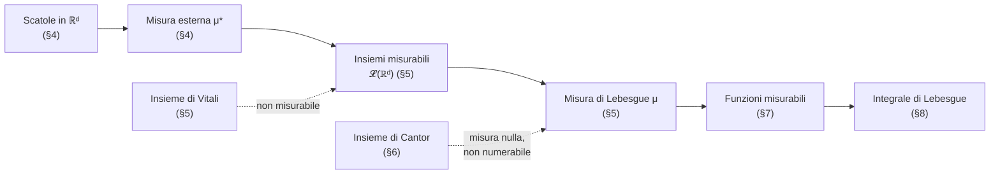
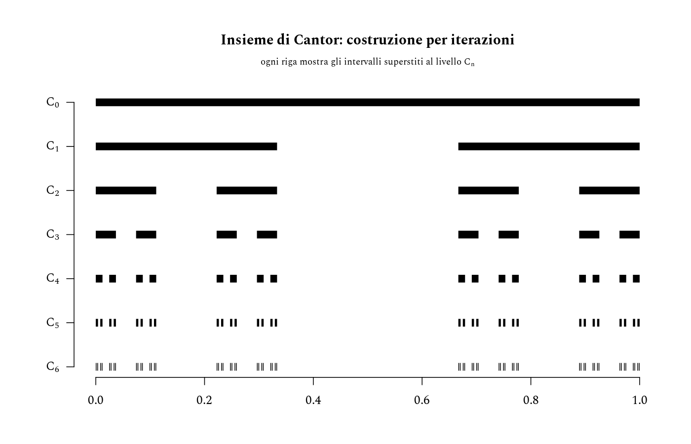
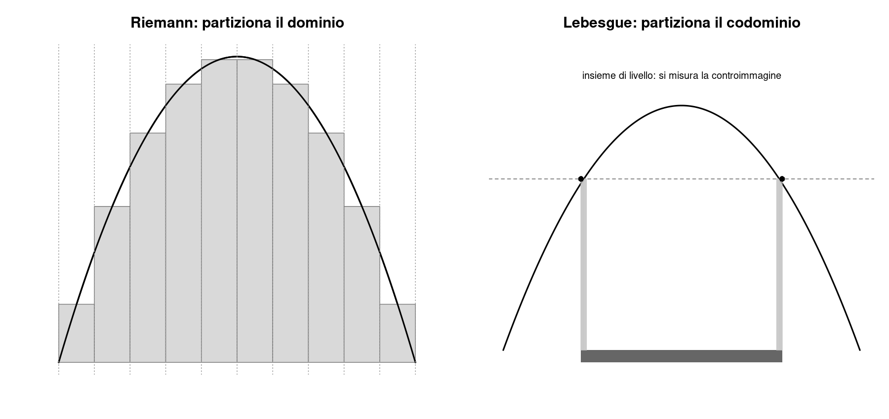

# Teoria della misura

L'integrale di Riemann funziona benissimo finché ci si limita a funzioni "ragionevoli" su intervalli. Ma appena si chiede quanto vale $\int_0^1 \mathbb{1}&#95;{\mathbb{Q}}(x)\,dx$ (la funzione che vale $1$ sui razionali e $0$ altrove), l'integrale di Riemann semplicemente non esiste: le somme superiori danno sempre $1$, le inferiori sempre $0$. Il problema non è la funzione, ma lo strumento: Riemann misura implicitamente gli insiemi con cui lavora usando solo intervalli, e i razionali — densi ma "piccoli" — non si lasciano approssimare bene in questo modo.

La teoria della misura nasce per rispondere a una domanda più generale: quali sottoinsiemi di $\mathbb{R}^d$ hanno senso di avere una lunghezza/area/volume, e come si integra rispetto a una nozione di misura così estesa. Il prezzo da pagare, come si vedrà nel [§5](#5-insiemi-misurabili-e-il-controesempio-di-vitali), è che non *tutti* i sottoinsiemi di $\mathbb{R}^d$ sono misurabili.


## Cosa ci serve

- **Insiemi numerabili e argomento diagonale** — servono a capire perché $\mathbb{Q}$ ha misura nulla e perché $\mathbb{R}$ no; sono il prerequisito concettuale per l'insieme di Cantor ([§6](#6-linsieme-di-cantor-cardinalità-e-misura-non-coincidono)).
- **$\boldsymbol{\sigma}$-algebre e misure** — il linguaggio condiviso da teoria dell'integrazione e teoria della probabilità: una misura di probabilità è solo una misura con $\mu(X)=1$.
- **Misura esterna e misurabilità secondo Lebesgue** — la costruzione centrale della nota; da qui nasce sia la misura di Lebesgue sia il controesempio (insieme di Vitali) che mostra che non si può misurare tutto.
- **Integrale di Lebesgue** — generalizza Riemann; il [§9](#9-lebesgue-contro-riemann-quando-coincidono-i-due-integrali) chiarisce esattamente quando i due integrali coincidono e quando no.




## 1. Insiemi numerabili e più che numerabili

### 1.1 Insiemi numerabili

$A$ è numerabile se è finito oppure se esiste una biiezione $f: A \to \mathbb{N}$.

$\mathbb{N} \times \mathbb{N}$ è numerabile: si può enumerare per diagonali successive $(0,0), (0,1), (1,0), (0,2), (1,1), (2,0), \dots$, oppure esplicitamente con la funzione di pairing di Cantor

$$
\pi(m,n) = \frac{(m+n)(m+n+1)}{2} + n
$$

che è una biiezione $\mathbb{N} \times \mathbb{N} \to \mathbb{N}$. Da qui segue che $\mathbb{Q}$ è numerabile: ogni razionale è $p/q$ con $(p,q) \in \mathbb{Z} \times \mathbb{N}$, e un'unione numerabile di insiemi numerabili è numerabile.

> Ricorda che, $f: A \to B$:
>
> - è **iniettiva** se $a \neq a' \Rightarrow f(a) \neq f(a')$;
> - è **suriettiva** se $f(A) = B$;
> - è **biiettiva** se è iniettiva e suriettiva.


### 1.2 La non numerabilità di $\mathbb{R}$

**Teorema di Cantor — argomento diagonale.** Supponiamo per assurdo che $[0,1]$ sia numerabile, cioè $[0,1] = \lbrace x_1, x_2, x_3, \dots\rbrace$. Scriviamo ogni $x_n$ in forma decimale, $x_n = 0.d_{n1}d_{n2}d_{n3}\dots$, e costruiamo

$$
y = 0.e_1 e_2 e_3 \dots \qquad \text{con } e_n = \begin{cases} 5 & \text{se } d_{nn} \neq 5 \\ 6 & \text{se } d_{nn} = 5 \end{cases}
$$

Allora $y \in [0,1]$ ma $y \neq x_n$ per ogni $n$ (differiscono almeno nella $n$-esima cifra), contraddizione. $\blacksquare$

**Una seconda dimostrazione — l'argomento della misura (Stillwell).** Vale la pena vederne un'altra, perché anticipa concettualmente tutta la nota. Supponiamo ancora $[0,1] = \lbrace x_1, x_2, \dots\rbrace$ numerabile. Fissato $\varepsilon > 0$, ricopriamo ogni $x_n$ con un intervallo aperto $I_n$ di lunghezza $\varepsilon/2^n$:

$$
I_n = \left(x_n - \frac{\varepsilon}{2^{n+1}},\ x_n + \frac{\varepsilon}{2^{n+1}}\right)
$$

Allora $[0,1] \subseteq \bigcup_n I_n$, ma la somma delle lunghezze è $\sum_n \varepsilon/2^n = \varepsilon$. Se il "totale coperto" non può eccedere la somma delle lunghezze (è la **subadditività numerabile**, dimostrata in generale nel [§4](#4-misura-esterna-di-lebesgue)), allora $[0,1]$ — che ha lunghezza $1$ — sarebbe ricopribile con lunghezza totale $\varepsilon$ arbitrariamente piccola. Assurdo. $\blacksquare$

> Questa seconda dimostrazione userà, ricorsivamente, esattamente il trucco $\varepsilon/2^n$ che ricompare nella prova della subadditività della misura esterna nel §4: non è un caso, è la stessa idea applicata due volte.


## 2. Spazi con misura

### 2.1 $\boldsymbol{\sigma}$-algebre e spazi misurabili

Una famiglia $\mathcal{A}$ di sottoinsiemi di $X$ è una $\sigma$-algebra su $X$ se:

1. $X \in \mathcal{A}$;
2. $E \in \mathcal{A} \Rightarrow E^c \in \mathcal{A}$;
3. $E_n \in \mathcal{A}$ per ogni $n \Rightarrow \bigcup_n E_n \in \mathcal{A}$.

Per De Morgan, una $\sigma$-algebra è chiusa anche per intersezioni numerabili. Gli elementi di $\mathcal{A}$ si dicono **insiemi misurabili**; $(X, \mathcal{A})$ è uno **spazio misurabile**. Data una famiglia qualsiasi $\mathcal{F}$ di sottoinsiemi di $X$, esiste sempre una più piccola $\sigma$-algebra che la contiene (l'intersezione di tutte le $\sigma$-algebre che contengono $\mathcal{F}$): è la **$\boldsymbol{\sigma}$-algebra generata** da $\mathcal{F}$, notazione $\sigma(\mathcal{F})$ — la useremo nel [§3](#3-insiemi-di-borel) per definire i Boreliani.

> **Esempio.** Sia $X = \lbrace 1,2,3\rbrace$ e $\mathcal{F} = \lbrace\lbrace 1\rbrace\rbrace$. Per costruire $\sigma(\mathcal{F})$ si parte da $\mathcal{F}$ e si aggiunge il minimo indispensabile a chiudersi rispetto a complementare e unione numerabile: il complementare di $\lbrace 1\rbrace$ è $\lbrace 2,3\rbrace$, e gli assiomi 1 e 2 impongono anche $X$ ed $\emptyset$. La famiglia $\lbrace\emptyset, \lbrace 1\rbrace, \lbrace 2,3\rbrace, X\rbrace$ così ottenuta è già chiusa (unioni e complementari tra questi quattro insiemi non producono nulla di nuovo), quindi $\sigma(\mathcal{F}) = \lbrace\emptyset, \lbrace 1\rbrace, \lbrace 2,3\rbrace, X\rbrace$.


### 2.2 Misure ed esempi

**Misura.** Data una $\sigma$-algebra $\mathcal{A}$ su $X$, una misura è $\mu: \mathcal{A} \to [0, +\infty]$ tale che $\mu(\emptyset)=0$ e, per ogni famiglia disgiunta $(E_n)&#95;{n \in \mathbb{N}} \subset \mathcal{A}$,

$$
\mu\Big(\bigcup_{n=1}^{\infty} E_n\Big) = \sum_{n=1}^{\infty} \mu(E_n) \qquad \text{(additività numerabile)}
$$

- **Misura di conteggio**: $\mu(E) = \lvert E \rvert$ se $E$ finito, $+\infty$ altrimenti, su $\mathcal{A} = 2^X$.
- **Massa di Dirac**: fissato $z \in X$, $\mu_z(E) = 1$ se $z \in E$, $0$ altrimenti.
- **Misura di probabilità**: qualunque misura con $\mu(X) = 1$ — il ponte diretto verso la teoria della probabilità.


### 2.3 Continuità e subadditività

**Continuità dal basso.** Se $E_n \subseteq E_{n+1}$ per ogni $n$ (successione crescente), allora $\mu\big(\bigcup_n E_n\big) = \lim_n \mu(E_n)$. *Idea della dimostrazione*: si "disgiunge" ponendo $B_1 = E_1$, $B_n = E_n \setminus E_{n-1}$; gli $E_n$ diventano unioni finite dei $B_k$ disgiunti, e si applica l'additività numerabile ai $B_k$.

**Continuità dall'alto (con un'avvertenza).** Se $E_n \supseteq E_{n+1}$ per ogni $n$ e **almeno un** $E_n$ ha misura finita, allora $\mu\big(\bigcap_n E_n\big) = \lim_n \mu(E_n)$. L'ipotesi di finitezza non è cosmetica: prendendo $\mu$ = misura di Lebesgue su $\mathbb{R}$ e $E_n = [n, +\infty)$, si ha $\bigcap_n E_n = \emptyset$ (quindi misura $0$), ma $\mu(E_n) = +\infty$ per ogni $n$, e il limite è $+\infty \neq 0$.

**Subadditività numerabile.** Per ogni famiglia $(A_k)&#95;{k \in \mathbb{N}} \subset \mathcal{A}$ (non necessariamente disgiunta),

$$
\mu\Big(\bigcup_{k=1}^{\infty} A_k\Big) \le \sum_{k=1}^{\infty} \mu(A_k)
$$

Si ottiene applicando la continuità dal basso agli insiemi $F_n = A_1 \cup \dots \cup A_n$ e l'additività finita (che a sua volta segue scrivendo $A_1 \cup A_2$ come unione disgiunta $A_1 \cup (A_2 \setminus A_1)$).


## 3. Insiemi di Borel

**Definizione.** La $\sigma$-algebra di Borel su $\mathbb{R}^d$ è $\mathcal{B}(\mathbb{R}^d) := \sigma(\text{aperti})$, la più piccola $\sigma$-algebra che contiene tutti gli aperti.

Contiene quindi automaticamente: tutti gli aperti, tutti i chiusi (complementari di aperti), tutte le unioni numerabili di chiusi (insiemi $F_\sigma$), tutte le intersezioni numerabili di aperti ($G_\delta$), e così via. I Boreliani sono il "livello base" degli insiemi misurabili: qualunque insieme costruibile da aperti/chiusi con un numero numerabile di operazioni insiemistiche è Boreliano.

> **Quanto è grande $\mathcal{B}(\mathbb{R}^d)$?** Non è banale come sembra: la gerarchia di Borel (aperti, $G_\delta$, $F_{\sigma\delta}$, ...) non si stabilizza dopo un numero finito né numerabile *fisso* di passi — servono tutti gli ordinali numerabili, fino a $\omega_1$ (il primo ordinale più che numerabile), perché la costruzione si chiuda in una vera $\sigma$-algebra. Non serve per il seguito, ma è un buon promemoria che "generato da" può nascondere una struttura sorprendentemente profonda.

I Boreliani non esauriscono però gli insiemi misurabili che vogliamo costruire: il prossimo passo (misura esterna, [§4](#4-misura-esterna-di-lebesgue)) produce una $\sigma$-algebra strettamente più grande, $\mathcal{L}(\mathbb{R}^d) \supsetneq \mathcal{B}(\mathbb{R}^d)$.


## 4. Misura esterna di Lebesgue

### 4.1 Definizione

**Scatola.** Una scatola in $\mathbb{R}^d$ è $S = [a_1,b_1] \times \dots \times [a_d,b_d]$, con misura elementare $\mathrm{mis}(S) = (b_1-a_1)\cdots(b_d-a_d)$.

**Ricoprimento.** $(S_n)&#95;{n \in \mathbb{N}}$ è un ricoprimento di $E \subseteq \mathbb{R}^d$ se $E \subseteq \bigcup_n S_n$. Ogni insieme ammette almeno un ricoprimento (banalmente, con scatole enormi).

**Misura esterna di Lebesgue.**

$$
\mu^\ast(E) = \inf\left\lbrace \sum_{n=1}^{\infty} \mathrm{mis}(S_n) \ :\ (S_n)_{n \in \mathbb{N}} \text{ è un ricoprimento di } E \right\rbrace \in [0, +\infty]
$$

A differenza di una misura, $\mu^\ast$ è definita su *tutti* i sottoinsiemi di $\mathbb{R}^d$ (è una funzione totale $2^{\mathbb{R}^d} \to [0,+\infty]$).


### 4.2 Proprietà

- **Ricoprimento con scatole degeneri**: $\mu^\ast(\emptyset) = 0$.
- **Monotonia**: $E \subseteq F \Rightarrow \mu^\ast(E) \le \mu^\ast(F)$.
- **Subadditività numerabile**: $\mu^\ast\big(\bigcup_n E_n\big) \le \sum_n \mu^\ast(E_n)$.

*Dimostrazione della subadditività* (lo stesso trucco $\varepsilon/2^n$ già usato nel [§1](#1-insiemi-numerabili-e-più-che-numerabili)). Se $\sum_n \mu^\ast(E_n) = +\infty$ non c'è nulla da dimostrare. Altrimenti, fissato $\varepsilon>0$, per ogni $n$ si sceglie (per definizione di estremo inferiore) un ricoprimento $(S_{n,j})&#95;j$ di $E_n$ con $\sum_j \mathrm{mis}(S_{n,j}) < \mu^\ast(E_n) + \varepsilon/2^n$. La famiglia $(S_{n,j})&#95;{n,j}$ è un ricoprimento numerabile di $\bigcup_n E_n$, quindi

$$
\mu^\ast\Big(\bigcup_n E_n\Big) \le \sum_{n,j} \mathrm{mis}(S_{n,j}) \le \sum_n \Big(\mu^\ast(E_n) + \frac{\varepsilon}{2^n}\Big) = \sum_n \mu^\ast(E_n) + \varepsilon
$$

e si conclude lasciando $\varepsilon \to 0$. $\blacksquare$

Si può inoltre dimostrare (non lo facciamo qui) che per una scatola $S$ vale $\mu^\ast(S) = \mathrm{mis}(S)$: la misura esterna estende quella elementare, non la contraddice.

> **Perché non basta?** $\mu^\ast$ è definita ovunque, ma *non* è numerabilmente additiva su *tutti* i sottoinsiemi di $\mathbb{R}^d$ — solo subadditiva. Costruire un esempio di due insiemi disgiunti con $\mu^\ast(A \cup B) < \mu^\ast(A) + \mu^\ast(B)$ richiede l'assioma di scelta (è essenzialmente l'insieme di Vitali del [§5](#5-insiemi-misurabili-e-il-controesempio-di-vitali)). La soluzione standard non è "aggiustare" $\mu^\ast$, ma **restringerla** a una $\sigma$-algebra più piccola su cui torna ad essere additiva: è l'argomento del prossimo paragrafo.


## 5. Insiemi misurabili e il controesempio di Vitali

### 5.1 Misurabilità secondo Lebesgue

**Definizione.** $A \subseteq \mathbb{R}^d$ è misurabile se per ogni $\varepsilon > 0$ esiste un aperto $\Omega \supseteq A$ con $\mu^\ast(\Omega \setminus A) < \varepsilon$ — cioè se $A$ è approssimabile "dall'esterno" da aperti con errore arbitrariamente piccolo.

**Teorema.** La famiglia $\mathcal{L}(\mathbb{R}^d)$ degli insiemi misurabili secondo Lebesgue è una $\sigma$-algebra, e $\mu := \mu^\ast\vert&#95;{\mathcal{L}(\mathbb{R}^d)}$ è una misura (la **misura di Lebesgue**) — cioè è numerabilmente additiva sugli insiemi misurabili disgiunti, a differenza di $\mu^\ast$ su $2^{\mathbb{R}^d}$.

Conseguenze immediate: ogni aperto è misurabile (banale, $\Omega = A$); ogni insieme di misura esterna nulla è misurabile (**completezza** della misura di Lebesgue); quindi

$$
\mathcal{B}(\mathbb{R}^d) \ \subseteq\ \mathcal{L}(\mathbb{R}^d) \ \subsetneq\ 2^{\mathbb{R}^d}
$$

la seconda inclusione è *stretta*, e il modo più diretto per convincersene è costruire esplicitamente un insieme non misurabile — l'**insieme di Vitali**, oggetto del prossimo paragrafo ([§5.2](#52-linsieme-di-vitali)).


### 5.2 L'insieme di Vitali

Su $[0,1]$ definiamo la relazione di equivalenza $x \sim y \iff x - y \in \mathbb{Q}$. Per l'assioma di scelta, esiste un insieme $V \subseteq [0,1]$ che contiene **esattamente un rappresentante** per ciascuna classe di equivalenza.

Sia $\lbrace q_n\rbrace&#95;{n \in \mathbb{N}}$ un'enumerazione di $\mathbb{Q} \cap [-1,1]$ (numerabile, [§1](#1-insiemi-numerabili-e-più-che-numerabili)) e definiamo i traslati $V_n = V + q_n = \lbrace v + q_n : v \in V\rbrace$. Valgono due fatti:

1. **I $\boldsymbol{V_n}$ sono a due a due disgiunti.** Se $v + q_n = v' + q_m$ con $v, v' \in V$, allora $v - v' = q_m - q_n \in \mathbb{Q}$, quindi $v \sim v'$; ma $V$ contiene un solo rappresentante per classe, quindi $v = v'$ e $q_n = q_m$, cioè $n=m$.
2. **$\boldsymbol{[0,1] \subseteq \bigcup_n V_n \subseteq [-1,2]}$.** Il secondo contenimento è immediato ($V \subseteq [0,1]$, $q_n \in [-1,1]$). Per il primo: dato $x \in [0,1]$, esiste $v \in V$ con $x \sim v$ (il rappresentante della sua classe), quindi $x - v \in \mathbb{Q} \cap [-1,1]$, cioè $x - v = q_n$ per qualche $n$, cioè $x \in V_n$.

Se $V$ fosse misurabile, per traslazione lo sarebbero anche tutti i $V_n$, con $\mu(V_n) = \mu(V)$ (la misura di Lebesgue è **invariante per traslazioni** — proprietà che qui usiamo senza dimostrare, ma è immediata dalla definizione via scatole). Per additività numerabile e monotonia, da $[0,1] \subseteq \bigcup_n V_n \subseteq [-1,2]$ seguirebbe

$$
1 \ \le\ \sum_{n=1}^{\infty} \mu(V) \ \le\ 3
$$

Ma $\sum_n \mu(V)$ vale $0$ se $\mu(V) = 0$, oppure $+\infty$ se $\mu(V) > 0$: in nessun caso può stare in $[1,3]$. Contraddizione: **$V$ non è misurabile**. $\blacksquare$

> Non è un incidente isolato: si dimostra (Solovay, 1970) che l'esistenza stessa di insiemi non misurabili in $\mathbb{R}$ richiede una qualche forma dell'assioma di scelta — senza AC è consistente che *ogni* sottoinsieme di $\mathbb{R}$ sia misurabile.


## 6. L'insieme di Cantor: cardinalità e misura non coincidono

### 6.1 Costruzione e misura nulla

**Costruzione.** $C_0 = [0,1]$. Da $C_n$ si ottiene $C_{n+1}$ rimuovendo il terzo centrale aperto da ciascuno dei $2^n$ intervalli di $C_n$. L'**insieme di Cantor** è $C = \bigcap_{n=0}^{\infty} C_n$.



**Misura nulla.** $C_n$ è unione di $2^n$ intervalli chiusi di lunghezza $3^{-n}$, quindi $\mu(C_n) = (2/3)^n$. Poiché $C_n \supseteq C_{n+1}$ e $\mu(C_0) = 1 < \infty$, per continuità dall'alto ([§2](#2-spazi-con-misura))

$$
\mu(C) = \lim_{n \to \infty} \mu(C_n) = \lim_{n \to \infty} \left(\frac{2}{3}\right)^n = 0
$$


### 6.2 Non numerabilità e ortogonalità

**Non numerabile.** Ogni $x \in C$ ammette una rappresentazione in base $3$ che usa solo le cifre $0$ e $2$ (a ogni passo si esclude esattamente il terzo "di mezzo", cioè le cifre che comincerebbero con $1$). La mappa che manda ogni tale sequenza di cifre $\lbrace 0,2\rbrace^{\mathbb{N}}$ in $\lbrace 0,1\rbrace^{\mathbb{N}}$ (dividendo per $2$) è una biiezione, e $\lbrace 0,1\rbrace^{\mathbb{N}}$ ha la cardinalità del continuo — non numerabile per l'argomento diagonale del [§1](#1-insiemi-numerabili-e-più-che-numerabili) (è essenzialmente lo stesso argomento, applicato a sequenze di cifre invece che a decimali).

$C$ è **tanto numeroso quanto $\boldsymbol{\mathbb{R}}$** (non numerabile) ma **piccolo quanto un punto** dal punto di vista della misura (misura nulla). Cardinalità e misura sono assi ortogonali: un insieme può essere "grande" nell'uno ed "piccolo" nell'altro. È anche il primo esempio non banale di insieme di misura nulla che non è né finito né numerabile — negli esempi del [§4](#4-misura-esterna-di-lebesgue) la misura nulla veniva sempre da insiemi al più numerabili (dove bastava la subadditività: un'unione numerabile di punti, ciascuno di misura $0$, ha misura $0$). Qui invece la misura nulla è un fatto genuinamente geometrico, non un corollario della numerabilità.


### 6.3 Verifica numerica in R

Verifichiamo numericamente in R la convergenza $\mu(C_n) \to 0$, costruendo esplicitamente gli intervalli superstiti a ogni passo (vedi [fondamenti_r §3](../fondamenti/fondamenti_r.md#3-controllo-di-flusso-e-funzioni) per sintassi e specifiche):

```r
cantor_intervalli <- function(n) {
    # Estremi degli intervalli superstiti di C_n, una riga [a, b] per intervallo.
    intervalli <- matrix(c(0, 1), ncol = 2)
    for (k in seq_len(n)) {
        nuovi <- matrix(nrow = 0, ncol = 2)
        for (i in seq_len(nrow(intervalli))) {
            a <- intervalli[i, 1]
            b <- intervalli[i, 2]
            terzo <- (b - a) / 3
            nuovi <- rbind(nuovi, c(a, a + terzo), c(b - terzo, b))
        }
        intervalli <- nuovi
    }
    intervalli
}

misura_totale <- function(intervalli) sum(intervalli[, 2] - intervalli[, 1])
for (n in 0:12) {
    ins <- cantor_intervalli(n)
    cat(sprintf("C_%2d: %5d intervalli, misura = %.6f  (teorica (2/3)^n = %.6f)\n",
                n, nrow(ins), misura_totale(ins), (2 / 3)^n))
}
```


## 7. Funzioni misurabili

### 7.1 Definizione

$f: A \to [-\infty, +\infty]$ (con $A \in \mathcal{L}(\mathbb{R}^d)$) è misurabile se $f^{-1}(]c,+\infty])$ è misurabile per ogni $c \in \mathbb{R}$. La condizione è equivalente a chiederlo per $[c,+\infty[$, $]-\infty,c[$, $]-\infty,c]$, o per $f^{-1}(\Omega)$ con $\Omega$ aperto qualsiasi.

Ogni funzione **continua** è misurabile (le controimmagini di aperti tramite funzioni continue sono aperte, quindi Boreliane, quindi misurabili — [§3](#3-insiemi-di-borel)). Ma la classe delle funzioni misurabili è molto più ampia: la **funzione caratteristica** $\mathbb{1}&#95;A$ di un insieme misurabile $A$ è sempre misurabile, anche se $A$ (e quindi $\mathbb{1}&#95;A$) è tutt'altro che "regolare".


### 7.2 Funzione di Dirichlet

L'esempio canonico è la **funzione di Dirichlet**

$$
\mathbb{1}_{\mathbb{Q}}(x) = \begin{cases} 1 & x \in \mathbb{Q} \\ 0 & x \notin \mathbb{Q} \end{cases}
$$

$\mathbb{Q}$ è numerabile quindi Boreliano quindi misurabile, dunque $\mathbb{1}&#95;{\mathbb{Q}}$ è misurabile — pur non essendo continua in *nessun* punto di $\mathbb{R}$ (ogni intorno di ogni punto contiene sia razionali che irrazionali). Misurabilità e continuità sono quindi nozioni distinte: la prima è molto più permissiva.


### 7.3 Funzioni semplici

Una funzione $s: \mathbb{R}^d \to \mathbb{R}$ misurabile che assume un numero **finito** di valori $c_1,\dots,c_p$ si dice **semplice**. Ponendo $A_k = s^{-1}(\lbrace c_k\rbrace)$ (misurabili, disgiunti, unione $= \mathbb{R}^d$),

$$
s(x) = \sum_{k=1}^{p} c_k \, \mathbb{1}_{A_k}(x)
$$

Le funzioni semplici sono ai fini della teoria della misura quello che le funzioni a scala sono per Riemann: mattoni elementari su cui costruire l'integrale ([§8](#8-integrale-di-lebesgue)).

> **Chiusura per limiti.** Un fatto che non dimostriamo ma che è cruciale (in particolare per la teoria della probabilità, dove le variabili aleatorie *sono* funzioni misurabili): se $(f_n)$ è una successione di funzioni misurabili, allora $\sup_n f_n$, $\inf_n f_n$, $\limsup_n f_n$, $\liminf_n f_n$ sono tutte misurabili. In particolare, il limite puntuale di funzioni misurabili è misurabile — un enorme vantaggio rispetto alla continuità, che i limiti puntuali *non* preservano in generale.


## 8. Integrale di Lebesgue

### 8.1 Costruzione in tre passi

La costruzione procede in tre passi, ciascuno più generale del precedente.

**1. Funzioni semplici non negative.** Se $s = \sum_{k=1}^p c_k \mathbb{1}&#95;{A_k} \ge 0$,

$$
\int_E s \, d\mu = \sum_{k=1}^{p} c_k\, \mu(E \cap A_k)
$$

**2. Funzioni misurabili non negative.** Ogni $f \ge 0$ misurabile è limite **crescente** di funzioni semplici: basta porre

$$
s_n(x) = \frac{\lfloor 2^n \min(f(x), n) \rfloor}{2^n}
$$

("si arrotonda $f$ per difetto a multipli di $2^{-n}$, troncando a $n$"), e si verifica $s_n \uparrow f$ puntualmente. Si definisce allora

$$
\int_E f \, d\mu = \sup\left\lbrace \int_E s \, d\mu \ :\ s \text{ semplice},\ 0 \le s \le f \right\rbrace
$$

**3. Funzioni con segno.** Scritta $f = f^+ - f^-$ (parte positiva e negativa, entrambe $\ge 0$), $f$ è **integrabile** se $\int_E \lvert f \rvert\,d\mu = \int_E f^+ d\mu + \int_E f^- d\mu < \infty$, e in tal caso

$$
\int_E f \, d\mu = \int_E f^+ d\mu - \int_E f^- d\mu
$$


### 8.2 Proprietà e uguaglianza quasi ovunque

- **Linearità**: $\int (\alpha f + \beta g) = \alpha \int f + \beta \int g$.
- **Monotonia**: $f \le g \Rightarrow \int f \le \int g$.
- **Disuguaglianza triangolare**: $\lvert \int f \rvert \le \int \lvert f \rvert$.

**Uguaglianza quasi ovunque.** Si dice che una proprietà vale **quasi ovunque** (q.o.) se l'insieme dei punti dove fallisce ha misura nulla. Fatto notevole: se $f = g$ q.o., allora $\int f = \int g$ — l'integrale di Lebesgue è "cieco" rispetto a modifiche su un insieme di misura nulla. È esattamente questo a rendere possibile l'esempio del prossimo paragrafo.


## 9. Lebesgue contro Riemann: quando coincidono i due integrali



### 9.1 La funzione di Dirichlet, di nuovo

Torniamo alla funzione di Dirichlet $\mathbb{1}&#95;{\mathbb{Q}}$ del [§7](#7-funzioni-misurabili), il controesempio con cui abbiamo aperto la nota.

- **Riemann**: non integrabile su $[0,1]$. Su ogni sottointervallo di ogni partizione ci sono sia razionali che irrazionali (densità di $\mathbb{Q}$ e $\mathbb{R} \setminus \mathbb{Q}$), quindi ogni somma superiore vale $1$ e ogni somma inferiore vale $0$: $\sup_P s(P) = 0 \neq 1 = \inf_P S(P)$.
- **Lebesgue**: perfettamente integrabile. $\mathbb{1}&#95;{\mathbb{Q}} = 0$ quasi ovunque (perché $\mu(\mathbb{Q}) = 0$, essendo $\mathbb{Q}$ numerabile — [§1](#1-insiemi-numerabili-e-più-che-numerabili)), quindi $\int_0^1 \mathbb{1}&#95;{\mathbb{Q}}\, d\mu = \int_0^1 0 \, d\mu = 0$.

Questo non è un caso isolato ma un fenomeno completamente caratterizzato:


### 9.2 Il teorema di Lebesgue sull'integrabilità secondo Riemann

**Teorema.** Una funzione $f: [a,b] \to \mathbb{R}$ limitata è integrabile secondo Riemann **se e solo se** l'insieme dei suoi punti di discontinuità ha misura di Lebesgue nulla (si dice che $f$ è "continua quasi ovunque").

> La funzione di Dirichlet è discontinua *ovunque* (misura $1 \neq 0$): ecco perché fallisce Riemann. Una funzione continua a tratti con un numero finito (o numerabile) di salti è invece discontinua solo su un insieme di misura nulla: ecco perché Riemann la gestisce senza problemi. **Corollario**: se $f$ è Riemann-integrabile su $[a,b]$, allora è anche Lebesgue-integrabile, con lo stesso valore — l'integrale di Lebesgue *estende* quello di Riemann, non lo sostituisce; lo estende esattamente fino al bordo tracciato da questo criterio.


## 10. Teoremi di riduzione: Tonelli, Fubini e Cavalieri

Scriviamo $\mathbb{R}^d = \mathbb{R}^p \times \mathbb{R}^q$ e $(x,y) \in \mathbb{R}^p \times \mathbb{R}^q$. Per $A \subseteq \mathbb{R}^d$ misurabile, la **sezione** $A_x = \lbrace y \in \mathbb{R}^q : (x,y) \in A\rbrace$.

**Teorema di Tonelli** (caso $f \ge 0$). Se $f: \mathbb{R}^d \to [0,+\infty]$ è misurabile, allora per quasi ogni $x$ la sezione $y \mapsto f(x,y)$ è misurabile, la funzione $x \mapsto \int f(x,y)\, d\mu_q(y)$ è misurabile, e

$$
\int_{\mathbb{R}^d} f(x,y)\, d\mu_d(x,y) = \int_{\mathbb{R}^p} \left( \int_{\mathbb{R}^q} f(x,y)\, d\mu_q(y) \right) d\mu_p(x)
$$

**Teorema di Fubini.** Stessa formula, ma per $f$ con segno variabile, purché $f$ sia **integrabile** ($\int \lvert f \rvert\, d\mu_d < \infty$) — la non negatività di Tonelli non basta più, serve integrabilità assoluta.

**Principio di Cavalieri** è il caso particolare $f = \mathbb{1}&#95;A$: la formula di Tonelli diventa $\mu_d(A) = \int_{\mathbb{R}^p} \mu_q(A_x)\, d\mu_p(x)$, cioè l'area (volume) di un insieme è l'integrale delle lunghezze (aree) delle sue sezioni — la stessa idea intuitiva insegnata per calcolare volumi "affettando" un solido, ora con una dimostrazione rigorosa alle spalle.


### 10.1 Esempio e verifica numerica in R

Area del triangolo $A = \lbrace(x,y) \in \mathbb{R}^2 : 0 \le x \le 1,\ 0 \le y \le x\rbrace$:

$$
\mu_2(A) = \int_0^1 \mu_1(A_x)\, dx = \int_0^1 x \, dx = \frac{1}{2}
$$

dove $A_x = [0,x]$ ha lunghezza $x$ — esattamente il principio di Cavalieri applicato al caso più semplice possibile.

Verifichiamo con l'approssimazione crescente per funzioni semplici del [§8](#8-integrale-di-lebesgue) il calcolo di $\int_0^1 x^2\, dx$, costruendo esplicitamente $s_n \uparrow f$ e osservando la convergenza:

```r
integrale_semplice_approx <- function(f, n, punti = 2000) {
    # s_n(x) = floor(2^n * f(x)) / 2^n, integrata come somma di Riemann
    # sulla griglia fine "punti": una stima dell'integrale di s_n.
    x <- seq(0, 1, length.out = punti)
    f_x <- f(x)
    s_n <- floor(2^n * f_x) / 2^n
    mean(s_n) # ampiezza del dominio è 1, quindi la media approssima l'integrale
}

f <- function(x) x^2
for (n in 1:10) {
    cat(sprintf("n = %2d: integrale di s_n ≈ %.6f  (vero integrale = 1/3 ≈ %.6f)\n",
                n, integrale_semplice_approx(f, n), 1 / 3))
}
```

Al crescere di $n$ le funzioni semplici $s_n$ approssimano $f$ sempre meglio dal basso, e l'integrale (una somma finita pesata, per costruzione) converge a $1/3$: è la costruzione del [§8](#8-integrale-di-lebesgue) resa visibile.


## Riferimenti bibliografici

- J. Stillwell, *The Real Numbers: An Introduction to Set Theory and Analysis*, Undergraduate Texts in Mathematics, Springer, 2013 — in particolare il cap. 3 (*Infinite Sets*, per cardinalità e insieme di Cantor) e il cap. 9 (*Measure Theory*, per misura esterna, misurabilità e insieme di Vitali).
