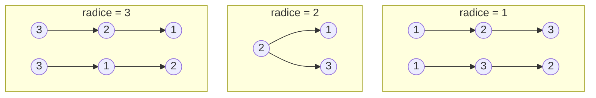
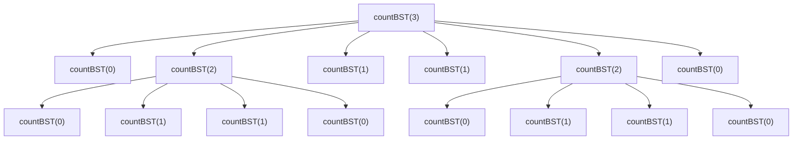

# Problema: il numero di alberi binari di ricerca

Data una lista di $n$ numeri distinti, contare quanti alberi binari di ricerca (BST) distinti si possono formare per memorizzarli.

Esempio: dati i numeri $[1, 2, 3]$, si possono formare esattamente $5$ BST distinti, raggruppati qui sotto per elemento scelto come radice:



Un'osservazione importante: il numero di alberi dipende solo da *quanti* elementi ci sono, non dai loro valori. Date due liste distinte della stessa lunghezza, si può sempre passare dagli alberi generati dall'una a quelli generati dall'altra rietichettando i nodi in ordine — l'ordine relativo, e quindi la forma di ogni albero valido, non cambia. Per questo il problema si riduce a una funzione di un solo parametro, $n$: esattamente come [problema_fibonacci.md](problema_fibonacci.md), il cui $n$-esimo termine dipende anch'esso da un solo intero, e a cui questo problema è imparentato più da vicino di quanto sembri (vedi l'approfondimento sui numeri di Catalan più sotto).


## 1. Soluzione: ricorsione diretta — $\Theta(3^n)$

L'osservazione che genera la ricorsione è la definizione stessa di BST: c'è *esattamente un* elemento alla radice, tutti gli elementi minori di esso finiscono nel sottoalbero sinistro, tutti quelli maggiori nel sottoalbero destro. Fissata la radice, il numero di alberi possibili è il prodotto tra il numero di sottoalberi sinistri possibili e il numero di sottoalberi destri possibili — e ciascuno dei due è a sua volta lo stesso identico problema, su un numero minore di elementi:

```go
func countBST(n int) int {
	if n <= 1 {
		return 1
	}
	totale := 0
	for radice := 0; radice < n; radice++ {
		sinistra := radice       // elementi minori della radice
		destra := n - 1 - radice // elementi maggiori della radice
		totale += countBST(sinistra) * countBST(destra)
	}
	return totale
}
```

Come per Fibonacci, questa ricorsione ricalcola più volte gli stessi sottoproblemi. Il trace di `countBST(3)` (che restituisce $5$) lo mostra chiaramente:

```
countBST(3) chiamata
    countBST(0) chiamata
    countBST(2) chiamata
        countBST(0) chiamata
        countBST(1) chiamata
        countBST(1) chiamata
        countBST(0) chiamata
    countBST(1) chiamata
    countBST(1) chiamata
    countBST(2) chiamata
        countBST(0) chiamata
        countBST(1) chiamata
        countBST(1) chiamata
        countBST(0) chiamata
    countBST(0) chiamata
```



`countBST(2)` viene ricalcolato da zero due volte. Indicando con $T(n)$ il numero totale di chiamate per calcolare `countBST(n)`, vale $T(n) = 1 + 2\sum_{k=0}^{n-1} T(k)$ per $n \ge 2$ (ogni scelta di radice genera una chiamata sul sottoalbero sinistro e una sul destro, sommate su tutte le $n$ scelte possibili). Scrivendo la stessa relazione per $T(n-1)$ e sottraendo si ottiene la ricorrenza chiusa

$$
T(n) = 3\,T(n-1), \qquad n \ge 3, \qquad T(2) = 5
$$

quindi $T(n) = \Theta(3^n)$ (vedi [teoria_complessita.md §1](teoria_complessita.md#1-notazione-asintotica) per la notazione $\Theta$): molto peggio della crescita del risultato stesso, che è "solo" $\Theta(4^n / n^{1.5})$ — i numeri di Catalan, discussi più sotto.


## 2. Soluzione: programmazione dinamica *top-down* — memoization

L'osservazione chiave è la stessa vista per Fibonacci: il risultato per un dato $n$ va calcolato una sola volta. Riusando lo stesso combinatore generico visto in [problema_fibonacci.md § Un Memoize generico e riutilizzabile](problema_fibonacci.md#un-memoize-generico-e-riutilizzabile):

```go
var countBSTMemo func(int) int
countBSTMemo = Memoize(func(n int) int {
	if n <= 1 {
		return 1
	}
	totale := 0
	for radice := 0; radice < n; radice++ {
		totale += countBSTMemo(radice) * countBSTMemo(n-1-radice)
	}
	return totale
})
```

Ogni valore `countBSTMemo(k)` viene calcolato una sola volta, ma il suo calcolo richiede comunque un ciclo di $O(n)$ iterazioni: la complessità totale scende da $\Theta(3^n)$ a $O(n^2)$ in tempo, $O(n)$ in spazio (cache più stack di ricorsione).


## 3. Soluzione: programmazione dinamica *bottom-up*

L'alternativa, come per Fibonacci, è costruire i risultati dal basso: si calcola `conteggio[k]` per $k$ crescente da $0$ a $n$, usando solo valori già calcolati:

```go
func countBSTIterativo(n int) int {
	conteggio := make([]int, n+1)
	conteggio[0] = 1
	for totale := 1; totale <= n; totale++ {
		for radice := 0; radice < totale; radice++ {
			conteggio[totale] += conteggio[radice] * conteggio[totale-1-radice]
		}
	}
	return conteggio[n]
}
```

Stessa complessità della versione memoizzata — $O(n^2)$ in tempo — ma senza lo stack di ricorsione, solo la tabella $O(n)$. La sequenza `conteggio[0], conteggio[1], conteggio[2], ...` calcolata da questa funzione è $1, 1, 2, 5, 14, 42, 132, \dots$: sono i **numeri di Catalan**.


## 4. Approfondimento: i numeri di Catalan

I numeri generati da questo problema sono un oggetto combinatorio molto studiato, con una ricorrenza identica a quella usata sopra per `countBST`:

$$
C_0 = 1, \qquad C_n = \sum_{i=0}^{n-1} C_i\,C_{n-1-i}
$$

ed esiste anche una forma chiusa, che evita del tutto la ricorsione:

$$
C_n = \frac{1}{n+1}\binom{2n}{n} = \frac{(2n)!}{(n+1)!\,n!}
$$

```go
func binom(n, k int) int {
	risultato := 1
	for i := 0; i < k; i++ {
		risultato = risultato * (n - i) / (i + 1)
	}
	return risultato
}

func countBSTClosedForm(n int) int {
	return binom(2*n, n) / (n + 1)
}
```

Complessità $O(n)$ in tempo, $O(1)$ in spazio — ma solo finché il risultato intermedio `binom(2n, n)` sta in un `int`. Su una piattaforma a 64 bit `int` di Go arriva fino a $2^{63}-1 \approx 9.22 \times 10^{18}$: `binom(2n, n)` lo supera già a $n = 34$, mentre $C_{34}$ da solo ci starebbe ancora comodamente — si esaurisce lo spazio due passi prima del necessario, perché la divisione per $n+1$ avviene solo alla fine.

> **Approfondimento in _Guile_:** gli interi di Guile sono a precisione arbitraria per costruzione, come il fattoriale di 30 già visto in [fondamenti_guile.md §5](fondamenti_guile.md#5-ricorsione): lo stesso calcolo, riscritto in Scheme, non ha bisogno di alcuna attenzione particolare all'overflow.
> ```scheme
> (define (binom n k)
>   (let loop ((i 0) (r 1))
>     (if (= i k) r (loop (+ i 1) (/ (* r (- n i)) (+ i 1))))))
>
> (define (catalan n) (/ (binom (* 2 n) n) (+ n 1)))
>
> (catalan 40)  ; => 2622127042276492108820, ben oltre il limite di un int64
> ```

> **Approfondimento in _R_:** R ha il coefficiente binomiale pronto nella libreria standard (`choose`) ed è vettorizzato: si calcolano tutti i numeri di Catalan da $0$ a $n$ con un'unica chiamata, senza scrivere un ciclo esplicito (vedi [fondamenti_r.md](fondamenti_r.md) per la sintassi).
> ```r
> catalan <- function(n) choose(2 * n, n) / (n + 1)
> catalan(0:10)
> # [1]     1     1     2     5    14    42   132   429  1430  4862 16796
> ```

> **Approfondimento in _C_:** a differenza di Go, che ha il garbage collector (vedi [fondamenti_go.md §1](fondamenti_go.md#1-caratteristiche-principali)), in C la tabella della soluzione bottom-up va allocata e liberata esplicitamente.
> ```c
> long long count_bst(int n) {
>     long long *conteggio = malloc((n + 1) * sizeof(long long));
>     conteggio[0] = 1;
>     for (int totale = 1; totale <= n; totale++) {
>         conteggio[totale] = 0;
>         for (int radice = 0; radice < totale; radice++) {
>             conteggio[totale] += conteggio[radice] * conteggio[totale - 1 - radice];
>         }
>     }
>     long long risultato = conteggio[n];
>     free(conteggio);
>     return risultato;
> }
> ```


## 5. Confronto

| Soluzione | Tempo | Spazio | Note |
|---|---|---|---|
| [Ricorsione diretta](#1-soluzione-ricorsione-diretta--theta3n) | $\Theta(3^n)$ | $O(n)$ (stack) | Ricalcola gli stessi sottoproblemi; impraticabile oltre $n \approx 20$ |
| [DP top-down (memoization)](#2-soluzione-programmazione-dinamica-top-down--memoization) | $O(n^2)$ | $O(n)$ | Ogni sottoproblema calcolato una volta, ma il calcolo stesso costa $O(n)$ |
| [DP bottom-up](#3-soluzione-programmazione-dinamica-bottom-up) | $O(n^2)$ | $O(n)$ | Stessa complessità della memoization, senza stack di ricorsione |
| [Forma chiusa](#4-approfondimento-i-numeri-di-catalan) | $O(n)$ | $O(1)$ | La più veloce, ma soggetta a overflow per $n$ grandi in aritmetica a precisione fissa |

Le tre tecniche seguono esattamente lo stesso schema di [problema_fibonacci.md §4](problema_fibonacci.md#4-confronto): la ricorsione diretta è la più immediata da scrivere ma esponenziale, la memoization la rende praticabile riusando il lavoro già fatto, e la versione bottom-up arriva alla stessa complessità senza stack di ricorsione. La forma chiusa è un'aggiunta possibile solo perché questo problema, a differenza di Fibonacci, ha anche un'elegante interpretazione combinatoria — ma è utilizzabile solo finché il risultato intermedio sta nel tipo intero scelto.
