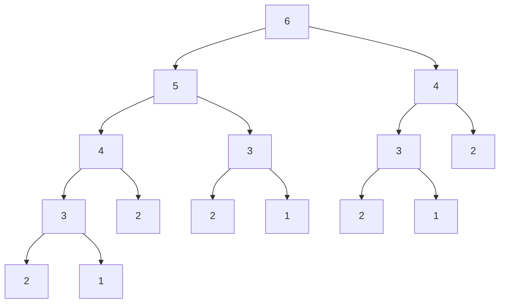
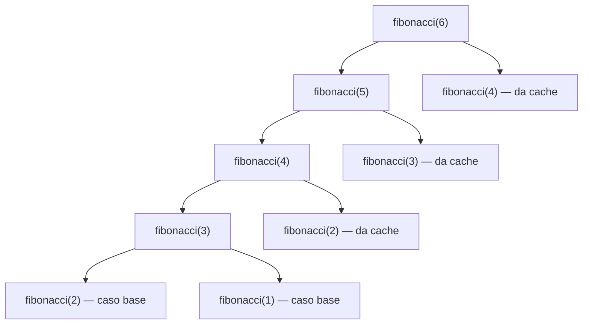

# Problema: la successione di Fibonacci

Restituire l'$n$-esimo numero della successione di Fibonacci, dove i primi due numeri valgono $1$ e ogni numero successivo è la somma dei due precedenti:

$$
F(n) =
\begin{cases}
1 & \text{se } n \le 2 \\
F(n-1) + F(n-2) & \text{se } n > 2
\end{cases}
$$

Esempio: per $n = 6$ i primi 6 numeri della successione sono $[1, 1, 2, 3, 5, 8]$, quindi il risultato è $8$.

> **Nota:** qui $n$ parte da $1$ (convenzione tipica dei problemi da colloquio). In [fondamenti_go.md §10](fondamenti_go.md#10-esempio-completo-numeri-di-fibonacci) la stessa successione è indicizzata da $0$ ($F(0)=0$); sono la stessa sequenza traslata di un indice, non due definizioni diverse.

Il problema è un buon veicolo per confrontare tre strategie che tornano utili in moltissimi altri problemi da colloquio e di programmazione competitiva: [ricorsione diretta](#1-soluzione-1-ricorsione-diretta--o2n), programmazione dinamica [*top-down*](#2-soluzione-2-programmazione-dinamica-top-down--memoization) e [*bottom-up*](#3-soluzione-3-programmazione-dinamica-bottom-up) (vedi [teoria_complessita.md §1](teoria_complessita.md#1-notazione-asintotica) per la notazione asintotica $O$ usata qui, e [teoria_costo.md §2](teoria_costo.md#2-caso-pessimo-worst-case) per il concetto di caso pessimo).


## 1. Soluzione 1: ricorsione diretta — $O(2^n)$

La traduzione diretta della definizione è una funzione ricorsiva:

```go
func fibonacci(n int) int {
	if n <= 2 {
		return 1
	}
	return fibonacci(n-1) + fibonacci(n-2)
}
```

Il codice è corretto ma lento, perché ricalcola più volte gli stessi sottoproblemi. Per vederlo, basta tracciare ogni chiamata con la sua profondità nell'albero di ricorsione:

```go
func fibonacciTraced(n, profondita int) int {
	fmt.Printf("%sfibonacci(%d) chiamata\n", strings.Repeat("    ", profondita), n)
	if n <= 2 {
		return 1
	}
	return fibonacciTraced(n-1, profondita+1) + fibonacciTraced(n-2, profondita+1)
}
```

A differenza di Python, Go non permette di leggere la profondità dello stack a runtime in modo semplice: passarla come parametro esplicito è il modo idiomatico per ottenerla, e ha anche il pregio di non modificare il codice originale se non per la stampa. L'esecuzione di `fibonacciTraced(6, 0)` produce:

```
fibonacci(6) chiamata
    fibonacci(5) chiamata
        fibonacci(4) chiamata
            fibonacci(3) chiamata
                fibonacci(2) chiamata
                fibonacci(1) chiamata
            fibonacci(2) chiamata
        fibonacci(3) chiamata
            fibonacci(2) chiamata
            fibonacci(1) chiamata
    fibonacci(4) chiamata
        fibonacci(3) chiamata
            fibonacci(2) chiamata
            fibonacci(1) chiamata
        fibonacci(2) chiamata
```

Sono 15 chiamate solo per calcolare $F(6)$. Il grafo delle chiamate rende evidente il perché: `fibonacci(4)` viene chiamata 2 volte, `fibonacci(3)` 3 volte, `fibonacci(2)` 5 volte e `fibonacci(1)` 3 volte.



L'albero è alto $n$ ed è quasi completo, quindi ha $O(2^n)$ nodi: ogni nodo è una chiamata a funzione, e ogni chiamata (tranne le foglie) ne genera altre due. Da qui la complessità esponenziale.


## 2. Soluzione 2: programmazione dinamica *top-down* — memoization

L'osservazione chiave è che non ha senso ricalcolare $F(k)$ più volte per lo stesso $k$: basta calcolarlo una volta e mettere in cache il risultato.


### Cache come mappa globale

```go
var fibonacciCache = map[int]int{}

func fibonacciMemo(n int) int {
	if n <= 2 {
		return 1
	}
	if v, ok := fibonacciCache[n]; ok {
		return v
	}
	risultato := fibonacciMemo(n-1) + fibonacciMemo(n-2)
	fibonacciCache[n] = risultato
	return risultato
}
```

Funziona, ma la cache è una variabile globale: nulla impedisce ad altro codice di leggerla o modificarla, e non è sicura in presenza di goroutine concorrenti senza un mutex aggiuntivo.


### Cache incapsulata in una chiusura

Un modo più pulito è costruire la funzione memoizzata con una *closure*, che possiede la propria cache senza esporla:

```go
func nuovoFibonacci() func(int) int {
	cache := map[int]int{}
	var fib func(int) int
	fib = func(n int) int {
		if n <= 2 {
			return 1
		}
		if v, ok := cache[n]; ok {
			return v
		}
		risultato := fib(n-1) + fib(n-2)
		cache[n] = risultato
		return risultato
	}
	return fib
}

fibonacci := nuovoFibonacci()
fibonacci(6) // 8
```

La dichiarazione `var fib func(int) int` seguita dall'assegnazione è necessaria: in Go una funzione anonima non può riferirsi a sé stessa direttamente, quindi serve prima una variabile a cui la chiusura possa agganciarsi per la chiamata ricorsiva.


### Un `Memoize` generico e riutilizzabile

Il problema della versione con [cache incapsulata in una chiusura](#cache-incapsulata-in-una-chiusura) è che lo schema (cache + wrapper) va riscritto per ogni funzione da memoizzare. Con i *generics* (da Go 1.18) si scrive una volta sola:

```go
func Memoize[K comparable, V any](f func(K) V) func(K) V {
	cache := map[K]V{}
	return func(k K) V {
		if v, ok := cache[k]; ok {
			return v
		}
		v := f(k)
		cache[k] = v
		return v
	}
}
```

```go
var fibonacci func(int) int
fibonacci = Memoize(func(n int) int {
	if n <= 2 {
		return 1
	}
	return fibonacci(n-1) + fibonacci(n-2)
})
```

Anche qui `fibonacci` va dichiarata prima di essere assegnata, per lo stesso motivo visto in [§ Cache incapsulata in una chiusura](#cache-incapsulata-in-una-chiusura): la funzione passata a `Memoize` la cattura per nome e la userà solo al momento della chiamata, quando sarà già stata assegnata.

> **Nota:** a differenza di Python, che offre `functools.lru_cache` pronto all'uso nella libreria standard, Go non include un decoratore di caching. `Memoize` colma questa lacuna una volta sola ed è riusabile per qualunque funzione con argomento comparabile — non solo per questo problema.

> **Approfondimento in _Guile_:** grazie a chiusure e tipizzazione dinamica, lo stesso combinatore si scrive senza bisogno di generics, perché il tipo dell'argomento non va dichiarato:
> ```scheme
> (define (memoize f)
>   (let ((cache (make-hash-table)))
>     (lambda (n)
>       (or (hash-ref cache n #f)
>           (let ((v (f n)))
>             (hash-set! cache n v)
>             v)))))
> ```
> Vedi [fondamenti_guile.md §7](fondamenti_guile.md#7-funzioni-di-ordine-superiore) per `let` e le funzioni come valori di prima classe.

Con la memoization, ogni valore $F(k)$ viene calcolato una sola volta; le chiamate successive per lo stesso $k$ tornano immediatamente dalla cache senza ricorrere ulteriormente:



Le chiamate totali passano da $O(2^n)$ a $O(n)$: la complessità in tempo è $O(n)$, quella in spazio è $O(n)$ (cache più stack di ricorsione).


## 3. Soluzione 3: programmazione dinamica *bottom-up*

L'alternativa alla memoization è costruire la soluzione partendo dal basso, dai casi base, senza mai ricorrere:

```go
func fibonacciIterativo(n int) int {
	precedente, corrente := 1, 1
	for i := 3; i <= n; i++ {
		precedente, corrente = corrente, precedente+corrente
	}
	return corrente
}
```

Complessità $O(n)$ in tempo e $O(1)$ in spazio, senza overhead di chiamate a funzione: in pratica è la versione più veloce delle tre, oltre che la più semplice da leggere.

> Questa è la stessa idea (e quasi lo stesso codice, a meno dell'indicizzazione) della versione iterativa già mostrata in [fondamenti_go.md §10](fondamenti_go.md#10-esempio-completo-numeri-di-fibonacci), che include anche la forma chiusa di Binet per calcolare $F(n)$ senza iterare.


## 4. Confronto

| Soluzione | Tempo | Spazio | Note |
|---|---|---|---|
| [Ricorsione diretta](#1-soluzione-1-ricorsione-diretta--o2n) | $O(2^n)$ | $O(n)$ (stack) | Semplice ma impraticabile oltre $n \approx 40$ |
| [DP top-down (memoization)](#2-soluzione-2-programmazione-dinamica-top-down--memoization) | $O(n)$ | $O(n)$ | Parte dalla ricorsione naturale, facile da derivare da una soluzione esponenziale esistente |
| [DP bottom-up](#3-soluzione-3-programmazione-dinamica-bottom-up) | $O(n)$ | $O(1)$ | Richiede di capire l'ordine di calcolo in anticipo, ma offre più margine di ottimizzazione dello spazio |

In generale l'approccio *top-down* è più facile da scrivere partendo dalla definizione ricorsiva del problema, mentre il *bottom-up* richiede di capire prima l'ordine in cui i sottoproblemi vanno risolti — ma proprio per questo espone più chiaramente eventuali ottimizzazioni di spazio, come si è visto passando da $O(n)$ a $O(1)$ nella soluzione [*bottom-up*](#3-soluzione-3-programmazione-dinamica-bottom-up).
