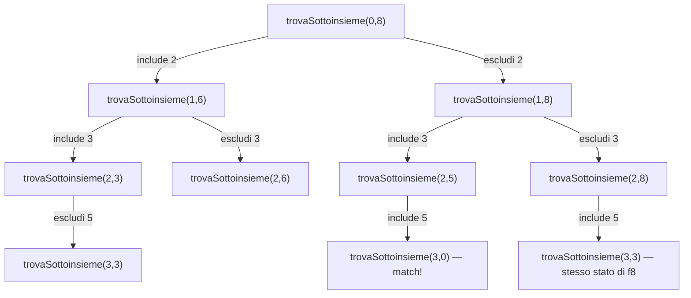

# Problema: la partizione di un insieme in due parti di uguale somma

Dato un insieme di numeri interi positivi, determinare se può essere partizionato in due parti aventi la stessa somma.

Esempio: l'insieme $[2, 3, 5, 6]$ può essere partizionato in $[2, 6]$ e $[3, 5]$, che hanno entrambe somma $8$.

> **Nota:** l'insieme è garantito non vuoto e può contenere fino a 50 numeri. Il vincolo non è sulla *quantità* di numeri, ma — come si vedrà nella [sezione 4](#4-approfondimento-perché-ons-non-è-tempo-polinomiale) — sui loro *valori*: è quello che rende praticabile una soluzione la cui complessità dipende dalla somma totale, non solo da $n$.

Come [problema_fibonacci.md](problema_fibonacci.md), [problema_bst.md](problema_bst.md) e [problema_regex_matching.md](problema_regex_matching.md), anche questo problema si presta a una scomposizione ricorsiva naturale, resa via via più efficiente con la programmazione dinamica. La particolarità qui è la *forma* del sottoproblema: non un singolo intero (Fibonacci, BST) né una coppia di indici su due sequenze diverse (regex matching), ma un indice e una somma residua ancora da raggiungere.

Un primo approccio a forza bruta consiste nell'enumerare tutti i $2^n$ sottoinsiemi $s_1$ dell'insieme, calcolarne il complemento $s_2$ e verificare se $\text{sum}(s_1) = \text{sum}(s_2)$. È un buon punto di partenza per un'osservazione decisiva: se una tale partizione esiste, allora

- $\text{sum}(s_1) = \text{sum}(s_2)$;
- $\text{sum}(s_1) + \text{sum}(s_2) = \text{sum}(\text{numeri})$.

Le due condizioni insieme implicano $\text{sum}(s_1) = \text{sum}(\text{numeri}) / 2$: il problema si riduce quindi a cercare *un solo* sottoinsieme con una somma bersaglio $S = \text{sum}(\text{numeri}) / 2$ (se $\text{sum}(\text{numeri})$ è dispari, la risposta è subito `false`, perché $S$ non sarebbe intero). Questa è un'istanza del classico problema del sottoinsieme di somma data (*subset sum*).


## 1. Soluzione: ricorsione diretta — $O(2^n)$

Fissato il bersaglio $S$, la ricorsione ragiona sul primo numero della lista: o lo si include nel sottoinsieme cercato (e allora resta da trovare, nel resto della lista, un sottoinsieme di somma $S - \text{numero}$), oppure lo si esclude (e resta da trovare un sottoinsieme di somma $S$, ma solo nel resto della lista):

```go
func puoPartizionare(numeri []int) bool {
	totale := 0
	for _, numero := range numeri {
		totale += numero
	}
	if totale%2 != 0 {
		return false
	}

	var trovaSottoinsieme func(indice, sommaResidua int) bool
	trovaSottoinsieme = func(indice, sommaResidua int) bool {
		if sommaResidua == 0 {
			return true // bersaglio raggiunto esattamente
		}
		if sommaResidua < 0 || indice >= len(numeri) {
			return false // sforato, oppure numeri esauriti prima del bersaglio
		}
		numero := numeri[indice]
		return trovaSottoinsieme(indice+1, sommaResidua-numero) || // include numero
			trovaSottoinsieme(indice+1, sommaResidua) // esclude numero
	}
	return trovaSottoinsieme(0, totale/2)
}
```

Ogni chiamata genera al più due chiamate figlie, e la profondità massima dell'albero è $n$: da qui la complessità $O(2^n)$, la stessa classe di crescita vista in [problema_fibonacci.md §1](problema_fibonacci.md#1-soluzione-ricorsione-diretta--o2n). Ma qui il fenomeno delle chiamate ripetute è meno ovvio, perché lo stato non è un solo intero decrescente: bisogna che due sottoinsiemi *diversi* dello stesso prefisso abbiano la stessa somma. Con l'insieme $[2, 3, 5, 6]$ e bersaglio $S = 8$, succede già al terzo livello: il sottoinsieme $\{5\}$ e il sottoinsieme $\{2, 3\}$ hanno entrambi somma $5$, quindi lasciano lo stesso residuo $3$ da cercare in `numeri[3:]`:

<div markdown="1" align="center">



</div>

`trovaSottoinsieme(3, 3)` viene raggiunto sia escludendo $5$ da $\{2, 3, 5\}$ sia includendolo da $\{5\}$ scartando $2$ e $3$: due percorsi diversi nell'albero delle scelte, ma lo stesso identico sottoproblema da risolvere due volte.

> **Curiosità:** l'idea di forza bruta scartata all'inizio — enumerare tutti i sottoinsiemi e confrontarne le somme — si scrive in poche righe in R, sfruttando `combn` per generare tutte le combinazioni di una data cardinalità:
> ```r
> esiste_partizione_bruta <- function(numeri) {
>     n <- length(numeri)
>     for (k in 0:n) {
>         for (s1 in combn(numeri, k, simplify = FALSE)) {
>             if (sum(s1) == sum(numeri) - sum(s1)) return(TRUE)
>         }
>     }
>     FALSE
> }
> esiste_partizione_bruta(c(2, 3, 5, 6)) # TRUE
> ```
> È la stessa complessità $O(2^n)$ della ricorsione diretta (anzi peggiore, per il costo di generare esplicitamente ogni combinazione), ma resa quasi immediata dalle funzioni combinatorie pronte nella libreria standard di R — lo stesso stile visto per `choose` in [problema_bst.md §4](problema_bst.md#4-approfondimento-i-numeri-di-catalan).


## 2. Soluzione: programmazione dinamica top-down — memoization

Come per gli altri problemi, l'osservazione chiave è che ogni coppia `(indice, sommaResidua)` va calcolata una sola volta. La chiave da mettere in cache è composta da due campi, esattamente come `posizione` in [problema_regex_matching.md §2](problema_regex_matching.md#2-soluzione-programmazione-dinamica-top-down--memoization): basta che sia comparabile perché il [`Memoize` generico](problema_fibonacci.md#un-memoize-generico-e-riutilizzabile) funzioni senza modifiche.

```go
type stato struct {
	indice, sommaResidua int
}

func puoPartizionareMemo(numeri []int) bool {
	totale := 0
	for _, numero := range numeri {
		totale += numero
	}
	if totale%2 != 0 {
		return false
	}

	var trovaSottoinsieme func(stato) bool
	trovaSottoinsieme = Memoize(func(s stato) bool {
		if s.sommaResidua == 0 {
			return true
		}
		if s.sommaResidua < 0 || s.indice >= len(numeri) {
			return false
		}
		numero := numeri[s.indice]
		return trovaSottoinsieme(stato{s.indice + 1, s.sommaResidua - numero}) ||
			trovaSottoinsieme(stato{s.indice + 1, s.sommaResidua})
	})
	return trovaSottoinsieme(stato{0, totale / 2})
}
```

Anche se la ricorsione diretta sembra generare $2^n$ chiamate, gli stati `(indice, sommaResidua)` distinti sono al più $(n+1) \cdot (S+1)$, dove $S = \text{sum}(\text{numeri})/2$: uno per ciascun valore di `indice` da $0$ a $n$, combinato con uno per ciascun valore di `sommaResidua` da $0$ a $S$ (i valori negativi terminano subito la ricorsione senza essere messi in cache). La memoization riduce quindi la complessità a $O(n \cdot S)$ in tempo e spazio.

> **Approfondimento in _Guile_:** come già visto per il regex matching in [problema_regex_matching.md §2](problema_regex_matching.md#2-soluzione-programmazione-dinamica-top-down--memoization), il `memoize` di [problema_fibonacci.md](problema_fibonacci.md#un-memoize-generico-e-riutilizzabile) non richiede uno `struct` apposito: basta una coppia `(cons indice somma-residua)` come chiave, perché le hash-table di Guile confrontano per struttura (`equal?`):
> ```scheme
> (define trova-sottoinsieme
>   (memoize (lambda (chiave)
>              (esegui-ricerca (car chiave) (cdr chiave)))))
> (trova-sottoinsieme (cons 0 (quotient (apply + numeri) 2)))
> ```


## 3. Soluzione: programmazione dinamica bottom-up

Come per [problema_regex_matching.md §3](problema_regex_matching.md#3-soluzione-programmazione-dinamica-bottom-up), `trovaSottoinsieme(indice, sommaResidua)` dipende solo da `indice + 1`, mai da indici minori: la tabella va quindi riempita a ritroso, dall'ultima riga (caso base) verso la prima.

```go
func puoPartizionareIterativo(numeri []int) bool {
	totale := 0
	for _, numero := range numeri {
		totale += numero
	}
	if totale%2 != 0 {
		return false
	}
	target := totale / 2
	n := len(numeri)

	// dp[indice][s] = "esiste un sottoinsieme di numeri[indice:] con somma s"
	dp := make([][]bool, n+1)
	for i := range dp {
		dp[i] = make([]bool, target+1)
		dp[i][0] = true // il sottoinsieme vuoto ha sempre somma 0
	}

	for indice := n - 1; indice >= 0; indice-- {
		for s := 1; s <= target; s++ {
			dp[indice][s] = dp[indice+1][s] ||
				(s-numeri[indice] >= 0 && dp[indice+1][s-numeri[indice]])
		}
	}
	return dp[0][target]
}
```

Stessa complessità della memoization — $O(n \cdot S)$ in tempo e spazio — ma senza stack di ricorsione.


### Ottimizzazione dello spazio a $O(S)$

Ogni riga `dp[indice]` dipende solo dalla riga `dp[indice+1]`: esattamente la stessa osservazione che in [problema_fibonacci.md §3](problema_fibonacci.md#3-soluzione-programmazione-dinamica-bottom-up) permette di ridurre lo spazio da $O(n)$ a $O(1)$, qui riduce lo spazio da $O(n \cdot S)$ a $O(S)$, tenendo un solo array booleano aggiornato sul posto, un numero alla volta:

```go
func puoPartizionareSpazioOttimizzato(numeri []int) bool {
	totale := 0
	for _, numero := range numeri {
		totale += numero
	}
	if totale%2 != 0 {
		return false
	}
	target := totale / 2

	raggiungibili := make([]bool, target+1)
	raggiungibili[0] = true
	for _, numero := range numeri {
		for s := target; s >= numero; s-- {
			if raggiungibili[s-numero] {
				raggiungibili[s] = true
			}
		}
	}
	return raggiungibili[target]
}
```

Il ciclo su `s` deve procedere a ritroso: `raggiungibili[s-numero]` deve riferirsi al valore calcolato *prima* di considerare `numero` in questa iterazione, altrimenti lo stesso numero verrebbe usato più volte nella stessa somma. È esattamente la differenza rispetto al problema del resto (*change-making*): lì ogni taglio può essere riusato quante volte serve, e per questo il ciclo interno procede in avanti; qui ogni numero va usato *al più una volta*, e nella versione con indice esplicito ([sezioni 1 e 2](#1-soluzione-ricorsione-diretta--o2n)) questo vincolo è imposto da `indice+1` nella chiamata ricorsiva — nella versione a spazio ottimizzato, dove la dimensione `indice` è stata eliminata, lo stesso vincolo va imposto invertendo la direzione del ciclo.


## 4. Approfondimento: perché $O(nS)$ non è tempo polinomiale

Il problema del sottoinsieme di somma data — e quindi anche questa partizione — è NP-completo (vedi [teoria_complessita.md §4-5](teoria_complessita.md#4-classe-np)). Eppure le sezioni precedenti mostrano un algoritmo che sembra scalare bene, $O(n \cdot S)$: come si conciliano le due cose?

La definizione di tempo polinomiale (vedi [teoria_complessita.md §1](teoria_complessita.md#1-notazione-asintotica) e [§3](teoria_complessita.md#3-classe-p)) misura la complessità in funzione della dimensione dell'input in bit, non del valore numerico dei dati. Un numero intero rappresentato in binario occupa $O(\log(\text{valore}))$ bit: la somma totale $S$ può quindi essere *esponenziale* nella dimensione dell'input, se i numeri in gioco sono grandi. Un algoritmo la cui complessità dipende dal *valore* degli input, anziché dalla loro dimensione in bit, si dice a **tempo pseudo-polinomiale**: efficiente quando i numeri restano piccoli — il vincolo del problema limita solo il loro numero, fino a 50, non la loro grandezza — ma non polinomiale in senso stretto.

Il caso pessimo è concreto, non solo teorico: con 50 numeri vicini a $2^{60}$, $S$ supererebbe $2^{63}$ e la tabella `dp` — o anche solo l'array `raggiungibili` — non entrerebbe in memoria, nonostante l'input resti piccolissimo (appena 50 numeri). La dimensione dell'input e la difficoltà del problema, in questo caso, sono due cose distinte.


## 5. Confronto

| Soluzione | Tempo | Spazio | Note |
|---|---|---|---|
| [Ricorsione diretta](#1-soluzione-ricorsione-diretta--o2n) | $O(2^n)$ | $O(n)$ (stack) | Ricalcola le stesse coppie `(indice, sommaResidua)` raggiunte da sottoinsiemi diversi con la stessa somma |
| [DP top-down (memoization)](#2-soluzione-programmazione-dinamica-top-down--memoization) | $O(n \cdot S)$ | $O(n \cdot S)$ | Stessa struttura ricorsiva, ogni coppia calcolata una sola volta |
| [DP bottom-up](#3-soluzione-programmazione-dinamica-bottom-up) | $O(n \cdot S)$ | $O(n \cdot S)$ | Stessa complessità della memoization, senza stack di ricorsione |
| [DP bottom-up, spazio ottimizzato](#ottimizzazione-dello-spazio-a-os) | $O(n \cdot S)$ | $O(S)$ | Una sola riga tenuta in memoria, aggiornata a ritroso |

Lo schema è lo stesso di [problema_fibonacci.md §4](problema_fibonacci.md#4-confronto), [problema_bst.md §5](problema_bst.md#5-confronto) e [problema_regex_matching.md §4](problema_regex_matching.md#4-confronto): la ricorsione diretta è la traduzione più immediata del problema ma esponenziale, la memoization la rende praticabile senza cambiarne la forma, il bottom-up arriva alla stessa complessità in tempo senza stack di ricorsione — e qui, in più, il fatto che ogni riga dipenda solo dalla precedente permette di comprimere lo spazio da $O(n \cdot S)$ a $O(S)$, purché $S$ resti piccolo: cosa non garantita a priori, come visto nella [sezione 4](#4-approfondimento-perché-ons-non-è-tempo-polinomiale).
