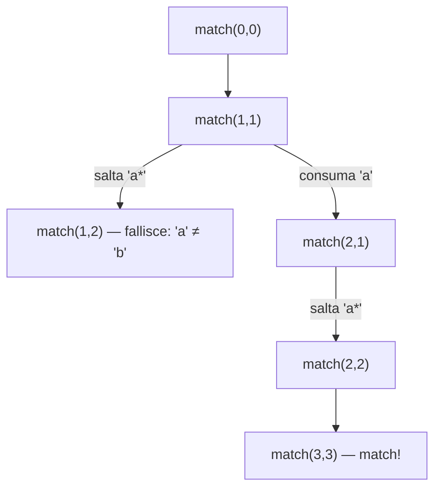

# Problema: il matching di espressioni regolari

Data una stringa $s$ e un pattern $p$, determinare se $p$ combacia con **tutta** $s$ (match totale, non ricerca parziale — vedi [teoria_regex.md §4.2](teoria_regex.md#42-match-totale-vs-ricerca-parziale)). Il pattern è costruito con solo due operatori, sottoinsieme minimo della sintassi vista in [teoria_regex.md §3](teoria_regex.md#3-sintassi-i-mattoni):

- `.` combacia con un carattere qualsiasi;
- `*` fa sì che il carattere che lo precede (non l'intero pattern che lo precede) venga applicato zero o più volte.

Esempi:

- `"abc"` combacia con `"abc"` e con `"a.c"`;
- `"abbc"` combacia con `"ab*c"`;
- `"ac"` combacia con `"ab*c"` (zero ripetizioni di `b`) e con `"a.*c"`;
- `"abcd"` combacia con `"a.*d"`.

> **Nota:** a differenza di [teoria_regex.md](teoria_regex.md), che tratta le regex come oggetto già disponibile in ogni linguaggio (motore compilato, funzioni di libreria), qui l'obiettivo è **implementare da zero il motore stesso** — sia pure per un sottoinsieme minuscolo della sintassi. È lo stesso spirito di [problema_fibonacci.md](problema_fibonacci.md) e [problema_bst.md](problema_bst.md): una definizione ricorsiva naturale, resa via via più efficiente con la programmazione dinamica.

Come per gli altri due problemi, la scomposizione ricorsiva è la chiave: si ragiona sul primo carattere di $s$ e sul primo *token* di $p$ (dove un token è un carattere letterale, `.`, oppure uno dei due seguito da `*`), e si delega il resto a una chiamata sul suffisso di entrambi.


## 1. Soluzione: ricorsione diretta — $O(2^{n+m})$

Il primo passo è spezzare il pattern in una lista di token atomici, in modo da non dover più distinguere `a` da `a*` carattere per carattere durante il matching:

```go
// regexToken è "a", ".", "a*" o ".*": un carattere letterale o '.',
// opzionalmente seguito da '*'.
func parseRegex(regex string) ([]string, error) {
	var tokens []string
	for _, c := range regex {
		if c == '*' {
			if len(tokens) == 0 || strings.HasSuffix(tokens[len(tokens)-1], "*") {
				return nil, fmt.Errorf("'*' deve essere preceduto da un carattere")
			}
			tokens[len(tokens)-1] += "*"
		} else {
			tokens = append(tokens, string(c))
		}
	}
	return tokens, nil
}
```

Restituire un errore invece di andare in panico è lo stile idiomatico visto in [fondamenti_go.md §8](fondamenti_go.md#8-gestione-degli-errori); qui basta propagarlo al chiamante.

Serve poi un secondo helper che confronta un singolo carattere (o l'assenza di carattere, a fine stringa) con un token privo di `*`:

```go
// matchNoStar confronta prefix (un carattere, oppure "" a fine stringa)
// con un token che non contiene '*'.
func matchNoStar(prefix, token string) bool {
	if token == "." {
		return len(prefix) == 1 // '.' combacia con un carattere, mai con "" (fine stringa)
	}
	return prefix == token
}
```

Con questi due pezzi, il matching si riduce a una funzione ricorsiva sui due indici `iString` e `iRegex`, che avanzano nella stringa e nella lista di token:

```go
func regexMatch(s, regex string) bool {
	tokens, err := parseRegex(regex)
	if err != nil {
		return false
	}

	var match func(iString, iRegex int) bool
	match = func(iString, iRegex int) bool {
		if iString == len(s) && iRegex == len(tokens) {
			return true // stringa e pattern esauriti insieme: match
		}
		if iRegex == len(tokens) {
			return false // pattern esaurito, ma restano caratteri da consumare
		}

		prefix := ""
		if iString < len(s) {
			prefix = s[iString : iString+1]
		}
		token := tokens[iRegex]

		if !strings.HasSuffix(token, "*") {
			// Token come 'a' o '.': consuma un carattere e il token.
			return matchNoStar(prefix, token) && match(iString+1, iRegex+1)
		}
		// Token come 'a*' o '.*': prova prima a saltarlo (zero ripetizioni)...
		if match(iString, iRegex+1) {
			return true
		}
		// ...altrimenti consuma un carattere e riusa lo stesso token,
		// per provare a consumarne altri.
		return matchNoStar(prefix, token[:1]) && match(iString+1, iRegex)
	}
	return match(0, 0)
}
```

Il ramo `a*`/`.*` è l'unico punto in cui la funzione genera più di una chiamata: da qui nasce la stessa esplosione combinatoria vista in [problema_fibonacci.md §1](problema_fibonacci.md#1-soluzione-ricorsione-diretta--o2n). Per vederlo, ecco il trace di `regexMatch("aab", "aa*b")` (tokens `["a", "a*", "b"]`), che restituisce `true`:

<div markdown="1" align="center">



</div>

Il ramo di salto viene sempre tentato per primo: solo se fallisce si prova a consumare un carattere. Con pattern come `"a*a*a*a*a*a*xyq"` (esempio classico, lo stesso che compare nella traccia del problema) il numero di combinazioni di zero/una ripetizione per ciascuna stella cresce esponenzialmente: nel caso pessimo (vedi [teoria_costo.md §2](teoria_costo.md#2-caso-pessimo-worst-case)) la complessità è $O(2^{n+m})$, dove $n = \|s\|$ e $m$ è il numero di token — la stessa classe di fenomeno del *catastrophic backtracking* discusso in [teoria_regex.md §4.5](teoria_regex.md#45-catastrophic-backtracking-e-redos): non a caso, i motori regex "veri" a backtracking soffrono esattamente di questo problema.

> **Curiosità:** il sottoinsieme di sintassi usato qui (`.` e `*`) è già valido come regex "vera" in quasi ogni flavor (vedi [teoria_regex.md §6](teoria_regex.md#6-i-flavor-perché-la-stessa-regex-non-funziona-ovunque)). Si può quindi delegare lo stesso confronto a un motore reale, ancorando con `^...$` per pretendere un match totale invece che parziale:
> ```r
> regex_match_motore_vero <- function(s, regex) grepl(paste0("^", regex, "$"), s)
> regex_match_motore_vero("aab", "aa*b") # TRUE, come regexMatch("aab", "aa*b")
> ```
> La differenza è tutta dietro le quinte: qui sopra `grepl` delega a un motore NFA/DFA compilato, mentre `regexMatch` implementa da zero, con ricorsione esplicita, esattamente la stessa logica.


## 2. Soluzione: programmazione dinamica top-down — memoization

Anche qui, come per [problema_fibonacci.md §2](problema_fibonacci.md#2-soluzione-programmazione-dinamica-top-down--memoization) e [problema_bst.md §2](problema_bst.md#2-soluzione-programmazione-dinamica-top-down--memoization), la stessa coppia `(iString, iRegex)` viene ricalcolata più volte da rami diversi dell'albero di ricorsione (si veda `match(1,1)` nel trace sopra, raggiungibile anche passando da un'altra sequenza di scelte con un pattern leggermente diverso). La differenza rispetto ai due problemi precedenti è che la chiave da mettere in cache non è un singolo intero ma una coppia: basta però che sia comparabile, quindi il [`Memoize` generico](problema_fibonacci.md#un-memoize-generico-e-riutilizzabile) funziona senza modifiche usando come chiave uno `struct` di due campi:

```go
type posizione struct {
	iString, iRegex int
}

func regexMatchMemo(s, regex string) bool {
	tokens, err := parseRegex(regex)
	if err != nil {
		return false
	}

	var match func(posizione) bool
	match = Memoize(func(p posizione) bool {
		if p.iString == len(s) && p.iRegex == len(tokens) {
			return true
		}
		if p.iRegex == len(tokens) {
			return false
		}

		prefix := ""
		if p.iString < len(s) {
			prefix = s[p.iString : p.iString+1]
		}
		token := tokens[p.iRegex]

		if !strings.HasSuffix(token, "*") {
			return matchNoStar(prefix, token) && match(posizione{p.iString + 1, p.iRegex + 1})
		}
		if match(posizione{p.iString, p.iRegex + 1}) {
			return true
		}
		return matchNoStar(prefix, token[:1]) && match(posizione{p.iString + 1, p.iRegex})
	})
	return match(posizione{0, 0})
}
```

Le combinazioni possibili di `(iString, iRegex)` sono al più $(n+1)(m+1)$, quindi la memoization riduce la complessità da $O(2^{n+m})$ a $O(n \cdot m)$ in tempo; lo spazio è anch'esso $O(n \cdot m)$ (cache più stack di ricorsione).

> **Approfondimento in _Guile_:** il `memoize` visto in [problema_fibonacci.md §2](problema_fibonacci.md#un-memoize-generico-e-riutilizzabile) funziona qui altrettanto bene, ma senza bisogno di definire uno `struct` apposito: basta usare come chiave una coppia `(cons i-string i-regex)`, perché le hash-table di Guile confrontano le chiavi per struttura (`equal?`) e non per identità:
> ```scheme
> (define match
>   (memoize (lambda (chiave)
>              (esegui-match (car chiave) (cdr chiave)))))
> (match (cons 0 0))
> ```
> È lo stesso vantaggio della tipizzazione dinamica già notato in [problema_fibonacci.md §2](problema_fibonacci.md#un-memoize-generico-e-riutilizzabile): Go richiede di dichiarare in anticipo la forma della chiave, Guile no.


## 3. Soluzione: programmazione dinamica bottom-up

Come per gli altri due problemi, si può costruire la tabella delle soluzioni senza ricorsione, per righe e colonne invece che per chiamate annidate. La particolarità qui è la direzione: `match(iString, iRegex)` dipende da indici *maggiori* o uguali (mai minori), quindi la tabella va riempita a ritroso, partendo dall'angolo `(n, m)` — il caso base — verso `(0, 0)`, il risultato cercato:

```go
func regexMatchIterativo(s, regex string) bool {
	tokens, err := parseRegex(regex)
	if err != nil {
		return false
	}
	n, m := len(s), len(tokens)

	// dp[i][j] = "s[i:] combacia con tokens[j:]"
	dp := make([][]bool, n+1)
	for i := range dp {
		dp[i] = make([]bool, m+1)
	}
	dp[n][m] = true // stringa e pattern entrambi esauriti: match

	for iString := n; iString >= 0; iString-- {
		for iRegex := m - 1; iRegex >= 0; iRegex-- {
			prefix := ""
			if iString < n {
				prefix = s[iString : iString+1]
			}
			token := tokens[iRegex]

			if !strings.HasSuffix(token, "*") {
				dp[iString][iRegex] = matchNoStar(prefix, token) && dp[iString+1][iRegex+1]
			} else {
				dp[iString][iRegex] = dp[iString][iRegex+1] ||
					(matchNoStar(prefix, token[:1]) && dp[iString+1][iRegex])
			}
		}
	}
	return dp[0][0]
}
```

Quando `iString == n`, `prefix` è `""` e `matchNoStar` restituisce sempre `false`: l'accesso a `dp[iString+1][...]` nel ramo di consumo non viene mai valutato, perché `&&` in Go è a corto circuito e si ferma al primo operando falso — proprio come già sfruttato in [teoria_chiusure.md](teoria_chiusure.md) per la valutazione lazy delle espressioni booleane. Non serve quindi nessun controllo esplicito sui bordi della tabella.

Stessa complessità della memoization — $O(n \cdot m)$ in tempo e spazio — ma senza stack di ricorsione, esattamente come [problema_bst.md §3](problema_bst.md#3-soluzione-programmazione-dinamica-bottom-up) rispetto alla sua versione memoizzata.


## 4. Confronto

| Soluzione | Tempo | Spazio | Note |
|---|---|---|---|
| [Ricorsione diretta](#1-soluzione-ricorsione-diretta--o2nm) | $O(2^{n+m})$ | $O(n+m)$ (stack) | Ricalcola le stesse coppie `(iString, iRegex)`; impraticabile con più stelle concatenate |
| [DP top-down (memoization)](#2-soluzione-programmazione-dinamica-top-down--memoization) | $O(n \cdot m)$ | $O(n \cdot m)$ | Stessa struttura ricorsiva, ma ogni coppia calcolata una sola volta |
| [DP bottom-up](#3-soluzione-programmazione-dinamica-bottom-up) | $O(n \cdot m)$ | $O(n \cdot m)$ | Stessa complessità della memoization, senza stack di ricorsione |

Lo schema è identico a quello di [problema_fibonacci.md §4](problema_fibonacci.md#4-confronto) e [problema_bst.md §5](problema_bst.md#5-confronto): la ricorsione diretta traduce la definizione del problema nel modo più diretto possibile, ma ricalcola gli stessi sottoproblemi; la memoization elimina la ricomputazione senza cambiare la forma del codice; la versione bottom-up arriva alla stessa complessità evitando del tutto lo stack di ricorsione, al prezzo di dover capire in anticipo l'ordine — qui a ritroso — in cui riempire la tabella.
