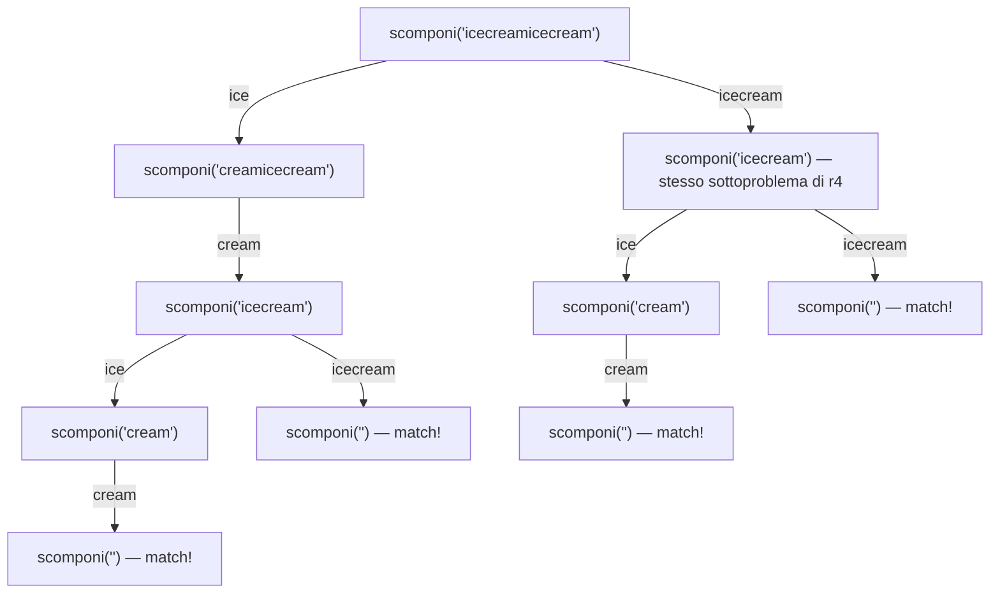

# Problema: scomposizione di una stringa senza spazi

Alcune lingue, come il thailandese o il latino classico, non separano le parole con spazi all'interno delle frasi. Questo crea qualche difficoltà per il software di elaborazione testi, che deve comunque essere in grado di riconoscere le parole.

Data una frase scritta come stringa senza spazi e un dizionario (una lista di parole), scomporre la frase in parole. Se sono possibili più scomposizioni, restituirne una qualsiasi.

Esempio 1: la frase `"helloworld"`, dato il dizionario `["hello", "goodbye", "world"]`, si scompone in `["hello", "world"]`.

Esempio 2: la frase `"catseatmice"`, dato il dizionario `["cat", "cats", "eat", "mice", "seat"]`, si scompone in `["cats", "eat", "mice"]` oppure in `["cat", "seat", "mice"]` (entrambe valide).

> **Nota:** la frase vuota si scompone sempre nella lista vuota `[]`; se invece non esiste alcuna scomposizione valida, il risultato è `nil` (l'equivalente Go di `None`). La distinzione conta: `[]string{}` (successo, zero parole) e `nil` (fallimento) sono entrambe slice "vuote" agli occhi di `len()`, ma solo il confronto esplicito `resto != nil` distingue le due cose — esattamente come il pattern `v, ok := cache[k]` di [problema_fibonacci.md § Un Memoize generico e riutilizzabile](problema_fibonacci.md#un-memoize-generico-e-riutilizzabile) distingue "non ancora calcolato" da "calcolato, e il risultato è il valore zero".

Come [problema_regex_matching.md](problema_regex_matching.md) e [problema_partizione_uguale.md](problema_partizione_uguale.md), anche questo problema si risolve con una scomposizione ricorsiva sui prefissi della stringa: si cerca una parola del dizionario che sia prefisso della frase residua, la si toglie, e si delega la scomposizione del resto a una chiamata ricorsiva sullo stesso identico problema, su una stringa più corta. Sia $n = \|s\|$ la lunghezza della frase e $m$ il numero di parole nel dizionario.


## 1. Soluzione: ricorsione diretta — $O(2^n)$ nel caso pessimo

```go
func scomponiFrase(dizionario []string, frase string) []string {
	if frase == "" {
		return []string{} // scomposizione vuota: caso base di successo
	}
	for _, parola := range dizionario {
		if strings.HasPrefix(frase, parola) {
			resto := scomponiFrase(dizionario, frase[len(parola):])
			if resto != nil {
				return append([]string{parola}, resto...) // una soluzione basta: si restituisce la prima trovata
			}
		}
	}
	return nil // nessuna parola del dizionario porta a una scomposizione valida
}
```

Questa ricorsione ricalcola più volte gli stessi sottoproblemi, anche quando la frase viene scomposta con successo. Con dizionario `["ice", "cream", "icecream"]` e frase `"icecreamicecream"`, il sottoproblema `scomponi("icecream")` viene raggiunto due volte: una direttamente (la frase intera inizia con la parola `"icecream"`), una passando prima per `"ice"` e poi per `"cream"`:

<div markdown="1" align="center">



</div>

Concatenando più occorrenze di `"icecream"` questo raddoppio si ripete a ogni copia aggiunta, esattamente come l'albero delle chiamate di [problema_fibonacci.md §1](problema_fibonacci.md#1-soluzione-ricorsione-diretta--o2n).

Il caso pessimo vero e proprio, però, non è quello di una scomposizione riuscita ma ridondante: è quello di una scomposizione che *fallisce* solo dopo aver esplorato ogni possibilità. Con dizionario `["a", "aa", "aaa", "aaaa", "aaaaa"]` e frase `"aaaaaaaaaaaab"` (dodici `"a"` seguite da una `"b"` che non compare in nessuna parola), ogni prefisso di `"a"` è una parola valida, quindi a ogni posizione la ricorsione si dirama fino a 5 volte prima di scoprire, solo alla fine, che nessun cammino raggiunge la `"b"` finale: la complessità è $O(2^n)$, la stessa classe di [problema_regex_matching.md §1](problema_regex_matching.md#1-soluzione-ricorsione-diretta--o2nm) per il ramo `a*`/`.*`.

> **Approfondimento in _C_:** senza slice né `append`, la costruzione del risultato si scrive naturalmente al contrario: il chiamante alloca un buffer `risultato` grande abbastanza (nel caso pessimo, una parola per carattere), e ogni livello di ricorsione scrive la propria parola in `risultato[0]` solo *dopo* che la chiamata su `risultato + 1` è tornata con successo — cioè srotolando lo stack, dall'ultima parola alla prima:
> ```c
> bool scompone_frase(const char *dizionario[], int n_dizionario,
>                     const char *frase, const char *risultato[], int *n_parole) {
>     if (*frase == '\0') {
>         *n_parole = 0;
>         return true;
>     }
>     for (int i = 0; i < n_dizionario; i++) {
>         size_t len = strlen(dizionario[i]);
>         if (strncmp(frase, dizionario[i], len) == 0) {
>             if (scompone_frase(dizionario, n_dizionario, frase + len, risultato + 1, n_parole)) {
>                 risultato[0] = dizionario[i];
>                 (*n_parole)++;
>                 return true;
>             }
>         }
>     }
>     return false;
> }
> ```
> `frase + len` è pura aritmetica sui puntatori: nessuna copia, esattamente come `frase[len(parola):]` in Go è solo un nuovo *slice header* sullo stesso array sottostante. È lo stesso principio di zero-copy delle sottostringhe, in due linguaggi molto diversi tra loro.

> **Curiosità in _R_:** `substring` è vettorizzata sugli argomenti di inizio e fine, quindi `substring(frase, 1, seq_len(nchar(frase)))` genera *tutti* i prefissi della frase in una sola chiamata, senza ciclo esplicito sul dizionario:
> ```r
> scomponi_frase_bruta <- function(dizionario, frase) {
>     if (frase == "") return(character(0))
>     prefissi <- substring(frase, 1, seq_len(nchar(frase)))
>     for (i in which(prefissi %in% dizionario)) {
>         resto <- scomponi_frase_bruta(dizionario, substring(frase, i + 1))
>         if (!is.null(resto)) return(c(prefissi[i], resto))
>     }
>     NULL
> }
> scomponi_frase_bruta(c("cat", "cats", "eat", "mice", "seat"), "catseatmice")
> # [1] "cat"  "seat" "mice"
> ```
> `which(prefissi %in% dizionario)` restituisce in un colpo solo tutte le lunghezze di prefisso che formano una parola del dizionario, al posto del ciclo `for _, parola := range dizionario` più `strings.HasPrefix` della versione Go — lo stesso stile di vettorizzazione già visto per `choose` in [problema_bst.md §4](problema_bst.md#4-approfondimento-i-numeri-di-catalan) e per `combn` in [problema_partizione_uguale.md §1](problema_partizione_uguale.md#1-soluzione-ricorsione-diretta--o2n).


## 2. Soluzione: programmazione dinamica top-down — memoization

L'osservazione chiave è la stessa degli altri problemi: ogni suffisso della frase va scomposto una volta sola. A differenza di [problema_regex_matching.md §2](problema_regex_matching.md#2-soluzione-programmazione-dinamica-top-down--memoization) e [problema_partizione_uguale.md §2](problema_partizione_uguale.md#2-soluzione-programmazione-dinamica-top-down--memoization), dove il sottoproblema era identificato da una coppia di indici e serviva quindi uno `struct` come chiave, qui il sottoproblema è già un singolo valore comparabile — la stringa `suffisso` — quindi il [`Memoize` generico](problema_fibonacci.md#un-memoize-generico-e-riutilizzabile) si applica senza bisogno di alcun wrapper:

```go
func scomponiFraseMemo(dizionario []string, frase string) []string {
	var helper func(string) []string
	helper = Memoize(func(suffisso string) []string {
		if suffisso == "" {
			return []string{}
		}
		for _, parola := range dizionario {
			if strings.HasPrefix(suffisso, parola) {
				resto := helper(suffisso[len(parola):])
				if resto != nil {
					return append([]string{parola}, resto...)
				}
			}
		}
		return nil
	})
	return helper(frase)
}
```

Il `dizionario`, a differenza di `suffisso`, non va messo in cache: resta un parametro della funzione esterna `scomponiFraseMemo`, catturato per chiusura da `helper`, che riceve solo l'argomento realmente variabile tra una chiamata ricorsiva e l'altra. È lo stesso accorgimento adottato nelle altre due memoization di questo tipo, e motivato esplicitamente: una cache non può usare come chiave un parametro mutabile o comunque estraneo al sottoproblema.

I suffissi distinti di `frase` sono al più $n+1$: la memoization riduce quindi il numero di sottoproblemi calcolati da (potenzialmente) esponenziale a $O(n)$. Il lavoro svolto per ciascuno resta un ciclo sul dizionario, quindi la complessità in tempo è $O(n \cdot m)$ (più precisamente $O(n \cdot W)$, dove $W$ è la somma delle lunghezze di tutte le parole del dizionario, perché ogni confronto `strings.HasPrefix` costa quanto la parola confrontata). Lo spazio è $O(n^2)$: la cache tiene fino a $n+1$ voci, ciascuna una slice di parole lunga fino a $O(n)$ nel caso pessimo (dizionario di soli caratteri singoli).

> **Approfondimento in _Guile_:** qui la situazione si inverte rispetto a [problema_regex_matching.md §2](problema_regex_matching.md#2-soluzione-programmazione-dinamica-top-down--memoization) e [problema_partizione_uguale.md §2](problema_partizione_uguale.md#2-soluzione-programmazione-dinamica-top-down--memoization): là serviva costruire una chiave composta con `cons`, perché il sottoproblema era una coppia; qui, come nella versione Go, il sottoproblema è già un singolo valore — una stringa — e il [`memoize` di problema_fibonacci.md](problema_fibonacci.md#un-memoize-generico-e-riutilizzabile) si applica alla lettera, senza alcun adattamento:
> ```scheme
> (define scomponi-frase-memo
>   (memoize (lambda (suffisso)
>              (esegui-scomposizione suffisso))))
> (scomponi-frase-memo frase)
> ```
> Le hash-table di Guile confrontano le stringhe per struttura (`equal?`), non per identità, quindi due suffissi uguali ma costruiti da chiamate diverse (ad esempio via `substring`) condividono comunque la stessa voce di cache.


## 3. Soluzione: programmazione dinamica bottom-up — BFS

Come per gli altri problemi, si può evitare la ricorsione costruendo le soluzioni dal basso. Qui conviene farlo esplorando i *prefissi* della frase in ordine di lunghezza crescente, con una coda FIFO: si parte dal prefisso vuoto e, per ognuno, si prova a estenderlo con ogni parola del dizionario che combaci con il resto della frase.

```go
func scomponiFraseIterativo(dizionario []string, frase string) []string {
	// scomposizioni[prefisso] = lista di parole che ricostruiscono prefisso
	scomposizioni := map[string][]string{"": {}}
	daProcessare := []string{""}

	for len(daProcessare) > 0 {
		prefisso := daProcessare[0]
		daProcessare = daProcessare[1:]
		if prefisso == frase {
			return scomposizioni[prefisso]
		}
		for _, parola := range dizionario {
			if strings.HasPrefix(frase[len(prefisso):], parola) {
				nuovoPrefisso := prefisso + parola
				if _, visitato := scomposizioni[nuovoPrefisso]; !visitato {
					copia := append([]string{}, scomposizioni[prefisso]...)
					scomposizioni[nuovoPrefisso] = append(copia, parola)
					daProcessare = append(daProcessare, nuovoPrefisso)
				}
			}
		}
	}
	return nil // coda esaurita senza mai raggiungere frase per intero
}
```

Il `copia := append([]string{}, ...)` non è ridondante: `scomposizioni[prefisso]` può essere estesa con parole diverse in più iterazioni dello stesso ciclo `for _, parola`, e senza copiarla prima ogni `append` rischierebbe di scrivere sullo stesso array sottostante condiviso da due voci della mappa, corrompendo l'una o l'altra a seconda dell'ordine di esecuzione — un'insidia tipica delle slice Go, dato che `append` non garantisce di allocare un nuovo array quando la capacità residua basta.

Stessa complessità della memoization — $O(n \cdot m)$ in tempo, $O(n^2)$ in spazio — ma senza stack di ricorsione. In più, come nota lo stesso testo da cui è tratto questo problema, esplorare i prefissi in ordine di lunghezza crescente (BFS) garantisce che la prima scomposizione trovata sia anche quella con il minor numero di parole possibile: non è un requisito del problema, ma è una proprietà gratuita di questo specifico ordine di visita — con un ordine diverso (ad esempio DFS) si otterrebbe comunque una scomposizione valida, ma non necessariamente la più corta.


## 4. Approfondimento: perché *una* scomposizione e non *tutte*

Il problema chiede esplicitamente una scomposizione qualsiasi, non l'elenco completo. È una scelta che rende possibile la programmazione dinamica: se si chiedesse di enumerarle *tutte* (la variante nota come "Word Break II"), nessun algoritmo — memoizzato o meno — potrebbe farlo in tempo polinomiale in $n$, perché il numero di scomposizioni valide può a sua volta crescere esponenzialmente.

Esempio: con un dizionario che contiene tutti i $k$ prefissi di una stringa di $k$ caratteri `a` (cioè `["a", "aa", "aaa", ...]` fino alla parola di $k$ caratteri) e una frase composta anch'essa da $k$ caratteri `a`, ogni sottoinsieme di $k-1$ "punti di taglio" fra caratteri consecutivi produce una scomposizione valida diversa: sono $2^{k-1}$ scomposizioni, la stessa crescita già vista per il numero di sottoinsiemi in [problema_partizione_uguale.md §1](problema_partizione_uguale.md#1-soluzione-ricorsione-diretta--o2n).

La memoization, in questo scenario, non farebbe sparire il problema: ridurrebbe il *lavoro di calcolo* (ogni sottoproblema `helper(suffisso)` risolto una volta sola), ma la lista dei risultati da restituire avrebbe comunque dimensione $\Theta(2^k)$ nel caso pessimo — quindi anche solo scriverla in output costerebbe tempo esponenziale, indipendentemente da quanto sia efficiente l'algoritmo che la calcola. È lo stesso fenomeno discusso per i numeri di Catalan in [problema_bst.md §4](problema_bst.md#4-approfondimento-i-numeri-di-catalan): il numero di *strutture* possibili (lì gli alberi, qui le scomposizioni) può crescere più in fretta di quanto qualunque algoritmo, per quanto ben progettato, possa elencarle una per una.


## 5. Confronto

| Soluzione | Tempo | Spazio | Note |
|---|---|---|---|
| [Ricorsione diretta](#1-soluzione-ricorsione-diretta--o2n-nel-caso-pessimo) | $O(2^n)$ | $O(n)$ (stack) | Ricalcola gli stessi suffissi raggiunti da scomposizioni diverse; esplora tutto prima di scoprire un fallimento |
| [DP top-down (memoization)](#2-soluzione-programmazione-dinamica-top-down--memoization) | $O(n \cdot m)$ | $O(n^2)$ | Ogni suffisso calcolato una sola volta; chiave di cache già scalare, senza bisogno di struct |
| [DP bottom-up (BFS)](#3-soluzione-programmazione-dinamica-bottom-up--bfs) | $O(n \cdot m)$ | $O(n^2)$ | Stessa complessità della memoization, senza stack di ricorsione; trova anche la scomposizione più corta |

Lo schema è lo stesso di [problema_fibonacci.md §4](problema_fibonacci.md#4-confronto), [problema_bst.md §5](problema_bst.md#5-confronto), [problema_regex_matching.md §4](problema_regex_matching.md#4-confronto) e [problema_partizione_uguale.md §5](problema_partizione_uguale.md#5-confronto): la ricorsione diretta traduce la definizione del problema nel modo più immediato ma ricalcola gli stessi sottoproblemi, la memoization elimina la ricomputazione senza cambiare la forma del codice, e la versione bottom-up arriva alla stessa complessità evitando lo stack di ricorsione — qui con il vantaggio ulteriore, specifico all'ordine di visita BFS, di garantire la scomposizione con il minor numero di parole. La [sezione 4](#4-approfondimento-perché-il-problema-chiede-una-scomposizione-non-tutte) ricorda però che questi guadagni valgono solo perché il problema chiede *una* soluzione: appena si chiede di enumerarle tutte, la programmazione dinamica smette di aiutare.
