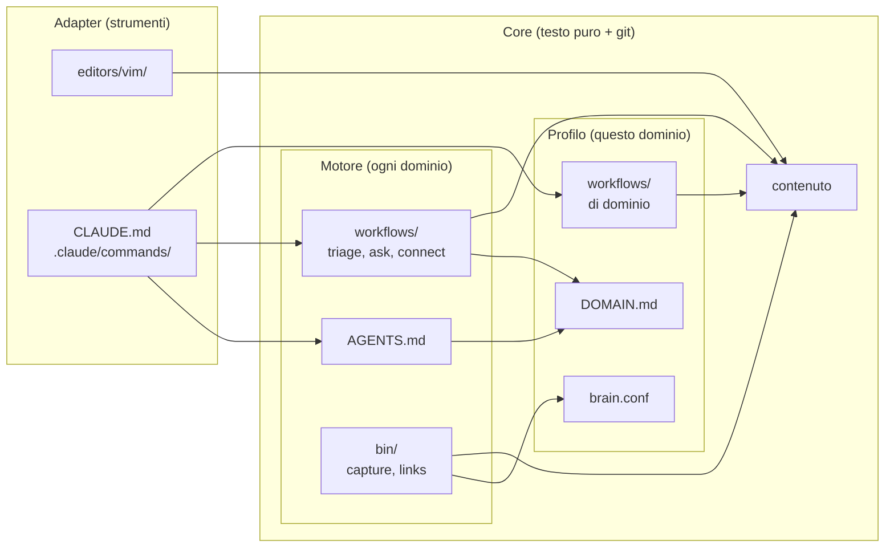

# Un second brain agnostico al dominio

Il progetto [`second-brain`](https://geoteo.net/second-brain/) è un archivio di note in testo puro, versionato con *git*, costruito attorno a un solo vincolo: **l'indipendenza dagli strumenti**, su due assi (l'editor e l'agente AI). Tutto ciò che ha valore sta in un *core* di file di testo; editor e agenti si collegano al core con *adapter* sottili e sostituibili.

Questa nota si chiede se la stessa architettura regga un terzo asse, il **dominio**: un brain per la contabilità, per la programmazione, per la scrittura narrativa o per gli articoli, invece che per gli appunti personali. La risposta è sì, a patto di accettare che una parte del core di `second-brain` non sia davvero invariante, ma sia *PKM* (*Personal Knowledge Management*) travestito da core: scelte che hanno senso solo perché l'archivio contiene appunti.

L'idea è semplice da enunciare: dividere il core in un motore, identico in ogni brain, e un profilo di dominio, che descrive cosa contiene *questo* brain. `second-brain` diventa così un caso particolare, il profilo `pkm` ([§7](#7-caso-duso-second-brain-come-profilo-pkm)).


## Cosa ci serve

- **Core e adapter** — la separazione già presente in `second-brain`: il core contiene tutto ciò che ha valore, gli adapter collegano uno strumento e non contengono nulla di proprio.
- **Motore** — la parte del core che ha senso in qualunque dominio: contratto di cattura, hard rules, workflow generici, ciclo di revisione.
- **Profilo** — la parte del core che ha senso solo in un dominio: unità di contenuto, cartelle, schema del frontmatter, tipi di fonte, workflow specifici.
- **Test di confine** — un secondo profilo molto diverso dal primo: se motore e profilo sono separati bene, cambiare profilo non tocca il motore.


## 1. Il punto di partenza: core e adapter

`second-brain` applica l'*architettura esagonale* (*ports and adapters*) alle note. Il core definisce il contratto (formato, istruzioni, procedure) e ogni strumento vi si adegua; tutte le dipendenze puntano verso il core, mai il contrario.

| Core                                    | Adapter                               |
|-----------------------------------------|---------------------------------------|
| le note, nel loro formato               | `CLAUDE.md` (una riga: `@AGENTS.md`)  |
| la struttura delle cartelle             | `.claude/commands/*.md` (poche righe) |
| `AGENTS.md`, le istruzioni per l'agente | `editors/vim/brain.vim`               |
| `workflows/`, le procedure in prosa     | impostazioni ed estensioni di VS Code |
| `bin/`, script in shell POSIX           | cache e indici di qualunque strumento |
| la storia git                           | —                                     |

Il criterio per decidere cosa sta nel core è uno solo:

> **La regola del README**: qualcosa appartiene al core se ha ancora senso dopo aver disinstallato ogni editor e ogni agente.

Questo criterio separa bene gli strumenti dal contenuto, ma non dice nulla sul dominio. Ed è qui che nasce il problema: tutto ciò che supera il test finisce nel core, anche quando dipende dal fatto che l'archivio contiene *appunti*.


## 2. Il problema: PKM travestito da core

La tentazione è pensare che generalizzare significhi solo rinominare le cartelle (`snippets/` al posto di `notes/`, `characters/` al posto di `areas/`). Non basta, perché alcune scelte del core di `second-brain` presuppongono che l'unità di contenuto sia una nota atomica. Lo si vede direttamente nel codice:

| Elemento                          | Dove                                               | Perché è PKM                                                           |
|-----------------------------------|----------------------------------------------------|------------------------------------------------------------------------|
| rilevamento dell'archivio         | `is_archive()` in `bin/capture` e `bin/links`      | richiede `AGENTS.md`, `inbox/` e `notes/`                          |
| cartelle di contenuto             | `bin/links`, `workflows/ask.md`                    | `notes projects areas journal` scritto per esteso                      |
| esenzione dagli orfani            | `bin/links`, `workflows/connect.md`                | `journal/` esente, perché le note giornaliere sono punti d'ingresso    |
| destinazione di default           | `workflows/triage.md`                              | "Default destination `notes/`"                                         |
| `notes/` piatto, un'idea per nota | `AGENTS.md`                                        | sensato per idee, non per capitoli o transazioni                       |
| tre campi di frontmatter          | `AGENTS.md`, `notes/note-format.md`                | `title`, `tags`, `created`: un solo schema per un solo tipo di unità   |
| tipi di fonte                     | `AGENTS.md`, `bin/capture`, `notes/note-format.md` | `lecture`, `handout`, `exam`...: vocabolario da studente, in tre copie |

L'ultima riga è un difetto anche indipendentemente dalla generalizzazione: il README stesso avverte che un nuovo tipo di fonte va aggiunto in tre posti. Separare il profilo lo risolve gratis, perché le liste finiscono in un solo file ([§6.2](#62-brainconf-i-dati-per-gli-script)).

Il punto più importante però è l'unità. In un brain di scrittura narrativa l'unità di lavoro è il capitolo, che non è atomico, non si "trova" con `ask` come un'idea e soprattutto non passa dal *triage*: il manoscritto si scrive, e il brain gli sta a fianco come "bibbia" (personaggi, mondo, cronologia). In un brain di contabilità il contenuto di valore non è prosa ma un formato verificabile, come il *plain-text accounting* (*hledger*, *beancount*), e le note sono solo il contorno. Rinominare le cartelle non cambia nessuna di queste cose.


## 3. Il terzo asse: il dominio

Il criterio del README si estende dividendo il core in due:

- **motore**: ha senso anche se cambio dominio ([§4](#4-il-motore));
- **profilo**: ha senso solo in questo dominio, ma resta comunque testo puro, indipendente dagli strumenti ([§5](#5-il-profilo)).

> **Il test esteso**: dopo aver disinstallato ogni strumento, ciò che resta è il core. Del core, ciò che resta anche cambiando dominio è il motore; il resto è il profilo.

C'è un'asimmetria da tenere presente: il profilo non è un adapter. Gli adapter sono sottili, senza stato e sostituibili in pochi minuti; il profilo è sostanzioso, contiene decisioni che costano care da cambiare (come il formato delle note) ed è metà del core. Motore e profilo insieme formano il core; gli adapter restano esattamente quelli di prima.



Tra motore e profilo le frecce vanno in una sola direzione: il motore *legge* il profilo per sapere dove stanno le cose e come sono fatte, il profilo non sa nulla di come il motore le gestisce.


## 4. Il motore

Il motore è ciò che resta di `second-brain` togliendo ogni riferimento agli appunti. L'obiettivo è che sia identico in ogni brain, e che copiarlo da un brain all'altro non richieda di modificarne una riga.

- **Rilevamento dell'archivio** — una cartella è un archivio se contiene `AGENTS.md` e `inbox/`, le due cose che il motore stesso garantisce. Il requisito di `notes/` sparisce ([§6.2](#62-brainconf-i-dati-per-gli-script)).
- **Contratto di cattura** — un file di testo che compare in `inbox/` è una cattura. `bin/capture` resta il modo più comodo di onorarlo, con la riga `source:` opzionale.
- **Hard rules** — mai cancellare (si sposta in `archive/`), mai link a file mancanti, mai modifiche fuori dall'archivio, mai copiare file binari nell'archivio, mai toccare la configurazione degli strumenti senza richiesta, mai commit, mai inventare contenuto, chiedere nel dubbio. Nessuna dipende da cosa contiene l'archivio.
- **Workflow generici**:
  - `ask`: sola lettura, cita i file, separa ciò che dice l'archivio dalla conoscenza generale dell'agente, segnala lacune e contraddizioni;
  - `connect` e `bin/links`: link rotti, file orfani, link mancanti;
  - `triage`, ma solo come procedura: leggi tutte le catture, raggruppa, cerca l'esistente, integra, crea o chiedi, collega, archivia l'originale. *Dove* va ogni cattura lo decide il profilo.
- **Ciclo di revisione** — l'agente non committa mai; si legge `git diff`, si correggono le istruzioni che l'agente ha frainteso, si committa a mano.

`triage` è il caso più istruttivo. In `second-brain` contiene due cose mescolate: un metodo (leggere tutto prima di toccare qualcosa, riformulare senza aggiungere, chiedere invece di indovinare) e una mappa (default `notes/`, `projects/` o `areas/` solo se ovvio). Il metodo è motore; la mappa è profilo.


## 5. Il profilo

Un profilo è fatto di sette componenti. Messi a confronto su tre domini molto diversi:

| Componente               | `pkm` (`second-brain`)            | `fiction`                                      | `ledger`                                   |
|--------------------------|-----------------------------------|------------------------------------------------|--------------------------------------------|
| **Unità**                | nota atomica, un'idea per file    | capitolo; scheda di personaggio o luogo        | transazione                                |
| **Tassonomia e routing** | `notes/` piatto + PARA ridotto    | `chapters/`, `characters/`, `world/`, `notes/` | `ledger/`, `notes/` per regole e procedure |
| **Schema**               | `title`, `tags`, `created`        | uno per tipo di unità (capitoli, schede)       | formato *hledger*, niente frontmatter      |
| **Tipi di fonte**        | `lecture`, `handout`, `book`, ... | per esempio `research`, `overheard`, ...       | `receipt`, `invoice`, `bank-statement`     |
| **Lingua e wrapping**    | una lingua, 72 colonne            | lingua del manoscritto, una frase per riga     | una lingua; il ledger ha il suo formato    |
| **Workflow di dominio**  | `distill`                         | `continuity`                                   | `reconcile`                                |
| **Validatori meccanici** | nessuno oltre a `bin/links`       | controllo della cronologia                     | `hledger check`                            |

Le righe più delicate sono le prime due. L'unità determina tutto il resto: cosa significa "integrare" una cattura, cosa conta come orfano, cosa `ask` deve leggere per intero. Il routing è la tabella che `triage` consulta: "una cattura di questo tipo va lì". Nel profilo `fiction`, per esempio, il routing contiene una regola che in `pkm` non avrebbe senso: `chapters/` non è mai una destinazione di triage ([§8.1](#81-un-domainmd-per-la-narrativa)).

Anche il wrapping della colonna `fiction` non è casuale: un manoscritto cambia per frasi, e una frase per riga (*semantic line breaks*) dà diff molto più leggibili durante la revisione. Il README di `second-brain` dice di scegliere il wrapping una volta per archivio, prima di scrivere la prima nota: è una scelta che vale per un archivio intero ma cambia da un dominio all'altro, quindi appartiene al profilo e non al motore.


## 6. Dai concetti ai file

### 6.1 `AGENTS.md` e `DOMAIN.md`

Al posto di un solo file di istruzioni ce ne sono due:

- **`AGENTS.md`** contiene solo il motore: scopo generico, hard rules, regole di formato comuni a ogni dominio (nomi in kebab-case, link relativi con estensione, niente link a sezioni), elenco dei workflow. È identico in ogni brain, più una frase: *"Le regole di dominio sono in `DOMAIN.md`: leggilo all'inizio di ogni sessione."*
- **`DOMAIN.md`** contiene il profilo, in prosa: le unità, le cartelle, la tabella di routing, lo schema del frontmatter per ogni tipo di unità, la struttura dei file (per esempio la sezione `## Links` finale, sensata per le note ma non per un capitolo), la lingua, i workflow di dominio.

Anche `DOMAIN.md` è prosa, quindi funziona con qualunque agente, compreso uno che non conosce le importazioni `@file` di Claude Code: basta la frase in `AGENTS.md`. Il costo è un file in più nel contesto di ogni sessione; il beneficio è che `AGENTS.md` si migliora una volta e si copia uguale in tutti i brain.


### 6.2 `brain.conf`: i dati per gli script

Gli script in `bin/` non leggono prosa: hanno bisogno di qualche dato in forma meccanica. Questi dati vanno in un `brain.conf` fatto di sole assegnazioni shell, che gli script caricano con il comando POSIX `.` (lo eseguono nella shell corrente, quindi le variabili restano definite):

```sh
# brain.conf: dati del profilo letti da bin/ (solo assegnazioni)
CONTENT_DIRS="notes projects areas journal" # dove cercano ask e links
ENTRY_DIRS="journal"                        # esenti dal controllo orfani
SOURCE_KINDS="lecture handout book article web exercise exam"
```

Rispetto a un `config.json` le differenze sono due: non serve `jq` (né un altro interprete) per leggerlo, coerentemente con la scelta di `second-brain` di avere solo script POSIX; e contiene solo ciò che serve agli script, non una descrizione completa del dominio, che resta in `DOMAIN.md`. Proprio perché `.` *esegue* il file, per convenzione `brain.conf` contiene solo assegnazioni, mai comandi; sta nello stesso archivio degli script e passa dalla stessa revisione con `git diff`.

> **Ogni dato vive in un solo posto**: le liste stanno in `brain.conf`, e `DOMAIN.md` le *richiama* invece di ripeterle ("le cartelle di contenuto sono quelle in `CONTENT_DIRS` di `brain.conf`"). L'agente sa leggere un file di assegnazioni; uno script non sa leggere la prosa.

In `bin/capture` la modifica è piccola, con una sola sottigliezza: l'ordine. Oggi lo script controlla il tipo di fonte prima di cercare l'archivio, perché la lista è scritta nello script; con `brain.conf` la lista sta nell'archivio, quindi il controllo va spostato dopo:

```sh
# un archivio ha AGENTS.md e inbox/ (notes/ non è più richiesto)
is_archive() {
    [ -f "$1/AGENTS.md" ] && [ -d "$1/inbox" ]
}

# ... ricerca di $root come prima ...

# i dati del profilo; senza brain.conf ogni tipo di fonte è accettato
SOURCE_KINDS=''
[ ! -f "$root/brain.conf" ] || . "$root/brain.conf"

if [ -n "$src" ] && [ -n "$SOURCE_KINDS" ]; then
    kind=$(printf '%s' "${src%%,*}" | tr -d ' ')
    case " $SOURCE_KINDS " in
    *" $kind "*) ;;
    *)
        echo "capture: unknown kind of source \"$kind\" (one of: $SOURCE_KINDS)" >&2
        exit 1
        ;;
    esac
fi
```

In `bin/links` le due liste scritte per esteso diventano derivate dal profilo: i file i cui link contano sono quelli in `CONTENT_DIRS`, quelli che possono essere orfani sono quelli in `CONTENT_DIRS` ma non in `ENTRY_DIRS`:

```sh
# qui brain.conf è obbligatorio: senza cartelle di contenuto non c'è
# nulla da controllare
. "$root/brain.conf"

# CONTENT_DIRS senza ENTRY_DIRS: le cartelle i cui file possono essere orfani
orphanable=''
for d in $CONTENT_DIRS; do
    case " $ENTRY_DIRS " in
    *" $d "*) ;;
    *) orphanable="$orphanable $d" ;;
    esac
done

notes=$(find $orphanable -name '*.md' 2>/dev/null | sort)
sources=$(find $CONTENT_DIRS -name '*.md' 2>/dev/null | sort)
```

Con il profilo `pkm` il comportamento resta identico a oggi: le cartelle che possono contenere orfani sono `notes projects areas`, quelle i cui link contano sono `notes projects areas journal`. Con il profilo `fiction` basta `ENTRY_DIRS="chapters"` perché i capitoli, che nessuna scheda è tenuta a citare, non vengano segnalati come orfani.


### 6.3 Il repository di template

Il `template/` di `second-brain` oggi ha quattro livelli (`core`, `claude`, `vim`, `docs`). Separando motore e profilo diventa:

```text
template/
├── engine/              # AGENTS.md, bin/, workflows/{triage,ask,connect}.md
├── profiles/
│   ├── pkm/             # DOMAIN.md, brain.conf, workflows/distill.md
│   └── fiction/         # DOMAIN.md, brain.conf, workflows/continuity.md
├── adapters/
│   ├── claude/          # CLAUDE.md, .claude/commands/
│   └── vim/             # editors/vim/brain.vim
└── docs/                # note che documentano il sistema
```

e `init.sh` riceve un'opzione in più:

```sh
init.sh --profile pkm --claude --vim ~/brain
init.sh --profile fiction --claude ~/romanzo
```

Le cartelle da creare non sono più scritte nello script (oggi c'è un `for d in inbox notes projects areas journal ...`): `init.sh` crea quelle del motore (`inbox/`, `archive/inbox/`, `workflows/`, `bin/`) più quelle in `CONTENT_DIRS` del profilo scelto. I comandi dell'adapter seguono la stessa logica: `/distill` va installato solo se il profilo ha `workflows/distill.md`.


## 7. Caso d'uso: `second-brain` come profilo `pkm`

Nella nuova struttura `second-brain` non sparisce: diventa il primo profilo, e non perde nulla di quello che fa oggi.

| Componente del profilo | In `second-brain` oggi                                                       |
|------------------------|------------------------------------------------------------------------------|
| Unità                  | nota atomica, un'idea per file, `## Why` quando registra una scelta          |
| Cartelle e routing     | `notes/` piatto (default), `projects/` e `areas/` solo se ovvio, `journal/`  |
| Schema                 | `title`, `tags`, `created`; opzionali `updated` e `source`                   |
| Tipi di fonte          | `lecture`, `handout`, `book`, `article`, `web`, `exercise`, `exam`           |
| Lingua e wrapping      | una lingua per archivio, 72 colonne                                          |
| Workflow di dominio    | `distill` (porta nelle note ciò che le risposte salvate di `ask` aggiungono) |
| Validatori meccanici   | nessuno oltre a `bin/links`, che è del motore                                |

In concreto, la migrazione del repository tocca pochi file:

1. **`AGENTS.md`** si divide. *Purpose* (reso generico), *Hard rules* e *Available workflows* restano; *Structure*, frontmatter, tipi di fonte, struttura delle note e lingua passano in `DOMAIN.md`. Anche la sezione *Format* si divide: restano solo le regole comuni a ogni dominio ([§6.1](#61-agentsmd-e-domainmd)).
2. **`brain.conf`** nasce con le tre righe di [§6.2](#62-brainconf-i-dati-per-gli-script) e diventa l'unica copia dei tipi di fonte.
3. **`bin/capture`** e **`bin/links`** perdono il requisito di `notes/` e leggono le liste da `brain.conf`.
4. **`workflows/triage.md`** perde la frase sulla destinazione di default, sostituita da *"scegli la destinazione con la tabella di routing di `DOMAIN.md`"*; **`workflows/ask.md`** cerca nelle cartelle di `CONTENT_DIRS` invece che in quattro cartelle nominate.
5. **`workflows/distill.md`** e il comando `/distill` passano nel profilo, perché dipendono da `answers/`, che è una scelta del profilo `pkm`.

Per un archivio già creato, `init.sh` può aggiungere `DOMAIN.md` e `brain.conf`, ma non può dividere `AGENTS.md`, perché non sovrascrive mai un file esistente. La divisione va fatta a mano e rivista con `git diff`, come ogni altra modifica; il rilevamento più permissivo (`AGENTS.md` + `inbox/`) riconosce comunque anche gli archivi esistenti.


## 8. Validare il confine: `fiction` e `ledger`

Un'astrazione costruita su un solo caso non è ancora un'astrazione. Per verificare il confine serve un secondo profilo **il più diverso possibile** dal primo, e la narrativa è il candidato migliore: unità non atomica, manoscritto che non passa dal triage, coerenza interna che conta più dei link.


### 8.1 Un `DOMAIN.md` per la narrativa

Uno schizzo di cosa conterrebbe, in inglese come l'`AGENTS.md` del template:

```markdown
# DOMAIN.md

## Units

- `chapters/`: the manuscript, one file per chapter, `NN-slug.md`.
    Written by the user, never by triage.
- `characters/`, `world/`: one sheet per character, place, faction or
    rule of the world. The reference for continuity.
- `notes/`: loose ideas, possible scenes, lines of dialogue.

## Routing

| The capture is about...             | Destination                 |
|-------------------------------------|-----------------------------|
| a fact about an existing character  | its sheet in `characters/`  |
| a rule, place or event of the world | `world/`                    |
| a scene, a line, a plot idea        | `notes/`                    |
| a change to a written chapter       | ask: never edit `chapters/` |
```

Lo schizzo omette lo schema, che non è uno solo: i capitoli hanno per esempio `pov`, `timeline` e `status`, le schede `title`, `tags` e `aliases`. Il profilo definisce uno schema per tipo di unità, non uno per tutto l'archivio.


### 8.2 Il test

Il criterio di successo è netto: se motore e profilo sono separati bene, passare da `pkm` a `fiction` non tocca il motore.

| Parte del motore        | Passa intatta? | Osservazione                                                                                            |
|-------------------------|----------------|---------------------------------------------------------------------------------------------------------|
| contratto di cattura    | sì             | una battuta di dialogo in `inbox/` è una cattura come un'altra                                          |
| hard rules              | sì             | "mai inventare contenuto" pesa ancora di più: l'agente non aggiunge fatti che l'autore non ha stabilito |
| `ask`                   | sì             | "cosa so del passato di Elena?" cerca, cita le schede, segnala contraddizioni                           |
| `connect` / `bin/links` | sì             | serve solo `ENTRY_DIRS="chapters"` nel profilo ([§6.2](#62-brainconf-i-dati-per-gli-script))            |
| `triage` (procedura)    | sì             | la tabella di routing cambia, il metodo no                                                              |
| ciclo di revisione      | sì             | con una frase per riga, il diff di un capitolo si legge frase per frase                                 |

Il profilo aggiunge poi ciò che `pkm` non ha: un workflow `continuity` che legge un capitolo e lo confronta con `characters/` e `world/` (età, luoghi, regole, cronologia). Come `connect`, presenta ciò che trova e aspetta conferma prima di toccare le schede; il capitolo non lo modifica mai. È l'equivalente narrativo di `ask`, con le contraddizioni come obiettivo principale invece che come effetto collaterale.

Se invece, scrivendo il profilo `fiction`, serve modificare `ask`, `connect` o una hard rule, quella parte sta ancora nel posto sbagliato: è PKM travestito da motore.


### 8.3 Un caso limite: il profilo `ledger`

La contabilità mette alla prova il motore in un altro modo, perché l'unità di valore non è prosa. Una ricevuta trascritta in `inbox/` è una cattura come le altre, con il suo tipo di fonte:

```text
source: receipt, distributore Eni via Roma, 2026-10-03
benzina 42,50 euro, pagata con la carta
```

e `triage` la trasforma in una transazione nel ledger, nel formato di *hledger*:

```text
2026-10-03 Eni via Roma
    expenses:auto:carburante    42.50 EUR
    assets:banca:carta
```

Il ledger è comunque testo puro, leggibile senza strumenti e versionabile con git, quindi rispetta il core; ma il validatore naturale, `hledger check`, è un programma esterno. È accettabile per lo stesso motivo per cui `second-brain` accetta la preview di VS Code: il formato resta leggibile senza, e i controlli (date, saldi, conti esistenti) si possono rifare a mano. Le regole del motore reggono, e "chiedi nel dubbio" diventa essenziale: se la cattura non dice da quale conto è uscito il denaro, l'agente chiede invece di scegliere, perché un conto sbagliato è proprio il tipo di errore difficile da ritrovare. I PDF delle fatture restano fuori dall'archivio, esattamente come le dispense in `second-brain`.


## 9. Prima il secondo brain, poi il framework

La tentazione, a questo punto, è estrarre subito il motore e scrivere `profiles/` per cinque domini. È la strada sbagliata, per lo stesso motivo per cui il README di `second-brain` suggerisce di partire con tre workflow e non con venti: il sistema migliora con la revisione, non con il design a priori.

La procedura che segue lo stesso principio ha quattro passi:

1. **Scrivi a mano un secondo brain concreto**, per esempio `fiction`, partendo da una copia di `second-brain` e modificando liberamente tutto ciò che serve.
2. **Usalo** per qualche settimana, con il solito ciclo cattura $\to$ triage $\to$ revisione $\to$ commit.
3. **Confronta** le parti che candidano a motore: istruzioni, procedure e script dei due archivi (il contenuto è diverso per definizione, e confrontarlo sarebbe solo rumore).
4. **Ciò che è rimasto identico è il motore**; ciò che hai dovuto modificare è profilo. Solo a questo punto ha senso ristrutturare `template/`.

Per il terzo passo bastano `diff -q`, che dice solo *se* due file differiscono, e `diff -u`, che mostra *come*:

```sh
# file identici, diversi o presenti in uno solo dei due archivi
diff -q ~/brain/AGENTS.md ~/romanzo/AGENTS.md
diff -rq ~/brain/workflows ~/romanzo/workflows
diff -rq ~/brain/bin ~/romanzo/bin

# nel dettaglio, le modifiche a un singolo file del motore candidato
diff -u ~/brain/workflows/ask.md ~/romanzo/workflows/ask.md
```

Un file presente in un solo archivio (`Only in ...`), come `continuity.md`, è un workflow di dominio; un file del motore che compare tra quelli diversi indica che il confine va rivisto.

Due segnali indicano che il confine è nel posto sbagliato, sul modello di quelli che il README dà per gli adapter:

- **Se aggiungere un dominio richiede di toccare il motore**, una parte del motore è profilo.
- **Se un profilo inizia a ridefinire procedure generiche** (un `triage` diverso, un `ask` diverso), sta assorbendo logica del motore: va riportata nel motore come opzione, oppure il profilo sta descrivendo un dominio per cui il motore non è adatto.


## 10. Scelte di progetto in sintesi

| Scelta                                             | Alternativa scartata                         | Motivo                                                                     |
|----------------------------------------------------|----------------------------------------------|----------------------------------------------------------------------------|
| motore + profilo                                   | solo rinominare le cartelle                  | l'unità di contenuto cambia, non solo i nomi                               |
| `DOMAIN.md` in prosa                               | profilo in un formato strutturato            | ogni agente capisce la prosa, e anche una persona                          |
| `brain.conf` con assegnazioni shell                | `config.json`                                | nessuna dipendenza (`jq`), solo i dati che servono agli script             |
| un dato in un solo posto                           | liste ripetute in `AGENTS.md` e negli script | i tipi di fonte oggi vivono in tre copie da tenere allineate               |
| archivi indipendenti (`$BRAIN`, cartella corrente) | brain composti con *git submodules*          | i submodule legano gli archivi tra loro; la risoluzione per cartella basta |
| archivio = `AGENTS.md` + `inbox/`                  | archivio = `AGENTS.md` + `inbox/` + `notes/` | `notes/` è una scelta del profilo                                          |
| prima un secondo brain a mano                      | estrarre subito il framework                 | il confine si scopre confrontando due casi reali, non progettandolo        |

Il filo comune è lo stesso di `second-brain`. Gli strumenti cambiano più in fretta delle idee, e per questo stanno negli adapter; i domini cambiano poco, ma sono diversi tra loro, e per questo stanno nei profili. Ciò che resta, il modo di catturare, rivedere e interrogare un archivio, è il motore: si scrive una volta e si riusa ovunque, senza costringere ogni dominio dentro la forma di un altro.


## 11. Documentazione e risorse

- **Caso d'uso**: [second-brain](https://geoteo.net/second-brain/), con template e `init.sh` su [GitHub](https://github.com/matteogiorgi/second-brain)
- **`AGENTS.md`**, la convenzione aperta per le istruzioni agli agenti: <https://agents.md>
- **Architettura esagonale**, l'articolo originale di Alistair Cockburn: <https://alistair.cockburn.us/hexagonal-architecture/>
- **Plain-text accounting**: <https://plaintextaccounting.org>, con [hledger](https://hledger.org) e [beancount](https://beancount.github.io)
- **Semantic line breaks**: <https://sembr.org>
- **PARA**: Tiago Forte, *Building a Second Brain* (2022)
- Vedi anche [tema_geoteo](tema_geoteo.md): la pagina di `second-brain` eredita lo stile da `geoteo.net` nello stesso modo di questo repository.
