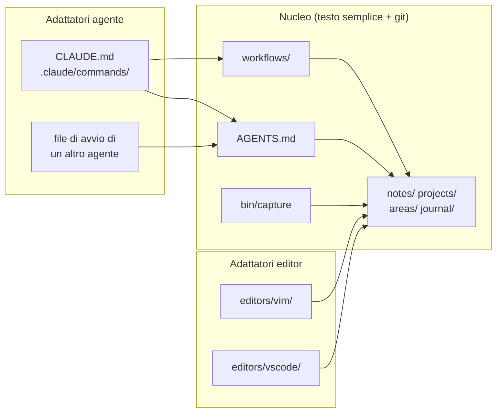
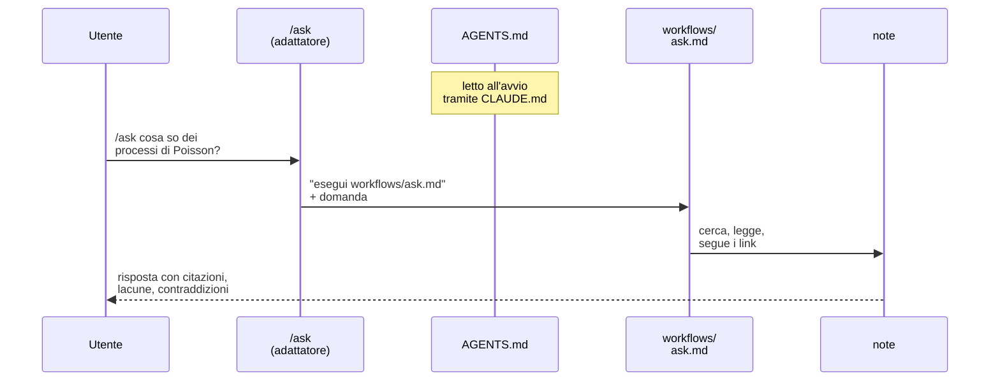
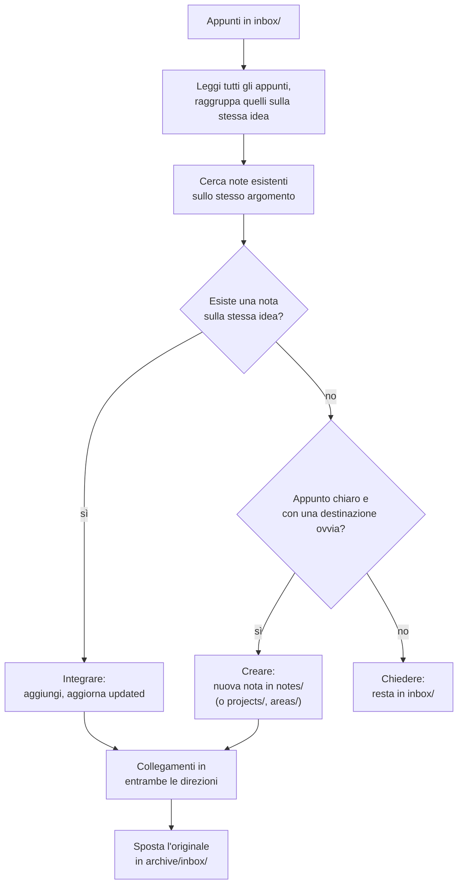
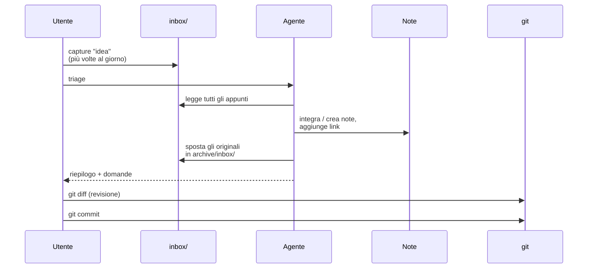

# Un second brain agnostico: note, editor e agenti

Un **second brain** è un archivio personale di note in cui raccogliere, collegare e ritrovare idee. Quello descritto qui è fatto di sole cartelle di file *Markdown* versionate con *git*: un editor qualsiasi serve a leggerle e scriverle, un agente AI (per esempio *Claude Code*) serve a smistarle, collegarle e interrogarle. Nessun database, nessuna app proprietaria, nessun formato che richieda un programma specifico per essere letto.

Il vincolo che dà forma a tutto il resto è l'**agnosticità**, su due assi: rispetto all'editor (Vim, VS Code o altro, senza che nulla cambi) e rispetto all'agente (Claude Code oggi, un altro domani). La soluzione è la stessa su entrambi gli assi: un **nucleo** di testo semplice che contiene tutto ciò che ha valore, e degli **adattatori** sottili e sostituibili che collegano il nucleo a uno strumento. Il resto della nota costruisce il sistema a partire da questo principio: il formato delle note, le istruzioni per gli agenti, le procedure (*workflow*), la cattura da shell, e infine come si usa e si mantiene nel tempo.


## Mappa: cosa serve per cosa

- **Nucleo e adattatori** — il principio architetturale: cosa sta nel nucleo, cosa è un adattatore, e il test che separa i due ([§1](#1-il-principio-nucleo-e-adattatori)).
- **Struttura delle cartelle** — dove vive ogni cosa, con le note tenute piatte ([§2](#2-la-struttura-dellarchivio)).
- **Formato delle note** — le convenzioni rigide: nomi, frontmatter, link relativi, estensioni ammesse ([§3](#3-il-formato-delle-note)).
- **`AGENTS.md` e `workflows/`** — le istruzioni per gli agenti, scritte in un file neutro e in prosa ([§4](#4-istruzioni-agent-agnostiche)).
- **Triage, ask, connect** — le tre procedure con cui l'agente lavora sull'archivio ([§5](#5-i-tre-workflow)).
- **Cattura** — lo script POSIX che fa entrare le idee nel sistema senza editor né agente ([§6](#6-la-cattura-da-shell)).
- **Adattatori editor** — Vim e VS Code, e cosa si perde e si guadagna con ciascuno ([§7](#7-adattatori-per-gli-editor)).
- **Uso e manutenzione** — il ciclo quotidiano e le revisioni periodiche ([§8](#8-uso-quotidiano)–[§9](#9-manutenzione)).



Tutte le frecce vanno **verso** il nucleo: è questo il senso dell'intera architettura.


## 1. Il principio: nucleo e adattatori

### 1.1 L'idea

Un sistema che deve sopravvivere ai propri strumenti va diviso in due parti. Il **nucleo** contiene tutto ciò che ha valore e non sa nulla degli strumenti; gli **adattatori** sanno tutto del nucleo, ma non contengono nulla di proprio.

È lo stesso schema dell'**architettura esagonale** (*ports and adapters*) nel software: il dominio non dipende dall'infrastruttura, è l'infrastruttura che dipende dal dominio. È anche parente stretto del consiglio Go di definire le interfacce dal lato di chi le consuma, visto in [fondamenti_go_oop §9.2](../teoria_linguaggi/fondamenti_go_oop.md#92-interfacce-piccole-definite-da-chi-le-consuma): è il nucleo a stabilire il contratto (il formato, le istruzioni), e ogni strumento si adegua.

Criterio pratico: **una cosa appartiene al nucleo se ha ancora senso dopo aver disinstallato ogni editor e ogni agente**.

| Nucleo                                    | Adattatori                                  |
|-------------------------------------------|---------------------------------------------|
| le note, nel loro formato                 | `CLAUDE.md` (una riga: `@AGENTS.md`)        |
| la struttura delle cartelle               | `.claude/commands/*.md` (una riga ciascuno) |
| `AGENTS.md`, le istruzioni per gli agenti | `editors/vim/brain.vim`                     |
| `workflows/`, le procedure in prosa       | impostazioni ed estensioni di VS Code       |
| `bin/`, script in shell POSIX             | hook di un agente che chiamano `bin/`       |
| la storia in git                          | cache e indici di qualsiasi strumento       |

Lo stesso principio regge, su scala diversa, l'eredità del tema descritta in [tema_geoteo](tema_geoteo.md): lo stile vive in un solo posto, e ogni repository vi si collega con una riga di `_config.yml`.


### 1.2 Le quattro regole di un adattatore

1. **È sottile.** Poche righe; se cresce, sta assorbendo logica che appartiene al nucleo.
2. **Punta in una sola direzione.** L'adattatore rimanda al nucleo, mai il contrario. Nessuna nota, nessun workflow e nessuno script *dipende* da un editor o da un agente: può citarlo come esempio, non richiederlo per funzionare.
3. **Non ha stato proprio.** Non conserva dati che non siano anche nel nucleo: cache, indici e database di uno strumento sono ricostruibili, quindi sacrificabili.
4. **È sostituibile.** Si cancella e si riscrive per un altro strumento in pochi minuti.

La seconda è quella che si rompe più facilmente. Un caso tipico sono le funzionalità specifiche di un agente, come gli *hook* che eseguono qualcosa dopo ogni modifica: comodi, e proprio per questo invitano a metterci dentro la logica. La regola è che la logica va in uno script in `bin/`, e l'hook si limita a chiamarlo. Così un altro agente, o una persona a mano, può fare la stessa cosa.

> **Un'eccezione consapevole.** `AGENTS.md`, che è nucleo, nomina `CLAUDE.md` e `.claude/` per dire all'agente di non toccarli. È una citazione, non una dipendenza: se quei file sparissero, la regola resterebbe vera e innocua. Il confine è sulla dipendenza, non sulla menzione.


### 1.3 Perché conviene: il problema m × n

Con $m$ editor e $n$ agenti, se ogni coppia deve accordarsi su un formato (un editor che scrive wikilink, un agente che deve saperli interpretare, un indice proprietario che solo un certo plugin sa leggere), le integrazioni da mantenere crescono come il prodotto; con un formato comune nel mezzo, ogni strumento si collega una volta sola al nucleo:

$$
\underbrace{m \cdot n}_{\text{accoppiamento diretto}} \qquad \longrightarrow \qquad \underbrace{m + n}_{\text{nucleo comune}}
$$

È la stessa riduzione che il *Language Server Protocol* ha portato negli editor di codice: invece di un plugin per ogni coppia (editor, linguaggio), un server per linguaggio e un client per editor.

Il guadagno più concreto, però, è sul costo di un cambio di strumento. Siano $N$ le note nell'archivio. Senza nucleo, abbandonare uno strumento significa migrare le note dal suo formato: un costo che cresce con l'archivio, $O(N)$, e che aumenta ogni giorno che si usa il sistema. Con il nucleo, cambiare strumento significa scrivere un adattatore, di dimensione indipendente da $N$:

$$
C_{\text{cambio}}(N) = O(1) \quad \text{rispetto a } N
$$

In altre parole, provare uno strumento nuovo costa un adattatore, non una migrazione.


### 1.4 Test di correttezza

Si eliminano mentalmente `CLAUDE.md`, `.claude/`, `editors/` e ogni altro adattatore. Si può ancora **catturare**, **leggere**, **cercare**, **collegare** e **versionare** le note con `cat`, `grep`, un editor qualsiasi e `git`? Se sì, il confine è tracciato bene.

```sh
cat notes/processo-poisson.md           # leggere
grep -rl 'poisson' notes/ projects/     # cercare
grep -rl '(processo-poisson.md)' notes/ # backlink: chi linka questa nota
git log --oneline -- notes/             # storia
```


## 2. La struttura dell'archivio

```
brain/
├── AGENTS.md          # istruzioni operative per qualsiasi agente
├── CLAUDE.md          # adattatore: importa AGENTS.md
├── inbox/             # appunti grezzi, da smistare
├── notes/             # note atomiche, piatte, una idea per file
├── projects/          # cose con una fine (esami, tesi, repo)
├── areas/             # responsabilità continue (studio, carriera, questo sistema)
├── journal/           # note giornaliere, AAAA-MM-GG.md
├── archive/           # note ritirate: qui non si cancella, si sposta
│   └── inbox/         # appunti originali già smistati
├── workflows/         # procedure in prosa, leggibili da persone e agenti
├── bin/               # script POSIX (capture, ...)
├── editors/           # adattatori editor (vim/, vscode/, ...)
└── .claude/
    └── commands/      # adattatori: ogni comando rimanda a un workflow
```

| Cartella     | Contenuto                               | Livello    | Formato imposto        |
|--------------|-----------------------------------------|------------|------------------------|
| `inbox/`     | appunti grezzi                          | nucleo     | no (nome a timestamp)  |
| `notes/`     | note atomiche, destinazione predefinita | nucleo     | sì                     |
| `projects/`  | note legate a qualcosa con una fine     | nucleo     | sì                     |
| `areas/`     | responsabilità continue                 | nucleo     | sì                     |
| `journal/`   | note giornaliere                        | nucleo     | sì (`AAAA-MM-GG.md`)   |
| `archive/`   | note ritirate e appunti già smistati    | nucleo     | quello d'origine       |
| `workflows/` | procedure                               | nucleo     | struttura fissa (§4.3) |
| `bin/`       | script                                  | nucleo     | shell POSIX            |
| `editors/`   | configurazioni per editor               | adattatore | quello dell'editor     |
| `.claude/`   | comandi per Claude Code                 | adattatore | quello dell'agente     |

La divisione `projects/` / `areas/` / `archive/` riprende il metodo *PARA* (*Projects, Areas, Resources, Archive*) di Tiago Forte, semplificato: le "risorse" diventano `notes/`, e si aggiungono `inbox/` e `journal/`.

Le note dentro `notes/` stanno **tutte allo stesso livello**, senza sottocartelle per argomento. La struttura la danno i tag e i link, non le directory, per due ragioni: un'idea può appartenere a più argomenti mentre una cartella la costringe in uno solo, e una nota che non si sposta non rompe i link relativi che puntano a lei.

Per inizializzare l'archivio:

```sh
mkdir -p brain/inbox brain/notes brain/projects brain/areas \
    brain/journal brain/archive/inbox brain/workflows brain/bin \
    brain/editors/vim brain/.claude/commands
cd brain && git init
```

Le cartelle vuote vanno tenute in git con un file `.gitkeep`, perché git traccia file e non directory.


## 3. Il formato delle note

Il formato è la parte più rigida del nucleo: cambiarlo dopo significa riscrivere l'archivio. Per questo va deciso per primo, e con un solo criterio: **ogni strumento deve capirlo senza estensioni**. Ne esce *CommonMark* con frontmatter *YAML* e link relativi.


### 3.1 File e nomi

- Testo UTF-8, fine riga LF, newline finale, estensione `.md`.
- Nomi in **minuscolo**, parole separate da trattini (*kebab-case*), **solo ASCII**: `processi-poisson-composti.md`, non `Processi Poisson composti.md`; `probabilita.md`, non `probabilità.md`. Gli accenti stanno nel testo e nel titolo, non nel nome del file.
- Il nome descrive il contenuto ed è **stabile**: ogni rinomina rompe dei link.
- Due eccezioni a formato fisso: `journal/AAAA-MM-GG.md` e, in `inbox/`, i nomi a timestamp generati dalla cattura (§6).

Nomi così sono sicuri in qualsiasi shell senza virgolette, uguali su ogni file system e comodi da completare con il tab.


### 3.2 Frontmatter

Ogni nota fuori da `inbox/` inizia con un blocco YAML di tre campi obbligatori:

```yaml
---
title: Processi di Poisson composti
tags: [probabilita, metodi-stocastici]
created: 2026-09-25
---
```

| Campo     | Obbligatorio | Formato                                             |
|-----------|--------------|-----------------------------------------------------|
| `title`   | sì           | titolo leggibile, con accenti e maiuscole           |
| `tags`    | sì           | lista YAML, minuscolo, kebab-case, ASCII            |
| `created` | sì           | data ISO 8601 (`AAAA-MM-GG`)                        |
| `updated` | no           | data dell'ultima revisione *sostanziale*            |
| `source`  | no           | libro, articolo o lezione da cui viene il contenuto |

Nessun altro campo senza prima aggiornare la nota sul formato. Ogni campo in più è un campo da mantenere su centinaia di note; tre bastano per ordinare, filtrare e datare.


### 3.3 Link: relativi, non wikilink

I link sono link Markdown standard, con **percorso relativo al file corrente** ed estensione inclusa:

```markdown
Generalizzazione del [processo di Poisson](processo-poisson.md), che
si collega alla [nota indice](../areas/second-brain.md).
```

I `[[wikilink]]` sono più comodi da scrivere, ma sono un'estensione: funzionano solo dove qualcuno li ha implementati. I link relativi invece sono Markdown puro.

|                                 | `[testo](nota.md)`                            | `[[nota]]`            |
|---------------------------------|-----------------------------------------------|-----------------------|
| Rendering su GitHub             | link funzionante                              | testo letterale       |
| Conversione con *pandoc*        | link funzionante                              | testo letterale       |
| Vim, senza plugin               | `gf` apre il file                             | serve configurazione  |
| Viewer Markdown generico        | link funzionante                              | testo letterale       |
| Ricerca dei backlink con `grep` | `grep '(nota.md)'`                            | `grep '\[\[nota\]\]'` |
| Costo di scrittura              | qualche carattere in più, scritto dall'agente | minimo                |

Tre regole completano il quadro.

- **Niente percorsi assoluti**: legherebbero l'archivio alla posizione su una macchina precisa.
- **Niente link a sezioni** (`nota.md#sezione`) se non strettamente necessario: ogni strumento genera gli identificativi delle sezioni in modo diverso. Se una sezione merita un link, probabilmente merita una nota propria.
- **Si linka solo a note esistenti.** Un concetto che meriterebbe una nota ma non ce l'ha resta testo semplice finché la nota non viene scritta. È la regola che impedisce all'agente di disseminare l'archivio di link morti.

> Il vincolo sulle sezioni è specifico dell'archivio personale. Questo stesso repository, pubblicato con *Jekyll* su un solo tema, usa invece i riferimenti `nota §x` con ancora: qui il generatore è uno e le ancore sono stabili.


### 3.4 Struttura interna ed estensioni ammesse

- Un solo titolo di livello 1, uguale a `title`; sezioni di livello 2; il livello 3 solo se davvero necessario.
- **Una sola idea per nota**: se servono due titoli di livello 1, sono due note.
- Quando la nota contiene una scelta, chiude con una sezione `## Perché` che la motiva: la motivazione sta accanto a ciò che giustifica e non si perde quando si riorganizza.
- Chiude sempre con `## Collegamenti`, anche breve.

Oltre a CommonMark sono ammesse solo estensioni diffuse e **leggibili anche come testo grezzo**: blocchi di codice recintati con il linguaggio, tabelle in stile GitHub per dati brevi, e matematica LaTeX tra `$...$` e `$$...$$`. La matematica non è CommonMark, ma la supportano pandoc, GitHub e i visualizzatori con *KaTeX* o *MathJax*, e il sorgente resta leggibile: un compromesso consapevole, perché per appunti di probabilità e statistica rinunciarvi costerebbe più della portabilità guadagnata.


### 3.5 A capo: 72 colonne o una frase per riga

Il testo va a capo a mano intorno alle **72 colonne**, come un messaggio di commit, così che si legga comodamente nel terminale anche senza visualizzatore. L'alternativa seria è **una frase per riga** (*semantic line breaks*), che dà diff ancora più puliti quando un agente riscrive un paragrafo:

```diff
 Il processo di Poisson conta eventi che arrivano a tasso costante.
-Gli intervalli tra arrivi sono esponenziali.
+Gli intervalli tra arrivi sono esponenziali di parametro lambda.
 La somma di processi indipendenti è ancora di Poisson.
```

Con le 72 colonne la stessa modifica può far scorrere l'intero paragrafo e sporcare il diff su più righe. La scelta qui è per le 72 colonne, più leggibili come testo; è una delle decisioni da prendere prima di scrivere la prima nota, perché cambiarla dopo tocca tutto l'archivio.


## 4. Istruzioni agent-agnostiche

### 4.1 Il problema

Ogni agente cerca le proprie istruzioni in un posto diverso: *Claude Code* legge `CLAUDE.md` e i comandi in `.claude/commands/`, altri agenti hanno file e cartelle propri. Se le istruzioni si scrivono lì, il sistema diventa di quell'agente. Eppure le istruzioni sono la parte più preziosa del lavoro con un agente, perché accumulano tutto ciò che si impara su come farlo lavorare bene: vanno trattate come nucleo.

La soluzione è dividerle su **due livelli**, entrambi in file neutri:

- **`AGENTS.md`**, nella radice: ciò che l'agente deve sapere *sempre*, in ogni sessione. Contesto e regole. `AGENTS.md` è una convenzione aperta, letta nativamente da diversi agenti; per quelli che non la leggono basta un adattatore di una riga.
- **`workflows/`**: ciò che l'agente deve fare *quando gli viene chiesto*. Una procedura per file.


### 4.2 Perché due livelli: il costo del contesto

Tutto ciò che l'agente legge all'avvio occupa la sua finestra di contesto in ogni sessione, anche quando non serve. Sia $A$ il file letto sempre, $W$ l'insieme dei workflow e $W_s \subseteq W$ quelli usati nella sessione $s$. Con un file unico che contiene tutto, il costo in contesto per sessione è

$$
C_{\text{unico}} = |A| + \sum_{w \in W} |w|
$$

mentre con due livelli si paga solo ciò che si usa:

$$
C_{\text{due livelli}} = |A| + \sum_{w \in W_s} |w| \;\le\; C_{\text{unico}}
$$

con uguaglianza solo se in una sessione si usano tutti i workflow. Il vantaggio cresce con il numero di workflow, ed è per questo che $\|A\|$ va tenuto piccolo: è l'unico termine che si paga sempre. C'è anche un effetto meno misurabile ma più importante: un file unico cresce finché l'agente non lo legge più con attenzione, e le regole annegano tra le procedure.


### 4.3 `AGENTS.md`

Contiene, in quest'ordine:

1. **Scopo** — due righe su cosa è l'archivio e a chi serve.
2. **Struttura** — le cartelle e a cosa serve ciascuna.
3. **Formato** — un riassunto operativo delle regole del §3, con rimando alla nota sul formato come fonte completa.
4. **Regole ferme** — ciò che l'agente non fa mai.
5. **Workflow disponibili** — un elenco dei file in `workflows/`, una riga ciascuno.

Non contiene il *perché* delle scelte: quello sta nelle note, dove lo legge una persona. `AGENTS.md` è scritto per chi **esegue**, le note per chi **capisce**. Il rimando dalla sezione Formato alla nota sul formato evita la duplicazione: le convenzioni hanno una sola fonte, e quando ne cambia una si aggiorna la nota e l'agente la segue.

Le regole ferme sono il cuore del file:

```markdown
## Regole ferme

- Non cancellare mai file: sposta in `archive/`.
- Non creare link verso note inesistenti.
- Non modificare file fuori da questa cartella.
- Non modificare file di configurazione degli strumenti senza richiesta
  esplicita.
- Non fare commit: lascia le modifiche da rivedere con `git diff`.
- Non inventare contenuto: le note riportano ciò che è negli appunti o
  che è stato chiesto esplicitamente di scrivere.
- In caso di dubbio su dove va una nota, come chiamarla o se unirla a
  un'altra, chiedi invece di decidere.
```

Due regole meritano una motivazione esplicita.

- **Niente commit da parte dell'agente.** La revisione del diff è il momento in cui ci si accorge di dove l'agente fraintende le istruzioni, e le si corregge. Se committa lui, quel ciclo di miglioramento si perde: il sistema continua a funzionare, ma smette di migliorare.
- **In caso di dubbio, chiedere.** Rende il triage un po' più lento, ma evita note nate nel posto sbagliato con il nome sbagliato, che sono le più difficili da scovare dopo.


### 4.4 I workflow

Ogni file in `workflows/` descrive una procedura in **prosa imperativa**, sempre con la stessa struttura:

| Sezione   | Contenuto                                              |
|-----------|--------------------------------------------------------|
| `Scopo`   | a cosa serve, in una o due righe                       |
| `Input`   | su cosa lavora (file, cartelle, argomenti dell'utente) |
| `Passi`   | la procedura, numerata                                 |
| `Output`  | cosa restituisce alla fine                             |
| `Vincoli` | cosa non deve fare                                     |

Due regole per scriverli:

- **Nessuna sintassi di un agente.** Gli argomenti si nominano in prosa ("la domanda dell'utente"), mai con segnaposto di uno strumento come `$ARGUMENTS`: sarà l'adattatore a passarli.
- **Eseguibili a mano.** Un workflow deve essere abbastanza chiaro da poterlo seguire una persona, senza agente. Se non ci si riesce, è scritto male anche per l'agente. Il sistema così degrada con grazia: senza agente diventa più lento, non inutilizzabile.

La prosa è una scelta precisa: è l'unica interfaccia che tutti gli agenti capiscono, e che continueranno a capire. Qualsiasi formato strutturato specifico è una scommessa sulla longevità di uno strumento.


### 4.5 Adattatori per un agente

Un agente nuovo richiede al massimo due cose.

**Il file letto all'avvio.** Se l'agente legge `AGENTS.md` da solo, non serve nulla. Altrimenti si crea il file col nome che si aspetta, che importa `AGENTS.md` se l'agente supporta gli import, oppure contiene una sola frase: "Leggi `AGENTS.md` e seguine le istruzioni." Per Claude Code, che supporta gli import con `@`, l'intero `CLAUDE.md` è:

```markdown
@AGENTS.md
```

**I comandi.** Uno per workflow, di una o due righe, che rimanda al file e passa gli argomenti con la sintassi dell'agente. Per Claude Code, `.claude/commands/ask.md` diventa il comando `/ask`:

```markdown
Esegui il workflow descritto in workflows/ask.md.
Domanda: $ARGUMENTS
```

e analogamente `triage.md` (senza argomenti) e `connect.md` (con `Ambito: $ARGUMENTS`). I comandi sono una comodità: in loro assenza basta chiedere all'agente di eseguire il workflow per nome.



**Test dell'agnosticità.** Si apre una sessione con un agente diverso da quello abituale, o senza adattatori, e gli si chiede di eseguire un workflow dopo aver letto solo `AGENTS.md`. Se il risultato è comparabile, le istruzioni sono davvero agnostiche.


## 5. I tre workflow

Si parte con tre workflow, non con venti: uno per far entrare le idee nell'archivio, uno per ritrovarle, uno per tenere sana la rete dei collegamenti.

| Workflow  | Scopo                                  | Modifica file          | Chiede conferma             |
|-----------|----------------------------------------|------------------------|-----------------------------|
| `triage`  | svuotare `inbox/` in note vere         | sì                     | solo sugli appunti ambigui  |
| `ask`     | rispondere usando le note come fonte   | no, sola lettura       | no                          |
| `connect` | link rotti, note orfane, link mancanti | sì, solo dopo conferma | sempre, prima di modificare |


### 5.1 Triage

Il triage trasforma gli appunti grezzi di `inbox/` in contenuto dell'archivio, nel formato corretto e collegato al resto. Il punto non ovvio è il primo passo: **leggere tutti gli appunti prima di toccare qualcosa**, perché due appunti catturati a un'ora di distanza spesso sono la stessa idea e vanno trattati insieme. Poi, per ogni appunto o gruppo, l'agente cerca se l'argomento è già trattato (nei titoli, nei tag, nel testo, provando sinonimi) e sceglie una di tre strade.



Gli originali finiscono in `archive/inbox/` e non in `archive/`, per non mescolare appunti grezzi e note ritirate; gli appunti in attesa di risposta restano in `inbox/`. L'output è un riepilogo in tre parti: appunti smistati con la nota di destinazione, collegamenti aggiunti, domande aperte.

I vincoli impediscono le derive più comuni: l'agente **riformula ma non aggiunge** informazioni che non c'erano; un appunto di una sola riga senza contesto non diventa una nota nuova; `title` e nome del file descrivono il contenuto, non la data o l'origine dell'appunto.


### 5.2 Ask

`ask` è ciò che trasforma la cartella in un secondo cervello: si chiede "cosa avevo scritto sui processi di Poisson composti?" e l'agente cerca, legge e sintetizza. I passi:

1. individuare i concetti chiave della domanda e i sinonimi, anche in inglese dove il termine tecnico è inglese;
2. cercare in `notes/`, `projects/`, `areas/` e `journal/`, e in `archive/` solo se serve;
3. leggere per intero le note rilevanti e seguirne i collegamenti **per un livello**;
4. comporre la risposta a partire da ciò che dicono le note.

Tre scelte lo rendono affidabile. È **in sola lettura**: non crea, modifica né sposta file. **Separa** esplicitamente ciò che dicono le note dalla conoscenza generale dell'agente, che può comparire solo in una parte dichiarata come tale. E **cita** ogni affermazione con il percorso della nota da cui viene (`notes/processi-poisson.md`), segnalando anche le **lacune** (cosa manca per rispondere bene) e le **contraddizioni** (note che dicono cose incompatibili): spesso sono la parte più utile della risposta.


### 5.3 Connect

`connect` lavora sul **grafo dei collegamenti**. Sia $V$ l'insieme delle note e $E \subseteq V \times V$ l'insieme dei link, con $(u, v) \in E$ se la nota $u$ contiene un link a $v$. Il workflow cerca tre cose, nell'ambito indicato (una nota, una cartella, un tag, o l'intero archivio escluso `archive/`):

- **link rotti**: link in una nota $u$ verso un percorso $t$ con $t \notin V$;
- **note orfane**: note che nessuno linka, cioè con grado entrante nullo,

  $$
  \deg^-(v) = \big|\lbrace u \in V : (u, v) \in E \rbrace\big| = 0
  $$

  con `journal/` esclusa dal controllo, perché le note giornaliere sono per natura punti d'ingresso;
- **collegamenti mancanti**: coppie $(u, v) \notin E$ di note che trattano gli stessi concetti. Qui il criterio è volutamente severo: si propone un link solo se una delle due note aiuta davvero a capire l'altra. Condividere un tag, cioè $T(u) \cap T(v) \neq \emptyset$, **non basta**.

I collegamenti aggiunti vanno **in entrambe le direzioni**: se si aggiunge $(u, v)$ si aggiunge anche $(v, u)$, così la relazione si scopre da qualunque delle due note si parta.

`connect` è il più prudente dei tre: presenta i risultati e **aspetta conferma** prima di modificare, non corregge da solo i link rotti (propone la correzione, magari indicando un file con nome simile) e non crea note per colmare lacune (le segnala). Il motivo è che tocca molte note in una volta, e un collegamento sbagliato è più difficile da notare di una nota sbagliata. Meglio pochi collegamenti significativi che molti deboli.

I primi due controlli sono puramente meccanici, e il criterio "eseguibile a mano" del §4.4 si può spingere fino a uno script POSIX che li fa senza agente:

```sh
#!/bin/sh
# links: elenca link rotti e note orfane dell'archivio
set -eu
cd "${BRAIN:-$HOME/brain}"
root=$(pwd -P)
seen=$(mktemp)
trap 'rm -f "$seen"' EXIT

notes=$(find notes projects areas -name '*.md' 2>/dev/null | sort)

for f in $notes; do
    # ignora blocchi di codice recintati e codice inline
    awk '/^```/ { c = !c; next } !c' "$f" | sed 's/`[^`]*`//g' |
        grep -o '](\([^)]*\))' | sed 's/^](//; s/)$//; s/#.*//' |
        while read -r t; do
            case $t in *://* | '') continue ;; esac
            d=$(cd "$(dirname "$f")/$(dirname "$t")" 2>/dev/null && pwd -P) || d=
            if [ -n "$d" ] && [ -e "$d/$(basename "$t")" ]; then
                echo "${d#"$root"/}/$(basename "$t")" >>"$seen"
            else
                echo "rotto:  $f -> $t"
            fi
        done
done

for f in $notes; do
    grep -qxF "$f" "$seen" || echo "orfana: $f"
done
```

Per ogni link, lo script risolve il percorso relativo alla cartella della nota che lo contiene: se il file esiste ne registra il percorso normalizzato (un arco del grafo), altrimenti segnala il link rotto. Alla fine, ogni nota che non compare tra le destinazioni registrate ha $\deg^-(v) = 0$. I link dentro i blocchi di codice sono esempi, non collegamenti, e vengono ignorati. L'output ha questa forma:

```
rotto:  notes/sola.md -> ../notes/nonc.md
orfana: notes/sola.md
```

Il terzo controllo, i collegamenti mancanti, resta invece un lavoro di giudizio: è lì che l'agente serve davvero.


## 6. La cattura da shell

### 6.1 L'inbox come interfaccia

La cattura è il punto in cui un'idea entra nel sistema, e deve costare il meno possibile: **zero decisioni e zero dipendenze**. Niente titolo, niente tag, niente scelta della cartella: tutto ciò che richiede pensiero è rimandato al triage. Ogni decisione chiesta nel momento sbagliato è un'occasione per rimandare, e un'idea rimandata di solito è persa.

Per lo stesso motivo la cattura non dipende né dall'editor né dall'agente: deve funzionare anche quando entrambi sono rotti, assenti o lenti ad avviarsi. L'unico contratto è:

> **Un file di testo che compare in `inbox/` è un appunto.**

Lo script che segue è solo il modo più comodo di rispettarlo. Qualsiasi altra via che deposita un file in `inbox/` (una sincronizzazione dal telefono, un'email salvata, un file copiato a mano) è una cattura valida, e si aggiunge senza toccare il resto del sistema. I file in `inbox/` sono esentati dal formato: niente frontmatter, nome a timestamp. Diventano note vere solo dopo il triage.


### 6.2 Lo script

`bin/capture`, in shell POSIX:

```sh
#!/bin/sh
# capture: scrive un appunto grezzo in $BRAIN/inbox
#
# uso:
#   capture "testo dell'appunto"
#   comando | capture
#   capture                  (da terminale: apre $EDITOR)

set -eu

dir="${BRAIN:-$HOME/brain}/inbox"
mkdir -p "$dir"
f="$dir/$(date +%Y%m%d-%H%M%S)-$$.md"

if [ $# -gt 0 ]; then
    printf '%s\n' "$*" >"$f"
elif [ -t 0 ]; then
    "${EDITOR:-vi}" "$f"
else
    cat >"$f"
fi

# niente appunti vuoti
if [ ! -s "$f" ]; then
    rm -f "$f"
    echo "capture: appunto vuoto, nulla salvato" >&2
    exit 1
fi
```

Lo script sceglie il modo d'uso in base a cosa riceve:

| Condizione                     | Modo                     | Caso d'uso                             |
|--------------------------------|--------------------------|----------------------------------------|
| ci sono argomenti (`$# -gt 0`) | testo da riga di comando | idee di una riga                       |
| stdin è un terminale (`-t 0`)  | apre `$EDITOR`           | appunti lunghi                         |
| stdin è una pipe o un file     | legge stdin              | catturare l'output di un altro comando |

Alcuni dettagli:

- il nome unisce data, ora e **PID** (`$$`): due catture nello stesso secondo, da processi diversi, non si sovrascrivono;
- un appunto vuoto (editor chiuso senza salvare, pipe senza output) **non lascia file**, grazie al test `-s` (file esistente e non vuoto);
- `set -eu` ferma lo script al primo errore o alla prima variabile non definita, invece di proseguire in silenzio;
- l'editor è quello di `$EDITOR`: la scelta resta fuori dallo script, che non ne sa nulla.


### 6.3 Installazione ed esempi

```sh
chmod +x "$BRAIN/bin/capture"
```

e nel profilo della shell (`~/.profile`, `~/.bashrc`, ...):

```sh
export BRAIN="$HOME/brain"
PATH="$BRAIN/bin:$PATH"
```

Da quel momento si cattura da qualunque terminale:

```sh
capture "rivedere la dimostrazione della proprietà di Markov forte"
xclip -o | capture          # il contenuto degli appunti di X
man 1 sh | col -b | capture # una pagina di manuale intera
capture                     # apre l'editor per un appunto lungo
```

Da un editor basta mandare il testo allo script. In Vim, `:'<,'>w !capture` cattura la selezione visuale: è un adattatore di una riga, comodo, ma lo script non ne sa nulla.


## 7. Adattatori per gli editor

Tutto ciò che è specifico di un editor sta in `editors/` o direttamente nei propri dotfile. Il test è quello del §1.4: se si cancella `editors/`, il sistema deve continuare a funzionare.


### 7.1 Vim

Il setup più naturale è **tmux con due pannelli**: Vim da una parte, l'agente dall'altra, entrambi nella cartella dell'archivio. L'adattatore `editors/vim/brain.vim` è di poche righe:

```vim
" Adattatore Vim per il second brain.
" Uso: nel vimrc, dopo aver esportato BRAIN,
"   execute 'source' $BRAIN . '/editors/vim/brain.vim'

" Ricarica i file modificati da un agente mentre sono aperti.
set autoread
augroup brain
    autocmd!
    autocmd FocusGained,BufEnter,CursorHold * silent! checktime
    " A capo a 72 colonne nelle note dell'archivio.
    execute 'autocmd BufRead,BufNewFile ' . $BRAIN . '/*.md setlocal textwidth=72'
augroup END

" gf segue i link relativi senza configurazione: 'path' contiene gia'
" '.', cioe' la cartella del file corrente, e i link includono '.md'.
```

- **`autoread` + `checktime`**: `autoread` da solo ricarica un file modificato all'esterno solo quando Vim se ne accorge; gli autocomandi forzano il controllo quando si torna sulla finestra, si cambia buffer o si resta fermi. È ciò che serve quando l'agente riscrive una nota aperta nell'altro pannello.
- **`textwidth=72`**: applica la convenzione del §3.5 solo alle note dell'archivio, non a tutti i file Markdown.
- **`gf` sui link**: è qui che i link relativi ripagano la scelta del §3.3. Con il cursore su `processo-poisson.md` dentro `[...](processo-poisson.md)`, `gf` apre il file, perché `'path'` contiene `.` (la cartella del file corrente) e il nome include già l'estensione. Con i wikilink servirebbero `'suffixesadd'` e un `'path'` che elenca tutte le cartelle.
- **Backlink**: `:grep '(processo-poisson.md)' **/*.md` popola la *quickfix list* con tutte le note che linkano quella corrente (con `'grepprg'` impostato su *ripgrep*, se disponibile, è istantaneo).

Anche il pannello dell'agente può comportarsi come Vim: Claude Code offre una modalità di editing con keybinding in stile vi per il prompt.


### 7.2 VS Code

In VS Code l'agente sta in un pannello accanto all'editor tramite l'estensione di Claude Code, che mostra le modifiche come **diff inline**. Per le note basta l'anteprima Markdown integrata, più un'estensione che renda la matematica con KaTeX (per esempio *Markdown All in One*). Le estensioni per i wikilink e il grafo delle note, come *Foam*, sono comode ma vanno configurate per **non** generare wikilink, altrimenti l'editor inizierebbe a scrivere un formato che il nucleo non ammette.


### 7.3 Cosa si perde, cosa resta

La portabilità ha un prezzo: alcune comodità restano legate a uno strumento e non migrano.

| Comodità                    | Dove                 | Sostituto agnostico                               |
|-----------------------------|----------------------|---------------------------------------------------|
| diff inline delle modifiche | estensione VS Code   | `git diff` dopo ogni sessione                     |
| grafo dei collegamenti      | Foam e simili        | workflow `connect`, script `links` (§5.3)         |
| completamento dei link      | estensioni editor    | lo scrive l'agente; `gf` e il completamento file  |
| anteprima della matematica  | estensioni con KaTeX | il sorgente LaTeX; `pandoc` per un PDF al bisogno |

Si accettano come comodità dell'adattatore, **a patto che nessuna diventi indispensabile** per usare il sistema. Il grafo visuale in particolare è più decorativo che utile: la parte sostanziale, cioè scoprire i collegamenti mancanti, la copre `connect`.


## 8. Uso quotidiano

Il ciclo ha quattro tempi, e solo il secondo richiede un agente:

1. **Catturare** senza pensare: `capture "idea"`, o un file nuovo in `inbox/`. Nessuna decisione su dove va o come si chiama.
2. **Smistare** una volta al giorno con `triage`: l'agente assegna frontmatter, nome, destinazione e collegamenti, e fa le domande sugli appunti ambigui.
3. **Interrogare** con `ask` quando serve ritrovare qualcosa: l'agente risponde solo dalle note e cita i file.
4. **Rivedere** con `git diff` ciò che l'agente ha modificato, poi committare.



Il quarto passo non è burocrazia. È il momento in cui si vede **dove l'agente sbaglia**, ed è da lì che nascono le correzioni ad `AGENTS.md` e ai workflow: il sistema migliora nella revisione, non nella progettazione iniziale.

```sh
git status      # cosa è cambiato
git diff        # modifiche alle note esistenti
git diff --stat # quante note ha toccato
git add -A && git commit -m "triage: 4 appunti smistati, 2 note nuove"
```

Se una modifica non convince, `git restore` la annulla: è questo che rende accettabile lasciare all'agente la riscrittura delle note.


## 9. Manutenzione

| Frequenza               | Attività                                                                                                |
|-------------------------|---------------------------------------------------------------------------------------------------------|
| ogni giorno             | `triage`; revisione del diff; commit                                                                    |
| ogni settimana          | inbox a zero; scorrere `git log --since='1 week ago'`; lanciare `connect`                               |
| ogni mese               | spostare in `archive/` i progetti chiusi; cercare note orfane; rileggere e correggere `AGENTS.md`       |
| quando si cambia editor | scrivere un nuovo adattatore in `editors/`                                                              |
| quando si cambia agente | scrivere il suo file di avvio (che rimanda ad `AGENTS.md`) e i suoi comandi (che rimandano ai workflow) |

Due regole valgono come **allarme architetturale**:

> **Se cambiando editor bisogna toccare il nucleo, il sistema è progettato male.** Lo stesso vale per l'agente: se l'agente nuovo legge `AGENTS.md` nativamente, non deve servire nient'altro.

> **Se un adattatore cresce, sta assorbendo logica.** Va riportata nel nucleo: in `AGENTS.md` se è una regola, in `workflows/` se è una procedura, in `bin/` se è meccanica.

La revisione mensile di `AGENTS.md` è la manutenzione più importante: ogni istruzione fraintesa nel mese è un'istruzione scritta male. Va riscritta in modo più preciso, non aggirata ripetendo la correzione a voce a ogni sessione.

Infine, un consiglio che vale più di ogni convenzione: **partire con la struttura minima e tre workflow**, non con venti cartelle. Il sistema che si usa batte quello perfetto, e le convenzioni si raffinano dopo qualche settimana, quando si vede dove l'agente sbaglia.


## 10. Riepilogo delle scelte

| Scelta                             | Alternativa scartata              | Motivo                                                                |
|------------------------------------|-----------------------------------|-----------------------------------------------------------------------|
| link relativi con estensione       | `[[wikilink]]`                    | Markdown puro: GitHub, pandoc, `gf` li capiscono senza estensioni     |
| nomi ASCII in kebab-case           | nomi liberi con spazi e accenti   | sicuri in shell, uguali su ogni file system                           |
| note piatte in `notes/`            | sottocartelle per argomento       | un'idea ha più argomenti; una nota che non si sposta non rompe i link |
| frontmatter di tre campi           | metadati ricchi                   | ogni campo è da mantenere su tutto l'archivio                         |
| a capo a 72 colonne                | una frase per riga                | leggibile come testo; diff un po' meno puliti                         |
| `AGENTS.md` + `workflows/`         | `CLAUDE.md` + `.claude/commands/` | le istruzioni sono nucleo, non proprietà di un agente                 |
| workflow in prosa                  | configurazione strutturata        | la prosa la capiscono tutti gli agenti, e la può seguire una persona  |
| l'agente non committa              | commit automatici                 | la revisione del diff è il meccanismo con cui il sistema migliora     |
| in caso di dubbio l'agente chiede  | l'agente decide                   | le note nel posto sbagliato sono le più difficili da scovare          |
| cattura come contratto su `inbox/` | cattura dentro un'app             | nuove vie d'ingresso senza toccare il resto                           |
| script in shell POSIX              | Python, Node, ...                 | niente da installare, funzionerà ancora fra dieci anni                |

Dietro tutte c'è la stessa ragione: gli strumenti cambiano più in fretta delle idee, e gli agenti AI in particolare cambiano ogni pochi mesi, mentre testo semplice e git durano decenni. Separare nucleo e adattatori significa che il valore accumulato (le note, le convenzioni, le procedure) non resta ostaggio dello strumento del momento.


## 11. Documentazione e risorse

- **`AGENTS.md`**: la convenzione aperta per le istruzioni agli agenti, <https://agents.md>
- **Claude Code, memoria e import con `@`**: <https://docs.claude.com/en/docs/claude-code/memory>
- **Claude Code, comandi slash personalizzati**: <https://docs.claude.com/en/docs/claude-code/slash-commands>
- **CommonMark**: la specifica del Markdown usato per le note, <https://commonmark.org>
- **Architettura esagonale**: l'articolo originale di Alistair Cockburn, <https://alistair.cockburn.us/hexagonal-architecture/>
- **Metodo PARA**: Tiago Forte, *Building a Second Brain* (2022)
- **Shell POSIX**: la specifica del linguaggio di comando, <https://pubs.opengroup.org/onlinepubs/9799919799/utilities/V3_chap02.html>
- **Semantic line breaks**: l'alternativa "una frase per riga" del §3.5, <https://sembr.org>
- Vedi anche [tema_geoteo](tema_geoteo.md) per lo stesso principio di "una sola fonte, consumatori sottili" applicato allo stile di questo repository, e [azioni_github](azioni_github.md) per automatizzare controlli come lo script `links` a ogni push.

> **Nota sulla versione**: le convenzioni degli agenti (nomi dei file letti all'avvio, sintassi dei comandi e degli argomenti) cambiano spesso. È proprio il motivo per cui qui stanno solo negli adattatori: quando cambiano, si aggiorna una riga, non l'archivio.
