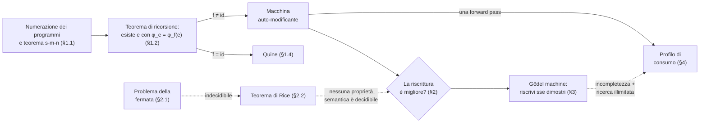
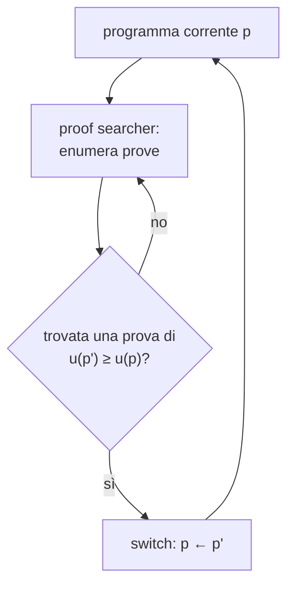
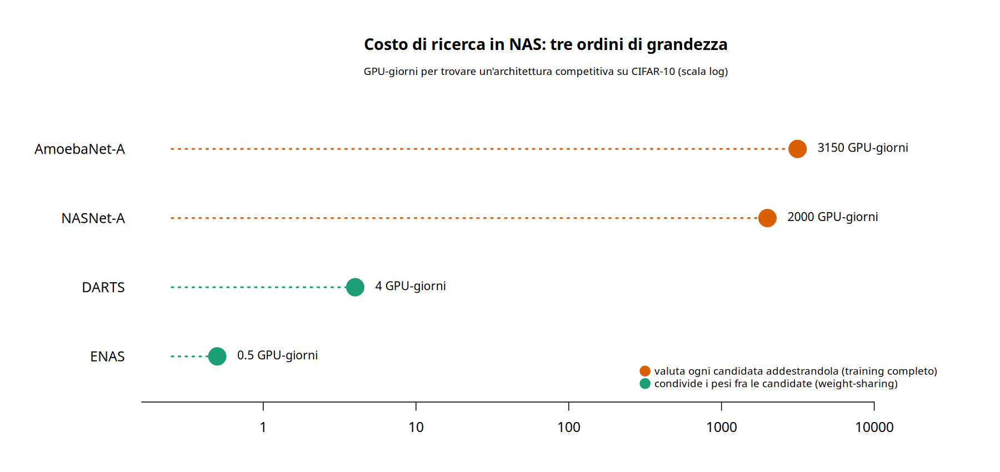

# Auto-riferimento e auto-modifica

«Un programma può riscrivere se stesso?» è una domanda che sembra una sola, ma ne nasconde due con difficoltà agli antipodi. La prima è **espressiva**: esiste un programma capace di produrre una versione modificata del proprio codice? La seconda è **epistemica**: quel programma può *sapere* che la modifica è un miglioramento, o anche solo che ne preserva il comportamento?

Il modello di calcolo resta quello standard — la macchina di Turing di [teoria_complessita §2](teoria_complessita.md#2-il-modello-di-calcolo-macchina-di-turing) — ma l'asse cambia: non più "quante risorse servono per risolvere questo problema" (il tema di quella nota), bensì "cosa è calcolabile in linea di principio", cioè teoria della **computabilità**. Ed è su quell'asse che le due domande finiscono su versanti opposti: la prima ha risposta in un teorema a costo quasi nullo, la seconda sbatte contro un muro di indecidibilità che nessuna quantità di ingegneria aggira. Il resto della nota segue questa faglia fino alla sua controparte pratica — il costo, misurato in GPU-giorni, di lasciare che un sistema modifichi davvero se stesso — e infine a un'applicazione diretta: cosa, di preciso, tutto questo dice (e non dice) sull'idea che un'IA capace di riscriversi porti a una crescita di capacità inarrestabile.


## Cosa ci serve

- **Numerazione dei programmi e teorema s-m-n** — il linguaggio in cui si formula tutto il resto: fissata un'enumerazione $\varphi_0, \varphi_1, \dots$ dei programmi, "costruire un programma con un certo comportamento" diventa "costruire un indice con una certa proprietà" ([§1.1](#11-numerazione-dei-programmi-e-il-teorema-s-m-n)).
- **Teorema di ricorsione di Kleene** — il cuore del lato espressivo: ogni programma può essere scritto per avere accesso al proprio codice sorgente ([§1.2](#12-il-teorema-di-ricorsione)–[§1.3](#13-la-forma-con-accesso-al-codice-sorgente)). Un quine ne è il caso degenere ([§1.4](#14-il-testimone-concreto-un-quine-in-guile)).
- **Problema della fermata e teorema di Rice** — il lato epistemico: nessuna proprietà semantica non banale di un programma (termina? è corretto? migliora una metrica?) è decidibile in generale ([§2](#2-il-lato-epistemico-perché-verificare-è-indecidibile)).
- **Gödel machine** — il ponte formale fra i due lati: un sistema che si riscrive solo quando *dimostra* che conviene, ereditando così sia l'indecidibilità sia l'incompletezza ([§3](#3-il-ponte-formale-la-gödel-machine)).
- **Meta-learning e NAS** — la controparte pratica: dove finisce la teoria comincia il conto in GPU-giorni, con lo stesso baricentro spostato dalla generazione alla validazione ([§4](#4-il-profilo-di-consumo)).




## 1. Il lato espressivo: riscriversi è gratis

### 1.1 Numerazione dei programmi e il teorema s-m-n

Fissiamo una numerazione ammissibile $\varphi_0, \varphi_1, \varphi_2, \dots$ delle funzioni parziali computabili: $\varphi_e$ è la funzione calcolata dal programma di indice (codice) $e$. Scriviamo $\varphi_e(x)\!\downarrow$ se il calcolo su input $x$ termina, $\varphi_e(x)\!\uparrow$ altrimenti, e $\simeq$ per l'uguaglianza fra valori eventualmente indefiniti (entrambi indefiniti, oppure entrambi definiti e uguali).

L'unico ingrediente che serve, oltre alla numerazione, è il **teorema s-m-n**: esiste una funzione **totale** computabile $s$ tale che, per ogni funzione computabile $\psi(x,y)$,

$$
\varphi_{s(x)}(y) \simeq \psi(x,y) \qquad \text{per ogni } x, y
$$

In parole: "incorporare un argomento nel codice di un programma" è di per sé un'operazione computabile sugli indici — non serve eseguire nulla, basta manipolare testo. Non lo dimostriamo (è un fatto standard di teoria della ricorsione, conseguenza diretta di come si codificano i programmi), ma è l'unico mattone su cui poggia tutto il resto.


### 1.2 Il teorema di ricorsione

**Teorema di ricorsione (Kleene, forma a punto fisso).** Per ogni funzione **totale** computabile $f: \mathbb{N} \to \mathbb{N}$ esiste un indice $e$ tale che

$$
\varphi_e = \varphi_{f(e)}
$$

*Dimostrazione.* Definiamo

$$
\psi(x,y) \simeq \varphi_{\varphi_x(x)}(y)
$$

(si esegue $\varphi_x(x)$; se termina con valore $u$, si esegue $\varphi_u(y)$; se $\varphi_x(x)\!\uparrow$, allora $\psi(x, \cdot)$ è ovunque indefinita). $\psi$ è computabile, quindi per il teorema s-m-n esiste $s$ totale computabile con

$$
\varphi_{s(x)}(y) \simeq \psi(x,y) \simeq \varphi_{\varphi_x(x)}(y) \qquad \text{per ogni } x,y
$$

$f \circ s$ è totale computabile (composizione di funzioni totali computabili), quindi ha un indice $m$: $\varphi_m(x) = f(s(x))$ per ogni $x$; essendo totale, $\varphi_m(m)\!\downarrow = f(s(m))$. Poniamo

$$
e := s(m)
$$

Allora, valutando la proprietà di $s$ in $x=m$ (e usando $\varphi_m(m)\!\downarrow$),

$$
\varphi_e = \varphi_{s(m)} = \varphi_{\varphi_m(m)} = \varphi_{f(s(m))} = \varphi_{f(e)}
$$

$\blacksquare$

La dimostrazione ricicla la diagonale $\varphi_x(x)$ che nel [§2.1](#21-il-problema-della-fermata) demolisce la decidibilità: qui la stessa costruzione, invece di produrre una contraddizione, produce un punto fisso — la stessa mossa usata due volte per scopi opposti, un parallelo diretto con il trucco $\varepsilon/2^n$ di [teoria_misura §4](teoria_misura.md#4-misura-esterna-di-lebesgue), riusato lì per la non numerabilità di $\mathbb{R}$ e per la subadditività della misura esterna.


### 1.3 La forma con accesso al codice sorgente

La forma a punto fisso ha una riformulazione più diretta, equivalente e altrettanto standard.

**Corollario (forma con accesso al sorgente).** Per ogni funzione computabile $g(e,x)$ esiste un indice $e$ tale che

$$
\varphi_e(x) \simeq g(e,x) \qquad \text{per ogni } x
$$

*Dimostrazione.* Per il teorema s-m-n applicato a $g$ stessa (vista come $\psi(e,x) := g(e,x)$), esiste $s$ totale computabile con $\varphi_{s(e)}(x) \simeq g(e,x)$ per ogni $e,x$. Applicando il teorema di ricorsione del [§1.2](#12-il-teorema-di-ricorsione) a $f := s$, si ottiene un indice $e$ con $\varphi_e = \varphi_{s(e)}$, dunque $\varphi_e(x) \simeq g(e,x)$ per ogni $x$. $\blacksquare$

Cioè: si può sempre scrivere un programma $e$ che, in esecuzione, dispone del proprio codice $e$ e ne fa qualunque cosa computabile — non un trucco isolato, ma una proprietà strutturale del calcolo.

> **Perché questo è l'auto-modifica.** Si legga $g(e,x)$ come "cosa fare, dato il proprio sorgente $e$ e l'input $x$", e $f$ come "la trasformazione che si vuole applicare al proprio codice".
>
> - $f = \mathrm{id}$: $\varphi_e = \varphi_e$, ed $e$ può limitarsi a restituire il proprio sorgente. È un **quine**.
> - $f \neq \mathrm{id}$: $e$ agisce come se avesse in mano $f(e)$, la propria versione modificata. È una **macchina auto-modificante**.
>
> La distanza fra "stampare sé stessi" e "riscriversi" è tutta in quella $f$. Nessuna delle due costa più dell'altra sul piano dell'esprimibilità: è lo stesso teorema.


### 1.4 Il testimone concreto: un quine in Guile

Il caso $g(e,x) = e$ ("restituisci il tuo sorgente, ignora l'input") è realizzabile esplicitamente, senza passare dall'astrazione degli indici $\varphi_e$. In Guile:

```scheme
((lambda (x) (list x (list 'quote x)))
 '(lambda (x) (list x (list 'quote x))))
```

Valutando l'espressione, `x` è legato al dato `(lambda (x) (list x (list 'quote x)))`, e il corpo `(list x (list 'quote x))` ricostruisce, come **S-espressione**, l'espressione di partenza. L'uguaglianza è a livello di *dato*, non di stringa stampata: il reader espande `'e` in `(quote e)`, quindi `(list 'quote x)` produce esattamente il ramo quotato del sorgente. È la stessa **omoiconicità** — codice e dati con la stessa rappresentazione — introdotta in [fondamenti_guile §2](fondamenti_guile.md#2-la-sintassi-le-s-espressioni) a rendere possibile la costruzione, senza bisogno di un parser separato.

Verifica a runtime, confrontando il risultato di `eval` sull'espressione quotata con l'espressione stessa:

```scheme
(define quine
  '((lambda (x) (list x (list 'quote x)))
    '(lambda (x) (list x (list 'quote x)))))

(equal? (eval quine (interaction-environment)) quine) ; => #t
```

> Se vi è familiare `mate.scm` di [matescm](https://geoteo.net/matescm/): quel progetto realizza, a un livello diverso, lo stesso principio di auto-riferimento. È un interprete a tree-walking per un dialetto minimale di Scheme, scritto in Scheme, la cui funzione `ev` è definita usando esattamente le forme (`if`, `lambda`, applicazione) che essa stessa valuta. Non è un quine — il linguaggio interpretato non ha `quote` né liste, quindi non può ospitare questa identica costruzione — ma è un cugino stretto: linguaggio ospitante e linguaggio ospitato coincidono, ed è quella coincidenza a renderlo un interprete "meta-circolare".

Il quine è il punto fisso del teorema di ricorsione reso tangibile: $f = \mathrm{id}$. Sostituire il corpo con una trasformazione non banale del dato `x` — riscrivere, per dire, il `lambda` interno prima di restituirlo — dà una macchina che emette una variante di sé. Quella è la parte facile. La parte difficile comincia quando si chiede se la variante emessa sia, in un qualsiasi senso, migliore: è l'oggetto del prossimo paragrafo.


## 2. Il lato epistemico: perché verificare è indecidibile

### 2.1 Il problema della fermata

**Teorema (indecidibilità della fermata).** L'insieme $K = \lbrace x : \varphi_x(x)\!\downarrow \rbrace$ non è decidibile.

*Dimostrazione.* Se un programma $d$ decidesse $K$, si potrebbe costruire da $d$ un programma $c$ che, su input $x$, entra in loop se $d$ dice che $\varphi_x(x)\!\downarrow$ e termina subito altrimenti — cioè $\varphi_c(x)\!\downarrow \iff \varphi_x(x)\!\uparrow$. Applicando $c$ a se stesso: $\varphi_c(c)\!\downarrow \iff \varphi_c(c)\!\uparrow$, contraddizione. $\blacksquare$

È lo stesso schema diagonale usato in [teoria_misura §1](teoria_misura.md#1-insiemi-numerabili-e-più-che-numerabili) per dimostrare che $\mathbb{R}$ non è numerabile: si costruisce un oggetto ($c$ qui, $y$ lì) tarato apposta per differire, in almeno un punto, da ogni elemento di un'ipotetica enumerazione o di un'ipotetica decisione.


### 2.2 Il teorema di Rice

Il problema della fermata è solo l'apripista. Una proprietà è **semantica** se dipende solo dalla funzione calcolata, non dal testo del programma: formalmente, un insieme $\mathcal{P}$ di funzioni parziali computabili, con insieme degli indici $I_\mathcal{P} = \lbrace e : \varphi_e \in \mathcal{P} \rbrace$. È **non banale** se $\mathcal{P} \neq \emptyset$ e $\mathcal{P}$ non contiene *tutte* le funzioni parziali computabili.

**Teorema di Rice.** Se $\mathcal{P}$ è semantica e non banale, $I_\mathcal{P}$ è indecidibile.

*Dimostrazione (riduzione dalla fermata).* A meno di scambiare $\mathcal{P}$ col suo complemento, supponiamo che la funzione ovunque indefinita $\uparrow$ non stia in $\mathcal{P}$. Poiché $\mathcal{P} \neq \emptyset$, fissiamo $\varphi_a \in \mathcal{P}$. Data un'istanza $x$ della fermata, per s-m-n ([§1.1](#11-numerazione-dei-programmi-e-il-teorema-s-m-n)) si costruisce un indice $b_x$ tale che, su input $y$, il programma $b_x$ esegue prima $\varphi_x(x)$ e, solo se termina, esegue $\varphi_a(y)$. Allora

$$
\varphi_{b_x} = \begin{cases} \varphi_a \in \mathcal{P} & \text{se } \varphi_x(x)\!\downarrow \\ \uparrow \ \notin \mathcal{P} & \text{se } \varphi_x(x)\!\uparrow \end{cases}
$$

Decidere $b_x \in I_\mathcal{P}$ significherebbe decidere se $\varphi_x(x)\!\downarrow$: ma questo è esattamente il problema della fermata, indecidibile per il [§2.1](#21-il-problema-della-fermata). $\blacksquare$

> È, testualmente, una **riduzione** many-one dal problema della fermata a $I_\mathcal{P}$, nello stesso senso di [teoria_riduzioni §2](teoria_riduzioni.md#2-riduzione-many-one-riduzione-di-karp) — con una differenza di famiglia: qui $x \mapsto b_x$ deve solo essere **calcolabile**, non calcolabile in tempo polinomiale. È il lusso che si può permettere la teoria della computabilità e non quella della complessità (dove le stesse catene di riduzioni, si veda il progetto [karp](https://geoteo.net/karp/), devono restare entro un budget polinomiale): non "quanto costa trasformare l'istanza", ma "si può trasformare, punto".


### 2.3 Le proprietà indecidibili di una riscrittura

Le proprietà che si vorrebbero verificare su un candidato riscritto $p'$ sono tutte semantiche e non banali:

- *"$p'$ termina su ogni input"* (totalità);
- *"$p'$ calcola la stessa funzione di $p$"* (preservazione del comportamento);
- *"$p'$ soddisfa la specifica $S$"* (correttezza);
- *"$p'$ migliora la metrica-obiettivo rispetto a $p$"* (miglioramento, non appena la metrica dipende dalla funzione calcolata e non dal solo testo del programma).

Per il teorema di Rice, **nessuna** di queste è decidibile in generale. Il corollario del [§1.3](#13-la-forma-con-accesso-al-codice-sorgente) garantisce l'accesso al proprio codice; non garantisce onniscienza sul risultato di modificarlo.

> **L'asimmetria in una frase.** Generare $p'$ è totale e a buon mercato: un'applicazione di $f$ ([§1.3](#13-la-forma-con-accesso-al-codice-sorgente)). Certificare una qualunque proprietà semantica di $p'$ è, nel caso generale, indecidibile ([§2.2](#22-il-teorema-di-rice)). L'auto-modifica *senza garanzie* è banale; con garanzie sbatte contro un limite di principio, non di ingegneria.


## 3. Il ponte formale: la Gödel machine

La costruzione di Schmidhuber (2007) prende sul serio la clausola "con garanzie" e la incorpora come condizione di riscrittura. Una **Gödel machine** è un sistema dotato di un dimostratore che enumera sistematicamente le prove nel proprio sistema formale; riscrive una parte qualsiasi del proprio codice — dimostratore incluso — non appena trova una prova che la modifica conviene.

Detta $u$ l'utilità attesa cumulata sul tempo di vita residuo, e $\vdash$ la derivabilità nel sistema formale della macchina, la regola di riscrittura è

$$
\text{passa a } p' \quad\Longleftrightarrow\quad \vdash\ \big(u(p') \ge u(p)\big)
$$

con la garanzia (che non dimostriamo, si veda Schmidhuber 2007) che la *prima* auto-riscrittura effettuata è, rispetto agli assiomi correnti della macchina, ottimale a livello globale.



Spostando il problema da "può farlo?" ([§1](#1-il-lato-espressivo-riscriversi-è-gratis)) a "può provarlo?" ([§2](#2-il-lato-epistemico-perché-verificare-è-indecidibile)), la macchina eredita due limiti classici dell'auto-riferimento formale:

- **Costo di ricerca illimitato.** L'indecidibilità del [§2](#2-il-lato-epistemico-perché-verificare-è-indecidibile) non svanisce: si ripresenta come tempo di attesa senza limite superiore decidibile prima che una prova (se esiste) compaia.
- **Incompletezza.** Per il primo teorema di incompletezza di Gödel possono esistere riscritture $p'$ con $u(p') \ge u(p)$ *vera* ma non dimostrabile nel sistema formale della macchina — che quindi non le adotterà mai: la stessa prudenza che garantisce l'ottimalità nega anche dei miglioramenti reali.

> La Gödel machine è il punto in cui i due lati della nota si toccano: usa senza sforzo l'auto-riferimento del [§1](#1-il-lato-espressivo-riscriversi-è-gratis) (accede al proprio codice, dimostratore compreso) e paga per intero il prezzo dell'indecidibilità del [§2](#2-il-lato-epistemico-perché-verificare-è-indecidibile) (la prova può non arrivare mai).


## 4. Il profilo di consumo

### 4.1 Tre livelli, due costi

Il costo di un ciclo di auto-modifica rispecchia l'asimmetria dei paragrafi precedenti: generare è la parte economica, validare quella cara. Cambia solo *quanto* cara, a seconda di dove agisce la riscrittura.

| Livello | Cosa cambia | Costo di generare | Costo di validare |
|---|---|---|---|
| **Codice** (agente che rigenera il proprio sorgente) | testo del programma, pesi congelati | una forward pass | esecuzione / test del codice prodotto |
| **Pesi** (meta-learning) | i parametri, via aggiornamento gradiente | un passo di training | un ciclo di meta-training, con gradienti del second'ordine |
| **Architettura** (NAS) | la struttura del modello | campionare una candidata | addestrare la candidata (o una sua approssimazione) |

Il ciclo, a ogni livello, ha la stessa forma — e la stessa asimmetria di costo fra le due righe della tabella:

```go
func autoModifica(p Programma, propone func(Programma) Programma, migliore func(Programma, Programma) bool) Programma {
	for {
		candidato := propone(p)      // generare: una passata sul modello, economico
		if !migliore(candidato, p) { // validare: esecuzione/training/benchmark, costoso
			return p
		}
		p = candidato
	}
}
```

> Nella Gödel machine del [§3](#3-il-ponte-formale-la-gödel-machine), `migliore` diventa `⊢ (u(p') ≥ u(p))`: la validazione non è più un training a costo alto ma finito, è una ricerca di prove **senza limite superiore decidibile**. È il caso estremo dello stesso fenomeno.


### 4.2 Il livello dei pesi: il meta-gradiente

Imparare *come* aggiornarsi, invece di limitarsi ad aggiornarsi, significa in genere differenziare attraverso il processo di ottimizzazione stesso. Nel MAML (Finn, Abbeel, Levine, 2017) l'aggiornamento meta è

$$
\theta \leftarrow \theta - \beta\, \nabla_\theta \sum_{i} \mathcal{L}_{\mathcal{T}_i}\Big(\theta - \alpha \nabla_\theta \mathcal{L}_{\mathcal{T}_i}(\theta)\Big)
$$

Il gradiente esterno $\nabla_\theta$ agisce su un'espressione che contiene già un gradiente interno: derivando $\theta - \alpha \nabla_\theta \mathcal{L}$ compaiono termini del second'ordine (prodotti Hessiano-vettore, $\nabla^2_\theta \mathcal{L}$). Le varianti *first-order* (FOMAML) esistono in gran parte per **evitare** quel termine, al prezzo di un'approssimazione — la stessa scelta, meno garanzie in cambio di meno costo, che ricorre a ogni livello di questa nota.


### 4.3 Il livello architettura: il crollo dei costi in NAS

La ricerca di architetture (*neural architecture search*, NAS) è il caso in cui l'asimmetria genera-valida si vede più chiaramente, perché nel tempo si è **ristretta** di tre ordini di grandezza. La NAS basata su reinforcement learning proposta da Zoph e Le (2017) valuta ogni candidata addestrandola da zero: la ricerca completa richiede centinaia di GPU per settimane. Le tecniche a **weight-sharing** (ENAS) e le rilassazioni **differenziabili** su un'unica supernet (DARTS, Liu, Simonyan, Yang 2019) esistono precisamente per evitare di pagare un addestramento completo per ogni candidata proposta.



I quattro punti riprendono la tabella comparativa di Liu et al. (2019): NASNet-A (ricerca RL) e AmoebaNet-A (ricerca evolutiva) restano nell'ordine delle migliaia di GPU-giorni — un costo dominato quasi per intero dal *validare* ogni candidata con un addestramento vero; ENAS e DARTS, condividendo i pesi fra le candidate durante la ricerca, riportano lo stesso problema a poche unità di GPU-giorno. La generazione di una candidata non è mai stata il collo di bottiglia: è sempre stata la validazione a dominare il conto, ed è sulla validazione che le tecniche moderne hanno agito.


## 5. Applicazione: i limiti del self-improvement ricorsivo

Una tesi ricorrente nel dibattito sull'intelligenza artificiale — che risale a I. J. Good (1965) e alla sua *intelligence explosion hypothesis* — sostiene che un sistema capace di migliorare se stesso innescherebbe un ciclo che si autoalimenta: ogni versione più capace produce la successiva più in fretta, fino a una crescita di capacità così rapida da rendere la sostituzione del lavoro umano improvvisa e incontrollabile, con conseguenze socio-economiche catastrofiche. Gli strumenti di questa nota permettono di essere precisi su cosa, di questa tesi, regge e cosa no.

**Quello che il [§2](#2-il-lato-epistemico-perché-verificare-è-indecidibile)–[§3](#3-il-ponte-formale-la-gödel-machine) autorizzano davvero a dire.** Nella sua forma più forte — un sistema che si migliora in modo *dimostrabilmente* corretto e benefico a ogni passo, la lettura naturale in termini di Gödel machine — la tesi urta contro un limite di principio, non contingente: nessuna procedura generale può certificare che una riscrittura arbitraria migliori un programma (teorema di Rice), e vincolare l'auto-modifica a passare solo per dimostrazioni formali eredita sia un costo di ricerca senza limite superiore decidibile sia l'incompletezza. Un ciclo di auto-miglioramento *certificato* e inarrestabile non è solo difficile da costruire: per questa formulazione della garanzia, è impossibile in generale.

**Quello che non autorizzano a dire.** L'indecidibilità di Rice riguarda il caso arbitrario, nel senso peggiore. Non impedisce affatto quello che i sistemi reali fanno: non *dimostrano* che un candidato sia migliore, lo *misurano* su un benchmark — una procedura perfettamente decidibile, solo costosa. Il [§4](#4-il-profilo-di-consumo) lo mostra esplicitamente: il collo di bottiglia storico non è mai stata l'impossibilità di verificare, ma il suo costo, ed è un costo che si è ristretto di tre ordini di grandezza nel giro di pochi anni (NASNet-A $\to$ DARTS). Questo è un fatto a doppio taglio: si può leggere come segnale che l'accelerazione è già misurabile, oppure come promemoria che quei tre ordini di grandezza sono costati anni di lavoro umano specializzato, non un loop spontaneo — la nota, da sola, non permette di scegliere fra le due letture.

> Il salto più grande, comunque, è categoriale. Tutto quello che precede vive nella computabilità e nel costo computazionale. "Sostituzione della forza lavoro" e "conseguenze catastrofiche socio-economiche" sono affermazioni di economia del lavoro — dipendono da velocità di adozione, allocazione del capitale, elasticità della domanda, frizioni di riallocazione, regolazione. Nessun teorema di questa nota le implica né le smentisce: servirebbe un ponte economico che il [§1](#1-il-lato-espressivo-riscriversi-è-gratis)–[§4](#4-il-profilo-di-consumo) non forniscono, e non hanno la giurisdizione per fornire.

Il bersaglio legittimo, quindi, è stretto: la retorica del *self-improvement garantito e inarrestabile*, non la domanda socio-economica nel suo complesso. Confondere le due cose userebbe un teorema per rispondere a una domanda che il teorema non pone.


## 6. In sintesi

Il *self-improvement* ricorsivo senza degradazione — riscritture in cascata che restano provabilmente migliori a ogni passo — non è un fatto acquisito ma un problema in gran parte aperto, e questa nota ne ha chiarito la natura: non un problema di **espressività** (il teorema di ricorsione la regala, gratis, per ogni trasformazione computabile del proprio codice, [§1](#1-il-lato-espressivo-riscriversi-è-gratis)), ma di **verifica** (Rice la vieta in generale, Gödel la vieta anche dove sarebbe vera, [§2](#2-il-lato-epistemico-perché-verificare-è-indecidibile)–[§3](#3-il-ponte-formale-la-gödel-machine)). Il profilo di consumo del [§4](#4-il-profilo-di-consumo) è la stessa storia in GPU-giorni: generare non è mai stato il collo di bottiglia, validare sì. Riscriversi è facile — è un teorema, dimostrato per esteso nel [§1.2](#12-il-teorema-di-ricorsione). Sapere di essersi migliorati è la parte difficile, ed è difficile per teorema, non per mancanza di ingegneria migliore. È lo stesso principio che permette di essere precisi, invece che retorici, quando si discute se questo porti a una crescita di capacità incontrollabile ([§5](#5-applicazione-i-limiti-del-self-improvement-ricorsivo)).


## Riferimenti bibliografici

- I. J. Good, «Speculations Concerning the First Ultraintelligent Machine», *Advances in Computers*, 6 (1965), 31–88 — l'*intelligence explosion hypothesis* discussa nel [§5](#5-applicazione-i-limiti-del-self-improvement-ricorsivo).
- H. Rogers Jr., *Theory of Recursive Functions and Effective Computability*, MIT Press, 1987 — teorema s-m-n e teorema di ricorsione nella forma usata nel [§1](#1-il-lato-espressivo-riscriversi-è-gratis).
- M. Sipser, *Introduction to the Theory of Computation*, 3ª ed., Cengage, 2013 — problema della fermata e teorema di Rice, con l'impostazione a riduzioni ripresa nel [§2](#2-il-lato-epistemico-perché-verificare-è-indecidibile).
- H. G. Rice, «Classes of recursively enumerable sets and their decision problems», *Transactions of the AMS*, 74 (1953), 358–366.
- J. Schmidhuber, «Gödel Machines: Fully Self-Referential Optimal Universal Self-Improvers», in *Artificial General Intelligence*, Springer, 2007 — costruzione, condizione di auto-riscrittura, ottimalità e limiti del [§3](#3-il-ponte-formale-la-gödel-machine).
- C. Finn, P. Abbeel, S. Levine, «Model-Agnostic Meta-Learning for Fast Adaptation of Deep Networks», *ICML*, 2017 — MAML e il meta-gradiente del [§4.2](#42-il-livello-dei-pesi-il-meta-gradiente).
- B. Zoph, Q. V. Le, «Neural Architecture Search with Reinforcement Learning», *ICLR*, 2017 — la NAS basata su RL del [§4.3](#43-il-livello-architettura-il-crollo-dei-costi-in-nas).
- H. Liu, K. Simonyan, Y. Yang, «DARTS: Differentiable Architecture Search», *ICLR*, 2019 — la rilassazione differenziabile e la tabella comparativa di costi (NASNet-A, AmoebaNet-A, ENAS, DARTS) usata per il grafico del [§4.3](#43-il-livello-architettura-il-crollo-dei-costi-in-nas).
