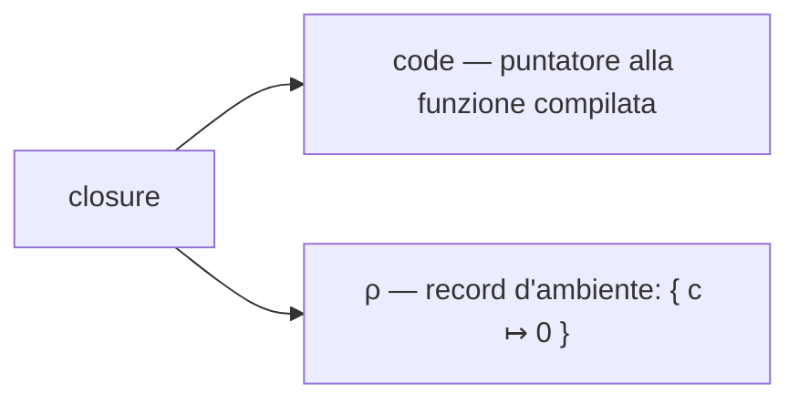

# Chiusure (closure)

Una **chiusura** (*closure*) è uno dei concetti che attraversano l'intera storia dei linguaggi di programmazione: nasce con Scheme negli anni '70, è il cuore semantico di ogni linguaggio funzionale e, sotto mentite spoglie, è anche il meccanismo con cui il mainstream imperativo (Go, Java, JavaScript...) implementa callback, generatori e incapsulamento. Vederla in linguaggi diversi non è un esercizio di collezionismo: ogni linguaggio la tratta in modo differente e, così facendo, rivela una sfaccettatura diversa dello stesso meccanismo.

Questa nota copre prima la teoria — cos'è una chiusura, perché costa qualcosa da implementare, come si rappresenta a runtime — e poi la stessa idea guida (un contatore che incapsula uno stato privato) ripetuta in sette linguaggi: **Scheme** (Guile), **OCaml**, **Haskell**, **R**, **Go**, **C** e **Java**. L'asse che li tiene insieme, e che vale la pena tenere a mente dall'inizio, è: *come si fa a mutare la variabile catturata*. È lungo quell'asse che i sette divergono in modo istruttivo.


## 1. Definizione

Una chiusura è una **funzione** insieme all'**ambiente lessicale** in cui è stata definita. Non è (solo) il codice della funzione: è la coppia codice + i legami (*binding*) alle variabili libere che quel codice usa.

Il punto da fissare subito, perché tutto il resto ne dipende, è *quando* quell'ambiente viene fissato: al momento della **definizione** della funzione, non al momento della sua **chiamata**. Questa è la differenza tra **scope lessicale** (o *statico*) e **scope dinamico**, ripresa nel [§3](#3-scope-lessicale-vs-scope-dinamico).

```scheme
(define x 10)

(define (f) x)          ; f cattura x dal punto in cui è DEFINITA

(define (g)
  (let ((x 20))
    (f)))                ; g chiama f, ma x qui vale 20...

(g)                      ; => 10, non 20: f vede l'ambiente in cui è nata
```

`f` restituisce `10`, non `20`: l'`x` che `f` vede è quello visibile nel punto in cui `f` è stata scritta (il *top level*, dove `x` vale `10`), non quello visibile nel punto in cui viene chiamata (dentro `g`, dove `x` vale `20`). Questo comportamento — apparentemente ovvio per chi è abituato a Scheme, Python o Go — è precisamente ciò che rende una funzione una *chiusura*.


## 2. Variabili libere

Una variabile che compare nel corpo di una funzione è **libera** se non è né un parametro né una variabile locale di quella funzione. La chiusura "chiude sopra" (*closes over*) esattamente le sue variabili libere — da qui il nome.

Nel calcolo lambda, dove una funzione anonima si scrive $\lambda x.\, e$, l'insieme delle variabili libere $\mathrm{FV}(e)$ di un'espressione si definisce per induzione sulla struttura del termine:

$$
\mathrm{FV}(x) = \{x\} \qquad\qquad \mathrm{FV}(\lambda x.\, e) = \mathrm{FV}(e) \setminus \{x\} \qquad\qquad \mathrm{FV}(e_1\ e_2) = \mathrm{FV}(e_1) \cup \mathrm{FV}(e_2)
$$

Cioè: una variabile è libera in $\lambda x.\, e$ se è libera in $e$ e diversa da $x$ (il parametro la *lega*, la rimuove dall'insieme). Nell'esempio del [§1](#1-definizione), $\mathrm{FV}(\lambda ().\, x) = \{x\}$: `x` è l'unica variabile libera del corpo di `f`, ed è esattamente ciò che la chiusura deve catturare per poter essere valutata correttamente altrove.


## 3. Scope lessicale vs scope dinamico

Lo **scope lessicale** risolve una variabile libera guardando *dove il codice è scritto* (la struttura testuale/sintattica del programma). Lo **scope dinamico** la risolve guardando *da dove il codice è chiamato* (lo stato della catena di chiamate a runtime). Quasi tutti i linguaggi moderni sono lessicali; è la premessa senza la quale il concetto di chiusura non avrebbe nemmeno senso — con scope dinamico, "l'ambiente al momento della definizione" non è nemmeno una nozione ben definita, perché l'ambiente rilevante è sempre quello della chiamata corrente.

Il controesempio storico è Emacs Lisp, che per decenni ha usato scope dinamico di default (dal 2011, con il *lexical binding*, supporta anche quello lessicale). Con scope dinamico, l'esempio del [§1](#1-definizione) darebbe `20`, non `10`: `f`, chiamata da dentro `g`, vedrebbe l'`x` locale di `g` perché a runtime quello è il binding di `x` più recente sullo stack delle chiamate, indipendentemente da dove `f` è stata scritta.


## 4. Extent vs scope — l'upward funarg problem

*Scope* è **dove** un binding è visibile nel testo del programma; *extent* è **per quanto tempo** quel binding esiste a runtime. Per una variabile locale ordinaria i due coincidono più o meno con la vita dello stack frame che la contiene: la variabile nasce quando la funzione viene chiamata e muore quando ritorna.

Le chiusure rompono questa coincidenza. Se una funzione crea una chiusura e la **restituisce al chiamante** (la fa risalire, da cui il nome storico *upward funarg problem*, formulato negli anni '70 nel progetto Scheme di Sussman e Steele), la chiusura può sopravvivere al frame che l'ha creata:

```scheme
(define (crea-contatore)
  (let ((c 0))
    (lambda () (set! c (+ c 1)) c)))   ; questa lambda "risale" fuori da crea-contatore

(define conta (crea-contatore))
;; il frame di (crea-contatore) è concettualmente "tornato", ma c è ancora viva
(conta)  ; => 1
(conta)  ; => 2
```

Quando `crea-contatore` ritorna, il suo frame non serve più *per lei* — ma `c` deve continuare a esistere perché la chiusura restituita la usa ancora. L'*extent* di `c` deve quindi eccedere l'*extent* del frame che l'ha creata. Questo è **il** motivo per cui le chiusure hanno un costo implementativo reale: un semplice stack a disciplina LIFO non basta più, perché non tutto ciò che uno stack frame contiene muore quando il frame viene disfatto. Serve l'**heap** (o un meccanismo equivalente, come l'*escape analysis* che promuove selettivamente variabili dallo stack all'heap) per ospitare i binding che potrebbero sopravvivere alla funzione che li ha creati. È anche la ragione profonda per cui **C**, che non gestisce memoria automaticamente, non offre le chiusure come costrutto nativo (vedi [§13](#13-c--lassenza-che-rivela-limplementazione)).


## 5. Rappresentazione a runtime

Concretamente, una chiusura è quasi sempre implementata come una coppia:

$$
\text{closure} = \langle\, \text{code},\ \rho \,\rangle
$$

dove `code` è un puntatore al codice compilato della funzione e $\rho$ (*rho*, notazione classica per un ambiente) è un **record d'ambiente**: una struttura dati che associa ogni variabile libera al proprio valore (o, più spesso, a una *cella* che lo contiene — vedi [§6](#6-binding-vs-cella)).



La trasformazione che rende esplicita questa coppia si chiama **closure conversion** (o *lambda lifting* nella sua forma più aggressiva, che elimina del tutto le funzioni annidate riscrivendole come funzioni top-level con un parametro d'ambiente esplicito in più). È un passo standard nella compilazione dei linguaggi funzionali, ed è precisamente ciò che si fa **a mano** quando si emula una chiusura in un linguaggio che non la offre nativamente: si veda la sezione su [C](#13-c--lassenza-che-rivela-limplementazione), dove la struct `contesto` e il puntatore a funzione *sono* `code` e $\rho$ resi espliciti, e quella su [Java pre-8](#14-java--reificazione-dellambiente-in-un-oggetto), dove $\rho$ diventa i campi di un oggetto.


## 6. Binding vs cella

Catturare una variabile libera vuol dire catturare il suo **binding** — ma un binding può essere trattato in due modi diversi quando si tratta di mutarlo:

- **Cattura per valore/binding mutabile diretto**: la chiusura ha accesso diretto al *binding* stesso, e può riassegnarlo (es. `set!` in Scheme, `c++` in Go).
- **Binding immutabile + cella mutabile**: il linguaggio non permette di riassegnare il binding in sé, ma il binding può puntare a un contenitore (una *cella*, un riferimento) il cui **contenuto** è mutabile. Si muta la cella, non il binding.

Questa distinzione — apparentemente un dettaglio — è in realtà l'asse guida di gran parte di questa nota: OCaml, Haskell e Java la rendono esplicita (con `ref`, `IORef` e, rispettivamente, un contenitore come `int[]`), mentre Scheme, R e Go permettono la mutazione diretta del binding. È anche legata alla **durata del binding**: se un costrutto come il `for` crea un binding nuovo per ogni iterazione o riusa lo stesso per tutte è esattamente il problema del *loop-variable capture* discusso nel [box a fine §12](#box--lo-stesso-bug-due-soluzioni-go-vs-javascript).


## 7. Stato mutabile incapsulato

Mettendo insieme i punti precedenti: una chiusura che cattura una cella mutabile è, a tutti gli effetti, un **oggetto con un solo metodo e uno stato privato**. È l'osservazione che rende le chiusure utili in pratica oltre che interessanti in teoria — e che le collega direttamente all'incapsulamento della programmazione a oggetti: una chiusura è "l'oggetto del povero", e un oggetto con un solo metodo pubblico è "la chiusura del ricco". Lo si vedrà tornare nella [tabella finale](#16-tabella-comparativa) e nella [conclusione](#17-in-sintesi).

L'esempio guida che segue in ogni linguaggio è il più semplice possibile per questo pattern: una funzione `crea_contatore` che restituisce una funzione senza argomenti, la quale ogni volta che viene chiamata incrementa e restituisce un contatore privato — invisibile e inaccessibile da fuori la chiusura stessa.


## 8. Scheme (Guile) — l'origine, binding mutabile nudo

Le chiusure lessicali nascono qui: sono la primitiva su cui Scheme è costruito, non un'aggiunta successiva (vedi [fondamenti_guile.md §4](fondamenti_guile.md#4-definizioni-e-funzioni) per `define` e `lambda`). Il binding è mutabile direttamente con `set!`, senza bisogno di alcuna indirezione:

```scheme
(define (crea-contatore)
  (let ((c 0))
    (lambda ()
      (set! c (+ c 1))
      c)))

(define conta (crea-contatore))
(conta)   ; => 1
(conta)   ; => 2
(conta)   ; => 3
```

`let` introduce `c` con scope lessicale ristretto al proprio corpo; la `lambda` che segue cattura quel binding e lo muta direttamente con `set!`. Ogni chiamata a `crea-contatore` crea un `let` (e quindi un `c`) nuovo, quindi due contatori distinti non interferiscono tra loro — la proprietà di incapsulamento del [§7](#7-stato-mutabile-incapsulato) qui si vede a nudo.


## 9. OCaml — binding immutabile, cella mutabile

In OCaml il binding creato con `let` è **immutabile** per default: non esiste un equivalente diretto di `set!`. Per avere una cella mutabile bisogna renderla esplicita con `ref`, che alloca una piccola struttura sull'heap contenente un campo mutabile:

```ocaml
let crea_contatore () =
    let c = ref 0 in
    fun () -> incr c; !c

let conta = crea_contatore ()
conta ()   (* => 1 *)
conta ()   (* => 2 *)
```

Qui `c` (il *binding*) non cambia mai — punta sempre alla stessa cella `ref`. Quello che cambia è il **contenuto** della cella, mutato da `incr` e letto con `!`. È la prima comparsa dello schema *binding immutabile + cella mutabile* introdotto nel [§6](#6-binding-vs-cella): lo si ritroverà, con sfumature diverse, in Haskell ([§10](#10-haskell--closure-come-thunk-cattura-senza-mutazione)) e in Java ([§14](#14-java--reificazione-dellambiente-in-un-oggetto)).


## 10. Haskell — closure come thunk, cattura senza mutazione

Haskell porta la distinzione del [§9](#9-ocaml--binding-immutabile-cella-mutabile) al limite: essendo **puro**, un binding non è mai mutabile, punto — e nemmeno tramite una cella, perché mutare una cella è un *effetto*. La versione "diretta" del contatore, con una variabile che cresce a ogni chiamata, semplicemente non si può scrivere. Per avere stato mutabile serve `IORef`, che rende esplicito nel tipo che la mutazione è confinata alla monade `IO`:

```haskell
import Data.IORef

creaContatore :: IO (IO Int)
creaContatore = do
    c <- newIORef 0
    return (modifyIORef' c (+1) >> readIORef c)

main :: IO ()
main = do
    conta <- creaContatore
    conta >>= print   -- 1
    conta >>= print   -- 2
```

> **Nota:** `modifyIORef'` (con l'apostrofo) è la versione *strict*; la versione pigra `modifyIORef` accumulerebbe una catena di thunk non valutati a ogni chiamata, un piccolo promemoria di quanto segue.

Il contributo concettuale più profondo di Haskell, però, non è `IORef`: è che in un linguaggio pigro **la chiusura è il meccanismo di valutazione stesso**. Un'espressione non ancora valutata è rappresentata internamente come un **thunk** — precisamente una coppia `(codice da eseguire, ambiente catturato)`, cioè una chiusura, sospesa fino a quando il suo valore viene richiesto. Allo stesso modo, il *currying* rende ogni applicazione parziale una chiusura: `(+) 3` non è "l'operatore più con un buco", è letteralmente una funzione che ha catturato `3` nel proprio ambiente e aspetta il secondo argomento. In Haskell la chiusura non è (solo) un costrutto per il programmatore: è il mattone su cui è costruita l'intera semantica del linguaggio.


## 11. R — closure pervasiva, lazy eval, `<<-`

In R quasi **ogni** funzione è, tecnicamente, una closure: ogni funzione porta con sé l'ambiente (*environment*) in cui è stata definita, ed è proprio lo scope lessicale — introdotto in R rispetto al vecchio S, che usava scope dinamico — a renderlo possibile (vedi [fondamenti_r.md §3](fondamenti_r.md#3-controllo-di-flusso-e-funzioni) per la sintassi di base delle funzioni). Il binding *è* mutabile, ma non con `<-` (che nell'ambiente della funzione interna creerebbe una nuova variabile locale, ombreggiando quella esterna): serve il **super-assignment** `<<-`, che risale la catena degli ambienti fino a trovare (o creare, al top level) il binding da modificare.

```r
crea_contatore <- function() {
    count <- 0
    function() {
        count <<- count + 1
        count
    }
}

conta <- crea_contatore()
conta()   # => 1
conta()   # => 2
```

> **Nota:** il nome della variabile è `count`, non `c` — in R `c()` è la funzione di concatenazione (quella che costruisce vettori, es. `c(1, 2, 3)`), e chiamare una variabile locale `c` la ombreggerebbe silenziosamente in tutto il corpo della funzione.

Vale la pena una riga sulla **lazy evaluation**: gli argomenti di una funzione R non sono valori, ma **promise** — espressioni non valutate insieme all'ambiente in cui vanno valutate, cioè un'altra forma di chiusura, distinta da quella di `count <<- ...` sopra. Una promise viene forzata solo alla prima lettura dell'argomento, il che ha conseguenze pratiche dirette: un ciclo che costruisce funzioni catturando la variabile di iterazione può comportarsi in modo controintuitivo se quella variabile cambia prima che la promise venga forzata — un parente stretto del *loop-variable capture* discusso nel [box a fine §12](#box--lo-stesso-bug-due-soluzioni-go-vs-javascript).


## 12. Go — loop-capture e semantica che cambia nel tempo

Go è mainstream, imperativo, con garbage collector — la combinazione che rende le chiusure "gratuite" da usare senza dover pensare all'*extent* del [§4](#4-extent-vs-scope--lupward-funarg-problem): il compilatore, tramite *escape analysis*, decide da solo se una variabile catturata va promossa sullo heap. Il binding è mutabile direttamente, come in Scheme (vedi anche [fondamenti_go.md §5](fondamenti_go.md#5-funzioni)):

```go
func contatore() func() int {
	c := 0
	return func() int {
		c++
		return c
	}
}

conta := contatore()
conta() // => 1
conta() // => 2
```

Il caso didatticamente più interessante di Go, però, riguarda la **cattura in un ciclo**. Fino a Go 1.21, tutte le chiusure create in un singolo `for` catturavano **la stessa variabile** — non una copia per iterazione:

```go
// Go ≤ 1.21: bug classico
funcs := make([]func() int, 3)
for i := 0; i < 3; i++ {
	funcs[i] = func() int { return i }
}
// tutte le funzioni in funcs restituiscono 3: condividono la stessa i,
// che al termine del ciclo vale 3
```

Go 1.22 (2024) ha cambiato la **semantica del `for`**: ogni iterazione ora crea una nuova variabile `i`, quindi lo stesso codice restituisce `0, 1, 2`. È un caso raro e istruttivo di un linguaggio che cambia una regola di scoping fondamentale in una versione recente — e il motivo (evitare esattamente questa classe di bug) è documentato nelle release notes ufficiali di Go 1.22.


### Box — lo stesso bug, due soluzioni (Go vs JavaScript)

Lo stesso problema di *loop-variable capture* si presenta in JavaScript, con una storia parallela ma una soluzione diversa nella leva usata:

```javascript
// var: function-scoped — tutte le callback catturano la stessa variabile
for (var i = 0; i < 3; i++) setTimeout(() => console.log(i));   // 3, 3, 3

// let: block-scoped — una variabile per iterazione
for (let i = 0; i < 3; i++) setTimeout(() => console.log(i));   // 0, 1, 2
```

Il confronto è istruttivo perché le due correzioni attaccano il problema da lati opposti:

| | Cosa cambia | Leva |
|---|---|---|
| **Go 1.22** | La semantica del costrutto `for` | Ogni iterazione crea una nuova variabile |
| **JavaScript (`let`)** | Lo scope della dichiarazione | Da *function-scoped* (`var`) a *block-scoped* (`let`) |

Entrambi risolvono il bug rendendo il **binding** della variabile di iterazione locale a ogni singola iterazione invece che condiviso da tutto il ciclo — cioè agendo esattamente sulla nozione di *durata del binding* introdotta nel [§6](#6-binding-vs-cella). È lo stesso concetto teorico, reso concreto da due scelte di design indipendenti che convergono sulla stessa soluzione.


## 13. C — l'assenza che rivela l'implementazione

C non ha chiusure. Un puntatore a funzione è **solo** un indirizzo di codice: non porta con sé alcun ambiente, quindi non può catturare nulla. Per ottenere lo stesso comportamento bisogna smontare a mano la coppia $\langle \text{code}, \rho \rangle$ del [§5](#5-rappresentazione-a-runtime): il puntatore a funzione da un lato, e un contesto passato esplicitamente come parametro dall'altro.

```c
#include <stdlib.h>

typedef struct {
    int c;
} contesto;

contesto *crea_contatore(void) {
    contesto *ctx = malloc(sizeof *ctx);
    ctx->c = 0;
    return ctx;
}

int conta(contesto *ctx) {
    return ++ctx->c;
}

int main(void) {
    contesto *ctx = crea_contatore();
    conta(ctx);   /* => 1 */
    conta(ctx);   /* => 2 */
    free(ctx);
    return 0;
}
```

La "chiusura" qui è la coppia `(conta, ctx)`, passata a mano ovunque serva invocarla — esattamente la struct `contesto` che gioca il ruolo del record d'ambiente $\rho$, e la funzione `conta` che gioca il ruolo di `code`. Nessuna magia: solo ciò che la [closure conversion](#5-rappresentazione-a-runtime) fa automaticamente in un linguaggio con chiusure native, reso qui esplicito e a carico del programmatore — incluso il costo, altrettanto esplicito, di allocare `ctx` sullo heap con `malloc` e liberarlo con `free`, invece che lasciarlo implicito al garbage collector.

> **Nota:** GCC offre le *nested functions* (estensione non standard, implementate con un *trampoline* eseguibile a runtime) e Clang i *Blocks* di Apple, entrambi più vicini a vere chiusure — ma sono estensioni non portabili, e il valore didattico di C sta proprio nel farlo a mano con una struct, non nell'usare l'estensione che lo nasconde di nuovo.


## 14. Java — reificazione dell'ambiente in un oggetto

Il valore didattico di Java non sta nella lambda di Java 8, ma in **come ci si è arrivati**: l'*anonymous inner class* pre-8, che costringe a rendere visibile un meccanismo che le vere chiusure nascondono.

```java
interface Supplier<T> { T get(); }

Supplier<Integer> creaCostante(final int inizio) {
    return new Supplier<Integer>() {
        public Integer get() { return inizio; }   // "inizio" finisce in un campo generato
    };
}
```

Il compilatore genera qui una vera e propria classe (tipicamente chiamata `Outer$1`) con un **campo** per ogni variabile catturata e un costruttore che li riceve e li copia al momento della creazione dell'oggetto. L'ambiente lessicale, invece di restare implicito, viene **reificato in un oggetto** — visibile e ispezionabile nel bytecode. È lo stesso `(code, environment)` del [§5](#5-rappresentazione-a-runtime) smontato a mano come in [C](#13-c--lassenza-che-rivela-limplementazione), ma con l'ambiente che diventa i campi di un oggetto invece dei campi di una struct: due modi paralleli di reificare la stessa coppia.

Da qui discende il perché del vincolo, storicamente noto come regola del **`final`**: le variabili catturate da un'inner class devono essere `final` (o, da Java 8, *effectively final* — mai riassegnate dopo l'inizializzazione, anche senza scriverlo esplicitamente). Il vincolo non è arbitrario: è la conseguenza diretta della cattura **per copia**. Se il linguaggio permettesse di mutare la variabile locale originale dopo che l'oggetto l'ha già copiata nel proprio campo, si avrebbero due entità — la locale sullo stack e la copia nel campo — libere di divergere, senza una risposta sensata alla domanda "quale delle due vedo?". Imponendo `final`, Java garantisce che copia e originale non divergano mai perché nessuna delle due può cambiare.

Questo spiega anche perché mutare un contatore richiede un'indirezione, esattamente come in [OCaml](#9-ocaml--binding-immutabile-cella-mutabile) e [Haskell](#10-haskell--closure-come-thunk-cattura-senza-mutazione): si cattura un **riferimento** a un contenitore mutabile, il cui contenuto può cambiare senza che il riferimento (il binding, vincolato a `final`/*effectively final*) cambi mai.

```java
Supplier<Integer> creaContatore() {
    int[] c = {0};                 // il "riferimento" c[] non cambia mai: final rispettato
    return () -> ++c[0];           // si muta il CONTENUTO dell'array, non il binding
}

Supplier<Integer> conta = creaContatore();
conta.get();   // => 1
conta.get();   // => 2
```

La lambda di Java 8 è zucchero sintattico sopra lo stesso identico meccanismo: *effectively final* è la stessa regola di prima, semplicemente senza l'obbligo di scrivere `final` esplicitamente. Riassumendo l'arco completo: prima la reificazione esplicita dell'ambiente (l'inner class), poi il vincolo `final` come conseguenza della cattura per copia (non come regola arbitraria), infine la mutazione recuperata tramite un contenitore (`int[]`, o più idiomaticamente `AtomicInteger` in codice reale).

> **A margine:** Scala, che gira sulla stessa JVM di Java, fa la scelta opposta — permette di catturare e mutare direttamente una `var`, senza bisogno di alcun contenitore. Stessa piattaforma, decisione di design diametralmente diversa sulla mutabilità della cattura.


## 15. Il ruolo di ciascun linguaggio in una frase

| Linguaggio | Concetto illustrato |
|---|---|
| [Scheme](#8-scheme-guile--lorigine-binding-mutabile-nudo) | L'origine storica; binding mutabile diretto (`set!`) |
| [OCaml](#9-ocaml--binding-immutabile-cella-mutabile) | Binding immutabile + cella mutabile esplicita (`ref`) |
| [Haskell](#10-haskell--closure-come-thunk-cattura-senza-mutazione) | Chiusura come *thunk*; meccanismo di valutazione, non solo costrutto |
| [R](#11-r--closure-pervasiva-lazy-eval--) | Chiusura pervasiva; `<<-`; lazy evaluation via *promise* |
| [Go](#12-go--loop-capture-e-semantica-che-cambia-nel-tempo) | *Loop-variable capture*; una semantica cambiata nel tempo (1.22) |
| [C](#13-c--lassenza-che-rivela-limplementazione) | L'assenza: la coppia `(code, env)` smontata a mano |
| [Java](#14-java--reificazione-dellambiente-in-un-oggetto) | Reificazione dell'ambiente in un oggetto; `final` come conseguenza, non regola |


## 16. Tabella comparativa

Riordinando tutto lungo l'asse del [§6](#6-binding-vs-cella) — *come si muta la variabile catturata* — la varietà diventa un colpo d'occhio:

| Linguaggio | Binding mutabile? | Come si muta | Meccanismo |
|---|---|---|---|
| Scheme | sì | `set!` diretto | binding mutabile |
| OCaml | no | `ref` + `incr`/`:=` | cella mutabile |
| Haskell | no (puro) | `IORef` dentro `IO` | cella + monade |
| R | sì (nell'*enclosing scope*) | `<<-` | super-assignment |
| Go | sì | `c++` diretto | binding mutabile (una var per iterazione dal 1.22) |
| C | — (nessuna chiusura nativa) | si muta il campo della struct | reificazione manuale |
| Java | no (`final`/*effectively final*) | si muta il contenuto del contenitore | cella obbligata dal linguaggio |


## 17. In sintesi

Una chiusura è sempre la stessa coppia — codice e ambiente catturato — ma ogni linguaggio decide diversamente **chi controlla la mutabilità di quell'ambiente**: il programmatore in Scheme e Go, esplicitamente tramite un tipo in OCaml, confinata in una monade in Haskell, imposta come regola dal linguaggio in Java, del tutto assente e quindi da ricostruire a mano in C. Nessuna di queste scelte è "la chiusura vera"; sono sette punti di vista sulla stessa coppia $\langle \text{code}, \rho \rangle$ del [§5](#5-rappresentazione-a-runtime).

Vale la pena chiudere il cerchio con l'osservazione del [§7](#7-stato-mutabile-incapsulato): chiusura e oggetto sono due reificazioni della stessa coppia *(comportamento, stato)*. La tabella del [§16](#16-tabella-comparativa) lo dimostra da un'angolazione diversa — chi non ha le chiusure (C) o le vincola pesantemente (Java) finisce per ricostruirle a mano con una struct o un oggetto, cioè con l'altra faccia della stessa medaglia.
