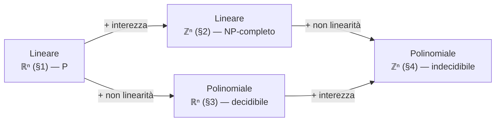
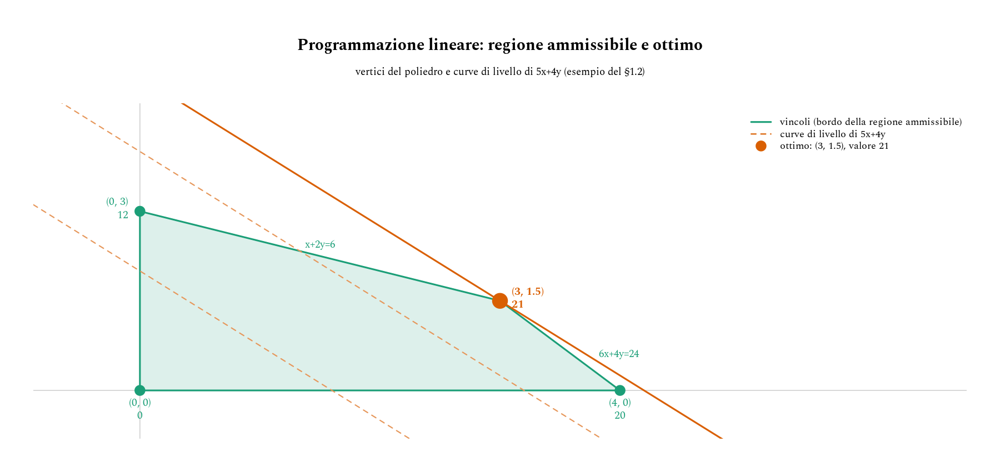
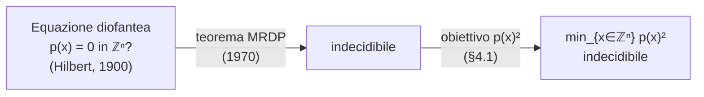

# Ottimizzazione e decidibilità

Molti problemi di ottimizzazione condividono la stessa forma: minimizzare (o massimizzare) una funzione obiettivo soggetta a vincoli. Cambiano solo due cose — la forma delle funzioni in gioco (lineari o polinomiali) e il dominio delle variabili (reale o intero) — ma da queste due scelte dipende se il problema è anche solo *decidibile*, cioè se possa esistere un algoritmo che, per ogni istanza, termina sempre con la risposta corretta.

La sorpresa è dove cade il confine: non è la non linearità da sola a romperlo, né l'interezza da sola, ma la loro combinazione. Questa nota costruisce la programmazione lineare da zero e attraversa i tre casi che la generalizzano, riusando lo stesso esempio numerico per isolare, di volta in volta, cosa cambia.


## Cosa ci serve

- **Programmazione lineare (LP)** — la base: poliedri, vertici, simplesso; colloca il problema in P ([teoria_complessita §3](teoria_complessita.md#3-classe-p)).
- **Programmazione lineare intera (ILP)** — si aggiunge il vincolo $x \in \mathbb{Z}^n$: più difficile (NP-completo, si veda [teoria_complessita §5](teoria_complessita.md#5-np-completezza-e-np-difficoltà)) ma ancora decidibile.
- **Ottimizzazione polinomiale sui reali** — si toglie la linearità: serve Tarski–Seidenberg per restare decidibile.
- **Ottimizzazione polinomiale sugli interi** — entrambe le generalizzazioni insieme: si sfonda la barriera della decidibilità, per il decimo problema di Hilbert.



Le due frecce che escono da LP sono, prese singolarmente, "gratuite": alzano la complessità ma non intaccano la decidibilità. È solo percorrendole entrambe — cioè arrivando in basso a destra — che il problema smette di ammettere un algoritmo che termina sempre.


## 1. Programmazione lineare

### 1.1 Definizione e forma standard

Un **programma lineare** (LP) ottimizza una funzione obiettivo lineare soggetta a vincoli lineari. Nella forma più comune:

$$
\max_{x \in \mathbb{R}^n} \; c^\top x
\qquad \text{soggetto a} \qquad
A x \le b, \quad x \ge 0,
$$

dove $c \in \mathbb{R}^n$ sono i coefficienti dell'obiettivo, $A \in \mathbb{R}^{m \times n}$ e $b \in \mathbb{R}^m$ codificano gli $m$ vincoli. "Lineare" è una condizione forte: niente prodotti $x_i x_j$, niente potenze, niente funzioni — solo combinazioni lineari delle variabili.


### 1.2 Un esempio numerico

Una piccola produzione con due prodotti $x$ e $y$, profitto unitario $5$ e $4$, e due risorse limitate:

$$
\begin{aligned}
\max \quad & 5x + 4y \\
\text{s.t.} \quad & 6x + 4y \le 24 \\
                  & \phantom{6}x + 2y \le 6 \\
                  & x, y \ge 0.
\end{aligned}
$$

L'insieme dei punti ammissibili è un poligono nel piano, delimitato dalle due rette di vincolo e dagli assi; i suoi 4 vertici sono $(0,0)$, $(4,0)$, $(0,3)$ e $(3,\,1.5)$, con $5x+4y$ che vale rispettivamente $0$, $20$, $12$ e $\mathbf{21}$.



$(3,\,1.5)$ è l'intersezione di $6x+4y=24$ e $x+2y=6$: è il vertice dove le curve di livello di $5x+4y$ toccano il poliedro per l'ultima volta, e dà il massimo.


### 1.3 Geometria: perché basta guardare i vertici

Ogni vincolo lineare taglia lo spazio con un iperpiano e ne tiene un semispazio; l'intersezione di semispazi è un **poliedro convesso**. L'obiettivo $c^\top x$ è costante su iperpiani paralleli tra loro (le curve di livello): massimizzarlo equivale a traslare uno di questi iperpiani finché tocca il poliedro per l'ultima volta — e quel contatto, per un poliedro, cade sempre su un vertice, uno spigolo o una faccia, mai "in mezzo al niente".

> **Teorema fondamentale della PL.** Se un LP è ammissibile e limitato, esiste un ottimo raggiunto su un vertice del poliedro.

Questo è ciò che rende l'LP trattabile: al posto di un continuo infinito di punti, basta esaminare un insieme **finito** di vertici.

```go
type vertice struct{ x, y float64 }

func ammissibile(v vertice) bool {
	return 6*v.x+4*v.y <= 24+1e-9 && v.x+2*v.y <= 6+1e-9 && v.x >= 0 && v.y >= 0
}

func obiettivo(v vertice) float64 { return 5*v.x + 4*v.y }

func migliorVertice(candidati []vertice) vertice {
	// Il teorema fondamentale garantisce che l'ottimo sia tra questi: non serve
	// esplorare l'interno del poliedro, solo i suoi vertici.
	migliore := candidati[0]
	for _, v := range candidati[1:] {
		if ammissibile(v) && obiettivo(v) > obiettivo(migliore) {
			migliore = v
		}
	}
	return migliore
}

// Su candidati = (0,0), (4,0), (0,3), (3,1.5): migliorVertice restituisce (3, 1.5), valore 21.
```


### 1.4 Complessità: decidibile, e per giunta in P

- Il **simplesso** (Dantzig, 1947) cammina di vertice in vertice migliorando l'obiettivo: rapidissimo in pratica, esponenziale nel caso peggiore.
- L'**algoritmo dell'ellissoide** (Khachiyan, 1979) e i **metodi a punti interni** (Karmarkar, 1984) risolvono l'LP in tempo polinomiale.

L'LP reale non solo termina sempre: sta in **P** ([teoria_complessita §3](teoria_complessita.md#3-classe-p)). È la base sicura da cui partono le complicazioni dei prossimi tre casi.


## 2. Caso 1 — Programmazione lineare intera (ILP)

### 2.1 Lo stesso problema, un vincolo in più

Riprendiamo *esattamente* il problema del [§1.2](#12-un-esempio-numerico) e aggiungiamo un'unica richiesta: $x, y \in \mathbb{Z}$.

$$
\begin{aligned}
\max \quad & 5x + 4y \\
\text{s.t.} \quad & 6x + 4y \le 24, \quad x + 2y \le 6, \quad x, y \ge 0, \\
                  & x, y \in \mathbb{Z}.
\end{aligned}
$$


### 2.2 L'errore da non fare: arrotondare

Il rilassamento continuo dava l'ottimo $(3,\,1.5)$ con valore $21$. Arrotondare $y$ verso l'alto è inammissibile: $(3,2)$ viola il primo vincolo ($6\cdot3+4\cdot2 = 26 > 24$). Arrotondare verso il basso dà $(3,1)$, valore $19$ — non ottimo. L'ottimo intero vero è altrove:

$$(x,y) = (4,0), \qquad 5x+4y = 20.$$

Il vincolo di interezza non "sposta un po'" l'ottimo continuo: lo può spostare in un punto che l'arrotondamento non trova mai.


### 2.3 Perché resta decidibile

Il poliedro del [§1](#1-programmazione-lineare) è limitato: contiene solo un numero finito di punti interi. In linea di principio sono enumerabili; in pratica si usa **branch & bound** (si risolve il rilassamento continuo, si sceglie una variabile frazionaria, si spezza il problema in due sotto-casi con arrotondamento per difetto/eccesso, si ricorre). Il punto teorico è che un algoritmo che termina sempre esiste — anche la sola enumerazione bruta, qui, basta:

```go
// migliorSoluzioneIntera enumera i punti interi del rettangolo [0,xMax]x[0,yMax]:
// la regione ammissibile è limitata, quindi l'insieme dei candidati è finito.
func migliorSoluzioneIntera(xMax, yMax int) (x, y, val int) {
	for i := 0; i <= xMax; i++ {
		for j := 0; j <= yMax; j++ {
			if 6*i+4*j <= 24 && i+2*j <= 6 && 5*i+4*j > val {
				x, y, val = i, j, 5*i+4*j
			}
		}
	}
	return
}

// migliorSoluzioneIntera(4, 3) → (4, 0, 20): l'ottimo intero, non un arrotondamento.
```


### 2.4 Complessità: difficile, non indecidibile

L'ILP è **NP-completo** ([teoria_complessita §5](teoria_complessita.md#5-np-completezza-e-np-difficoltà)) — nella stessa famiglia di SAT, Vertex Cover, Knapsack, collegata tramite le riduzioni di [teoria_riduzioni](teoria_riduzioni.md). È quindi *difficile* (nessun algoritmo polinomiale noto, e nessuno se P ≠ NP), ma decidibile. Curiosità sul confine: a numero fissato di variabili l'ILP torna polinomiale (Lenstra, 1983) — la difficoltà vive nella crescita del numero di variabili, non nell'interezza in sé.

> **Morale del Caso 1.** L'interezza, da sola, alza la complessità (da P a NP-completo) ma non tocca la decidibilità.


## 3. Caso 2 — Ottimizzazione polinomiale sui reali

### 3.1 Dal poliedro all'insieme semialgebrico

Ora obiettivo e vincoli possono essere **polinomi**, con variabili di nuovo reali:

$$
\min_{x \in \mathbb{R}^n} \; p(x_1,\dots,x_n) \quad \text{s.t.} \quad q_j(x) \ge 0.
$$

La regione ammissibile non è più un poliedro ma un insieme *semialgebrico* (definito da disuguaglianze polinomiali): può curvare, avere buchi, spezzarsi in più componenti.


### 3.2 Il trucco del quadrato (qui innocuo)

Un modo comodo per sondare questi problemi: dato un polinomio $p$, si considera

$$\min_{x \in \mathbb{R}^n} \; p(x)^2.$$

L'obiettivo è sempre $\ge 0$, e vale esattamente $0$ se e solo se $p$ ha una **radice reale**. Due esempi:

- $p(x) = x^2 - 2$: minimo di $(x^2-2)^2$ è $0$, in $x = \pm\sqrt{2}$ → radici reali.
- $p(x) = x^2 + 1$: minimo di $(x^2+1)^2$ è $1$, in $x = 0$ → nessuna radice reale.

```go
// haRadiceReale cerca un cambio di segno di p su una griglia di [-lim, lim]:
// per il teorema dei valori intermedi, un cambio di segno garantisce una radice
// nel sotto-intervallo. lim può essere fissato a priori con un bound di Cauchy
// sui coefficienti di p, quindi la ricerca è finita per costruzione.
func haRadiceReale(p func(float64) float64, lim float64, passi int) bool {
	prev, passo := p(-lim), 2*lim/float64(passi)
	for i := 1; i <= passi; i++ {
		cur := p(-lim + float64(i)*passo)
		if prev == 0 || cur == 0 || (prev < 0) != (cur < 0) {
			return true
		}
		prev = cur
	}
	return false
}

// p1 := func(x float64) float64 { return x*x - 2 }  // haRadiceReale(p1, 10, 1000) → true
// p2 := func(x float64) float64 { return x*x + 1 }  // haRadiceReale(p2, 10, 1000) → false
```

> Questo `haRadiceReale` è solo un'illustrazione a griglia, non la procedura generale: perde radici a molteplicità pari che toccano zero senza cambiare segno (es. $p(x)=x^2$ in $x=0$), e non si estende da sé a più variabili. La garanzia di decidibilità vera arriva dalle **successioni di Sturm** (caso a una variabile) e, in generale, dal punto seguente.


### 3.3 Perché è decidibile: Tarski-Seidenberg

La teoria del primo ordine dei **campi reali chiusi** — la struttura $(\mathbb{R}, +, \cdot, <, 0, 1)$ — ammette **eliminazione dei quantificatori** (Tarski 1948, Seidenberg 1954): qualunque enunciato costruito con polinomi, uguaglianze/disuguaglianze, $\land, \lor, \lnot$ e quantificatori $\exists, \forall$ sui reali, ad esempio

$$\exists x\,\exists y \; \big( p(x,y) = 0 \;\land\; q(x,y) > 0 \big),$$

può essere deciso algoritmicamente. Un problema di ottimizzazione si esprime in questo linguaggio ("esiste un punto ammissibile con valore $\le t$?", "l'estremo inferiore è raggiunto?"), quindi **è decidibile**.


### 3.4 Complessità: costosa, ma finita

Il prezzo è alto: l'eliminazione dei quantificatori è, nel caso generale, **doppiamente esponenziale**; già il solo frammento esistenziale (la *existential theory of the reals*, $\exists\mathbb{R}$) si colloca tra NP e PSPACE. Ma "costoso" non è "impossibile": un algoritmo che termina sempre esiste.

> **Morale del Caso 2.** La non linearità, da sola, non tocca la decidibilità: sui reali anche l'ottimizzazione polinomiale generale resta risolubile in linea di principio.


## 4. Caso 3 — Ottimizzazione polinomiale sugli interi

### 4.1 La stessa costruzione, un dominio diverso

Uniamo i due ingredienti — polinomi *e* variabili intere — riusando il trucco del quadrato:

$$\min_{x \in \mathbb{Z}^n} \; p(x_1,\dots,x_n)^2, \qquad p \text{ a coefficienti interi}.$$

Di nuovo l'obiettivo è $\ge 0$, e vale $0$ se e solo se $p(x_1,\dots,x_n) = 0$ ammette una **soluzione intera** — cioè se e solo se la corrispondente **equazione diofantea** è risolubile.


### 4.2 Il decimo problema di Hilbert

Decidere se un'arbitraria equazione diofantea ha soluzioni intere è precisamente il **decimo problema di Hilbert** (1900):

> **Teorema (Davis–Putnam–Robinson–Matiyasevich, MRDP, 1970).** Non esiste alcun algoritmo che, data un'arbitraria equazione diofantea, decida se ha soluzioni intere.



Di conseguenza non esiste alcun algoritmo che, data un'istanza qualsiasi di $\min_{x \in \mathbb{Z}^n} p(x)^2$, decida anche solo se l'ottimo è $0$ — a maggior ragione, nessuno per trovare il minimo in generale. Da notare: **non serve alcun vincolo**; già l'ottimizzazione *non vincolata* sugli interi basta a essere indecidibile, con un solo obiettivo polinomiale su $\mathbb{Z}^n$.

Questa è la stessa barriera del problema della fermata ([teoria_autoriferimento §2.1](teoria_autoriferimento.md#21-il-problema-della-fermata)): lì nessun algoritmo decide se un programma termina, qui nessun algoritmo decide se un'equazione diofantea ha soluzione — entrambe conseguenze dello stesso fenomeno, l'esistenza di famiglie di domande per cui non c'è un criterio di arresto uniforme.


### 4.3 Un assaggio: la somma di tre cubi

L'intuizione dell'indecidibilità è che non c'è un **limite calcolabile** a quanto in grande cercare. Un assaggio dalla stessa famiglia: per quali interi $n$ esistono $x,y,z \in \mathbb{Z}$ con

$$x^3 + y^3 + z^3 = n \;?$$

(equivalente a chiedere $\min_{\mathbb{Z}^3}(x^3+y^3+z^3-n)^2 = 0$.) Per anni non si sapeva se $33$ e $42$ fossero somma di tre cubi interi: entrambi risolti solo nel 2019, con soluzioni fatte di numeri da 16-17 cifre.

```go
// cercaSommaTreCubi prova tutte le terne in [-lim, lim]^3. Trovarne una risponde
// "sì". Non trovarne nessuna NON risponde "no": significa solo "nessuna soluzione
// con coordinate ≤ lim in valore assoluto" — aumentare lim può sempre rivelarne
// una più grande, e qui non c'è un lim calcolabile "abbastanza grande" in generale.
func cercaSommaTreCubi(n, lim int64) (x, y, z int64, trovata bool) {
	for x = -lim; x <= lim; x++ {
		for y = -lim; y <= lim; y++ {
			for z = -lim; z <= lim; z++ {
				if x*x*x+y*y*y+z*z*z == n {
					return x, y, z, true
				}
			}
		}
	}
	return 0, 0, 0, false
}

// cercaSommaTreCubi(33, 1000) → (0, 0, 0, false): non prova che 33 non sia
// somma di tre cubi, solo che non lo è con termini di modulo ≤ 1000.
```

*Nota di rigore:* la singola istanza $n=33$ non è di per sé "il problema indecidibile" — l'indecidibilità del [§4.2](#42-il-decimo-problema-di-hilbert) riguarda la **famiglia** di tutte le equazioni diofantee, non un'istanza isolata (per la quale, una volta trovata *una* soluzione, il problema è chiuso). Ma l'esempio dà l'intuizione di perché non possa esistere un criterio di arresto uniforme su tutta la famiglia.


### 4.4 Perché nessuna ricerca limitata può bastare

Nei tre casi precedenti ([§1](#1-programmazione-lineare)–[§3](#3-caso-2--ottimizzazione-polinomiale-sui-reali)) la decidibilità poggiava sempre su un **bound calcolabile a priori** che rendeva la ricerca finita: i vertici di un poliedro ([§1.3](#13-geometria-perché-basta-guardare-i-vertici)), i punti interi di una regione limitata ([§2.3](#23-perché-resta-decidibile)), il bound di Cauchy sulle radici di un polinomio ([§3.2](#32-il-trucco-del-quadrato-qui-innocuo)). Qui quel bound non esiste — non per una lacuna tecnica, ma perché il teorema MRDP mostra che *nessuna* funzione calcolabile può fare da bound uniforme per tutte le equazioni diofantee. È esattamente questo, e non la sola difficoltà del calcolo, a separare il Caso 3 dagli altri tre.

> **Morale del Caso 3.** Interezza *e* non linearità insieme spingono oltre la barriera: il problema diventa indecidibile.


## 5. Il confine, in sintesi

|                 | **Reali** $(\mathbb{R}^n)$            | **Interi** $(\mathbb{Z}^n)$ |
|-----------------|---------------------------------------|-----------------------------|
| **Lineare**     | P — Khachiyan / Karmarkar             | NP-completo — decidibile    |
| **Polinomiale** | Decidibile — Tarski–Seidenberg, 2-EXP | Indecidibile — MRDP         |

Le tre caselle chiare sono tutte risolubili in linea di principio; solo l'angolo in basso a destra sfonda la barriera (lo stesso percorso del diagramma in apertura, in [Cosa ci serve](#cosa-ci-serve)). Riletto per assi:

- **Da reale a intero**, caso lineare: da P a NP-completo — più difficile, ancora decidibile.
- **Da lineare a polinomiale**, caso reale: da P a 2-EXP — molto più costoso, ancora decidibile.
- **Entrambi i passi insieme**: si esce dal decidibile.

Il punto da portare a casa non è "il non lineare è difficile" né "gli interi sono difficili", ma che la **decidibilità** è una risorsa fragile: sopravvive a ciascuno dei due salti preso da solo, e cede solo alla loro composizione — un fenomeno di soglia dello stesso tipo di quello incontrato con il teorema di Rice ([teoria_autoriferimento §2.2](teoria_autoriferimento.md#22-il-teorema-di-rice)), dove è la combinazione di auto-riferimento e proprietà semantica, non l'uno o l'altra da soli, a rendere tutto indecidibile.

$$
\underbrace{\min_{x\in\mathbb{R}^n} c^\top x}_{\text{P}}
\;\longrightarrow\;
\underbrace{\min_{x\in\mathbb{Z}^n} c^\top x}_{\text{NP-completo}}
\;\longrightarrow\;
\underbrace{\min_{x\in\mathbb{Z}^n} p(x)^2}_{\text{indecidibile}}
$$


## Riferimenti bibliografici

- D. Hilbert, «Mathematische Probleme», *Göttinger Nachrichten*, 1900 — il decimo problema, alla base del [§4.2](#42-il-decimo-problema-di-hilbert).
- Y. Matiyasevich, «Enumerable Sets are Diophantine», *Soviet Mathematics Doklady*, 11 (1970), 354–358 — il passo che chiude il teorema MRDP usato nel [§4.2](#42-il-decimo-problema-di-hilbert).
- A. Tarski, *A Decision Method for Elementary Algebra and Geometry*, RAND Corp., 1948 — l'eliminazione dei quantificatori del [§3.3](#33-perché-è-decidibile-tarski-seidenberg).
- L. Khachiyan, «A Polynomial Algorithm in Linear Programming», *Soviet Mathematics Doklady*, 20 (1979), 191–194 — decidibilità in tempo polinomiale dell'LP reale, [§1.4](#14-complessità-decidibile-e-per-giunta-in-p).
