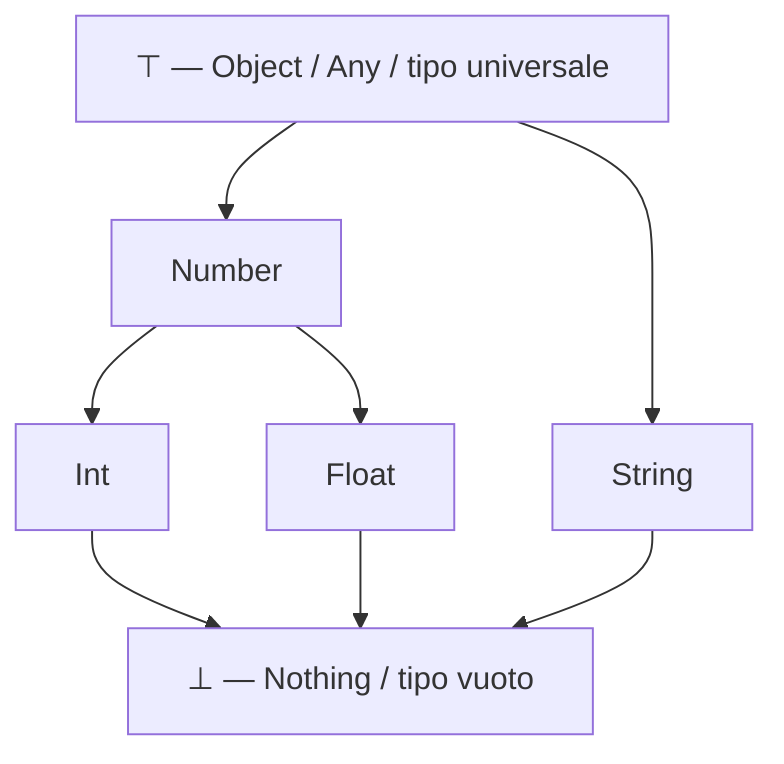

# Sistemi di tipi

Ogni linguaggio di programmazione fa una scommessa su *quanto* e *quando* controllare che le operazioni su un dato abbiano senso — sommare due numeri, invocare un metodo, indicizzare una lista. Quella scommessa è il suo **sistema di tipi**, ed è una delle decisioni di design più profonde e più visibili di un linguaggio: attraversa la sintassi, il modo in cui si manifestano i bug, le prestazioni, perfino lo stile con cui si pensa un programma prima ancora di scriverlo.

Questa nota non è organizzata linguaggio per linguaggio, ma per assi: statico/dinamico, forte/debole, inferenza, nominale/strutturale, gestione del "niente", tipi somma, polimorfismo, soundness. Ogni asse è per lo più ortogonale agli altri — il primo mito da smontare, ripreso nel [§3](#3-vocabolario-e-assi-ortogonali), è che "statico" implichi "forte" o che "dinamico" implichi "debole": non è così. Otto linguaggi ricorrono come illustrazioni lungo questi assi — **C**, **Go**, **OCaml**, **Haskell**, **Java**, **Guile** (Scheme, vedi [fondamenti_guile.md](fondamenti_guile.md)), **JavaScript** e **R** (vedi [fondamenti_r.md](fondamenti_r.md)) — scelti non per completezza ma perché ciascuno drammatizza al meglio uno o più assi; **Bash** compare come *cameo* fuori tabella nel [§17](#17-box--bash-il-pavimento), il "pavimento" dello spettro dove il concetto stesso di tipo quasi scompare.

La prima parte ([§1](#1-cosè-un-tipo)–[§6](#6-giudizi-di-tipo-e-soundness)) tratta la teoria senza legarla a un linguaggio specifico; la seconda ([§7](#7-statico-vs-dinamico-applicato)–[§17](#17-box--bash-il-pavimento)) applica ogni asse ai linguaggi scelti, con lo stesso schema per ciascuna scelta di design: perché è stata adottata, come è implementata, quali vantaggi e svantaggi comporta, come si usa al meglio.


## 1. Cos'è un tipo

Un tipo si può guardare da due prospettive complementari, ognuna utile per ragioni diverse.

**Tipo come insieme di valori** (vista *semantica*, denotazionale). `bool` è l'insieme $\{\texttt{true}, \texttt{false}\}$; un byte con segno è l'insieme dei 256 interi rappresentabili in 8 bit; una funzione `int -> bool` è, semanticamente, l'insieme di tutte le funzioni totali che accettano un intero e restituiscono un booleano. Il sottotipaggio, con questa vista, è semplicemente **inclusione insiemistica**: se $S \le T$ allora ogni valore di $S$ è anche un valore di $T$ — un `Dog` è, come insieme di comportamenti/valori possibili, contenuto in `Animal`. È la vista più intuitiva, quella su cui vale la pena costruirsi un disegno mentale:

<div markdown="1" align="center">



</div>

In cima al reticolo c'è il tipo che contiene *tutti* i valori (`Object` in Java, `Any` in Scala/Kotlin, $\top$ in notazione teorica); in fondo il tipo che non contiene *nessun* valore (`Nothing` in Scala, l'assenza di un termine ben tipato in generale) — utile, ad esempio, per dare un tipo di ritorno onesto a una funzione che non ritorna mai (loop infinito, funzione che lancia sempre un'eccezione). Il reticolo torna al [§10](#10-nominale-vs-strutturale), quando si tratta di *come* un linguaggio decide se un tipo sta sotto un altro.

**Tipo come proprietà dimostrata su un programma** (vista *sintattica*, alla Curry-Howard). Un tipo è un giudizio che si dimostra per induzione sulla struttura del termine — esattamente lo schema di un sistema di regole di deduzione, formalizzato nel [§6](#6-giudizi-di-tipo-e-soundness). È la vista che rende un type-checker un dimostratore di teoremi ristretto e automatico: scrivere codice che tipizza è, alla lettera, costruire una dimostrazione che il programma non farà un certo genere di errore.

Le due viste non sono in conflitto: la prima dice *cosa* un tipo denota, la seconda dice *come* si stabilisce che un termine ha quel tipo.


## 2. A cosa serve un sistema di tipi

Un sistema di tipi non è un ostacolo burocratico prima di poter eseguire un programma: è uno strumento che paga in almeno quattro modi diversi.

**Sicurezza.** Cattura una classe intera di errori prima che si manifestino — l'affermazione di Robin Milner, "well-typed programs don't go wrong" (1978), diventerà precisa nel [§6](#6-giudizi-di-tipo-e-soundness): "andare storto" ha un significato tecnico (eseguire un'operazione su un valore che non sa gestirla, tipo il classico "chiamare un metodo che non esiste"), non "il programma si ferma o lancia un'eccezione gestita" in generale.

**Documentazione eseguibile.** La firma `parseInt : string -> int option` dice, senza bisogno di leggere l'implementazione, che la funzione può fallire (torna un `option`) e che si aspetta una stringa. A differenza di un commento, una firma di tipo non può mentire: se il compilatore l'accetta, è vera per costruzione — un contratto verificato, non solo dichiarato.

**Ottimizzazione.** Conoscere il tipo di un valore a compile-time dice al compilatore la sua rappresentazione a runtime — dimensione, layout in memoria, quale implementazione di un'operazione usare — permettendo di generare codice specializzato invece di fare dispatch generico a ogni chiamata. È il filo che lega la scelta di *come* implementare il polimorfismo (type erasure vs monomorfizzazione, [§13](#13-polimorfismo-nei-linguaggi)) alle prestazioni.

**Modularità.** Le firme tipate sono il contratto tra moduli scritti da persone (o team) diverse: permettono di controllare ogni modulo isolatamente, senza dover guardare l'implementazione di chi lo usa o di chi verrà dopo — è ciò che rende possibile la compilazione separata e, più in generale, far crescere una base di codice senza che ogni modifica richieda di rileggere tutto.


## 3. Vocabolario e assi ortogonali

Due domande, spesso confuse tra loro, danno origine a due assi indipendenti.

**Statico vs dinamico** risponde a *quando* avviene il controllo dei tipi: a compile-time, prima di eseguire una singola istruzione (statico), oppure a runtime, sul valore concreto che una variabile assume in quel momento (dinamico). È strettamente legato alla distinzione tra *manifest typing* (il tipo è dichiarato o inferito nel testo del programma, come in OCaml o Java) e *latent typing* (il tipo esiste solo nel valore a runtime, come in Guile o R): un linguaggio dinamico è quasi sempre anche *latently typed*, perché non c'è altro posto dove il tipo potrebbe vivere.

**Forte vs debole** risponde a *quanto* il linguaggio permette coercizioni implicite tra tipi diversi — sommare una stringa e un numero senza dirlo esplicitamente, reinterpretare i bit di un valore come se fossero un altro tipo. È un termine volutamente sfumato e contestato in letteratura (non esiste una definizione operativa universalmente accettata, a differenza di statico/dinamico); qui lo si usa nel senso pratico e diffuso di "quante conversioni implicite e silenziose il linguaggio compie al posto tuo".

Il punto pedagogico centrale è che questi due assi sono *ortogonali*: sapere che un linguaggio è statico non dice nulla sul fatto che sia forte o debole, e viceversa.

| | **Forte** | **Debole** |
|---|---|---|
| **Statico** | OCaml, Haskell, Java, Go | C |
| **Dinamico** | Guile | JavaScript, R |

C è statico (il compilatore controlla i tipi prima di eseguire) eppure debole (cast liberi, `union` non taggate, conversioni implicite tra interi e puntatori). Guile è dinamico (il controllo avviene a runtime) eppure forte (nessuna coercizione silenziosa: sommare una stringa e un numero è un errore, non una conversione automatica). La coppia Guile/JavaScript, entrambi dinamici ma agli estremi opposti dell'asse forte/debole, è il confronto più istruttivo di tutta la nota e viene ripresa in dettaglio al [§8](#8-forte-vs-debole-applicato).


## 4. L'algebra dei tipi

I costruttori di tipo più comuni hanno una struttura algebrica precisa, che vale la pena rendere esplicita prima di incontrare gli ADT ([§12](#12-tipi-somma-e-pattern-matching-esaustivo)): se si conta *quanti valori distinti* abita un tipo (la sua cardinalità $\|T\|$), i costruttori si comportano esattamente come le operazioni aritmetiche da cui prendono il nome.

| Costruttore | Notazione | Cardinalità | Esempio |
|---|---|---|---|
| Prodotto (record / tupla) | $A \times B$ | $\lvert A\rvert \cdot \lvert B\rvert$ | `(bool, bool)` → 4 valori |
| Somma (variant / `enum` taggato) | $A + B$ | $\lvert A\rvert + \lvert B\rvert$ | `Left of bool \| Right of unit` → 3 valori |
| Funzione | $B^A$ | $\lvert B\rvert^{\lvert A\rvert}$ | `bool -> bool` → 4 funzioni possibili |
| Unità | $1$ | $1$ | `unit` (OCaml), `()` (Haskell) — un solo valore |
| Vuoto | $0$ | $0$ | `Void` (Haskell), tipo senza alcun costruttore |

Le identità algebriche non sono un'analogia decorativa: valgono davvero, a meno di isomorfismo, e si possono usare per semplificare un tipo esattamente come si semplifica un'espressione algebrica —

$$
A \times 1 \cong A \qquad\qquad A \times 0 \cong 0 \qquad\qquad A^1 \cong A \qquad\qquad A^0 \cong 1 \qquad\qquad 1^A \cong 1
$$

($A^0 \cong 1$: c'è esattamente *una* funzione dal tipo vuoto a qualunque `A` — la funzione vuota, definita ovunque per vacuità perché non ha mai un argomento su cui essere applicata). Questa vista è il ponte diretto verso i tipi somma con pattern matching esaustivo del [§12](#12-tipi-somma-e-pattern-matching-esaustivo): un `match` esaustivo su `A + B` è, algebricamente, l'aver enumerato tutti e $\lvert A\rvert + \lvert B\rvert$ i casi.


## 5. Polimorfismo: una tassonomia

Prima di vedere come i linguaggi lo incarnano ([§13](#13-polimorfismo-nei-linguaggi)), vale la pena fissare il vocabolario secondo la tassonomia classica di Cardelli e Wegner (1985), che distingue due famiglie:

- **Polimorfismo universale** — una *singola* implementazione funziona per una famiglia infinita di tipi:
  - **parametrico**: la funzione è scritta senza sapere nulla del tipo concreto (`identity : 'a -> 'a` funziona identica per interi, stringhe, alberi...);
  - **per inclusione / sottotipo**: un valore di un sottotipo è utilizzabile ovunque sia richiesto un supertipo (l'inclusione insiemistica del [§1](#1-cosè-un-tipo), resa operativa).
- **Polimorfismo ad-hoc** — implementazioni *diverse*, una per ciascun tipo (o famiglia di tipi), scelte da un meccanismo del linguaggio:
  - **overloading**: più funzioni con lo stesso nome, risolte in base al tipo degli argomenti;
  - **coercizione**: conversione implicita di un valore in un altro tipo per far combaciare un'operazione — l'anello di congiunzione con l'asse forte/debole del [§8](#8-forte-vs-debole-applicato).

Il **duck typing** dei linguaggi dinamici (R, JavaScript, Guile) non rientra in modo pulito in questa tassonomia: è una nozione *informale e a runtime* — "se si comporta come un'anatra, trattalo come un'anatra" — che nei linguaggi statici viene invece resa esplicita e verificata a compile-time dal sottotipaggio strutturale ([§10](#10-nominale-vs-strutturale)). È il motivo per cui compare separatamente nel confronto del [§13](#13-polimorfismo-nei-linguaggi).


## 6. Giudizi di tipo e soundness

Formalizzando la vista sintattica del [§1](#1-cosè-un-tipo): un **giudizio di tipo** si scrive

$$
\Gamma \vdash e : \tau
$$

e si legge "nel contesto $\Gamma$ (l'insieme dei binding di variabili a tipi attualmente visibili), l'espressione $e$ ha tipo $\tau$". Una regola di inferenza tipica, quella per l'applicazione di funzione, è:

$$
\dfrac{\Gamma \vdash e_1 : \tau_1 \to \tau_2 \qquad\quad \Gamma \vdash e_2 : \tau_1}{\Gamma \vdash e_1\ e_2 : \tau_2} \quad \text{(APP)}
$$

cioè: se $e_1$ ha tipo funzione da $\tau_1$ a $\tau_2$, e $e_2$ ha tipo $\tau_1$, allora applicare $e_1$ a $e_2$ produce un termine di tipo $\tau_2$. Un intero type-checker è, in questo senso, un motore di ricerca di dimostrazione: verifica se esiste una derivazione che porta al giudizio finale usando regole come questa.

Vale la pena distinguere tre compiti spesso confusi: il **type checking** verifica che un termine *già annotato* rispetti le regole; il **type inference** ricostruisce i tipi mancanti a partire dal contesto (l'algoritmo Hindley-Milner del [§9](#9-inferenza-di-tipo) ne è l'esempio principe); la **type reconstruction** è il caso generale in cui annotazioni e inferenza coesistono parzialmente.

La proprietà che rende un sistema di tipi degno di fiducia è la **soundness**, che si dimostra tipicamente in due parti:

- **Progress**: un termine chiuso e ben tipato o è già un valore, oppure può fare un passo di valutazione (non resta mai "bloccato").
- **Preservation** (o *subject reduction*): se $\Gamma \vdash e : \tau$ e $e$ fa un passo di valutazione fino a $e'$, allora $\Gamma \vdash e' : \tau$ — il tipo non cambia mai durante l'esecuzione.

Insieme, le due proprietà garantiscono esattamente ciò che il [§2](#2-a-cosa-serve-un-sistema-di-tipi) aveva anticipato in modo informale: un programma ben tipato non raggiunge mai uno stato "stuck" — un'operazione applicata a un valore che non sa gestire. È la versione precisa di "well-typed programs don't go wrong". Non tutti i linguaggi mantengono questa promessa fino in fondo: il [§14](#14-soundness-e-sicurezza-in-pratica) mostra un caso reale (Java) in cui viene deliberatamente rotta.


## 7. Statico vs dinamico, applicato

**La scelta statica** — C, Go, OCaml, Haskell, Java. Il perché affonda nella stirpe Algol/Fortran: linguaggi pensati per programmi compilati una volta e distribuiti, dove un errore scoperto a runtime dall'utente finale costa molto più di un errore scoperto dal compilatore dello sviluppatore. Il come è un'intera fase del compilatore (il type-checker) che attraversa l'albero sintattico prima di generare codice, rifiutando il programma se una derivazione come quella del [§6](#6-giudizi-di-tipo-e-soundness) non esiste. Il vantaggio è duplice: gli errori si scoprono presto (spesso nell'editor, prima ancora di compilare) e le firme di tipo diventano una rete di sicurezza per il refactoring su larga scala. Lo svantaggio è l'attrito — codice che è "ovviamente corretto" ma che il type-checker rifiuta finché non viene riformulato in un modo che riesce a dimostrare. L'uso migliore è lasciare che sia l'inferenza ([§9](#9-inferenza-di-tipo)) a fare il lavoro di scrittura dei tipi, riservando le annotazioni esplicite ai confini pubblici del codice.

```ocaml
let incrementa x = x + 1
let () = incrementa "ciao"
(* Error: This expression has type string but an expression was expected of type int *)
(* l'errore emerge PRIMA di eseguire una sola istruzione *)
```

**La scelta dinamica** — Guile, R, JavaScript. Il perché ha radice nella tradizione Lisp: codice-come-dato, sviluppo interattivo al REPL, dove il ciclo scrivi-prova-correggi deve essere il più corto possibile e il programma può letteralmente riscrivere se stesso a runtime (macro, `eval`). Il come è che ogni *valore*, non ogni variabile, porta con sé un tag di tipo controllato al momento dell'operazione, non prima. Il vantaggio è la flessibilità — funzioni che accettano "qualunque cosa abbia questa forma" senza dover dichiarare in anticipo l'intera famiglia di tipi accettabili — e una metaprogrammazione più naturale. Lo svantaggio speculare è che un errore di tipo può restare silente fino a quando il ramo di codice sbagliato non viene effettivamente eseguito, magari in produzione. L'uso migliore è compensare con disciplina esterna al linguaggio: funzioni piccole e testate, test property-based, o un livello di gradual typing sopra (si veda il [§9](#9-inferenza-di-tipo) e l'accenno finale sul *gradual typing*).

```scheme
(define (raddoppia x) (* x 2))
(raddoppia 21)      ; => 42
(raddoppia "ciao")  ; errore, ma solo ORA, alla chiamata — non prima
```


## 8. Forte vs debole, applicato

**JavaScript — dinamico e debole.** Il perché è storico e deliberato: JavaScript nasce nel 1995 per manipolare form HTML in dieci giorni, con l'obiettivo esplicito di non far mai fallire rumorosamente uno script nel browser di un utente qualunque — meglio un risultato "ragionevole" che un errore bloccante. Il come è l'algoritmo di coercizione implicita (`ToPrimitive`/`ToNumber`/`ToString`) applicato ogni volta che un operatore riceve operandi di tipo diverso:

```javascript
"5" + 3        // "53"  — + con una stringa forza ToString sull'altro operando
"5" - 3        // 2     — con -, invece, forza ToNumber
[] == ![]      // true  — [] diventa "" (ToString), ![] diventa false, poi entrambi 0
```

Il vantaggio è la tolleranza: un valore che arriva "quasi giusto" (una stringa `"3"` da un campo di un form, invece del numero `3`) spesso funziona comunque. Lo svantaggio è il rovescio della stessa medaglia — bug d'azione a distanza, difficili da individuare perché il linguaggio non si lamenta mai. L'uso migliore è disciplinare la debolezza a mano: `===` invece di `==` sempre, e in codice reale un livello statico sopra (TypeScript) che rifiuta molte di queste coercizioni prima ancora che accadano.

**Guile — dinamico ma forte.** Il perché è altrettanto deliberato, ma nella direzione opposta: la tradizione Lisp/Scheme privilegia l'esplicitezza anche in un mondo dinamico — un valore ha un tipo preciso e le conversioni fra tipi devono essere richieste, mai indovinate dal linguaggio. Il come è la *numeric tower* di Scheme (interi esatti, razionali, reali, complessi, in una gerarchia di promozione esplicita e prevedibile solo fra numeri, mai fra numeri e stringhe) unita all'assenza totale di coercizione stringa/numero:

```scheme
(+ "5" 3)
;; ERROR: Wrong type argument in position 1: "5"
(+ (string->number "5") 3)  ; => 8, la conversione va chiesta esplicitamente
```

Il confronto con JavaScript è il colpo pedagogico dell'intera nota: stesso quadrante dell'asse statico/dinamico (entrambi dinamici), poli opposti sull'asse forte/debole — la prova migliore che i due assi sono davvero ortogonali.

**C — statico ma debole.** Il perché è pragmatico: C è pensato come "assembly portabile", dove il programmatore deve poter reinterpretare bit a piacimento per parlare con l'hardware, senza che il type-checker si metta in mezzo. Il come sono le *usual arithmetic conversions* dello standard (conversioni implicite fra tipi numerici) e soprattutto la `union`, che fa condividere lo stesso spazio di memoria a rappresentazioni diverse senza alcun tag a runtime che ricordi quale membro sia stato scritto per ultimo:

```c
union valore { int i; float f; };
union valore v;
v.f = 3.14f;
printf("%d\n", v.i);   /* legge i BIT di un float come se fossero un int: "funziona",
                           ma è il compilatore statico che lo permette senza fiatare */
```

Il vantaggio è l'accesso a basso livello imprescindibile per la programmazione di sistema (bit twiddling, layout di protocollo, interfacce hardware). Lo svantaggio è che lo stesso meccanismo, usato per sbaglio invece che di proposito, è indistinguibile da un bug. L'uso migliore è confinare le `union` e i cast a punti isolati e commentati del codice, mai come stile pervasivo.


## 9. Inferenza di tipo

**Inferenza completa — OCaml e Haskell.** Il perché nasce con Robin Milner stesso: dare a ML (1978) la sicurezza di un linguaggio statico senza il fardello di annotare ogni singolo tipo come nei linguaggi statici precedenti. Il come è l'algoritmo di **Hindley-Milner** (spesso implementato come *algoritmo W*): il compilatore genera una variabile di tipo per ogni sotto-espressione, raccoglie le equazioni implicate dalla struttura del programma, e le risolve per *unificazione*.

```ocaml
let somma x y = x + y
(* nessuna annotazione scritta, eppure il compilatore inferisce: *)
(* val somma : int -> int -> int = <fun> *)
(* "+" vincola x e y a essere int, quindi il tipo dell'intera funzione ne segue *)
```

Il vantaggio è una scrittura quasi priva di annotazioni pur restando completamente statica — le firme si leggono come se il linguaggio fosse dinamico, ma sono verificate come se non lo fosse. Lo svantaggio classico è la localizzazione degli errori: un vincolo violato lontano nel programma può produrre un messaggio d'errore che punta a una riga sintatticamente corretta ma logicamente non quella colpevole. L'uso migliore è annotare comunque le firme delle funzioni pubbliche di un modulo — non serve al type-checker, serve a chi legge, e aiuta l'inferenza stessa a localizzare meglio un eventuale errore.

**Inferenza locale — Go e Java.** Il perché è una scelta pratica più recente e più conservativa: sia Go (dal day one, con `:=`) sia Java (con `var`, dalla versione 10) hanno deliberatamente *rifiutato* l'inferenza in stile Hindley-Milner a favore di un'inferenza puramente locale, guidata dal lato destro di una singola assegnazione — proprio per evitare i messaggi d'errore "a distanza" appena descritti e per mantenere le firme delle funzioni sempre esplicite come documentazione.

```go
x := 42          // inferito da int letterale
var y = "ciao"   // stesso principio, sintassi diversa
```
```java
var lista = new ArrayList<String>();  // Java 10+, stesso principio: solo variabili locali
```

Il vantaggio è ridurre il rumore visivo (`var x = ...` invece di `TipoLunghissimo<Generico> x = ...`) senza pagare il costo cognitivo dell'inferenza whole-program. Lo svantaggio è che è, appunto, *solo* locale: non può mai dedurre la firma di una funzione. L'uso migliore è esattamente questo compromesso deliberato: inferenza per i dettagli locali, tipi espliciti sulle interfacce pubbliche — il punto in cui, non a caso, coincide con il consiglio dato sopra anche per OCaml/Haskell.


## 10. Nominale vs strutturale

**Sottotipaggio strutturale — Go.** Il perché è una reazione deliberata alle gerarchie di interfacce rigide in stile Java: i progettisti di Go (2009) volevano disaccoppiare *chi implementa* un'interfaccia da *chi la dichiara*, permettendo di scrivere un'interfaccia dopo aver già scritto i tipi che la soddisfano. Il come è che un tipo soddisfa un'interfaccia automaticamente, se possiede tutti i metodi richiesti — nessuna dichiarazione esplicita di intento:

```go
type Stringer interface { String() string }

type Punto struct{ X, Y int }
func (p Punto) String() string { return fmt.Sprintf("(%d,%d)", p.X, p.Y) }
// Punto soddisfa Stringer senza mai menzionarlo — il compilatore lo scopre da solo
```

Il vantaggio è la componibilità: si può scrivere un'interfaccia minima *dal lato di chi la consuma*, e farla soddisfare da tipi scritti altrove, anche in pacchetti che non conoscono l'interfaccia. Lo svantaggio è la **conformità accidentale**: due tipi senza alcuna relazione concettuale possono soddisfare la stessa interfaccia solo perché hanno per caso un metodo con la stessa firma, il che riduce la scopribilità (non c'è un `implements` da cercare nel codice). L'uso migliore, coerente con lo scopo per cui è nata: interfacce piccole (spesso un solo metodo), definite dal pacchetto che le *usa*, non da quello che definisce il tipo concreto.

**Sottotipaggio nominale — Java.** Il perché è l'approccio classico della OOP alla Simula/Smalltalk: la relazione di sottotipo è parte dell'identità dichiarata di una classe, non una proprietà accidentale della sua forma. Il come è l'obbligo esplicito della clausola `implements`:

```java
interface Stringer { String asString(); }

class Punto implements Stringer {   // dichiarazione ESPLICITA di intento
    int x, y;
    public String asString() { return "(" + x + "," + y + ")"; }
}
```

Il vantaggio è la scopribilità e l'intenzionalità: leggendo la dichiarazione di una classe si vede immediatamente ogni contratto che promette di rispettare. Lo svantaggio è la rigidità: un tipo scritto da terzi, per quanto abbia già tutti i metodi giusti, non soddisfa un'interfaccia a meno che il suo autore non l'abbia dichiarato esplicitamente — servono adapter/wrapper. L'uso migliore è sfruttare proprio questa esplicitezza per i contratti architetturalmente importanti di un sistema, dove la scopribilità vale più della flessibilità.


## 11. Il problema del "niente": null, option, zero value

Probabilmente l'asse con il maggior valore pratico: quattro linguaggi, quattro risposte diverse alla stessa domanda — "come rappresento l'assenza di un valore?".

**C — il puntatore nullo.** Nessuna protezione: `NULL` è un puntatore come un altro, e nulla nel sistema di tipi distingue un puntatore che può essere nullo da uno che non può esserlo mai. Dereferenziarlo è *undefined behavior*, tipicamente un segfault, ma non è garantito nemmeno quello.

```c
int *p = NULL;
printf("%d\n", *p);  /* UB — può segfaultare, o (peggio) "funzionare" per caso */
```

**Java — `null` come membro di ogni tipo riferimento.** È la scelta che Tony Hoare, che introdusse i riferimenti nulli in ALGOL W nel 1965, ha in seguito definito pubblicamente il suo "billion-dollar mistake": ogni tipo riferimento (`String`, `List`, una classe qualunque) include silenziosamente `null` fra i suoi valori possibili, e il type-checker non ha modo di escluderlo.

```java
String s = trovaUtente(id);   // può restituire null, la firma non lo dice
System.out.println(s.length());  // NullPointerException, scoperta solo a runtime
```

**OCaml e Haskell — `option`/`Maybe` come tipo esplicito.** L'assenza diventa un valore di prima classe dentro un tipo somma ([§12](#12-tipi-somma-e-pattern-matching-esaustivo)), e il compilatore obbliga a gestire entrambi i casi:

```ocaml
let trova_utente : int -> utente option = fun id -> (* ... *)
match trova_utente id with
| Some u -> Printf.printf "%s\n" u.nome
| None -> Printf.printf "utente non trovato\n"
(* omettere un caso produce un WARNING di match non esaustivo *)
```

**Go — zero value più `error` esplicito, una terza via.** Go non ha `option` nativo, e non ha nemmeno `null` in senso Java: ogni tipo ha un valore di default deterministico (`0` per i numeri, `""` per le stringhe, `nil` solo per puntatori/slice/mappe/interfacce), e l'assenza di un risultato valido si comunica per convenzione con un secondo valore di ritorno:

```go
u, err := trovaUtente(id)
if err != nil {
    fmt.Println("utente non trovato:", err)
    return
}
fmt.Println(u.Nome)   // qui, per convenzione, u è garantito valido
```

Non è verificato dal compilatore quanto lo `option` di OCaml (nulla obbliga davvero a controllare `err`), ma la convenzione — rinforzata da linter come `errcheck` — rende l'ignorare l'errore un'anomalia visibile nel codice, non un'operazione silenziosa. Il confronto tra le quattro strategie mostra concretamente come un type system possa eliminare un'intera classe di bug (OCaml/Haskell), renderla solo più visibile per convenzione (Go), o non affrontarla affatto (C, e in pratica anche Java).


## 12. Tipi somma e pattern matching esaustivo

**ADT con controllo di esaustività — OCaml (e, con sintassi affine, Haskell).** Il perché discende direttamente dall'algebra dei tipi del [§4](#4-lalgebra-dei-tipi): se un tipo è dichiarato come somma di casi, il compilatore *conosce* l'insieme completo dei casi e può verificare che un `match` li copra tutti.

```ocaml
type forma =
    | Cerchio of float          (* raggio *)
    | Rettangolo of float * float  (* lati *)

let area = function
    | Cerchio r -> Float.pi *. r *. r
    | Rettangolo (b, h) -> b *. h
(* aggiungere un terzo costruttore a `forma` senza aggiornare `area`
   produce un WARNING "this match case is not exhaustive" *)
```

Il vantaggio è enorme in manutenzione: aggiungere un nuovo caso a un tipo somma fa "esplodere" (con un warning, promuovibile a errore) ogni `match` nel codice che non lo gestisce ancora — il compilatore diventa una checklist automatica. Lo svantaggio è la rigidità opposta a quella dei tipi aperti: aggiungere un caso è un cambiamento *breaking* per definizione, che tocca ogni consumatore. L'uso migliore è riservare gli ADT chiusi a domini dove l'insieme dei casi è davvero stabile o dove si *vuole* essere avvisati a ogni estensione.

**La stessa idea, insicura — C.** `enum` più `union` esprimono la stessa intenzione (un tag più uno spazio dati alternativo) ma senza alcuna garanzia: nulla lega il tag alla scelta di membro effettivamente scritta in memoria, e nulla obbliga uno `switch` a coprire tutti i casi.

```c
typedef struct {
    enum { CERCHIO, RETTANGOLO } tag;
    union { double raggio; struct { double base, altezza; } rett; } dati;
} Forma;

double area(Forma f) {
    switch (f.tag) {
        case CERCHIO: return 3.14159 * f.dati.raggio * f.dati.raggio;
        /* RETTANGOLO dimenticato: nessun errore, nessun warning di default */
    }
    return 0;  /* silenziosamente sbagliato per ogni rettangolo */
}
```

È letteralmente la stessa struttura dati dell'esempio OCaml, ma con ogni garanzia rimossa: il tag può disallinearsi dal membro dell'`union` letto, e l'esaustività dello `switch` non è verificata (solo alcuni compiler, con flag espliciti come `-Wswitch-enum`, avvisano).

**Nessun supporto nativo — Go.** Go non ha tipi somma; il pattern più vicino è un'interfaccia soddisfatta da più tipi concreti, esplorata a runtime con un *type switch*:

```go
type Forma interface{ Area() float64 }
type Cerchio struct{ Raggio float64 }
type Rettangolo struct{ Base, Altezza float64 }

func (c Cerchio) Area() float64    { return math.Pi * c.Raggio * c.Raggio }
func (r Rettangolo) Area() float64 { return r.Base * r.Altezza }
// nessun controllo di esaustività nativo se si aggiunge un nuovo tipo che implementa Forma
```

Funziona, ma sposta il controllo di esaustività fuori dal linguaggio (linter di terze parti come `exhaustive`), a differenza della garanzia integrata di OCaml/Haskell — un buon esempio di come l'assenza di un costrutto (qui: i tipi somma) si ripercuota su un asse diverso (qui: la sicurezza del pattern matching).


## 13. Polimorfismo nei linguaggi

Applicando la tassonomia del [§5](#5-polimorfismo-una-tassonomia):

**Parametrico.** OCaml e Haskell lo hanno nativo e senza costi concettuali (`let id x = x` è già polimorfa, nessuna sintassi speciale). Java lo ha con **type erasure**: `List<String>` e `List<Integer>` condividono a runtime esattamente la stessa classe `List`, perché i parametri di tipo esistono solo a compile-time e vengono cancellati dopo il type-checking — dimostrabile chiedendo `lista.getClass()`, identica per qualunque `T`. Go lo ha dal 1.18 (2022) con **monomorfizzazione**: il compilatore genera una versione specializzata della funzione generica per ogni combinazione di tipi effettivamente usata, pagando in dimensione del binario ciò che Java risparmia cancellando l'informazione. C non ha polimorfismo parametrico affatto: si simula con macro testuali (nessun controllo di tipo) o con `void *` (nessuna informazione di tipo a runtime, cast manuali ovunque).

**Ad-hoc — overloading.** Java risolve `println(int)` vs `println(String)` *staticamente*, in base al tipo apparente degli argomenti al punto di chiamata — due metodi diversi, scelti dal compilatore, non un solo metodo che decide *a runtime*.

**Ad-hoc — type class.** La forma canonica è Haskell, dove il concetto è nato nella sua forma più pulita:

```haskell
class Eq a where
    (==) :: a -> a -> Bool

instance Eq Bool where
    True  == True  = True
    False == False = True
    _     == _     = False
```

Il come implementativo, degno di nota: il compilatore risolve `(==)` scegliendo l'istanza giusta e la passa *implicitamente* come un parametro extra alla funzione generica (*dictionary passing*) — un meccanismo affine, nello spirito, alla risoluzione degli overload di Java, ma guidato dall'inferenza invece che dalla sola sintassi del punto di chiamata.

**Sottotipo.** Java in stile OOP classico: `Animal a = new Dog();` — un `Dog` è utilizzabile ovunque serva un `Animal`, l'inclusione insiemistica del [§1](#1-cosè-un-tipo) resa operativa a runtime tramite dispatch dinamico sui metodi.

**Duck typing.** Informale e a runtime, negli stessi linguaggi dinamici del [§7](#7-statico-vs-dinamico-applicato):

```javascript
function faiVersoso(animale) { animale.verso(); }
// funziona con QUALUNQUE oggetto che abbia un metodo verso(), nessuna dichiarazione di tipo
```

È l'equivalente runtime, non verificato, del sottotipaggio strutturale statico di Go visto al [§10](#10-nominale-vs-strutturale) — stessa idea ("basta avere la forma giusta"), momento del controllo diverso.


## 14. Soundness e sicurezza in pratica

**C — insicuro per progetto.** Il type system di C non promette memory safety, punto: accesso fuori dai limiti di un array, `use-after-free`, dereferenziazione di puntatori pendenti sono tutti *undefined behavior* che il compilatore non è tenuto a impedire né a segnalare. La soundness nel senso del [§6](#6-giudizi-di-tipo-e-soundness) semplicemente non è un obiettivo di design di C: il tipo controlla la *forma* delle operazioni (non sommare un `int*` e uno `struct`), non la loro *sicurezza a runtime*.

**Java — memory-safe ma con un'unsoundness nota.** Java non ha puntatori grezzi né UB in questo senso, ma ha un buco di soundness deliberato e documentato: gli array sono covarianti.

```java
Object[] arr = new String[3];   // compila: String[] è considerato sottotipo di Object[]
arr[0] = 42;                    // compila ANCHE questo: 42 è un Object valido...
// ArrayStoreException a runtime: l'array è "veramente" uno String[], non può contenere un Integer
```

Il perché storico: Java 1.0 (1996) non aveva ancora i generics (arrivati solo nel 2004, con Java 5), e serviva un modo per scrivere un singolo metodo `sort(Object[] a)` capace di ordinare array di qualunque tipo — la covarianza degli array era l'unica via disponibile. Il prezzo è che il type-checker accetta un programma che *può* fallire a runtime con un'eccezione che, in un sistema pienamente sound, non dovrebbe essere raggiungibile: la promessa "well-typed doesn't go wrong" viene rattoppata con un controllo a runtime invece che rispettata staticamente.

**OCaml e Haskell — sound salvo escape hatch esplicito.** Il nucleo del linguaggio è sound; entrambi offrono però una valvola di fuga deliberatamente nominata in modo allarmante — `Obj.magic : 'a -> 'b` in OCaml, `unsafeCoerce :: a -> b` in Haskell — che forza un tipo qualunque in un altro senza alcun controllo, bypassando ogni garanzia. L'uso corretto, coerente con il nome scelto apposta per scoraggiarlo, è: praticamente mai nel codice applicativo, riservato a librerie di interoperabilità a bassissimo livello (FFI) scritte e verificate con estrema cura.


## 15. Il soffitto: effetti nel tipo e higher-kinded types

Haskell illustra un asse che nessun altro linguaggio di questa nota tocca, ed è utile seguirne la genesi causale, perché è la catena che rende il risultato finale meno arbitrario di quanto sembri a prima vista: Haskell voleva la *valutazione lazy* (per poter ragionare sul codice per via puramente equazionale, senza dover fissare un ordine di valutazione) → ma la pigrizia rende gli effetti collaterali imprevedibili (se non si sa quando un'espressione viene valutata, non si sa nemmeno quando un `print` al suo interno avverrebbe), quindi il linguaggio impone la purezza nel nucleo: nessuna funzione può avere effetti collaterali e gli effetti, quando servono, vengono spostati nel sistema di tipi, con un tipo speciale `IO a` che li rende visibili nella firma:

```haskell
saluta :: String -> IO ()
saluta nome = putStrLn ("Ciao, " ++ nome)   -- la firma DICE che tocca il mondo esterno

quadrato :: Int -> Int
quadrato x = x * x                          -- la firma GARANTISCE che non può farlo
```

Il compilatore impedisce di chiamare `saluta` da dentro `quadrato`, non perché "non avrebbe senso", ma perché il tipo `Int -> Int` esclude letteralmente ogni funzione che tocchi `IO`. È un type system che non descrive solo *cosa* una funzione restituisce, ma *cosa le è permesso fare*.

Il secondo contributo, distinto ma imparentato, sono gli **higher-kinded types**: astrazioni su *costruttori* di tipo, non su tipi. `Functor`, con il suo `fmap :: (a -> b) -> f a -> f b`, è definito per una variabile `f` che non è un tipo (come `Int`) ma una funzione da tipi a tipi (come `Maybe`, `[]` o `IO`) — un piano di astrazione più alto, che permette di scrivere codice generico su "qualunque cosa sia un contenitore mappabile" indipendentemente da cosa contenga. OCaml può esprimere qualcosa di simile solo passando per il sistema dei moduli/functor, molto più pesante sintatticamente; Java non ha un modo pulito per esprimerlo affatto.

Il vantaggio è un riuso enorme di codice attraverso famiglie di tipi altrimenti scorrelate, con gli effetti tracciati, testabili e componibili nel tipo stesso. Lo svantaggio è la curva di apprendimento — la proverbiale "monad tutorial fatigue" — e l'attrito nel far evolvere codice puro in codice che deve diventare impuro (e viceversa), che richiede di rifilettare `IO` lungo tutte le firme coinvolte. L'uso migliore, diventato un principio di design condiviso oltre Haskell stesso, è tenere il confine puro/impuro il più sottile possibile: un "nucleo funzionale" puro circondato da un "guscio imperativo" sottile che gestisce solo l'I/O effettivo.


## 16. Un caso anomalo: i sistemi a oggetti di R

R non illustra un asse pulito quanto gli altri, ma è un caso di studio prezioso per due ragioni indipendenti dal resto della nota (si veda anche [fondamenti_r.md](fondamenti_r.md)).

La prima è che R ha quattro sistemi a oggetti coesistenti — S3, S4, Reference Classes (R5) e il pacchetto `R6` — invece di uno solo. S3 è informale: un oggetto è un valore qualunque con un attributo `class`, e il dispatch avviene per convenzione di nome (`print.miaclasse` viene chiamata automaticamente da `print()` su un oggetto con `class(x) == "miaclasse"`):

```r
cerchio <- list(raggio = 2)
class(cerchio) <- "cerchio"
print.cerchio <- function(x, ...) cat("Cerchio di raggio", x$raggio, "\n")
print(cerchio)  # dispatch S3: cerca print.cerchio, la trova, la chiama
```

S4, più formale (`setClass`, `setGeneric`), aggiunge qualcosa che nessun altro linguaggio di questa nota ha nativamente: il **multiple dispatch** — un metodo può essere scelto in base alla classe di *più di un* argomento, non solo del ricevente.

La seconda ragione è la sua politica di coercizione automatica e gerarchica tra i tipi vettoriali di base (`logical` < `integer` < `double` < `character`), unita al valore speciale `NA` che si propaga silenziosamente attraverso i calcoli invece di segnalare un errore:

```r
c(1, TRUE, "a")   # -> tutto coercito a character: c("1", "TRUE", "a")
NA + 1             # -> NA, non un errore: l'assenza si propaga
```

Combinato con l'essere un linguaggio dinamico e debole (§7–§8), questo rende R il linguaggio della nota dove le coercizioni implicite sono più pervasive e più difficili da prevedere a colpo d'occhio — un costo accettato in cambio della comodità nell'esplorazione interattiva di dati eterogenei, che è il contesto per cui R è stato disegnato.


## 17. Box — Bash, il pavimento

Bash non è un linguaggio in più da confrontare voce per voce con gli altri otto: è un caso limite che vale la pena isolare, perché illustra al meglio una distinzione che quasi tutti confondono — dinamicamente tipato non è lo stesso di non tipato.

In Guile, R o JavaScript i *valori* portano con sé un tipo a runtime: `3` sa di essere un numero, `[1, 2]` sa di essere una lista, e le operazioni controllano quel tag prima di procedere ([§7](#7-statico-vs-dinamico-applicato)). Bash è invece sostanzialmente **unityped**, o "stringly-typed": ogni valore è una stringa, senza eccezioni, e non porta con sé alcun tag.

```bash
x=5
x=ciao          # rappresentazione IDENTICA alla riga precedente: solo testo

echo $(( x + 1 ))   # errore solo perché "ciao" non parsifica come intero,
                    # non perché il "tipo" non corrisponda: (( )) prova a
                    # interpretare comunque la stringa come espressione aritmetica

declare -i n=5      # il timido cenno a un "tipo": un attributo sulla variabile
n=n+1                # -> 6: la stringa "n+1" viene ri-valutata come aritmetica
                    # ogni volta che n viene letta, non è un vero intero tipato
```

È la stessa distinzione che, in teoria dei tipi, separa il lambda calcolo *tipato* dal lambda calcolo *non tipato*: qui il "tipo" emerge esclusivamente dal contesto sintattico che consuma il valore (`$(( ))` prova un'interpretazione numerica, `[[ -f ]]` una di percorso file, altrove resta testo puro), mai da un tag intrinseco al valore stesso.

La lezione più utile che Bash offre è al negativo: cosa succede senza alcuna disciplina di tipo a proteggere. L'esempio canonico è il *word splitting* su variabili non quotate:

```bash
dir=
rm -rf "$dir"/*     # con $dir vuota e quotata correttamente: errore "No such file"
rm -rf $dir/*        # SENZA quote: $dir si espande a niente, il comando diventa
                     # letteralmente `rm -rf /*` dopo l'espansione della shell
```

Non è un tipo che manca in senso stretto — è l'assenza di *qualunque* distinzione tra "questo è un percorso", "questo è vuoto", "questo è una lista di percorsi" a rendere questa classe di errore strutturalmente possibile. È il miglior argomento *in negativo* del perché i tipi, anche quelli minimi come lo `option` del [§11](#11-il-problema-del-niente-null-option-zero-value), esistono: non per burocrazia, ma per rendere impossibili per costruzione errori come questo.


## 18. Tabella comparativa

| Linguaggio | Statico/Dinamico | Forte/Debole | Inferenza | Nominale/Strutturale | Gestione del "niente" | Tipi somma | Soundness |
|---|---|---|---|---|---|---|---|
| **C** | Statico | Debole | Nessuna | — | `NULL` non protetto | `enum`+`union`, non sicuri | Insicuro per progetto |
| **Go** | Statico | Forte | Locale (`:=`) | Strutturale | zero value + `error` | Assenti (interfacce + type switch) | Sound (nel sottoinsieme sicuro) |
| **OCaml** | Statico | Forte | Completa (HM) | Strutturale (record) / nominale (varianti) | `option` | ADT esaustivi | Sound (salvo `Obj.magic`) |
| **Haskell** | Statico | Forte | Completa (HM) | Nominale | `Maybe` | ADT esaustivi | Sound (salvo `unsafeCoerce`) |
| **Java** | Statico | Forte (con eccezioni) | Locale (`var`) | Nominale | `null` | Assenti (record/sealed dal 17+) | Unsound su covarianza array |
| **Guile** | Dinamico | Forte | — (latent) | Strutturale (duck, verificato a runtime) | `#f`/valori opzionali | Assenti (tag manuale) | N/A (nessun type-check statico) |
| **JavaScript** | Dinamico | Debole | — (latent) | Strutturale (duck, verificato a runtime) | `null`/`undefined` | Assenti | N/A |
| **R** | Dinamico | Debole | — (latent) | Strutturale (duck; S4 nominale) | `NA`/`NULL` | Assenti | N/A |

*(Bash resta fuori tabella: su quasi ogni colonna sarebbe semplicemente "N/A" — vedi il [§17](#17-box--bash-il-pavimento).)*


## 19. In sintesi

Nessuno degli otto linguaggi di questa nota è "il più tipato" o "il migliore": ognuno occupa un punto diverso in uno spazio a più assi, per lo più indipendenti, e ogni punto è la conseguenza di un contesto storico e di un obiettivo di design preciso — la sicurezza di sistema di C, la componibilità di Go, la dimostrabilità di OCaml e Haskell, la scopribilità di Java, l'esplorazione interattiva di Guile e R, la tolleranza del web di JavaScript. La lezione più importante da portarsi via non è quale linguaggio "vince", ma che domande come "è tipato forte?" o "è sicuro?" sono mal poste finché non si specifica *lungo quale asse*.

Lo spettro completo va dal pavimento di Bash del [§17](#17-box--bash-il-pavimento), dove il tipo è solo un'interpretazione contestuale di una stringa, al soffitto di Haskell del [§15](#15-il-soffitto-effetti-nel-tipo-e-higher-kinded-types), dove il tipo arriva a descrivere non solo la forma di un valore ma la presenza stessa di un effetto collaterale. In mezzo, ogni linguaggio ha scelto — quasi sempre consapevolmente, come mostrano i "perché" ripetuti in ogni sezione — quanto vicino stare a ciascun estremo.
